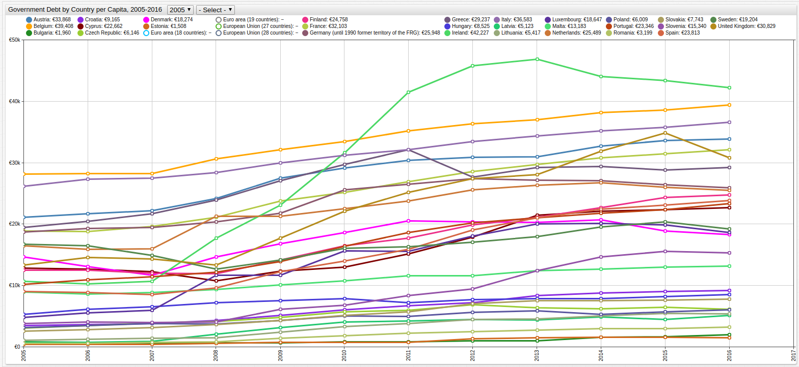
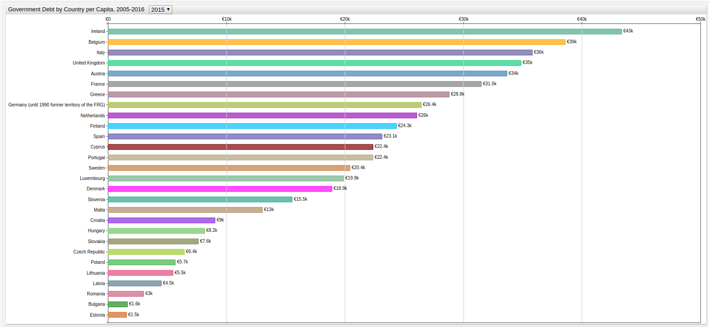
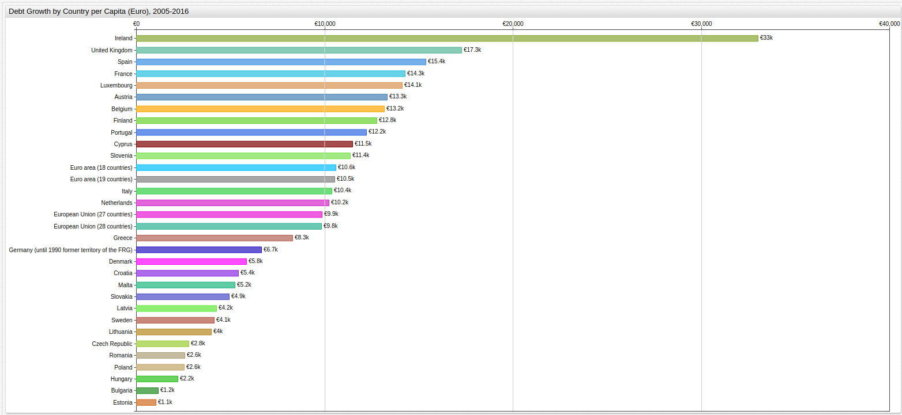

# European Union Debt by Country Per Capita (2005-2016)

Data Source: [EuroStat](http://ec.europa.eu/eurostat)

Visualization Tool: [ChartLab](https://apps.axibase.com/chartlab)

> Use the dropdown menus at the top of the visualization to navigate through time by selecting the desired start and end
years for the observation period.

Recently, [European Union Debt Data](../../research/data-lib/eu-debt/README.md) sorted by country was published
in the [Axibase Data Library](https://axibase.com/blog/data-library/). After its release, there were a number of requests to explore
that data considering population numbers to arrive at a modified debt per capita visualization, representing how much of a
government's gross debt is represented by individual citizens of that particular country.

The visualization above shows the growth of per capita debt in the European Union over the entire observed period of time,
sorted by member country and below that same information is displayed in one year increments.

> Open the visualization above and navigate through time with the dropdown menu.

Per capita debt data does not represent the average amount of debt carried by an individual consumer but rather the debt of
a given government distributed to every citizen of that country, whom the government officially represents. A large country
with a lot of debt is considered equal to small country with only a little debt because the ratio of population
to gross government debt is being considered.

The following visualization tracks debt growth by country from 2006 to 2016:

This dataset is queried further and indexed in the [Data Library](https://axibase.com/blog/data-library/) using the web-based [SQL Console](https://axibase.com/docs/atsd/sql/) in ATSD.
See the complete entry in the [Data Library](../../research/data-lib/eu-debt-per-capita/README.md).