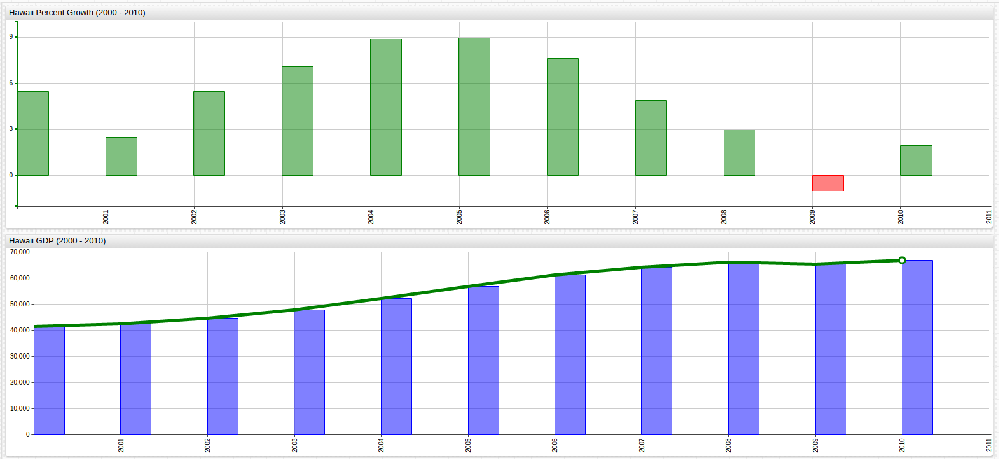

# Island Living is Recession Proof

Hawaii is not often considered among the economic powerhouses of the United States, but it
seems the tiny archipelago two-and-a-half thousand miles from the California coastline
knows something the rest of us don't.

Using [data](https://catalog.data.gov/dataset/dbedt-hawaii-nominal-gross-domestic-product-2000-2010-59862)
from the State of Hawaii's Department of Business, Economic Development, and Tourism, and
the [Axibase Time Series Database](https://axibase.com/docs/atsd/), the fiftieth state's economic
performance can be explored using a number of analytic tools. Shown above are two
visualizations of Hawaii's economy: its percent growth from 2000 to 2010 and its nominal
GDP value for the same years. GDP is generally considered to be the godfather of economic
indicators and with a state that imports [close to 90%](http://files.hawaii.gov/dbedt/op/spb/INCREASED_FOOD_SECURITY_AND_FOOD_SELF_SUFFICIENCY_STRATEGY.pdf)
of its food, a dollar amount subtracted from the GDP and estimated by the State to be about three billion dollars,
positive growth results amid global recession are no small feat.

Comprising a modest [0.45%](https://fred.stlouisfed.org/series/HINGSP) of the overall United States GDP, the Aloha State makes up for its
below average wealth production and high import deficit with percent growth that is significantly higher than the US Average, and
decline that is significantly lower than the US Average. Compare the numbers below:

| Year | Hawaii Percent Growth | United States Percent Growth | Nominal Difference (Hawaii Growth - US Growth) |
|------|--------------------------:|---------------------------------:|-------------------:|
| 2000 | 5.5% | 4.09% | 1.41% |
| 2001 | 2.5% | 0.98% | 1.52% |
| 2002 | 5.5% | 1.70% | 3.80% |
| 2003 | 7.1% | 2.81% | 4.29% |
| 2004 | 8.9% | 3.79% | 5.11% |
| 2005 | 9.0% | 3.35% | 5.65% |
| 2006 | 7.6% | 2.67% | 4.99% |
| 2007 | 4.9% | 1.78% | 3.12% |
| 2008 | 3.0% | -0.29% | 3.29% |
| 2009 | -1.0% | -2.78% | 1.78% |
| 2010 | 2.0% | 2.53% | -0.53% |

> Source for US GDP Data: [The World Bank](http://data.worldbank.org/indicator/NY.GDP.MKTP.KD.ZG).

Measuring this growth over the entire 11-year period to compare effective annual growth, Hawaii averaged a total of 4.96% per year
effective growth compared to the United States' effective growth rate of just 1.86% per year. This metric averages the growth of each
entity over the observed time period to show the annual growth rate if it were to remain constant. Effective growth (or interest)
rate is often used to judge investments with a compounding interest rate, however it can be adopted to these purposes to
accurately provide average performance benchmarks for Hawaii and the United States.

Even during the worst year of the eponymous Great Recession, the state of Hawaii actually continued
to see growth locally, and it was not until the final observed year that the United States
GDP Growth was able to surpass a tiny economy built on [tourism and agriculture](https://www.bea.gov/regional/bearfacts/pdf.cfm?fips=15000&areatype=STATE&geotype=3),
two notoriously volatile industries. Hawaii is also in the top 20 states when considering
per capita GDP, another popular economic indicator.

Whether it's the warm sunshine, the clear water, or the endless beaches that are driving
Hawaii's steady positive growth is unclear but economic stability and opportunity
can be added to the list of benefits of island living.
