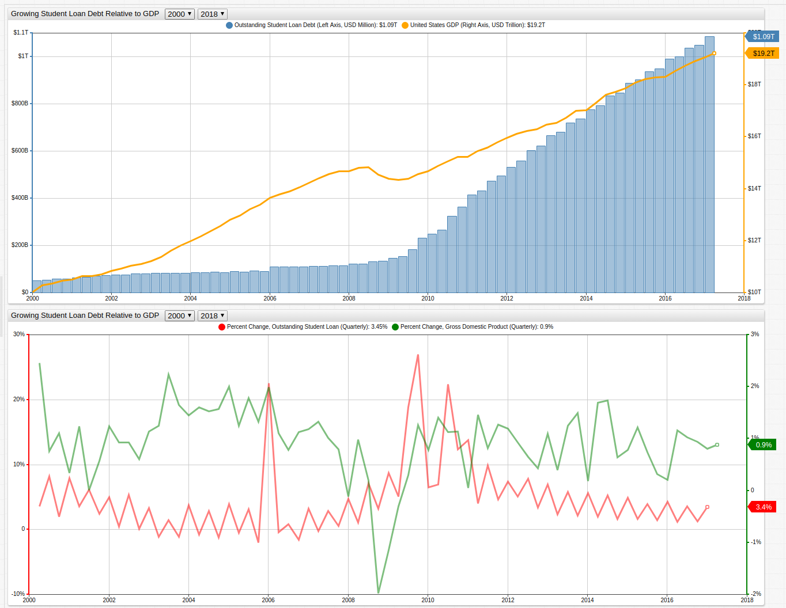

# Outstanding Students Loan Debt Continues to Exceed One Trillion Dollars

> Open the [ChartLab](https://apps.axibase.com/chartlab) visualization above and use the dropdown menus to navigate through time.

**Data Source**: [Federal Reserve Economic Data](https://fred.stlouisfed.org/series/FGCCSAQ027S)

**Visualization Tool**: [Axibase Times Series Database](https://axibase.com/docs/atsd/)

The United States is carrying around about $20 trillion USD in outstanding debt right now, $14 trillion of which is being
traded on various financial markets across the globe. The remaining amount is mostly held in Social Security assets ([1](../../research/analysis/the-new-bubble/README.md))
or owed to various United States government agencies and so is appropriately called intergovernmental debt. China owns about a trillion
dollars of the public debt ([2](../../research/analysis/treasuries-as-assets/README.md)), which many consider to be substantial as it
represents around 5% of the total, and an even larger portion of that debt which is owned by the public. However, as the chart above
shows, student loan debt has also grown at an alarming rate since the 1990s and makes up a comparable total amount. The difference
is the "debt owned to China" is held in the form of United States Treasury Bills, whereas the student loan debt is scattered
around the entire country and owed to various organizations affiliated with the Department of Education, the DoE merely acts as the
debt's guarantor.

That presents an entirely new problem, because while the student loan debt is not directly held by the government it is
beginning to look more and more like the Federal Government will end up footing the bill. Right now, more than 10% of student
loan borrowers are delinquent on their payments ([3](https://ifap.ed.gov/perkinscdrguide/attachments/1415PerkinsCDR.pdf)).

The lower part of the above visualization shows that the rate of student loan debt growth is staying relatively constant,
which isn't great news considering that this rate of increase is relatively more significant than the rate of GDP growth
produced by the United States. The number of economic troubles being juggled by the United States is significant at the moment,
especially considering that the debt profile of the average American has managed to remain relatively consistent for the last
several decades ([4](../../research/average-american-debt-profile/README.md)), it seems that the brunt of the damage has been inflicted on the system itself.
