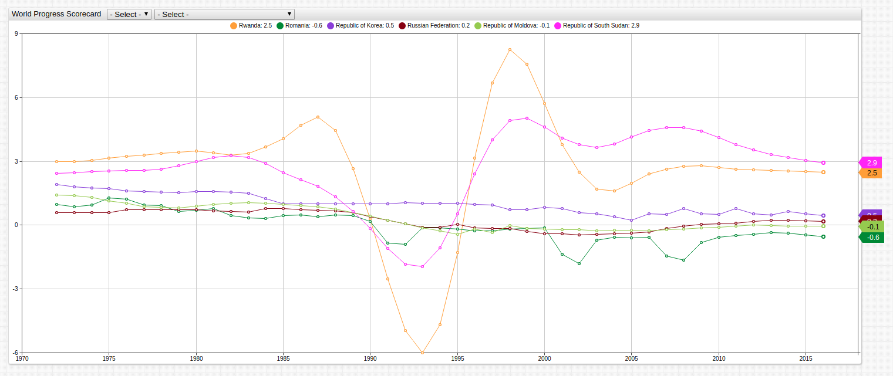
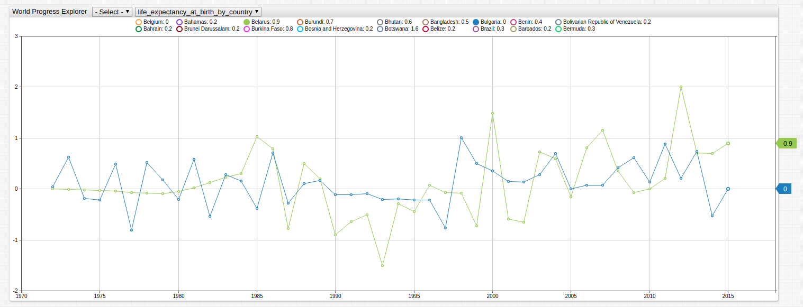

# The World Progress Explorer: In-Depth Visualization with SQL and User-Defined Functions


[](https://trends.axibase.com/ecb8def7#fullscreen)

## Introduction

The **World Progress Explorer** is an aggregation of many statistics that are collected by various international agencies including the [World Bank](http://www.worldbank.org/) and [United Nations Statistical Division](https://unstats.un.org/home/) and retrieved from the [Federal Reserve Economic Research](https://fred.stlouisfed.org/) API.

Open the **Trends** visualization above and use the drop-down menus to navigate between all countries which have recorded data, grouped in alphabetically ascending order. The observed metric may be changed using the right-most drop-down menu. The metrics tracked in the visualization are described in the table below:

|Metric Name |Description |
|------------|------------|
|adolescent_fertility_rate_by_country | Recorded births by women aged 15-19 |
|age_dependency_ratio_by_country | Population aged 0-14 or 65+ |
|crude_birth_rate_by_country| Recorded births by women aged 15-65 per 100,000 members of a population|
|fertility_rate_total_by_country|Recorded births by women aged 15-65 per 100,000 women|
|infant_mortality_rate_by_country| Recorded deaths of infants under 1 year old per 1000 live births|
|life_expectancy_at_birth_by_country|Number of years a newborn is predicted to live given constant mortality figures|
|population_total_by_country| Recorded number of people living in a given country|

For detailed information about using the **Trends** service, read this [guide](../../integrations/shared/trends.md).

## Visualization

The visualizations in the chart above demonstrate a [user-defined function](../../integrations/shared/trends.md#user-defined-functions) which sets the year 1990 as the baseline using the [`fred.js`](https://apps-chartlab.axibase.com/portal/resource/scripts/fred.js) library. Using the `PercentChangeFromYearAgo` function instead creates the visualization below. Open the **Trends** interface and explore the data using the same drop-down menus to navigate between countries and metrics.


[](https://trends.axibase.com/5d0563d2/2#fullscreen)

Axibase [Charts API](https://axibase.com/products/axibase-time-series-database/visualization/widgets/) uses a simple syntax with robust functionality. The underlying mechanics of the `PercentChangeFromYearAgo` function are shown here:

```javascript
value = var v = value('cpi'); var p = value('prev_cpi'); if(p!=null && v!=null) return (v / p - 1) * 100
```

To implement this function, the this setting is used:

```javascript
value = fred.PercentChangeFromYearAgo('raw')
```

Open the **Trends** visualization and use any of the supported user-defined functions from the [`fred.js` library](../../integrations/shared/trends.md#fred-library).

## SQL Queries

Although a non-relational database, ATSD supports an SQL-like feature called [SQL Console](https://axibase.com/docs/atsd/sql/), a convenient interface which lets users quickly query data.

### Greatest Life Expectancy for Year 2015

```sql
SELECT tags.country AS "Country",
  value AS "Life Expectancy"
FROM "life_expectancy_at_birth_by_country"
  WHERE datetime = '2015'
ORDER BY "Life Expectancy" DESC
  LIMIT 10
```

Query uses these clauses:

* [`FROM`](https://axibase.com/docs/atsd/sql/#virtual-table)
* [Alias / `AS`](https://axibase.com/docs/atsd/sql/#aliases)
* [`WHERE`](https://axibase.com/docs/atsd/sql/#where-clause)
* [`LIMIT`](https://axibase.com/docs/atsd/sql/#limiting)
* [`ORDER BY`](https://axibase.com/docs/atsd/sql/#ordering)

| Country           | Life Expectancy |
|-------------------|-----------------|
| Japan             | 84              |
| Hong Kong         | 84              |
| Macao             | 84              |
| Spain             | 83              |
| Switzerland       | 83              |
| Singapore         | 83              |
| Sweden            | 83              |
| Australia         | 82              |
| Luxembourg        | 82              |
| Republic of Korea | 82              |

**Notes:** Japan and the various semi-autonomous regions of the People's Republic of China are often celebrated for their high life expectancies, generally ascribed to the high average income, healthy diet, and focus on basic exercise.

### Lowest Life Expectancy at Birth for Year 2015

```sql
SELECT tags.country AS "Country",
  value AS "Life Expectancy"
FROM "life_expectancy_at_birth_by_country"
  WHERE datetime = 2015
ORDER BY "Life Expectancy" ASC
  LIMIT 10
```

| Country                   | Life Expectancy |
|---------------------------|-----------------|
| Central African Republic  | 51              |
| Sierra Leone              | 51              |
| Chad                      | 53              |
| Nigeria                   | 53              |
| Republic of Cote d'Ivoire | 53              |
| Lesotho                   | 54              |
| Somalia                   | 56              |
| Republic of South Sudan   | 56              |
| Swaziland                 | 57              |
| Burundi                   | 57              |

**Notes:** Unsurprisingly, many of the African nations featured on this list of lowest life expectancy have been ravaged by some internal or external conflict in the past decade. Swaziland is brutally affected by HIV/AIDS, Somalia was involved in a 6-year internal military conflict from 2006-2012, and Sierra Leone was struck by the dreaded Ebola epidemic in 2014. In recent years, a focus on infrastructure development in Africa may help to ease some of these phenomena and help increase the life expectancy in these countries.

### Greatest Growth in Life Expectancy Across Observed Period (1970-2015)

```sql
SELECT tags.country AS "Country",
  FIRST(value) AS "1971 Value",
  LAST(value) AS "2015 Value",
  LAST(value) - FIRST(value) AS "Change in Life Expectancy"
FROM "life_expectancy_at_birth_by_country"
  GROUP BY "Country"
  ORDER BY "Change in Life Expectancy" DESC
  LIMIT 10
```

Clauses used in this query:

* [`FIRST`](https://axibase.com/docs/atsd/sql/#first)
* [`LAST`](https://axibase.com/docs/atsd/sql/#last)

| Country                            | 1970 Value | 2015 Value | Change in Life Expectancy |
|------------------------------------|------------|------------|---------------------------|
| Maldives                           | 44.24      | 77.12      | 32.88                     |
| Bhutan                             | 39.63      | 69.81      | 30.17                     |
| Nepal                              | 40.50      | 69.87      | 29.37                     |
| Democratic Republic of Timor-Leste | 39.54      | 68.58      | 29.04                     |
| Senegal                            | 39.22      | 66.66      | 27.44                     |
| Cambodia                           | 41.57      | 68.47      | 26.90                     |
| Oman                               | 50.26      | 77.12      | 26.86                     |
| Islamic Republic of Afghanistan    | 36.71      | 63.30      | 26.59                     |
| Algeria                            | 50.34      | 75.86      | 25.51                     |
| Mali                               | 32.39      | 57.46      | 25.06                     |

**Notes:** East Timor, officially the Democratic Republic of Timor-Leste is an interesting appearance on this table of overall highest improvement in life expectancy. Colonized by the Portuguese until 1975, during the last three decades the small East-Indian Ocean island community has been one of the few nations that has fared better after the end of their colonization.

### Least Growth in Life Expectancy Across Observed Period (1970-2015)

```sql
SELECT tags.country AS "Country",
  FIRST(value) AS "1971 Value",
  LAST(value) AS "2015 Value",
  LAST(value) - FIRST(value) AS "Change in Life Expectancy"
FROM "life_expectancy_at_birth_by_country"
  GROUP BY "Country"
  ORDER BY "Change in Life Expectancy" ASC
  LIMIT 10
```

| Country            | 1970 Value | 2015 Value | Change in Life Expectancy |
|--------------------|------------|------------|---------------------------|
| Ukraine            | 70.24      | 71.19      | 0.95                      |
| Russian Federation | 68.13      | 70.91      | 2.77                      |
| Curacao            | 74.71      | 77.82      | 3.11                      |
| Bulgaria           | 71.26      | 74.47      | 3.21                      |
| Belarus            | 70.08      | 73.62      | 3.55                      |
| Liechtenstein      | 78.42      | 82.07      | 3.65                      |
| Serbia             | 71.49      | 75.49      | 4.00                      |
| Armenia            | 69.92      | 74.21      | 4.28                      |
| Latvia             | 69.84      | 74.12      | 4.29                      |
| Lithuania          | 70.80      | 75.12      | 4.32                      |

**Notes**: Almost of the nations appearing on this list are former Soviet Socialist Republics who experienced a huge decrease in life expectancy after the dissolution of the USSR, and have since recovered. Use the chart below showing Belarus and Bulgaria during the 1990s, in the aftermath of the break-up, as a reference.


[](https://trends.axibase.com/bf59e818)

Open the **Trends** visualization and remove unwanted data by clicking colored indicator labels along the top of the screen to toggle visible countries.

### Greatest Population Growth Across Observed Period (1970-2015)

```sql
SELECT tags.country AS "Country",
ROUND((LAST(value) - FIRST(value))/1000000,0) AS "Change in Population (Million)"
FROM "population_total_by_country"
  GROUP BY "Country"
  ORDER BY LAST(value) - FIRST(value) DESC
  LIMIT 10
```

Clauses used in this query:

* [`ROUND`](https://axibase.com/docs/atsd/sql/#mathematical-functions)

| Country       | Change in Population (Million) |
|---------------|-----------------------------|
| India         | 770                         |
| China         | 560                         |
| Indonesia     | 146                         |
| Pakistan      | 135                         |
| Nigeria       | 130                         |
| United States | 118                         |
| Brazil        | 112                         |
| Bangladesh    | 97                          |
| Mexico        | 75                          |
| Ethiopia      | 73                          |

**Notes:** It's unsurprising that the five largest countries by population (China, India, the United States, Indonesia, and Pakistan) also saw the largest growth in population during the observed period.

### Greatest Population Growth Percent Across Observed Period (1970-2015)

```sql
SELECT tags.country AS "Country",
  FIRST(value)/1000000 AS "Population 1971 (Million)",
  LAST(value)/1000000 AS "Population 2015 (Million)",
  ((LAST(value) - FIRST(value)) / FIRST(value)) * 100 AS "Change in Population (%)"
FROM "population_total_by_country"
  GROUP BY "Country"
  ORDER BY "Change in Population (%)" DESC
  LIMIT 10
```

| Country                      | Population 1971 (Million) | Population 2015 (Million) | Change in Population (%) |
|------------------------------|---------------------------|---------------------------|--------------------------|
| United Arab Emirates         | 0.24                      | 9.27                      | 3836.16                  |
| Qatar                        | 0.11                      | 2.57                      | 2246.55                  |
| Bahrain                      | 0.21                      | 1.43                      | 570.34                   |
| Cayman Islands               | 0.01                      | 0.06                      | 564.53                   |
| Turks and Caicos Islands     | 0.01                      | 0.03                      | 519.56                   |
| Oman                         | 0.72                      | 4.42                      | 511.28                   |
| Djibouti                     | 0.16                      | 0.94                      | 490.22                   |
| Collectivity of Saint Martin | 0.01                      | 0.03                      | 486.22                   |
| Saudi Arabia                 | 5.84                      | 32.28                     | 453.01                   |
| Jordan                       | 1.72                      | 9.46                      | 450.10                   |

**Notes:** Many of these oil-rich countries discovered their vast supplies of natural resources earlier than the 1970s but were unable to achieve independence to fully control them until 1971. Qatar, Bahrain, the UAE, and Oman achieved independence in 1971 and have since then vastly expanded their oil production capabilities including inviting large numbers of foreign national into the country to either develop or oversee the continued expansion of an industry which is responsible for the overwhelming majority of each country's GDP.

The table below shows the percent of foreigners in selected countries above where the figure is significant:

|Country | Approximate Foreign Population (%)|
|--------|-------------------------------------|
|United Arab Emirates | 80 |
|Qatar | 88 |
|Turks and Caicos Islands | 56 |
|Oman | 45 |
|Saudi Arabia | 31 |
|Jordan | 31 |
|Cayman Islands | 25 |

### Greatest Population Decline Across Observed Period (1970-2015)

```sql
SELECT tags.country AS "Country",
(LAST(value) - FIRST(value)/1000000 AS "Change in Population"
FROM "population_total_by_country"
  GROUP BY "Country"
  ORDER BY LAST(value) - FIRST(value) ASC
  LIMIT 10
```

| Country                | Change in Population (Million) |
|------------------------|----------------------|
| Ukraine                | -2.08        |
| Bulgaria               | -1.36        |
| Romania                | -0.54        |
| Serbia                 | -0.52        |
| Hungary                | -0.51        |
| Georgia                | -0.4         |
| Latvia                 | -0.39        |
| Lithuania              | -0.26        |
| Bosnia and Herzegovina | -0.24        |
| Croatia                | -0.24        |

**Notes**: Almost all of these countries are form Warsaw Pact / Eastern Bloc countries who have in one way or another achieved some sort of cooperation with European countries that has allowed for massive amounts of emigration from the formerly closed nations. In the case of the Ukraine, the significant drop in population immediately after the dissolution of the USSR is clearly visible.


[](https://trends.axibase.com/fcb79db7)

Open the **Trends** visualization above to track the same pattern in other former Warsaw Pact countries by using the drop-down menus to navigate through the data.

### Greatest Population Decline Percent Across Observed Period (1970-2015)

```sql
SELECT tags.country AS "Country",
  FIRST(value)/1000000 AS "Population 1971 (Million)",
  LAST(value)/1000000 AS "Population 2015 (Million)",
  ((LAST(value) - FIRST(value)) / FIRST(value)) * 100 AS "Change in Population (%)"
FROM "population_total_by_country"
  GROUP BY "Country"
  ORDER BY "Change in Population (%)" ASC
  LIMIT 10
```

| Country                | Population 1970 (Million) | Population 2015 (Million) | Change in Population (%) |
|------------------------|---------------------------|---------------------------|--------------------------|
| Latvia                 | 2.36                      | 1.96                      | -16.90                   |
| Bulgaria               | 8.49                      | 7.13                      | -16.04                   |
| Georgia                | 4.12                      | 3.72                      | -9.72                    |
| Lithuania              | 3.14                      | 2.87                      | -8.52                    |
| Serbia                 | 7.59                      | 7.06                      | -6.97                    |
| Bosnia and Herzegovina | 3.76                      | 3.52                      | -6.48                    |
| Croatia                | 4.41                      | 4.17                      | -5.45                    |
| Hungary                | 10.34                     | 9.82                      | -5.03                    |
| Ukraine                | 47.09                     | 45.00                     | -4.42                    |
| Estonia                | 1.36                      | 1.32                      | -3.21                    |

**Notes:** As with other population / life-expectancy decline data, former Soviet Socialist Republics showed the greatest tendencies to see a decline in population growth. In the case of the Baltic States (Estonia, Lithuania, and Latvia) and the former Yugoslavia (Serbia, Bosnia and Herzegovina, and Croatia), all of whom have since joined the EU,these figures have been especially pronounced.

### Greatest Fertility Rate (2015)

```sql
SELECT tags.country AS "Country",
LAST(value) AS "Fertility Rate"
FROM "fertility_rate_total_by_country"
  GROUP BY "Country"
  ORDER BY LAST(value) DESC
  LIMIT 10
```

| Country                            | Fertility Rate |
|------------------------------------|----------------|
| Niger                              | 7.29          |
| Somalia                            | 6.36          |
| Democratic Republic of Congo       | 6.2           |
| Mali                               | 6.14          |
| Chad                               | 6.05          |
| Burundi                            | 5.78          |
| Angola                             | 5.76          |
| Democratic Republic of Timor-Leste | 5.61          |
| Nigeria                            | 5.59          |
| Republic of Gambia                 | 5.48          |

**Notes:** African nations have a markedly-high fertility rate, as all of the countries on this list are on the continent of Africa.

### Lowest Fertility Rate (2015)

```sql
SELECT tags.country AS "Country",
LAST(value) AS "Fertility Rate"
FROM "fertility_rate_total_by_country"
  GROUP BY "Country"
  ORDER BY LAST(value) ASC
  LIMIT 10
```

| Country                | Fertility Rate |
|------------------------|----------------|
| Hong Kong              | 1.19          |
| Portugal               | 1.23          |
| Republic of Korea      | 1.23          |
| Singapore              | 1.24          |
| Republic of Moldova    | 1.24          |
| Macao                  | 1.28          |
| Greece                 | 1.3           |
| Poland                 | 1.32          |
| Spain                  | 1.32          |
| Bosnia and Herzegovina | 1.34          |

**Notes:** Many of the countries featured on this list are business hubs such as Hong Kong, Singapore, and Macao, faced with large population decline such as Bosnia and Herzegovina, or struggling economically such as Greece, Poland, and Spain.
