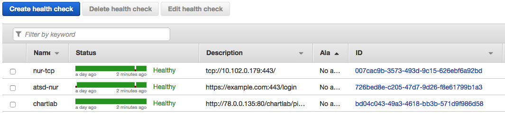
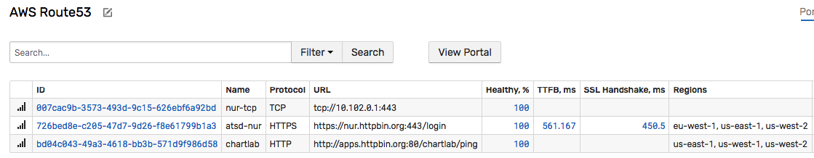
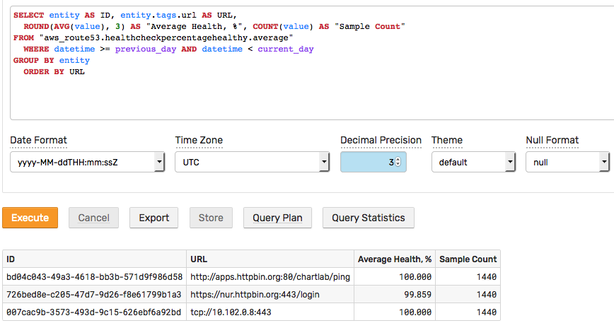

# How to Build Availability Report for AWS Route 53

## Overview

[AWS Route53](https://aws.amazon.com/route53) provides tools to automate DNS configuration in order to reliably connect external user requests to infrastructure running in AWS. In addition to domain registration, it provides dynamic routing services, including latency-based routing, GeoDNS, Geoproximity, and Weighted Round Robin (WRR).

A core Route 53 functionality is the ability to configure [health checks](https://docs.aws.amazon.com/Route53/latest/DeveloperGuide/welcome-health-checks.html) which monitor the health of an application and can route incoming traffic to its healthy endpoints.



An automation procedure, such as DNS fail-over or service restart, can be initiated once the health check status drops below a certain threshold.


### Geographic Distribution

Health checks are executed from different parts of the world so that the outage and latency can be independently verified. The latency and connection times collected by the checkers will vary widely depending on the geographic proximity of the monitored endpoint to one of the AWS regions used for health checking.

* us-east-1
* us-west-1
* us-west-2
* sa-east-1
* ap-southeast-1
* ap-southeast-2
* ap-northeast-1


### Access Security

Amazon AWS publishes a list of IP ranges used by [health checker nodes](https://ip-ranges.amazonaws.com/ip-ranges.json). Your network administrators need to make sure that inbound traffic from `ROUTE53_HEALTHCHECKS` addresses are allowed.

```json
{
  "ip_prefix": "54.243.31.192/26",
  "region": "us-east-1",
  "service": "ROUTE53_HEALTHCHECKS"
}
```

### Healthy Endpoint

For HTTP and HTTPS checks, the endpoint is considered healthy if the TCP connection was established within **ten** seconds and the endpoint returned an HTTP status code of `2xx` or `3xx` within **two** seconds.

For TCP checks, the endpoint status is determined as healthy if the TCP connection was established within **ten** seconds.

The timeouts are **hardcoded**.

### Monitoring Frequency

Health checkers in multiple regions are scheduled [independently](https://docs.aws.amazon.com/Route53/latest/DeveloperGuide/health-checks-creating.html#health-checks-creating-values-request-interval) using the same monitoring interval of 30 or 10 seconds ('fast' mode).

* 0.5 requests per second for standard frequency of 30 seconds.
* 2.0 requests per second for 'fast' frequency of 10 seconds.

The individual checkers are not synchronized and the rate at which the requests arrive is uneven.

Health checks are available for HTTP, HTTPS, and TCP protocols.

The endpoint is considered to be in a `Healthy` state when the specified percentage of checkers were able to establish a TCP connection and (for HTTP/S) received a 2xx/3xx response code from the server. The response should also contain the specified keyword if **String Matching** is enabled.

When specifying paths for HTTP/S endpoints, factor in the increased traffic sent to the target service. The monitored URL should not cause excessive load on the server.

### HTTPS

The health checks **cannot** be used to monitor validity of SSL certificates as part of HTTPS endpoint monitoring. In particular, they will report `Healthy` status even if the SSL certificate is expired, self-signed, or otherwise invalid.

### Metrics

Built-in monitoring charts display endpoint health statistics for a period of up to 2 weeks.


Route 53 CloudWatch metrics are available only in the **us-east-1** region as specified in the [Developer Guide](https://docs.aws.amazon.com/Route53/latest/DeveloperGuide/health-checks-monitor-view-status.html) (see section **To view Route 53 metrics on the CloudWatch console**).

## Service Availability Dashboards

Health check statistics may be offloaded to [Axibase Time Series Database](https://axibase.com/docs/atsd/) and used to create consolidated dashboards with custom thresholds for alerts and notifications.

## Configuration

### Prerequisites

* Create an AWS [IAM account](https://github.com/axibase/axibase-collector/blob/master/jobs/aws-iam.md) to query CloudWatch statistics.
* Make sure 4GB RAM is available for the [ATSD sandbox](https://github.com/axibase/dockers/tree/atsd-sandbox) container.

### Launch ATSD Sandbox

Create an `import` directory in the current directory:

```sh
mkdir import
cd import
```

This directory will be mounted into the Docker container in order to pass AWS credentials to the CloudWatch data collector without exposing them as environment variables.

Create an `aws.propeties` file in the `import` directory and replace `KEY` and `SECRET` with AWS Access Key ID and Secret Access Key respectively.

```sh
accessKeyId=KEY
secretAccessKey=SECRET
```

Launch [ATSD sandbox](https://github.com/axibase/dockers/tree/atsd-sandbox) container on a Docker host:

```sh
docker run -d -p 8443:8443 -p 9443:9443 -p 8081:8081 \
  --name=atsd-sandbox \
  --volume=$(pwd)/import:/import \
  --env ATSD_IMPORT_PATH='https://github.com/axibase/atsd-use-cases/raw/master/how-to/aws/route53-health-checks/resources/aws-route53-xml.zip' \
  --env COLLECTOR_IMPORT_PATH='https://raw.githubusercontent.com/axibase/atsd-use-cases/master/how-to/aws/route53-health-checks/resources/job_aws_aws-route53.xml' \
  --env COLLECTOR_CONFIG='job_aws_aws-route53.xml:aws.properties' \
  axibase/atsd-sandbox:latest
```

The sandbox container includes both ATSD and [Axibase Collector](https://github.com/axibase/axibase-collector/blob/master/jobs/docker.md) instances.

The Collector instance installed in the sandbox container will be used to retrieve Route 53 statistics from AWS CloudWatch and store them in ATSD.

Wait until the sandbox is initialized and 'All applications started.' message is displayed.

```sh
docker logs -f atsd-sandbox
```

```sh
[Collector] 2018-03-29 17:47:40,329 Job 'aws-route53' completed.
[Collector] 2018-03-29 17:47:40,330 All jobs completed.
[Collector] Checking Collector web-interface port 9443 ...
[Collector] Collector web interface:
[Collector] https://172.17.0.2:9443
[Collector] Collector start completed.
[Collector] For more details see logfile in /opt/axibase-collector/logs/axibase-collector.log
[Collector] Account 'axibase' created.
All applications started
```

Log in to ATSD user interface using `axibase` username and `axibase` password at `https://atsd_hostname:8443/`.

### Setup Health Check Attribute Copy

Configure a cron-scheduled task to copy health check attributes into ATSD sandbox as described [here](https://github.com/axibase/atsd-integration/tree/aws-route53)

## Results

### Consolidated View

All working Route 53 health checks are now visible on the **AWS Route 53** tab.



### Service Level Reporting




### Availability Portal

The built-in portal displays availability statistics.


