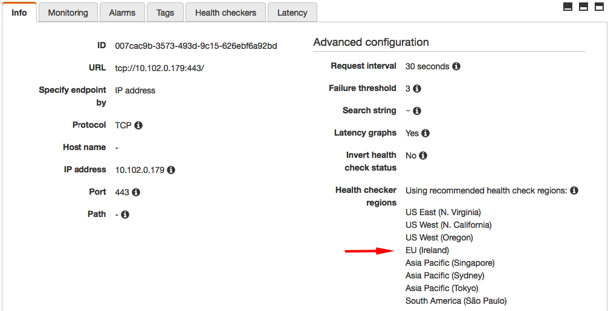
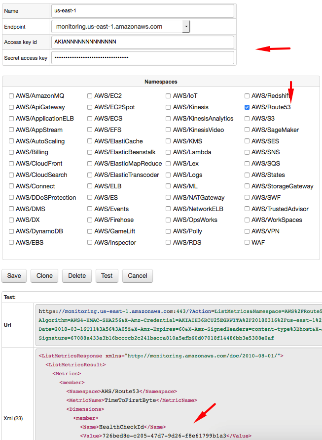
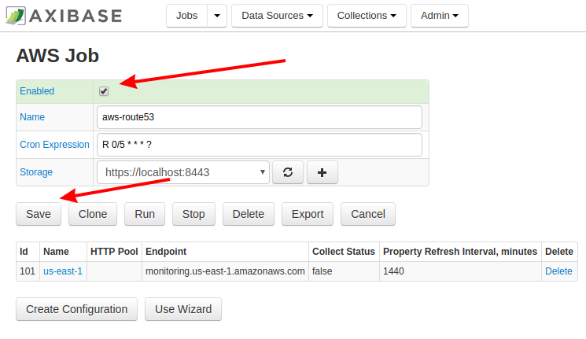

# How to Build Availability Report for AWS Route53

## Overview

[AWS Route53](https://aws.amazon.com/route53) service provides tools to automate DNS configuration to reliably connect external user requests to infrastructure running in AWS. In addition to domain registration, it provides dynamic routing services, including Latency Based Routing, Geo DNS, Geoproximity, and Weighted Round Robin.

One of the core Route53 capabilities is the ability to configure [Health Checks](https://docs.aws.amazon.com/Route53/latest/DeveloperGuide/welcome-health-checks.html) to route traffic to healthy endpoints or to independently monitor the health of your application and its endpoints.


An automation procedure, such as DNS change or instance restart, can be initiated once the health check status drops below a certain threshold.


The Health Checks are available for HTTP, HTTPS, and TCP protocols and can be executed from a variety of regions for resiliency.



The built-in monitoring charts provide an overview over a period of up to 2 weeks.


## Service Availability Dashboards

By offloading Route53 health check statistics to [Axibase Time Series Database](http://axibase.com/products/axibase-time-series-database/) you can build consolidated dashboards spanning all or subsets of health checks with the ability to define custom thresholds.


## Configuration

### Prerequisites

* AWS [IAM account](https://github.com/axibase/axibase-collector/blob/master/jobs/aws-iam.md) to query CloudWatch statistics.
* 4GB RAM for the [ATSD sandbox](https://github.com/axibase/dockers/tree/atsd-sandbox) container.

### Launch ATSD Sandbox

Launch [ATSD sandbox](https://github.com/axibase/dockers/tree/atsd-sandbox) container on one of the Docker hosts:

```
$ docker run -d -p 8443:8443 -p 9443:9443 \
  --name=atsd-sandbox \
  axibase/atsd-sandbox:latest
```

The sandbox container includes both ATSD and [Axibase Collector](https://github.com/axibase/axibase-collector/blob/master/jobs/docker.md) instances.

The Collector instance installed in the sandbox container will be used to retrieve Route53 statistics from AWS CloudWatch and store them in ATSD.

Wait until the sandbox is initialized and 'All applications started.' message is displayed.

```
docker logs -f atsd-sandbox
```

Log in to ATSD user interface using `axibase` username and `axibase` password.

```
https://atsd_hostname:8443/
```

### Import AWS Job into Axibase Collector

Log in to Axibase Collector instance at `https://atsd_hostname:9443` using `axibase` username and `axibase` password.

Import the attached [job configuration](resources/job_aws_aws-route53.xml) XML file.

The **aws** job will query Route53 metrics using the CloudWatch API and store the data in ATSD.


### Configure Access Parameters

In the **Jobs** drop-down menu, select **AWS** jobs.

> If the **aws-route53** job is not visible, be sure that the **Status** drop-down menu is displaying all jobs.

Open **us-east-1** configuration and specify AWS Access and Secret keys.

Confirm connectivity by clicking the **Test** button.

The response should contain a list of metrics for the enabled health checks.

```xml
<ListMetricsResponse xmlns="http://monitoring.amazonaws.com/doc/2010-08-01/">
  <ListMetricsResult>
    <Metrics>
      <member>
        <Namespace>AWS/Route53</Namespace>
        <MetricName>TimeToFirstByte</MetricName>
        <Dimensions>
          <member>
            <Name>HealthCheckId</Name>
            <Value>726bed8e-c205-47d7-9d26-f8e61799b1a3</Value>
          </member>
        </Dimensions>
      </member>
    </Metrics>
  </ListMetricsResult>
  <ResponseMetadata>
    <RequestId>01af0476-2911-11e8-8699-e53c6524cd7c</RequestId>
  </ResponseMetadata>
</ListMetricsResponse>
```



### Enable Job

From the **AWS Job** page, enable the **aws-route53** job. Click **Save**.



### Import Route53 Models into ATSD

Open ATSD user interface at `https://atsd_hostname:8443`.

Open **Settings > Diagnostics > Backup Import** and upload the [aws-route53-xml.zip](resources/aws-route53-xml.zip) archive that contains entity views, portals, SQL queries and rules designed specifically for AWS Route53 data.

### Setup Health Check Attribute Copy

Configure a cron-scheduled task to copy health check attributes into ATSD sandbox as described [here](https://github.com/axibase/atsd-integration/tree/aws-route53)

## Results

### Consolidated View

The view displays all Route53 health checks.


### Service Level Reporting


### Availability Portal

The built-in portal displays availability statistics.


