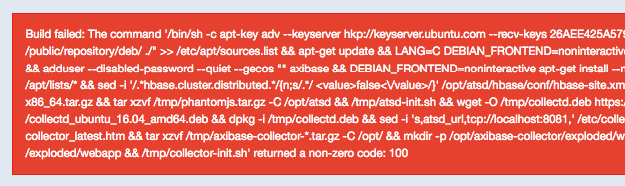
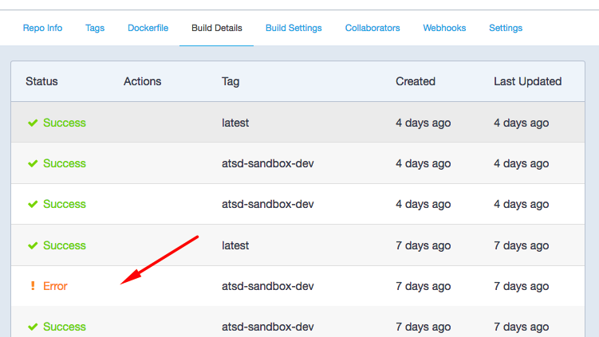
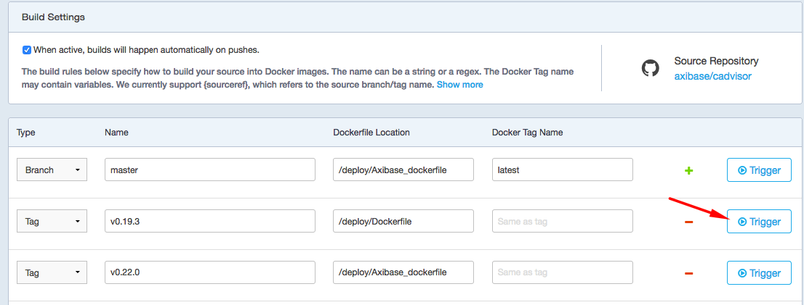

# Generate Webhook when Docker Hub Build Fails

## Overview

If you have images hosted on the [Docker Hub](https://hub.docker.com)  registry, you need to monitor build jobs on Docker Hub to make sure that the images are successfully published and your CI pipeline is healthy.

While the Docker Hub provides the capability to trigger [outgoing webhooks](https://docs.docker.com/docker-hub/webhooks/), they're only executed when the build completes **successfully**. If the job fails, webhooks are not fired and your team remains unaware of broken builds. This limitation is [known](https://forums.docker.com/t/docker-hub-webhook-on-build-failure/1166) however a fix is currently not available.


While the email option can serve as a work-around, it's difficult to rely on it for programmable integration with alerting and CI systems.


This document describes a solution, based on the rule engine implemented in [Axibase Time Series Database](https://github.com/axibase/atsd/tree/master/rule-engine#rule-engine), which polls the Docker Hub build history using the Docker Hub v2 API and generates missing webhooks in case of **build failures**.

## Build Failures

The failures come in different flavors - some are caused by human error while others occur due to infrastructure changes outside of your control.

Human Error:


Dockerfile compressed for minimum layers is often difficult to troubleshoot:



## Build History

The build history, containing success and failure statuses, is accessible under the **Build Details** tab.



Build history is also available via the **Docker Hub v2 API**.

https://hub.docker.com/v2/repositories/axibase/cadvisor/buildhistory/?page=1&page_size=5

The build has failed if its status is not 0 (`queued`), 3 (`pending`), or 10 (`completed`).

In the example below, the status is `-1` which is reported as `! Error` on Docker Hub.

```json
{
  "id": 23028946,
  "status": -1,
  "created_date": "2018-04-24T13:34:33.654759Z",
  "last_updated": "2018-04-24T13:36:39.537606Z",
  "build_code": "beedjaiuvjxk5m37uxjorja",
  "dockertag_name": "latest",
  "cause": "TRIGGERED_VIA_API"
}
```

## Webhooks

The proposed solution queries the build history for the most recent build in the given repository and sends an HTTP request to the consuming web service if the build status is not 0, 3, or 10.

### Webhook Payload `on-success`

Sample request payload generated by Docker Hub when the build succeeds.

```json
{
  "push_data": {
    "pushed_at": 1524572027,
    "images": [],
    "tag": "latest",
    "pusher": "axibase"
  },
  "callback_url": "https://registry.hub.docker.com/u/axibase/atsd/hook/123/",
  "repository": {
    "status": "Active",
    "description": "Axibase Time Series Database",
    "is_trusted": true,
    "full_description": "Axibase Time Series Database",
    "repo_url": "https://hub.docker.com/r/axibase/atsd",
    "owner": "axibase",
    "is_official": false,
    "is_private": false,
    "name": "atsd",
    "namespace": "axibase",
    "star_count": 5,
    "comment_count": 0,
    "date_created": 1433511877,
    "dockerfile": "REDACTED for brevity",
    "repo_name": "axibase/atsd"
  }
}
```

### Webhook Payload `on-error`

Request payload produced by ATSD.

The `on-error` payload is similar to the native `on-success` webhook above except the `repository.status` field is set to `Failed` and an extra `build_history` object is present.

```json
{
  "build_history": {
    "id" : 23028946,
    "status" : -1,
    "created_date" : "2018-04-24T13:34:33.654759Z",
    "last_updated" : "2018-04-24T13:36:39.537606Z",
    "build_code" : "beedjaiuvjxk5m37uxjorja",
    "dockertag_name" : "latest",
    "cause" : "TRIGGERED_VIA_API"
  },
  "push_data": {
    "pushed_at": 1524632779,
    "images": [],
    "tag": "latest",
    "pusher": "axibase"
  },
  "repository": {
    "status": "Failed",
    "repo_url": "https://hub.docker.com/r/axibase/atsd",
    "owner": "axibase",
    "name": "atsd",
    "namespace": "axibase",
    "repo_name": "axibase/atsd"
  }
}
```

## Instructions

Modify `COLLECTOR_CONFIG` variable in the command below to poll your Docker Hub namespace. Replace `MY_NS` with your namespace, for example:

```sh
  --env COLLECTOR_CONFIG='job.xml:configurations.entitySet.entities.string=https://hub.docker.com/v2/repositories/myrepo/' \
```

Modify `ATSD_CONFIG` variable in the command below to set Endpoint URL for a web service receiving the `on-error` webhook. Replace `MY_SVC` with your receiving endpoint, for example:

```sh
  --env ATSD_CONFIG='notify.xml:url=https://jenkins_srv:8443' \
```

Execute the command below to launch [ATSD Sandbox](https://github.com/axibase/dockers/tree/atsd-sandbox) container.

```sh
docker run -d -p 8443:8443 -p 9443:9443 \
  --name=atsd-sandbox \
  --env COLLECTOR_CONFIG='job.xml:configurations.entitySet.entities.string=https://hub.docker.com/v2/repositories/MY_NS/' \
  --env ATSD_CONFIG='notify.xml:url=https://MY_SVC:8443' \
  --env ATSD_IMPORT_PATH='https://raw.githubusercontent.com/axibase/atsd-use-cases/master/how-to/docker/resources/rule.xml,https://raw.githubusercontent.com/axibase/atsd-use-cases/master/how-to/docker/resources/notify.xml' \
  --env COLLECTOR_IMPORT_PATH='https://raw.githubusercontent.com/axibase/atsd-use-cases/master/how-to/docker/resources/job.xml' \
  axibase/atsd-sandbox:latest
```

Go to Docker Hub and open Build Settings for one of the repositories. Trigger a build for one of the branches known to fail.



The webhook should arrive less than 5 minutes after the job completes.

You can adjust the frequency in the Collector at `https://localhost:8443`. Open `dockerhub-poller` job and set Cron Expression to `0 * * * * ?` (every minute).

## Troubleshooting

### Axibase Collector

Log in to Collector at `https://localhost:9443` with `axibase`/`axibase` credentials.

Locate `dockerhub-poller`. Check that its status is 'Completed'.


### Axibase Time Series Database

Log in to ATSD at `https://localhost:8443` with `axibase`/`axibase` credentials.

Open **Alerts > Web Notifications** page. Open `dockerhub-webhook-sender` notification. Make sure it's enabled. Click Test to verify connection.

Open **Data > Data Entry** page in the main menu. Submit the following command to emulate a build failure detected by Axibase Collector.

```ls
message e:docker.hub t:build_code=abc t:last_updated=2018-04-24T13:36:39.537606Z t:dockertag_name=latest t:name=my-image t:cause=TRIGGERED_VIA_API t:id=23028946 t:created_date=2018-04-24T13:34:33.654759Z t:source=docker.hub t:repository=test/my-image t:type=build t:user=test t:status=-1
```

Check that the `dockerhub-webhook-sender` status is `OK`.


