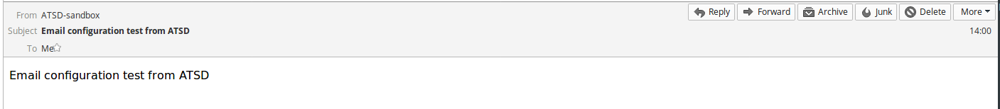
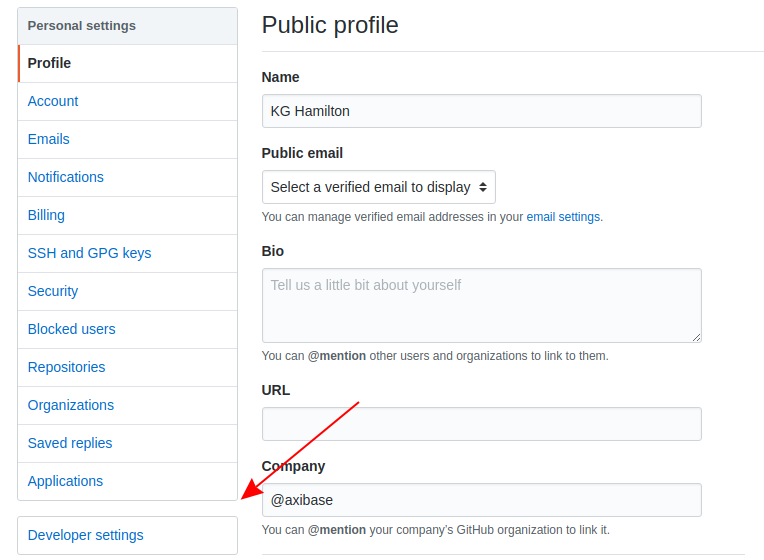
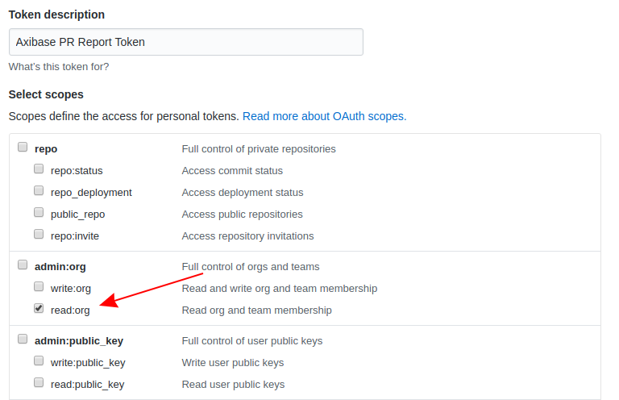
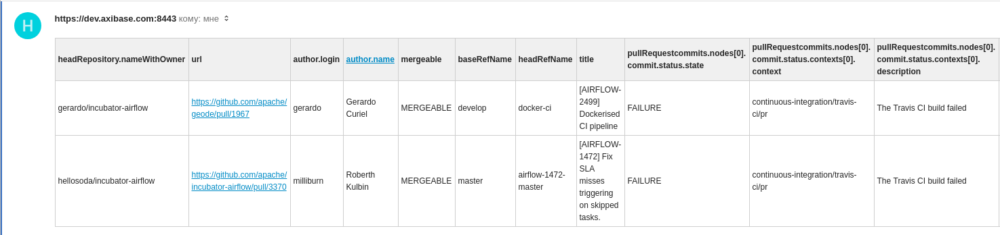

# Daily Pull Request Report for GitHub Repositories

## Overview

This guide shows how to configure [ATSD](https://axibase.com/products/axibase-time-series-database/) to produce a daily report with all open Pull Requests across an organization's entire collection of repositories and email it to subscribed users. The report will have two parts: open Pull Requests that are able to be merged and passing all secondary status checks, and open Pull Requests that are not ready to be merged because they are failing one or more secondary status checks. Each report will be delivered separately. GitHub [webhook services](pr-notification.md) may be used to notify repository owners and administrators when a new Pull Request is opened, but for larger organizations with a large collection of repositories, individual Pull Requests may be missed and left open leading to potential conflicts or inaccurate code / documentation. This feature allows repository owners and administrators to monitor their work and receive a daily report with the status of all open Pull Requests across an entire repository library. Follow the instructions to configure the notifications to be sent directly to any group of subscribers via email with [Axibase Time Series Database](https://axibase.com/products/axibase-time-series-database/) and the [GitHub v4 API](https://developer.github.com/v4/). Setup should take around 10 minutes.


## Purpose

Large organizations maintain large GitHub libraries with many repositories. Keeping track of many incoming Pull Requests is important to maintain accurate documentation and up-to-date code accessible to end users, but even attentive repository administrators may miss the occasional Pull Request. Stay on top of open Pull Requests with daily reports delivered to a list of subscribers.

GitHub features email notifications for individual repositories, but the task of tracking Pull Requests across many repositories may be better accomplished using programmatic integration leveraging the [GraphQL](https://graphql.org/) API query language, featured in the GitHub API.

In contrast to the [GitHub v3 REST API](https://developer.github.com/v3/), the latest [GitHub v4 GraphQL API](https://developer.github.com/v4/) offers more flexibility by replacing multiple REST requests with a single call to fetch all relevant data.

## Launch ATSD Sandbox

Execute the `docker run` command to launch a local ATSD [sandbox](https://github.com/axibase/dockers/tree/atsd-sandbox) instance.

The launch command must be modified to include legitimate information: replace the `SERVER_URL` parameter with the public DNS name of the Docker host where the sandbox container will be running.
The `ORGANIZATION` variable should contain the case-sensitive name of the organization whose repositories should be queried when generating the daily report. The `TOKEN` variable should contain the [GitHub OAuth token](#generating-oauth-access-token) which must be generated to query repositories using the GraphQL API. The `SUBSCRIBERS` variable should contain the comma-separated list of email addresses who will be subscribed to the daily report.

```sh
docker run -d -p 8443:8443 \
  --name=atsd-sandbox \
  --env START_COLLECTOR=off \
  --env SERVER_URL=https://atsd.company_name.com:8443 \
  --env ORGANIZATION=MyOrganization \
  --env TOKEN=**************************************** \
  --env SUBSCRIBERS=myuser@example.org \
  --env EMAIL_CONFIG=mail.properties \
  --env ATSD_IMPORT_PATH=https://raw.githubusercontent.com/axibase/atsd-use-cases/master/how-to/github/resources/github-daily-pr-status.xml,https://raw.githubusercontent.com/axibase/atsd-use-cases/master/how-to/github/resources/github-graphql-table.xml,https://raw.githubusercontent.com/axibase/atsd-use-cases/master/how-to/github/resources/graphql-queries.xml \
  --volume /home/user/mail.properties:/mail.properties \
  axibase/atsd-sandbox:latest
```

For information about creating a new organization, see the [GitHub Help Documentation](https://help.github.com/articles/creating-a-new-organization-from-scratch/).

Mail configuration has several required parameters, passing them into the container via mounted file is the simplest solution. The `volume` variable should point to the **absolute path** where a plaintext file is stored containing the following parameters:

```ls
server=smtp.example.org
user=myuser@example.org
password=secret
```

This `mail.properties` file defines the mail server which will send outgoing reports. Replace `server`, `user`, and `password` parameters with legitimate credentials. If your outgoing mail server uses a different port than 587 for SMTP queries, define it as an additional parameter in the `mail.properties` file.

```ls
port=465
```

Watch the sandbox container logs for `All applications started` and `Mail Client configured`.

```sh
docker logs -f atsd-sandbox
```

If **Mail Client** is successfully configured, ATSD will notify:

```txt
Mail Client test successful.
```

If invalid parameters are provided or the connection test otherwise fails, ATSD with provide a warning:

```txt
Mail Client test failed: Invalid email address
```

Upon failure, stop the container:

```sh
docker rm -vf atsd-sandbox
```

Confirm the validity of parameters in `mail.properties` file and relaunch.

Upon successful completion, the **Mail Client** will automatically send subscribed users a confirmation email to confirm connectivity.



After initial launch, if **Mail Client** settings need to be reconfigured, follow these [instructions](https://axibase.com/docs/atsd/administration/mail-client.html).

ATSD web interface is accessible at [`https://docker_host:8443/`](https://github.com/axibase/dockers/tree/atsd-sandbox#exposed-ports).

> For advanced launch settings refer to this [guide](https://github.com/axibase/dockers/tree/atsd-sandbox).

## Generating OAuth Access Token

The GitHub API may be accessed [several ways](https://developer.github.com/v3/auth/#other-authentication-methods). This tool uses an [OAuth Personal Token](https://blog.github.com/2013-05-16-personal-api-tokens/) to query the API without sending user login information. Follow these instructions to generate a personal token and store it in the local ATSD instance.

While logged in to GitHub, click your profile picture in the upper-right corner from any page, then click **Settings**



Open the **Developer Settings** page and navigate to the **Personal Access Tokens** tab.


Click **Generate New Token**, you will be prompted to enter your password.



Configure the token to grant **read:org** permissions in the **admin:org** section. This scope grants read-only organization access to any user with this token, keep it confidential. For more information about token scopes, see [GitHub Developer Documentation](https://developer.github.com/apps/building-oauth-apps/scopes-for-oauth-apps/).

## Configuring Report Delivery

By default, the `github-daily-pr-status` rule is configured to deliver a report upon launch and then again every morning at 5:00 AM server local time. Open the **Settings** menu in ATSD interface and select **System Information** to view server local time.

Modify delivery time by opening the `github-daily-pr-status` rule from the **Rules** page. The `Condition` field contains:

```java
now.getHourOfDay() == 5
```

Change the value of this expression to the integer UTC 24-hour time when the report should be delivered.

```java
now.getHourOfDay() == 18
```

Report delivery will be scheduled for 6:00 PM server local time.

## Notification Payload

The `github-daily-pr-status` rule builds an HTML table with information returned by the GQL query, according to the following configuration found in the **Text** field of the **Email Notifications** tab:

```javascript
${addTable(
  jsonToLists(
    jsonPathFilter(
      queryConfig('github-graphql-table',
        ['GQL_query': lookup('graphql-queries', 'issue-list')]
      ).content,
      "$..pullRequests.nodes[?(@.mergeable == 'MERGEABLE' && @.pullRequestcommits.nodes[0].commit.status.state == 'SUCCESS')]"
    )
  )
, 'html', true)}
```

> The `FAILURE` email report uses an identical configuration with the exception of the `JSONPath`, which instead evaluates `state == 'FAILURE'`.

The `queryConfig` clause calls `github-graphql-table` which queries the [GraphQL API v4](https://developer.github.com/v4/guides/forming-calls/#the-graphql-endpoint) via POST method and returns open Pull Request information in JSON format.

The `'GQL_query'` variable is delivered as the outgoing query and returns the `pullRequests` [node](https://developer.github.com/v4/guides/intro-to-graphql/#node), which is a JSON list of open Pull Requests.

[GitHub Developer Documentation](https://developer.github.com/v4/guides/forming-calls/#example-query) offers a step-by-step walkthrough for forming each part of a query using the v4 API.

Consider this query:

```graphql
query {
  organization(login: "apache") {
        repositories(first: 1, orderBy: {field: PUSHED_AT, direction: DESC}) {
        nodes {
            #name
            pullRequests(first: 5, states: OPEN, orderBy: {field: UPDATED_AT, direction: DESC}) {
                nodes {
                    headRepository { nameWithOwner }
                    url
                    author {
                    ... on User {
                        login name
                        }
                    }
                    mergeable
                    baseRefName
                    headRefName
                    title
                    #milestone { title }
                    #labels(first: 3) { nodes{name} }
                    ... on PullRequest {
                        pullRequestcommits: commits(last: 1) {
                            #totalCount
                            nodes {
                                commit {
                                    #url
                                    status { state contexts { context description createdAt targetUrl } }
                                }
                            }
                        }
                    }
                }
            }
        }
    }
  }
}
```

This query targets [Apache Software Foundation](https://github.com/apache) repositories and returns a JSON list with the first five Pull Requests from the first repository in their GitHub library, alphabetically. These settings may be configured by modifying the `pullRequests(first: 5, states: OPEN, orderBy: {field: UPDATED_AT, direction: DESC}) {` and `repositories(first:1, orderBy: {field: PUSHED_AT, direction: DESC}) {` clauses, respectively.

<details><summary>View the JSON results of the above GraphQL query.</summary>
<p>

```json
{
    "data": {
        "organization": {
            "repositories": {
                "nodes": [
                    {
                        "pullRequests": {
                            "nodes": [
                                {
                                    "headRepository": {
                                        "nameWithOwner": "harishbisht/incubator-airflow"
                                    },
                                    "url": "https://github.com/apache/incubator-airflow/pull/3387",
                                    "author": {
                                        "login": "harishbisht",
                                        "name": "Harish Bisht"
                                    },
                                    "mergeable": "MERGEABLE",
                                    "baseRefName": "master",
                                    "headRefName": "master",
                                    "title": "added airtel in user list",
                                    "pullRequestcommits": {
                                        "nodes": [
                                            {
                                                "commit": {
                                                    "status": {
                                                        "state": "PENDING",
                                                        "contexts": [
                                                            {
                                                                "context": "continuous-integration/travis-ci/pr",
                                                                "description": "The Travis CI build is in progress",
                                                                "createdAt": "2018-05-21T15:53:56Z",
                                                                "targetUrl": "https://travis-ci.org/apache/incubator-airflow/builds/381737856?utm_source=github_status&utm_medium=notification"
                                                            }
                                                        ]
                                                    }
                                                }
                                            }
                                        ]
                                    }
                                },
                                {
                                    "headRepository": {
                                        "nameWithOwner": "kaxil/incubator-airflow"
                                    },
                                    "url": "https://github.com/apache/incubator-airflow/pull/3394",
                                    "author": {
                                        "login": "kaxil",
                                        "name": "Kaxil Naik"
                                    },
                                    "mergeable": "MERGEABLE",
                                    "baseRefName": "master",
                                    "headRefName": "AIRFLOW-2429",
                                    "title": "[AIRFLOW-2429] Fix contrib folder's flake8 errors",
                                    "pullRequestcommits": {
                                        "nodes": [
                                            {
                                                "commit": {
                                                    "status": {
                                                        "state": "PENDING",
                                                        "contexts": [
                                                            {
                                                                "context": "continuous-integration/travis-ci/pr",
                                                                "description": "The Travis CI build is in progress",
                                                                "createdAt": "2018-05-21T15:34:06Z",
                                                                "targetUrl": "https://travis-ci.org/apache/incubator-airflow/builds/381727712?utm_source=github_status&utm_medium=notification"
                                                            }
                                                        ]
                                                    }
                                                }
                                            }
                                        ]
                                    }
                                },
                                {
                                    "headRepository": {
                                        "nameWithOwner": "RealImpactAnalytics/airflow"
                                    },
                                    "url": "https://github.com/apache/incubator-airflow/pull/3314",
                                    "author": {
                                        "login": "milanvdm",
                                        "name": "Milan van der Meer"
                                    },
                                    "mergeable": "MERGEABLE",
                                    "baseRefName": "master",
                                    "headRefName": "milanvdm/subdag_view",
                                    "title": "[AIRFLOW-2419] Use default view for subdag operator",
                                    "pullRequestcommits": {
                                        "nodes": [
                                            {
                                                "commit": {
                                                    "status": {
                                                        "state": "SUCCESS",
                                                        "contexts": [
                                                            {
                                                                "context": "continuous-integration/travis-ci/pr",
                                                                "description": "The Travis CI build passed",
                                                                "createdAt": "2018-05-04T13:24:31Z",
                                                                "targetUrl": "https://travis-ci.org/apache/incubator-airflow/builds/374873020?utm_source=github_status&utm_medium=notification"
                                                            }
                                                        ]
                                                    }
                                                }
                                            }
                                        ]
                                    }
                                },
                                {
                                    "headRepository": {
                                        "nameWithOwner": "hellosoda/incubator-airflow"
                                    },
                                    "url": "https://github.com/apache/incubator-airflow/pull/3370",
                                    "author": {
                                        "login": "milliburn",
                                        "name": "Roberth Kulbin"
                                    },
                                    "mergeable": "MERGEABLE",
                                    "baseRefName": "master",
                                    "headRefName": "airflow-1472-master",
                                    "title": "[AIRFLOW-1472] Fix SLA misses triggering on skipped tasks.",
                                    "pullRequestcommits": {
                                        "nodes": [
                                            {
                                                "commit": {
                                                    "status": {
                                                        "state": "FAILURE",
                                                        "contexts": [
                                                            {
                                                                "context": "continuous-integration/travis-ci/pr",
                                                                "description": "The Travis CI build failed",
                                                                "createdAt": "2018-05-21T13:34:13Z",
                                                                "targetUrl": "https://travis-ci.org/apache/incubator-airflow/builds/381662628?utm_source=github_status&utm_medium=notification"
                                                            }
                                                        ]
                                                    }
                                                }
                                            }
                                        ]
                                    }
                                },
                                {
                                    "headRepository": {
                                        "nameWithOwner": "gerardo/incubator-airflow"
                                    },
                                    "url": "https://github.com/apache/incubator-airflow/pull/3393",
                                    "author": {
                                        "login": "gerardo",
                                        "name": "Gerardo Curiel"
                                    },
                                    "mergeable": "MERGEABLE",
                                    "baseRefName": "master",
                                    "headRefName": "docker-ci",
                                    "title": "[AIRFLOW-2499] Dockerised CI pipeline",
                                    "pullRequestcommits": {
                                        "nodes": [
                                            {
                                                "commit": {
                                                    "status": {
                                                        "state": "FAILURE",
                                                        "contexts": [
                                                            {
                                                                "context": "continuous-integration/travis-ci/pr",
                                                                "description": "The Travis CI build failed",
                                                                "createdAt": "2018-05-21T14:18:05Z",
                                                                "targetUrl": "https://travis-ci.org/apache/incubator-airflow/builds/381676845?utm_source=github_status&utm_medium=notification"
                                                            }
                                                        ]
                                                    }
                                                }
                                            }
                                        ]
                                    }
                                }
                            ]
                        }
                    }
                ]
            }
        }
    }
}
```

</p>
</details>

The GraphQL query returns a JSON list of Pull Requests based on `MERGEABLE` status. Among the five returned Pull Requests, one has `'SUCCESS'` state, two have `'FAILURE'` state, and two have `'PENDING'` state. ATSD [Rule Engine](https://axibase.com/docs/atsd/rule-engine/) filters these results with `JSONPath` syntax:

```ls
$..pullRequests.nodes[?(@.mergeable == 'MERGEABLE' && @.pullRequestcommits.nodes[0].commit.status.state == 'SUCCESS')]
```

And

```ls
$..pullRequests.nodes[?(@.mergeable == 'MERGEABLE' && @.pullRequestcommits.nodes[0].commit.status.state == 'FAILURE')]
```

The result sets are used to create two unique reports. One report tracks `MERGEABLE` Pull Requests which have passed all secondary checks identified by `state == 'SUCCESS'`, and the second report tracks `MERGEABLE` pull requests which have failed one or more secondary checks identified by `state == 'FAILURE'`.

Each of these JSONPaths will return a unique JSON list which ATSD Rule Engine will convert into an HTML table.

<details><summary>View the <code>state == 'SUCCESS'</code> JSON result set.</summary>
<p>

```json
[
  {
    "headRepository": {
      "nameWithOwner": "RealImpactAnalytics/airflow"
    },
    "url": "https://github.com/apache/incubator-airflow/pull/3314",
    "author": {
      "login": "milanvdm",
      "name": "Milan van der Meer"
    },
    "mergeable": "MERGEABLE",
    "baseRefName": "master",
    "headRefName": "milanvdm/subdag_view",
    "title": "[AIRFLOW-2419] Use default view for subdag operator",
    "pullRequestcommits": {
      "nodes": [
        {
          "commit": {
            "status": {
              "state": "SUCCESS",
              "contexts": [
                {
                  "context": "continuous-integration/travis-ci/pr",
                  "description": "The Travis CI build passed",
                  "createdAt": "2018-05-04T13:24:31Z",
                  "targetUrl": "https://travis-ci.org/apache/incubator-airflow/builds/374873020?utm_source=github_status&utm_medium=notification"
                }
              ]
            }
          }
        }
      ]
    }
  }
]
```

</p>
</details>

<details><summary>View the <code>state == 'FAILURE'</code> JSON result set.</summary>
<p>

```json
[
  {
    "headRepository": {
      "nameWithOwner": "hellosoda/incubator-airflow"
    },
    "url": "https://github.com/apache/incubator-airflow/pull/3370",
    "author": {
      "login": "milliburn",
      "name": "Roberth Kulbin"
    },
    "mergeable": "MERGEABLE",
    "baseRefName": "master",
    "headRefName": "airflow-1472-master",
    "title": "[AIRFLOW-1472] Fix SLA misses triggering on skipped tasks.",
    "pullRequestcommits": {
      "nodes": [
        {
          "commit": {
            "status": {
              "state": "FAILURE",
              "contexts": [
                {
                  "context": "continuous-integration/travis-ci/pr",
                  "description": "The Travis CI build failed",
                  "createdAt": "2018-05-21T13:34:13Z",
                  "targetUrl": "https://travis-ci.org/apache/incubator-airflow/builds/381662628?utm_source=github_status&utm_medium=notification"
                }
              ]
            }
          }
        }
      ]
    }
  },
  {
    "headRepository": {
      "nameWithOwner": "gerardo/incubator-airflow"
    },
    "url": "https://github.com/apache/incubator-airflow/pull/3393",
    "author": {
      "login": "gerardo",
      "name": "Gerardo Curiel"
    },
    "mergeable": "MERGEABLE",
    "baseRefName": "master",
    "headRefName": "docker-ci",
    "title": "[AIRFLOW-2499] Dockerised CI pipeline",
    "pullRequestcommits": {
      "nodes": [
        {
          "commit": {
            "status": {
              "state": "FAILURE",
              "contexts": [
                {
                  "context": "continuous-integration/travis-ci/pr",
                  "description": "The Travis CI build failed",
                  "createdAt": "2018-05-21T14:18:05Z",
                  "targetUrl": "https://travis-ci.org/apache/incubator-airflow/builds/381676845?utm_source=github_status&utm_medium=notification"
                }
              ]
            }
          }
        }
      ]
    }
  }
]
```

</p>
</details>

ATSD [Rule Engine](https://axibase.com/docs/atsd/rule-engine/) receives incoming JSON result sets and converts them into human-readable HTML reports. Rule Engine generates reports based on [Conditions](https://axibase.com/docs/atsd/rule-engine/#condition-checking), in this case, immediately after the first sandbox launch and then daily at 5:00 AM server local time. The report is created by [Email Action](https://axibase.com/docs/atsd/rule-engine/email.html) which convert the JSON output into HTML table via [`jsonToLists`](https://axibase.com/docs/atsd/rule-engine/functions-table.html#jsontolists) function.

The above JSON result sets will be converted to two outgoing email reports, sent to the defined subscriber list.

**Sample Apache Report for `MERGEABLE` Pull Requests with `SUCCESS` State**


**Sample Apache Report for `MERGEABLE` Pull Requests with `FAILURE` State**



For additional GraphQL query syntax, view the [documentation](https://graphql.org/learn/queries/).

## Report Delivery

Before report delivery, ensure all parameters have been correctly configured:

* ATSD web client is able to resolve outgoing email server (See **Settings** > **Mail Client** to send additional test messages after launch);

* Valid [OAuth access token](#generating-oauth-access-token) created and inserted into launch command;

* [Email subscribers](#adding-subscribers) defined;

* GraphQL query targets the appropriate organization. Any organization's public repositories may be queried by GitHub GraphQL API.

A sample report from [**Siemens**](https://github.com/siemens) repositories using a wider scope:


Clickable URLs redirect to the Pull Request page.

For additional setup information, raise an [issue](https://github.com/axibase/atsd/issues) on the ATSD GitHub repository. For other GitHub tools developed by Axibase, see our [Use Cases Repository](https://github.com/axibase/atsd-use-cases#github).