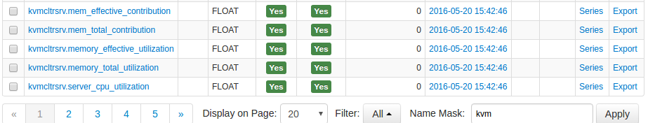

# IBM Tivoli Monitoring Integration

## Overview

There are two options to integrate ATSD with IBM Tivoli Monitoring (ITM):

* Run a scheduled JDBC job with Axibase Collector to copy incremental data from detailed tables in Tivoli Data Warehouse to ATSD.
* Configure ITM Warehouse Proxy Agent (WPA) to store analytical data in CSV files.

This document describes the second option, which provides minimal latency at the expense of introducing additional overhead on the WPA server.

In order to offload detailed data from ITM-managed systems with minimal latency you need to enable an ITM Warehouse Proxy Agent (WPA) to write incoming analytical data from ITM agents into CSV files on the local file system. The CSV directory is continuously monitored by an `inotify` script, which uploads new CSV files into ATSD the moment these files are created by ITM agents.

This integration enables ATSD to act as a long-term repository for historical data such as attribute groups with aggressive pruning settings like process tables, which are typically configured to only retain old data for an interval of three to seven days.

Because statistics from ITM agents are received by ATSD with no delay, use this type of integration for real-time analytics and performance dashboards with no display latency.


## Installation steps

### Configure ITM Warehouse Proxy Agent

* Configure WPA to store analytical data received from agents into CSV files on the local file system as described in the [IBM Knowledge Center](https://www.ibm.com/support/knowledgecenter/SSATHD_7.7.0/com.ibm.itm.doc_6.3fp2/adminuse/history_analytics_scenarios.htm "WPA").

* Set the `hd.ini` settings to activate private history streaming:

  * Change to the `/opt/ITM directory` and append the following settings to the `config/hd.ini` file:

    ```ini
            KHD_CSV_OUTPUT_ACTIVATE=Y
            KHD_CSV_OUTPUT=/tmp/itm/csv
            KHD_CSV_OUTPUT_TAGGED_ONLY=Y
            KHD_CSV_ISO_DATE_FORMAT=Y
            KHD_CSV_MAXSIZE=400
            KHD_CSV_EVAL_INTERVAL=60
    ```

  * Restart WareHouse Proxy agent:

    ```sh
            bin/itmcmd stop hd
            bin/itmcmd start hd
    ```

### Configure ITM Agents

* Download situation configuration files for the following products:

  * [Linux OS](csv-configs/agents/lz_situations.xml)
  * [VMware](csv-configs/agents/vm_situations.xml)
  * [WebSphere MQ](csv-configs/agents/mq_situations.xml)

* Copy the configuration file to the `localconfig/${PRODUCT_CODE}/` directory on the agent machine, where `${PRODUCT_CODE}` is the agent product code. You can look up commonly used product codes in the [IBM Knowledge Center](https://www.ibm.com/support/knowledgecenter/en/SS4EKN_7.2.0/com.ibm.itm.doc_6.3/install/pc_codes.htm).

    > Agent situation files adhere to the following naming convention: ${PRODUCT_CODE}_situations.xml

* Restart the agent:

```bash
    bin/itmcmd stop ${PRODUCT_CODE}
```

```bash
    bin/itmcmd start ${PRODUCT_CODE}
```

### Download CSV Parsers for UX, VM, and MQ Product Codes

* [Linux OS](csv-configs/atsd/klz-csv-configs.xml)
* [VMware](csv-configs/atsd/kvm-csv-configs.xml)
* [WebSphere MQ](csv-configs/atsd/mq-csv-configs.xml)

### Upload CSV Parsers into ATSD

* Log in to the ATSD web interface.
* Open the **Configuration > Parsers: CSV** page.
* Open the split button and select **Import**.
* Upload the CSV parser XML files.

### Configure `inotify` Script to Read CSV files and Upload into ATSD

* Download [`inotify_sender`](inotify_sender.sh) script to your WPA server.

* Specify the ATSD hostname by editing the following line:

```bash
    if [ "$url" = "" ]; then
        url="http://atsd_hostname:8088"
    fi
```

* Set username and password in the `inotify_sender.sh` script

```sh
--user=[[USER]] --password=[[PASSWORD]]
```

* Set permissions to execute the script:

```sh
    chmod a+x inotify_sender.sh
```

* Launch the `inotify` wrapper script:

```sh
    ./inotify_sender.sh
```

* Review the logs in the `/tmp/itm/logs` directory.

* Add script to auto-start. The auto-start configuration is specific to your operating system.

## Verifying Data in ATSD

* Log in to ATSD.
* Click to the Metrics tab and filter metrics with the following prefixes:

  * `klz`

  

  * `lnx`

  

  * `kvm`

  

  * `mq`

  

## Viewing Data in ATSD

### Metrics

* List of collected [ITM metrics](metric-list.md)

### Entity Groups

* `ITM - Linux OS`

### Portals

* [ITM – Linux OS Portal](https://apps.axibase.com/chartlab/43f054ee)


