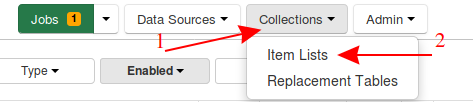
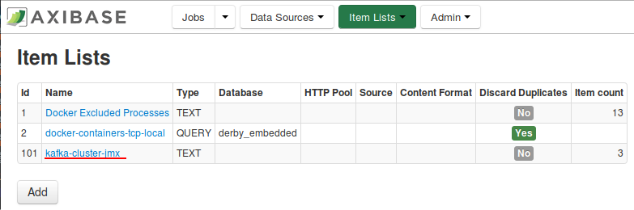
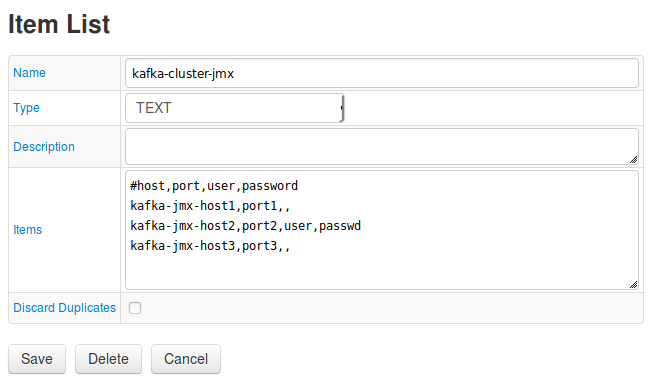
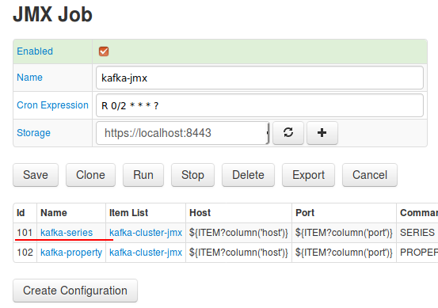
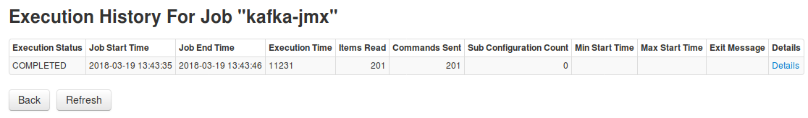
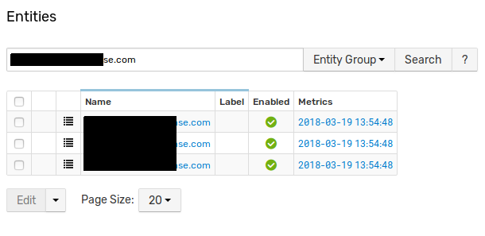
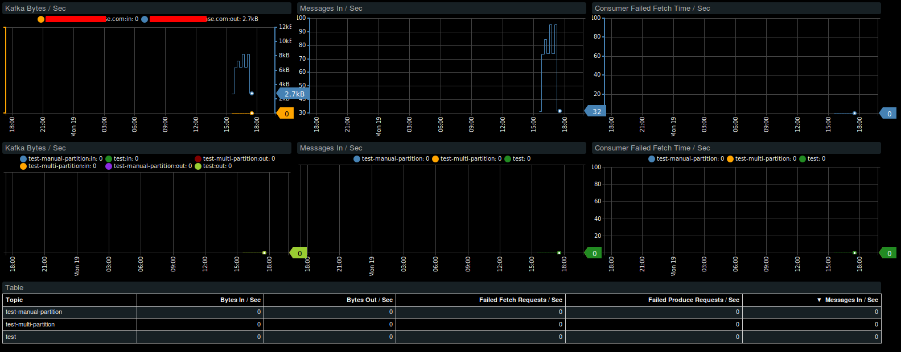

# How to Monitor Kafka Brokers

## Overview

This guide describes how to monitor availability and performance of [Apache Kafka](https://kafka.apache.org/) brokers using Axibase Time Series Database.

## Configuration

### Prerequisites

* Kafka brokers with enabled JMX
* 4GB RAM for the [ATSD sandbox](https://github.com/axibase/dockers/tree/atsd-sandbox) container.

### Launch ATSD Sandbox

Launch [ATSD sandbox](https://github.com/axibase/dockers/tree/atsd-sandbox) container on one of the Docker hosts:

```sh
docker run -d -p 8443:8443 -p 9443:9443 -p 8081:8081 \
    --name=atsd-sandbox \
    --volume /var/run/docker.sock:/var/run/docker.sock \
    --env ATSD_IMPORT_PATH='https://raw.githubusercontent.com/axibase/atsd-use-cases/master/how-to/kafka/broker-monitoring/resources/kafka-xml.zip' \
    --env COLLECTOR_IMPORT_PATH='https://raw.githubusercontent.com/axibase/atsd-use-cases/master/how-to/kafka/broker-monitoring/resources/job_jmx_kafka-jmx.xml' \
axibase/atsd-sandbox:latest
```

The sandbox container includes both ATSD and [Axibase Collector](https://github.com/axibase/axibase-collector/blob/master/jobs/docker.md) instances.

The Collector instance installed in the sandbox container is used to retrieve Kafka statistics using JMX and store them in ATSD.

Wait until the sandbox is initialized and 'All applications started.' message is displayed.

```sh
docker logs -f atsd-sandbox
```

### Configure Collector

Log in to Axibase Collector instance at `https://atsd_hostname:9443` using `axibase` username and `axibase` password.

Click `Jobs` and set job type `JMX`. Make sure that `kafka-jmx` job is visible on the page and enabled.


This job uses `kafka-cluster-jmx` [Item List](https://github.com/axibase/axibase-collector/blob/master/jobs/jmx.md#connection-parameters) with Kafka JMX connection settings.
Replace default parameters in this list with actual broker JMX address. Click `Collections` -> `Item Lists`



Open `kafka-cluster-jmx`



Edit CSV-formatted items. Replace default parameters with actual JMX parameters. Set username and password if required. Click `Save`.



Make sure that connection settings are correct. Click `Jobs` -> `JMX` and find `kafka-jmx` job.
Click `kafka-series` configuration



At the bottom of the page click the `Test` button.


If connection parameters are correct, series commands will be shown. Select other brokers and repeat test.


Return to the Job page and run job.




### Configure ATSD

Log in to ATSD instance at `https://atsd_hostname:8443` using `axibase` username and `axibase` password.

Click `Entities` and make sure that Kafka nodes are created by collector with their hostnames



Click `Portals` -> `Configure`


Select `Kafka Broker` and `Kafka Cluster` portals and enable them using button at the bottom of the page.


Check Kafka broker portal. Return to the entities page, find any kafka broker and click `Open portals`




Check Kafka cluster entity view and portal. Click `Entity Views` -> `Kafka`


Entity View should be shown. Click `View Portal` to check Kafka Cluster portal


