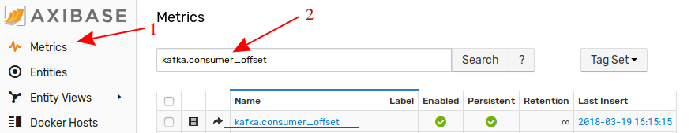

# How to Monitor Kafka Consumers

## Overview

This document describes how to monitor [Apache Kafka](https://kafka.apache.org/) consumer offset using Axibase Time Series Database.

## Configuration

### Launch ATSD

Launch [ATSD](https://github.com/axibase/dockers) container on one of the Docker hosts:

```
docker run \
  --detach \
  --name=atsd \
  --restart=always \
  --publish 8088:8088 \
  --publish 8443:8443 \
  --publish 8081:8081 \
  --publish 8082:8082/udp \
  axibase/atsd:latest
```

Wait until the container is initialized and 'ATSD start completed.' message is displayed.

```
docker logs -f atsd
```

### Start script

Consumer lag calculation requires information about producer offset and consumer offset.

The producer offset is collected from Kafka brokers by the JMX Job above.

The consumer offset is collected using a Kafka console consumer reading events from  the `__consumer_offset` topic on one of the Kafka servers in the cluster.

Login into the Kafka server.

Download the [script](resources/send_offset.sh) into Kafka `bin` directory.

```
# assign execute permission
chmod +x /opt/kafka_2.12-1.0.0/bin/send_offset.sh
```

For Kafka versions before 0.10.2.0 use `--zookeeper` option instead `bootstrap-server` in the script.

Replace `ATSD_HOST` and `TCP_PORT` with actual values and launch the script.

> The default ATSD TCP command port is `8081`.

The script will read topic offsets and send them to ATSD under the hostname entity.

```
# launch the script
nohup /opt/kafka_2.12-1.0.0/bin/send_offset.sh ATSD_HOST TCP_PORT &
```

If the hostname is different from the entity name used in the JMX job, specify the entity manually.

```
nohup /opt/kafka_2.12-1.0.0/bin/send_offset.sh ATSD_HOST TCP_PORT ENTITY &
```

The script will continuously read consumer offsets from Kafka and send the offsets to ATSD as series commands. The commands will also be copied to stdout for debugging.

```ls
series e:kafka_host m:kafka.consumer_offset=455 t:groupid="console-consumer-72620" t:topic="test" t:partition=0 ms:1519893731570
series e:kafka_host m:kafka.consumer_offset=492 t:groupid="console-consumer-72620" t:topic="test" t:partition=0 ms:1519893736569
series e:kafka_host m:kafka.consumer_offset=492 t:groupid="console-consumer-72620" t:topic="test" t:partition=0 ms:1519893741570
series e:kafka_host m:kafka.consumer_offset=550 t:groupid="console-consumer-72620" t:topic="test" t:partition=0 ms:1519893746570
```

Check that metric `kafka.consumer_offset` is available on the Metrics tab in ATSD.
Log in to ATSD instance, click Metrics and type `kafka.consumer_offset` in search field

