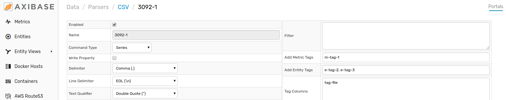

# Importing CSV Parsers

CSV parser is a collection of rules of how to read and translate CSV files into series, properties, and message commands inserted into the database. The parser contains instructions which columns contain entity names, metric names, timestamps, and command tags.

Follow this process to upload a CSV Parser configuration to your local ATSD instance.

1. Expand the **Data** menu and select **CSV Parsers**.

    

2. From the **CSV** page, expand the split button, click **Import**.

    

3. Select the appropriate XML file from your local machine. Click **Import**.

Your parser configuration has been uploaded to ATSD.

Return to the **CSV** page where the newly configured portal will be visible.

## Uploading Multiple Configuration Files

Note that multiple files may be uploaded together or as an archive by opening the **Settings** menu, expanding the **Diagnostics** section, selecting the **Backup Import** page, and completing the form to which you will be directed.

