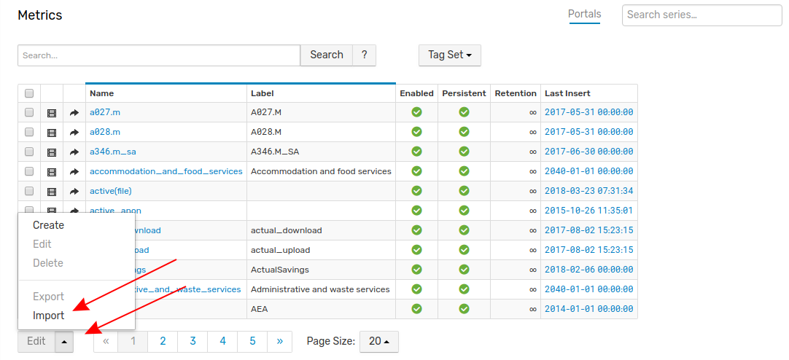

# Importing Metrics to ATSD 

Metrics are numeric measurements stored in ATSD. The [metric record](https://github.com/axibase/atsd/blob/master/api/meta/metric/list.md#fields) includes information about the measured attribute including its name, a user-friendly label, measurement units etc.

Follow this process to import metric definitions into your local ATSD instance.

1. Click the **Metrics** link in the toolbar on the left.

2. From the **Metrics** page, expand the split button at the bottom of the page and click **Import**.

3. Select the appropriate XML file from you local machine and click **Import**.

Your metrics have been uploaded to ATSD. Return to the **Metrics** page where the newly imported metrics will be visible. 

### Uploading Multiple Configuration Files

Note that multiple files may be uploaded together or as an archive by opening the **Settings** menu, expanding the **Diagnostics** section, selecting the **Backup Import** page, and completing the form to which you will be directed.

