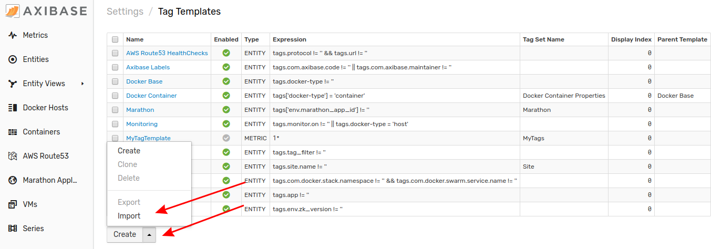

# Importing Tag Templates

A Tag Template is a set of pre-defined formatting rules applied in the rule editor or metric editor for matching entities or metrics correspondingly. The tag template formats the information displayed in the editor in a way, that is customized for the given record.

Follow this process to upload a tag template to your local ATSD instance.

1. Expand the **Settings** menu and select **Tag Templates**.

    

2. From the **Tag Templates** page, expand the split button, click **Import**

    

3. Select the appropriate XML file from your local machine, click **Import**.

    

Your tag template has been uploaded to ATSD.

Return to the **Tag Templates** page where the newly configured template will be visible.

## Uploading Multiple Configuration Files

Note that multiple files may be uploaded together or as an archive by opening the **Settings** menu, expanding the **Diagnostics** section, selecting the **Backup Import** page, and completing the form to which you will be directed.

