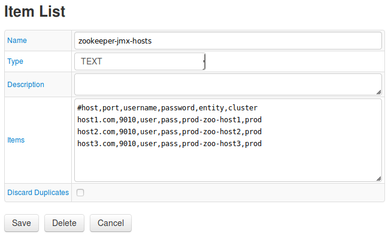
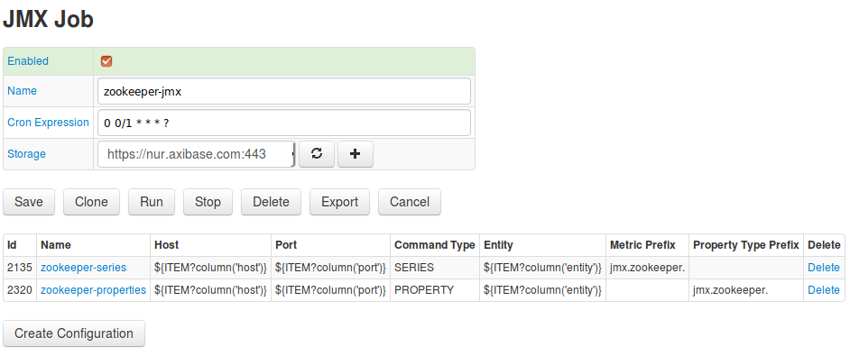
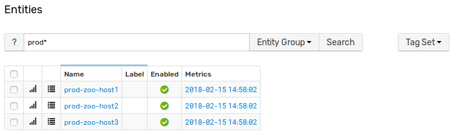
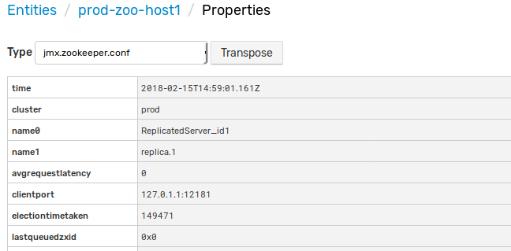
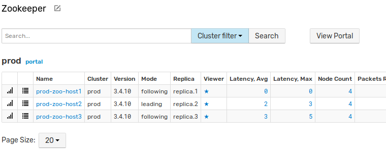

# Zookeeper Integration

This guide describes how to monitor availability and performance of an [Apache Zookeeper](https://zookeeper.apache.org/) cluster (3 nodes) using [Axibase Time Series Database](https://axibase.com/docs/atsd/).

## Step 1: Configure Axibase Collector

### Create hosts list

1) Log in to Axibase Collector at `https://collector_hostname:9443`

2) Open the **Collections** drop-down list in the top menu and select **Item Lists**.

3) Click **Add** and create an item list with Zookeeper hosts.
Enter the name `zookeeper-jmx-hosts`, choose type **TEXT** and add comma-separated addresses of Zookeeper hosts in the following format:

```txt
#host,port,username,password,entity,cluster
host1.com,9010,user,pass,prod-zoo-host1,prod
host2.com,9010,user,pass,prod-zoo-host2,prod
host3.com,9010,user,pass,prod-zoo-host3,prod
```

* **host**: Zookeeper hostname.
* **port**: JMX port.
* **username**: JMX user name.
* **password**: Password for JMX user.
* **entity**: ATSD entity for Zookeeper node.
* **cluster**: ATSD series tag for indicating that nodes are in the same cluster.



Click **Save**.

### Import Job

Open the **Jobs**page. Expand the split button below the table and select **Import**.

Import the [`zookeeper-jmx`](resources/jobs.xml) job.

Locate the `zookeeper-jmx` job in the **Jobs** list.

Adjust the cron expression if required. For more information on cron expressions, see [Scheduling](https://github.com/axibase/axibase-collector/blob/master/scheduling.md).

Select a target ATSD database for storing data.

Click **Save**.



Test job configurations. Open `zookeeper-series` by clicking the link in **Name** column on the **Jobs** page.

If needed, change default parameters.
For more information on JMX configuration, see [JMX Job Documentation](https://github.com/axibase/axibase-collector/blob/master/jobs/jmx.md). Click **Test**.


Repeat test for `zookeeper-properties`.

On the **JMX Job** page set the **Enabled** checkbox and save the job.

### Check data collection

Log in to the target Axibase Time Series Database instance at `https://atsd_hostname:8443`.

Open the **Metrics** tab and verify that `jmx.zookeeper.*` metrics are available.


1. Open the **Entities** tab and verify that `jmx.zookeeper.*` properties are available for entities from `zookeeper-properties` configuration.





## Step 2: Configure Zookeeper in ATSD

### Import entity group

1. Open the **Settings** menu, select **Entity Groups** and import this [entity group](resources/groups.xml).
1. Locate **Zookeeper Nodes** group and open the group by clicking the link in the **Name** column.
1. Confirm that the database successfully imported the entities.


### Import portals

1. Open the **Portals** menu, select **Configure** and import [portals](resources/portal-configs.xml) (set the flag in the **Auto-enable New Portals** check box).
2. Verify that new portals are displayed by opening the **Portals** menu and searching for the newly-configured portal named **Zookeeper Cluster**.


### Import rules

Open the **Alerts** menu, select **Rules** and import [rules](resources/rules.xml) (set the flag in the **Auto-enable New Rules** check box).

Confirm the database imported the desired rules


* **Zookeeper cluster high latency**: alert opens when more than 50% of the nodes in a cluster have average latency greater than 100 ms in 3 minutes.
* **Zookeeper cluster not serving requests**: alert opens when node status is `leaderelection`, which means that nodes cannot choose leader.
* **Zookeeper dead cluster**: opens when no data was collected from cluster in 2 minutes.
* **Zookeeper dead node**: opens when no data was collected from a single node in 2 minutes.
* **Zookeeper dead nodes list**: same as single dead node, but checks all nodes by timer.
* **Zookeeper node high latency**: opens when node average latency is above 100 in 3 consecutive measurements.
* **Zookeeper rate metrics**: always open. Used for transform `packetsreceived` and `packetssent` metrics from cumulative to difference (packets per minute) metrics. Uses derived commands.

Verify rule functionality. Stop one node and check that **Zookeeper dead node** and **Zookeeper dead nodes list** rule opens (allow up to two minutes). Open the **Alerts** menu and select **Open Alerts** to view all open rules.


To check **Zookeeper cluster not serving requests** rule stop more than 50% of all active nodes (in this case two of three, if Zookeeper quorum is default).

To check **Zookeeper dead cluster** stop all nodes.

To check **Zookeeper cluster high latency** send large latency values from the **Data > Data Entry** page. For example:

```ls
series e:prod-zoo-host1 m:jmx.zookeeper.avgrequestlatency=1400 t:cluster=prod
series e:prod-zoo-host2 m:jmx.zookeeper.avgrequestlatency=1500 t:cluster=prod
```

To check **Zookeeper node high latency** send large latency for single node three times using **Data Entry**

```ls
series e:prod-zoo-host1 m:jmx.zookeeper.avgrequestlatency=1400 t:cluster=prod
```

To check **Zookeeper rate metrics** open the **Metrics** tab and verify that metrics `jmx.zookeeper.packetsreceived.counter` and `jmx.zookeeper.packetssent.counter` are collecting.

For more information about the Rule Engine, see [ATSD Rule Engine Documentation](https://axibase.com/docs/atsd/rule-engine/).

### Import entity view

Open the **Entity Views** menu, select **Configure** and import the following [entity view](resources/entity-views.xml).
Check entity view.  Open the **Entity Views** menu and ensure you see **Zookeeper** entity view.



Click the **Portal** icon and check cluster portal.


