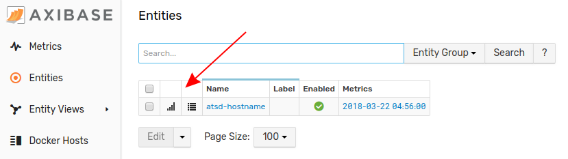

# ActiveMQ Integration

This document describes the process of configuring ActiveMQ for availability and performance monitoring with ATSD.

Requirements

* ActiveMQ `5.x.+`

## Configuring ActiveMQ Server

### Step 1: Enable JMX and Log Aggregator

* Log in to the ActiveMQ server via SSH.
* Change to the ActiveMQ installation directory.

```sh
cd /opt/apache-activemq-5.13.1
```

* Download `.jar` log aggregation filter files to the ActiveMQ `lib` directory:

```sh
wget --content-disposition -P ./lib/ \
   "https://repository.sonatype.org/service/local/artifact/maven/redirect?r=central-proxy&g=com.axibase&a=aggregation-log-filter&v=LATEST"
```

```sh
wget --content-disposition -P ./lib/ \
   "https://repository.sonatype.org/service/local/artifact/maven/redirect?r=central-proxy&g=com.axibase&a=aggregation-log-filter-log4j&v=LATEST"
```

* Append aggregation filter settings to the ActiveMQ `log4j` properties file. Replace `atsd_hostname` with the hostname of the ATSD server:

```sh
cat <<EOF >> ./conf/log4j.properties
log4j.appender.logfile.filter.COLLECTOR=com.axibase.tsd.collector.log4j.Log4jCollector
log4j.appender.logfile.filter.COLLECTOR.writerHost=atsd_hostname
EOF
```

> See [Aggregation Log Filter](https://github.com/axibase/aggregation-log-filter) for additional configuration options.

* Modify JMX settings in the ActiveMQ JVM launch options.

* Search for the `ACTIVEMQ_SUNJMX_START` setting and replace `activemq_hostname` with the full hostname or IP address of the ActiveMQ server. This is the same hostname that Axibase Collector uses when connecting to ActiveMQ server.

> For more information on configuring JMX in ActiveMQ, see [ActiveMQ JMX Notes](https://activemq.apache.org/jmx.html)

ActiveMQ `5.11.x` and later:

```sh
vi ./bin/env
```

```bash
ACTIVEMQ_SUNJMX_START="$ACTIVEMQ_SUNJMX_START -Dcom.sun.management.jmxremote"
ACTIVEMQ_SUNJMX_START="$ACTIVEMQ_SUNJMX_START -Dcom.sun.management.jmxremote.port=1090"
ACTIVEMQ_SUNJMX_START="$ACTIVEMQ_SUNJMX_START -Dcom.sun.management.jmxremote.rmi.port=1090"
ACTIVEMQ_SUNJMX_START="$ACTIVEMQ_SUNJMX_START -Dcom.sun.management.jmxremote.ssl=false"
ACTIVEMQ_SUNJMX_START="$ACTIVEMQ_SUNJMX_START -Djava.rmi.server.hostname=activemq_hostname"
ACTIVEMQ_SUNJMX_START="$ACTIVEMQ_SUNJMX_START -Dcom.sun.management.jmxremote.password.file=${ACTIVEMQ_CONF}/jmx.password"
ACTIVEMQ_SUNJMX_START="$ACTIVEMQ_SUNJMX_START -Dcom.sun.management.jmxremote.access.file=${ACTIVEMQ_CONF}/jmx.access"
```

ActiveMQ `5.10.x` and earlier:

```sh
vi ./bin/activemq
```

```bash
ACTIVEMQ_SUNJMX_START="-Dcom.sun.management.jmxremote \
   -Dcom.sun.management.jmxremote.port=1090 \
   -Dcom.sun.management.jmxremote.rmi.port=1090 \
   -Dcom.sun.management.jmxremote.ssl=false \
   -Djava.rmi.server.hostname=activemq_hostname \
   -Dcom.sun.management.jmxremote.password.file=${ACTIVEMQ_BASE}/conf/jmx.password \
   -Dcom.sun.management.jmxremote.access.file=${ACTIVEMQ_BASE}/conf/jmx.access"
```

Either result is the same as shown in the image below:


* Modify JMX security credential files in `./conf` directory.

`jmx.access`:

```txt
# The "monitorRole" role has readonly access.
monitorRole readonly
```

`jmx.password`:

```txt
# The "monitorRole" role password is "abc123".
monitorRole abc123
```

* Secure access to the `jmx.password` file by restricting permissions:

```sh
chmod 600 ./conf/jmx.password
```

* Restart ActiveMQ server.

```sh
./bin/activemq stop
```

```sh
./bin/activemq start
```

### Step 2: View Collected Logs in ATSD

1. Log in to the ATSD web interface at `https://atsd_hostname:8443`.
2. Open the **Entities** tab.
3. Locate the ActiveMQ host in the **Entities** list or enter the entity name in the **Search Bar** above the list.
4. Click the **Portal** icon next to the host.



An example of the collected log data displayed in the ATSD portal is shown in the image below:


## Configuring Statistics Collection

## Before Beginning

Log in to Axibase Collector via SSH and verify that the ActiveMQ server is reachable on `activemq_hostname` (see Step 1).
If the `activemq_hostname` cannot be resolved, add it to `/etc/hosts` manually.

### Step 3: Configure ActiveMQ JMX Job

1. Log in to Axibase Collector at `https://collector_hostname:9443`.
2. From the **Jobs** page, locate the `jmx-activemq` job.
3. On the **JMX Job** page, enable collection with the **Enabled** check box, click **Save**.
4. Adjust the `cron` expression if needed. By default, Collector executes the job every ten seconds. For more information on `cron` expressions, see [Scheduling](https://axibase.com/docs/axibase-collector/scheduling.html).


### Configuring Series Collection

1. Select `activemq-series` configuration.
2. On the **JMX Configuration** page, enter the JMX connection parameters, specified in Step 1.6 above:

    * **Host**: ActiveMQ hostname. Must be the same as the `activemq_hostname`.
    * **Port**: JMX port.
    * **User Name**: JMX user name such as `monitorRole`. Read-only permissions are sufficient.
    * **Password**: Password for JMX user.
    * **Entity**: Optionally, specify the output of the hostname command on the ActiveMQ server if the hostname differs from `activemq_hostname` (for example, if `activemq_hostname` represents a fully-qualified name).
    * Other parameters are optional. For more information on JMX configuration, see [JMX](https://axibase.com/docs/axibase-collector/jobs/jmx.html).

3. Click **Test** to validate the configuration. If the existing configuration passes, this indicates that there are no errors or empty fields in the test results.
4. Click **Save**.

    

### Configuring Property Collection

1. From the table on the **JMX Job** page, click **Edit** next to the `activemq-property` configuration.
2. Set Host, Port, User Name, Password, and Entity fields as described in the previous section.
3. Click **Test** to validate the configuration.
4. Click **Save**.

### Step 4: View ActiveMQ Statistics in ATSD

1. Log in to ATSD web interface at `https://atsd_hostname:8443`.
2. Open the **Entities** tab.
3. Locate the ActiveMQ host in the **Entities** list or enter the name in **Search Bar** above the list.
4. Click the **Portal** icon next to the host.


See example collected log data displayed in an ATSD portal in the image below:

