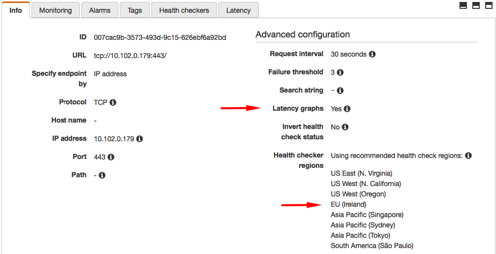
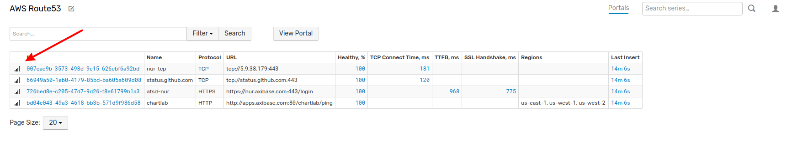
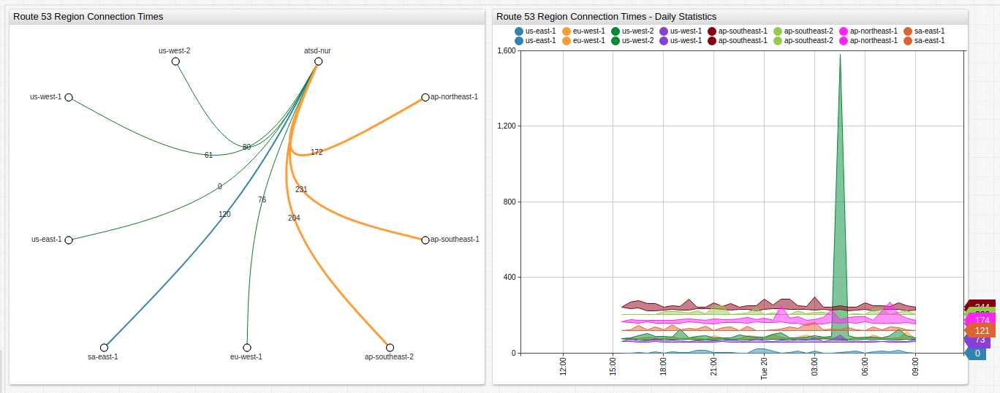

# Tracking Application Latency Issues with ATSD and Route 53

## Introduction

Route 53 networking and content delivery tool from Amazon Web Services supports worldwide endpoint health checks. ATSD and Axibase Collector may monitor these health checks to historize data for longer intervals than the two weeks which are
recorded by Route 53.

Health checks are available for HTTP, HTTPS, and TCP protocols and are executed from a variety of regions for resiliency.

Additionally, using latency checks to monitor connectivity issues from multiple regions provides valuable insight
for system administrators who need to diagnose whether the problem is related to network infrastructure or the target application itself. Look at the figure below for tips about interpreting latency data.

In the above figure, latency spikes indicated by green arrows show regional connectivity issues. Your application is functioning as expected. The group of latency spikes indicated by the red arrow (showing simultaneous latency issues across **all** regions) indicate the problem is likely related to the monitored application, which is inaccessible from multiple regions.

> Note that **Latency Graphs** are a premium feature and must be enabled through the **AWS Console** or API.

### Prerequisites

* Install [ATSD sandbox](README.md).

## Import Latency Portal

Log into ATSD and click **Portals** in the top menu. Import the [latency portal](resources/aws-route53-connection-time-latency.xml) from the XML file as described by the [Import Instructions](../../shared/import-portal.md).

## Import Entity View

Click the **Entity View** link in the tool menu on the left and import the [Route53 entity view](resources/entity-views.xml) from the XML file as described by the [Import Instructions](../../shared/import-entity-view.md).

## Results

### AWS Route 53 Entity View and Application Latency Portal

In the **AWS Route 53** tab, the newly-configured entity view and portal are now accessible. Click **Open Portal** to monitor worldwide endpoint latency.

The **Latency Portal** has two windows: The first tracks average connection time (milliseconds) and the second shows real-time and historical connection data (milliseconds).

Open the **ChartLab** example above to see a fully functioning **Latency Portal** integrated with Axibase servers delivering status information from endpoints and applications across the globe.