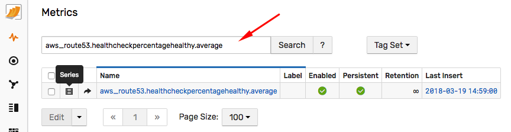
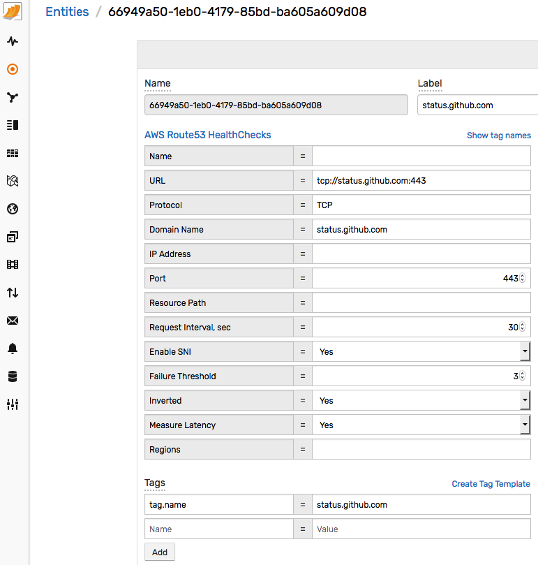

# How to Create Uptime Reports for AWS Route 53 Health Checks

## Overview

[AWS Route 53](https://aws.amazon.com/route53) provides tools to monitor connectivity to AWS and external services using [health checks](https://docs.aws.amazon.com/Route53/latest/DeveloperGuide/welcome-health-checks.html).

A health check is a configuration for a scheduled connectivity test that AWS performs from multiple locations around the world. The health checks support HTTP, HTTPS, and TCP protocols.

The default list of regions where tests are performed is as follows:

* `us-east-1`
* `us-west-1`
* `us-west-2`
* `sa-east-1`
* `ap-southeast-1`
* `ap-southeast-2`
* `ap-northeast-1`

The test frequency is set to 30 second intervals, which may be reduced to 10 seconds for operation in **Fast** mode.
In addition to connection parameters, which specify the DNS name or IP address, the port and the path for HTTP/S tests, you can specify retry logic to test the endpoint again if the connection fails. The specified number of retry attempts, executed by the service at the same frequency as the base test, determine how many successive failures Route 53 allows before the service determines an endpoint is unavailable.

The intervals of time when the endpoint is unavailable are captured by the `HealthCheckPercentageHealthy` metric. This metric measures the percentage of time in the given period when the endpoint is available from 0% to 100%. For example, if the value of the average statistic for the `HealthCheckPercentageHealthy` metric is 90% for the ten-minute period, the target is reachable for nine minutes (`10 * 60 * 90% = 540 seconds`).  AWS CloudWatch stores these statistics  for a period of up two weeks.


Measuring uptime is important for a variety of use cases such as reviewing IT operations track records, or evaluating the quality of services delivered by a service provider.

In addition to cumulative availability over a reporting period, identify the total number of downtime incidents as well as the longest incidents for in-depth diagnostics.

While [How to Build Availability Report for AWS Route53](README.md) describes how to collect AWS Route53 statistics with Axibase Time Series Database, this article focuses on creating and delivering scheduled uptime reports.

## Preparation

* Setup an [IAM account](https://axibase.com/docs/axibase-collector/jobs/aws-iam.html)
* Configure [Route53 & ATSD](README.md) integration. Copy health check attributes as described by the [ATSD Integration Documentation](https://github.com/axibase/atsd-integration/tree/aws-route53)

Log in to ATSD user interface using `axibase` username and `axibase` password.

Open the **Metrics** tab and search for the `aws_route53.healthcheckpercentagehealthy.average` metric.



Click **Series** icon to view monitored health checks.


Click one of the health check IDs under the **Entity** column to view properties. Verify that both the standard and custom resource tags are present in ATSD.



This completes the verification stage. You now have data which can be reported on by the database.

## Reports

Since you need a flexible way of filtering, grouping, and formatting results, rely on [SQL](https://axibase.com/docs/atsd/sql/) implemented in Axibase Time Series Database (ATSD) to prepare reports, including time series extensions for time zone aggregations.

In ATSD, execute SQL queries via web-based console, an external reporting tool using a JDBC/ODBC driver, or with the built-in report generator with email delivery, web publishing, and file generation options. This article relies on the web-based [SQL Console](https://axibase.com/docs/atsd/sql/) to test and fine-tune these queries.

### Base Report

To get started, open the web-based [SQL Console](https://axibase.com/docs/atsd/sql/) interface in ATSD from the toolbar on the left and execute the sample SQL query below:

```sql
SELECT entity AS ID, entity.tags.url AS URL,
  ROUND(AVG(value), 3) AS "Average Health, %", COUNT(value) AS "Sample Count"
FROM "aws_route53.healthcheckpercentagehealthy.average"
  WHERE datetime >= previous_day AND datetime < current_day
GROUP BY entity
  ORDER BY entity
```


The output includes the list of health check IDs and the average percentage healthy metric for each check for the **previous day**.

```ls
| ID                                    | URL                                       | Average Health, %  | Sample Count |
|---------------------------------------|-------------------------------------------|--------------------|--------------|
| bd04c043-49a3-4618-bb3b-571d9f986d58  | http://api.example.org:80/v1.12/srv-ping  | 100.000            | 1440         |
| 726bed8e-c205-47d7-9d26-f8e61799b1a3  | https://docs.example.org:443/poll         | 99.958             | 1440         |
| 007cac9b-3573-493d-9c15-626ebf6a92bd  | tcp://192.0.2.1:443                       | 100.000            | 1440         |
```

This query includes the **Sample Count** column for data quality control purposes. Route 53 reports checks every minute, the number of samples in the report is equal to the number of hours in the reporting interval multiplied by `60`. In the above case, the number of hours is `24` and therefore the sample count is `24*60 = 1440`.

You can adjust the start and end date of the reporting interval using convenient [calendar](https://axibase.com/docs/atsd/shared/calendar.html) syntax. For example, to view availability for the previous quarter, specify the date condition as follows:

* Last 24-hours:

```sql
WHERE datetime >= NOW - 24*hour AND datetime < NOW
```

* Previous week:

```sql
WHERE datetime >= previous_week AND datetime < current_week
```

* Previous month:

```sql
WHERE datetime >= previous_month AND datetime < current_month
```

* Previous quarter:

```sql
WHERE datetime >= previous_quarter AND datetime < current_quarter
```

### Displaying Health Check Properties

Entity tags displayed on the Entity editor page above can be added to the list of displayed columns by accessing the data as `entity.tags.{tag_name}`.

```sql
SELECT entity.tags.url AS URL, entity.tags.protocol AS "Protocol",
  ROUND(AVG(value), 3) AS "Average Health, %"
FROM "aws_route53.healthcheckpercentagehealthy.average"
  WHERE datetime >= previous_day AND datetime < current_day
GROUP BY entity
  ORDER BY entity.tags.url
```

```ls
| URL                                       | Protocol  | Average Health, % |
|-------------------------------------------|-----------|-------------------|
| http://api.example.org:80/v1.12/srv-ping  | HTTP      | 100.000           |
| https://docs.example.org:443/poll         | HTTPS     | 99.958            |
| tcp://192.0.2.1:443                       | TCP       | 100.000           |
```

### Filtering By Property

Filter the report by entity tag using [String Operators](https://axibase.com/docs/atsd/sql/#where-clause) such as `=`, `!=`, and `LIKE`.

```sql
SELECT entity.tags.url AS URL, entity.tags.protocol AS "Protocol",
  ROUND(AVG(value), 3) AS "Average Health, %"
FROM "aws_route53.healthcheckpercentagehealthy.average"
  WHERE datetime >= previous_day AND datetime < current_day
  AND entity.tags.protocol LIKE 'HTTP%'
GROUP BY entity
  ORDER BY entity.tags.url
```

```ls
| URL                                       | Protocol  | Average Health, % |
|-------------------------------------------|-----------|-------------------|
| http://api.example.org:80/v1.12/srv-ping  | HTTP      | 100.000           |
| https://docs.example.org:443/poll         | HTTPS     | 99.958            |
```

```sql
SELECT entity.tags.url AS URL, entity.tags.protocol AS "Protocol",
  ROUND(AVG(value), 3) AS "Average Health, %"
FROM "aws_route53.healthcheckpercentagehealthy.average"
  WHERE datetime >= previous_day AND datetime < current_day
  AND entity.tags.url NOT LIKE '%api.example%'
GROUP BY entity
  ORDER BY entity.tags.url
```

```ls
| URL                                       | Protocol  | Average Health, % |
|-------------------------------------------|-----------|-------------------|
| http://api.example.org:80/v1.12/srv-ping  | HTTP      | 100.000           |
| tcp://192.0.2.1:443                       | TCP       | 100.000           |
```

### Grouping by Property

Since health checks are often collected for various resources of similar type, for example geographically-distributed applications, it may be useful to calculate average uptime using a higher-level grouping as opposed to URL. Derive this grouping column from either the URL or the custom resource tags defined in the Route 53 Console.

```sql
SELECT entity.tags.geo AS "GEO",
  ROUND(AVG(value), 3) AS "Average Health, %"
FROM "aws_route53.healthcheckpercentagehealthy.average"
  WHERE datetime >= previous_day
GROUP BY entity.tags.geo
  ORDER BY entity.tags.geo
```

```ls
| GEO  | Average Health, % |
|------|-------------------|
| EUR  | 99.923            |
| US   | 100.000           |
```

### Filter Grouped Reports

ATSD SQL reporter has a number of options, one of which is conditional email delivery. In particular, ATSD may email a report only if the number of records is not zero. By leveraging this functionality you can both filter and email the aggregate reports only when the filtered list is not empty.

```sql
SELECT entity.tags.geo AS "GEO",
  ROUND(AVG(value), 3) AS "Average Health, %"
FROM "aws_route53.healthcheckpercentagehealthy.average"
  WHERE datetime >= previous_day
GROUP BY entity
  HAVING AVG(value) < 99.95
  ORDER BY entity.tags.geo
```

```ls
| GEO  | Average Health, % |
|------|-------------------|
| EUR  | 99.923            |
```


### Calendar Filtering

The database provides a convenient syntax to filter data via calendar. This is convenient, if the availability objectives vary by peak/off-peak hours. This filtering condition calculates average uptime for specific hours of the day such as 8 AM to 6 PM during weekdays (Monday to Friday).

```sql
SELECT entity.tags.url AS URL,
  ROUND(AVG(value), 3) AS "Average Health, %", COUNT(value) AS "Sample Count"
FROM "aws_route53.healthcheckpercentagehealthy.average"
  WHERE datetime >= previous_month AND datetime < next_month
  AND CAST(date_format(time, 'H') AS number) BETWEEN 8 AND 17
  AND date_format(time, 'u') < 6
GROUP BY entity
  ORDER BY AVG(value) DESC
```

```ls
| URL                                       | Average Health, % |
|-------------------------------------------|-------------------|
| tcp://status.github.com:443               | 100.000           |
| tcp://192.0.2.1:443                       | 99.447            |
| https://docs.example.org:443/poll         | 99.074            |
| http://api.example.org:80/v1.12/srv-ping  | 63.636            |
```

Similarly, calculate the availability for specific days of the week to locate patterns that might lead to enhanced change control, such as instituting a change freeze on Fridays.

```sql
SELECT substr(date_format(time, 'u-EEE'), 3) AS day_of_week,
  ROUND(AVG(value), 3) AS "Average Health, %"
FROM "aws_route53.healthcheckpercentagehealthy.average"
  WHERE datetime >= previous_month AND datetime < next_month
GROUP BY date_format(time, 'u-EEE')
  ORDER BY date_format(time, 'u-EEE')
```

```ls
| day_of_week  | Average Health, % |
|--------------|-------------------|
| Mon          | 99.923            |
| Tue          | 99.905            |
| Wed          | 99.226            |
| Thu          | 99.953            |
| Fri          | 99.749            |
| Sat          | 99.912            |
| Sun          | 99.986            |
```

### Downtime Incidents - Incident Count

```sql
SELECT entity.tags.url AS URL, count(value) AS "Downtime Count"
FROM "aws_route53.healthcheckpercentagehealthy.average"
  WHERE datetime >= previous_week AND datetime < current_week
  AND value = 0
GROUP BY entity
  ORDER BY count(value) DESC
```

```ls
| URL                                | Downtime Count |
|------------------------------------|----------------|
| https://docs.example.org:443/poll  | 5             |
| tcp://192.0.2.1:443                | 1             |
```

### Downtime Incidents - Longest Incidents

The impact of downtime incidents is typically more severe if the duration exceeds a certain reasonable recovery threshold.

The following report identifies the longest downtime incidents (where health percentage is consecutively 0) and the downtime exceeds 5 minutes.

```sql
SELECT "url",
  date_format("period_start") AS "Incident Start",
    date_format("adjusted_period_end") AS "Incident End",
    ("adjusted_period_end" - "period_start") / 60000 AS "Duration, min"
FROM (
    SELECT "url", "period_start", LEAD("period_end") AS "adjusted_period_end"
    FROM (
        SELECT entity.tags.url AS "url",
            CASE WHEN ((LAG(time) IS NOT NULL) AND (time - LAG(time) = 60000) AND (entity = LAG(entity))) THEN 0 ELSE time END AS "period_start",
            CASE WHEN ((LEAD(time) IS NOT NULL) AND (LEAD(time) - time = 60000) AND (entity = LEAD(entity))) THEN 0 ELSE time END AS "period_end"
        FROM "aws_route53.healthcheckpercentagehealthy.average"
        WHERE value = 0
      ORDER BY entity, tags, time ASC)
    WHERE ("period_start" != 0 OR "period_end" != 0) AND ("period_start" != "period_end") )
WHERE "period_start" != 0
   AND ("adjusted_period_end" - "period_start") > 60000*5
  ORDER BY "Duration, min" DESC
```

```ls
| url                                | Incident Start       | Incident End         | Duration, min |
|------------------------------------|----------------------|----------------------|---------------|
| tcp://192.0.2.1:443                | 2018-03-14 16:42:00  | 2018-03-14 16:51:00  | 9             |
| https://docs.example.org:443/poll  | 2018-03-14 16:41:00  | 2018-03-14 16:50:00  | 9             |
```