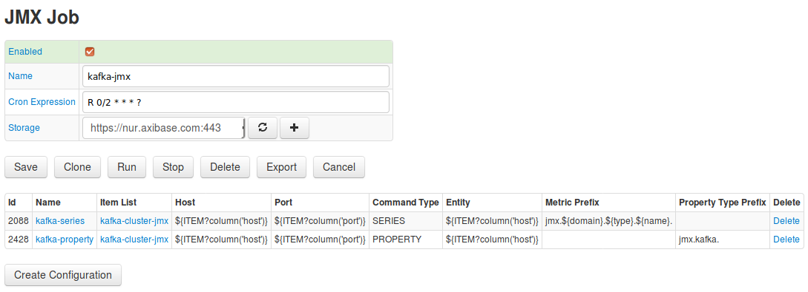
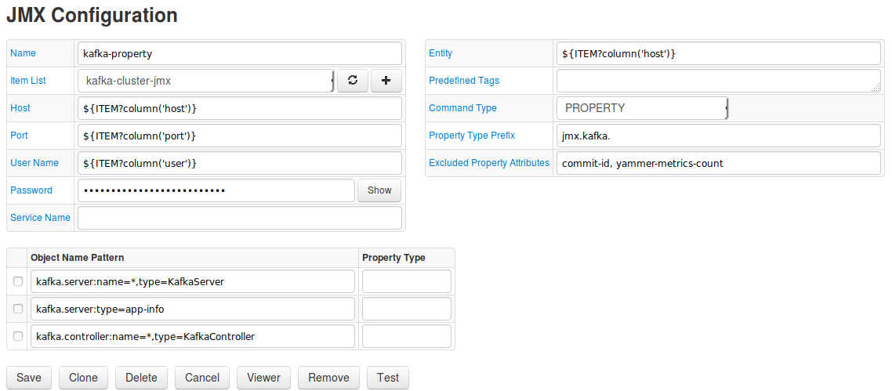
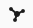
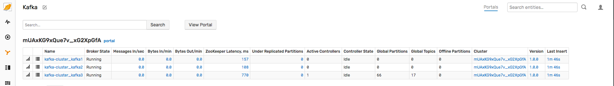
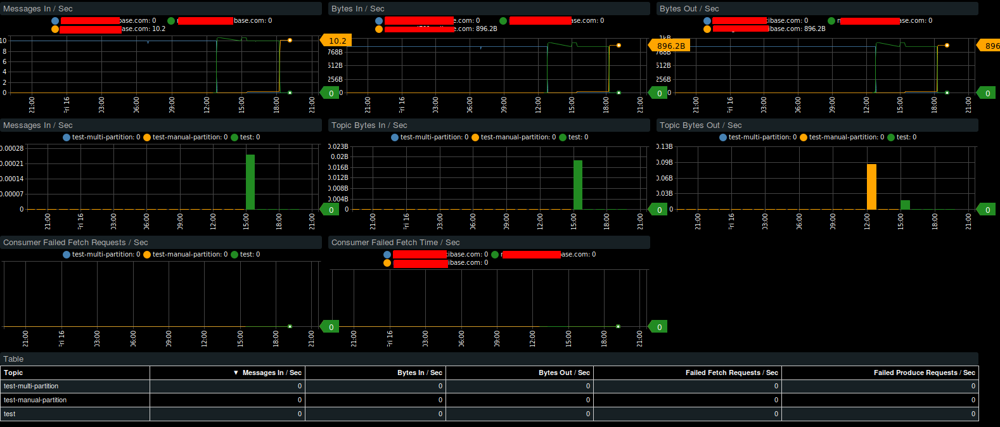

# Kafka Integration

This document describes how to monitor availability and performance of [Apache Kafka](https://kafka.apache.org/) using ATSD.

## Step 1: Configure Axibase Collector

1. Log in to Axibase Collector at `https://collector_hostname:9443`
2. From the **Jobs** page select **Import** by opening the split button below the table.
3. Import the [`kafka-jmx`](./resources/job_jmx_kafka-jmx.xml) job.
4. Locate the newly-imported `kafka-jmx` job on the **Jobs** page.
5. On the **JMX Job** page, enable the job status by setting the flag in the **Enabled** checkbox.
6. Adjust the `cron` expression if required. For more information on `cron` expressions, see [Scheduling](https://axibase.com/docs/axibase-collector/scheduling.html).
7. Select a target ATSD database for storing data.
8. Click **Save**.



### Configure series collection

1. Select `kafka-series` configuration.
2. On the **JMX Configuration** page, enter the JMX connection parameters or use [Item List](https://axibase.com/docs/axibase-collector/jobs/jmx.html#connection-parameters) with predefined kafka parameters:

    * **Host**: Kafka hostname.
    * **Port**: JMX port.
    * **User Name**: JMX user name.
    * **Password**: Password for JMX user.
    * **Entity**: Optionally, specify the output of the hostname command on the Kafka server if it is different from `kafka_hostname` (for example if `kafka_hostname` represents a fully-qualified name).
    * Other parameters are optional. For more information on JMX configuration, see [JMX Job Documentation](https://axibase.com/docs/axibase-collector/jobs/jmx.html).

3. Click **Test** to validate the configuration.
4. Click **Save**.

    

### Configure properties collection

1. Select `kafka-properties` configuration.
2. Set **Host**, **Port**, **User Name**, **Password**, and **Entity** fields as described in the previous section.
3. Click **Test** to validate the configuration.
4. Click **Save**.

    

## Step 2: Configure Kafka in ATSD

1. Log in to the target Axibase Time Series Database instance at `https://atsd_hostname:8443`.
2. Go to the **Metrics** page and verify that `jmx.kafka.*` metrics are available.
3. Go to the **Entities** page and verify that `jmx.kafka.*` properties are available for entities from `kafka-properties` configuration.
4. Open the **Settings** menu, select **Entity Groups** and import [Kafka](./resources/groups.xml) entity group.
5. Open the **Portals** menu, select **Configure** and import [Kafka](./resources/portal-configs.xml) portals (check on the **Auto-enable New Portals** check box).
6. Open the  **Alerts** menu, select **Rules** and import [Kafka](./resources/rules.xml) rules (check the **Auto-enable New Rules** check box).
7. Open the  **Entity Views** menu, select **Configure** and import [Kafka](./resources/entity-views.xml) entity view.

## Step 3: Verification

1. Select an open `Kafka` on the **Entity Views** menu:

    

2. Verify that the portal in the table header is available and refers to the Kafka portal:

    

3. Verify that portals for each entity refer to the Broker portal:

    

## Consumer Lag

Consumer lag calculation requires information about producer offset and consumer offset.

Producer offset is collected from Kafka brokers by the JMX Job above.

Consumer offset is collected using a Kafka console consumer reading events from  the `__consumer_offset` topic on one of the Kafka servers in the cluster.

Log in to the Kafka server.

Download the [shell script](./resources/send_offset.sh) into Kafka `bin` directory.

```sh
# assign execute permission
chmod +x /opt/kafka_2.12-1.0.0/bin/send_offset.sh
```

For Kafka versions before `0.10.2.0` use `--zookeeper` option instead `bootstrap-server` in the script.

Replace `ATSD_HOST` and `TCP_PORT` with actual values and launch the script.

> The default ATSD TCP command port is `8081`.

The script reads and sends topic offsets to ATSD under the hostname entity.

Launch the script:

```sh
nohup /opt/kafka_2.12-1.0.0/bin/send_offset.sh ATSD_HOST TCP_PORT &
```

If the hostname is different from the entity name used in the JMX job, specify the entity manually.

```sh
nohup /opt/kafka_2.12-1.0.0/bin/send_offset.sh ATSD_HOST TCP_PORT ENTITY &
```

The script continuously reads consumer offsets from Kafka and sends the offsets to ATSD as `series` commands. Kafka also copies the commands `stdout` for debugging.

```ls
series e:nurswgvml702 m:kafka.consumer_offset=455 t:groupid="console-consumer-72620" t:topic="test" t:partition=0 ms:1519893731570
series e:nurswgvml702 m:kafka.consumer_offset=492 t:groupid="console-consumer-72620" t:topic="test" t:partition=0 ms:1519893736569
series e:nurswgvml702 m:kafka.consumer_offset=492 t:groupid="console-consumer-72620" t:topic="test" t:partition=0 ms:1519893741570
series e:nurswgvml702 m:kafka.consumer_offset=550 t:groupid="console-consumer-72620" t:topic="test" t:partition=0 ms:1519893746570
```

1. Check that metric `kafka.consumer_offset` is available on the **Metrics** tab in ATSD.
1. Import [Consumer Lag Portal](./resources/consumer-lag.xml) into ATSD and change the topic name to view the consumer lag.


For additional Kafka integration, see [Brokers Monitoring](brokers-monitoring/README.md) and [Consumers Monitoring](consumers-monitoring/README.md).
