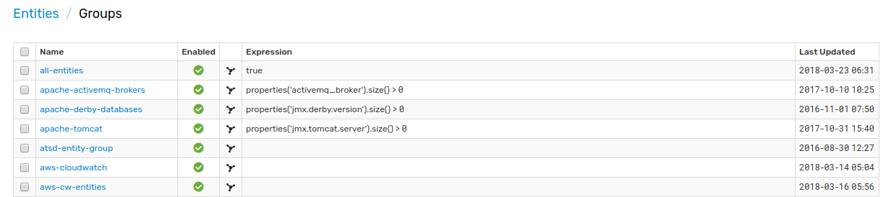
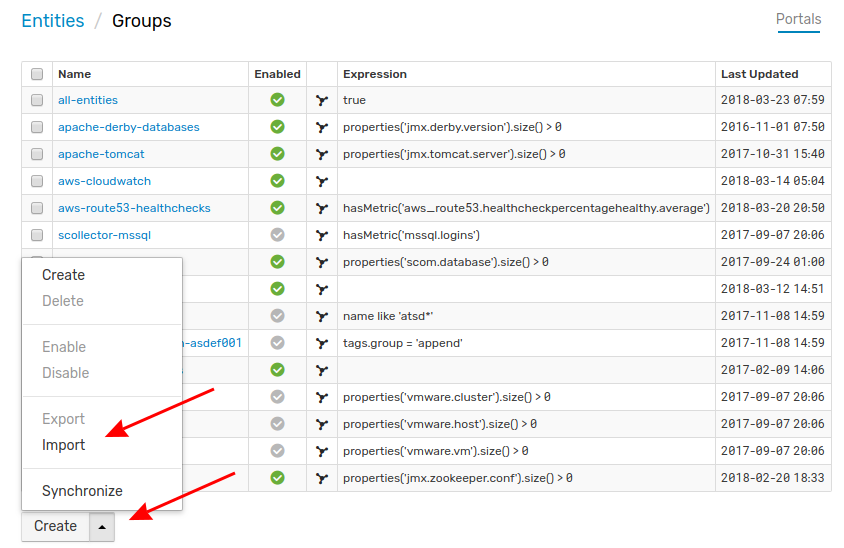

# Importing Entity Groups

Entity Groups provide a way to organize similar entities into logical collections. These groups may be operated upon as aggregates by a user when managing permissions, filtering data, calculating statistics, etc.

For more information on entity groups, see the [ATSD Documentation](https://axibase.com/docs/atsd/configuration/entity_groups.html).

Follow this procedure to import an Entity Group definition to your local ATSD instance.

1. Expand the **Settings** menu from the left toolbar and select **Entity Groups**

    

2. Expand the split button at the bottom of the page and click **Import**.

    

3. Select the appropriate XML file from your local machine by clicking **Choose File**. Click **Import**.

    

Expand the **Settings** menu in the left tool bar and select **Entity Groups**, where you can select your new Entity Group.

## Uploading Multiple Configuration Files

Note that multiple files may be uploaded together or as an archive by opening the **Settings** menu, expanding the **Diagnostics** section, selecting the **Backup Import** page, and completing the form.

