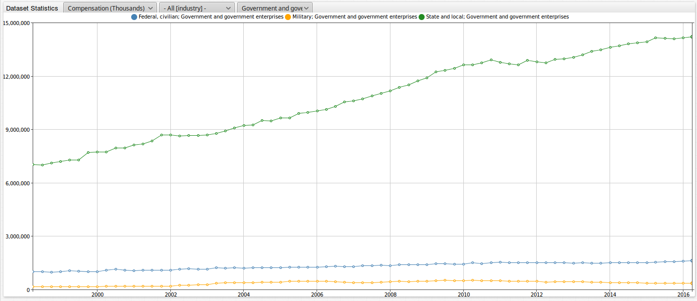
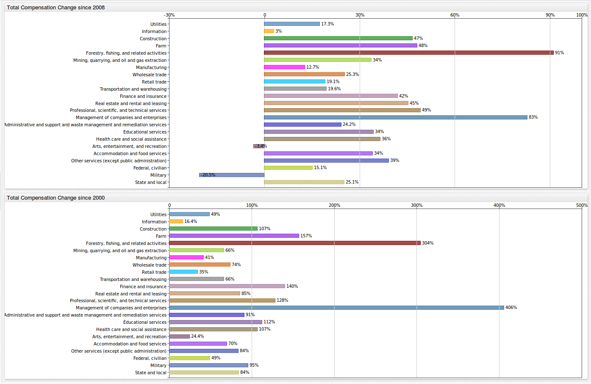
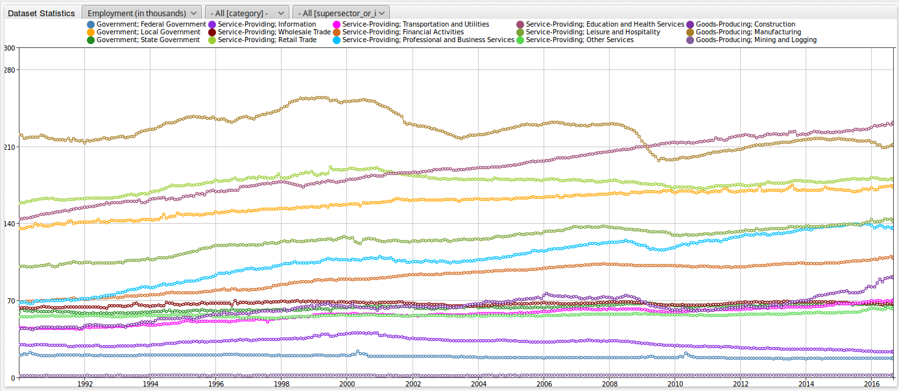
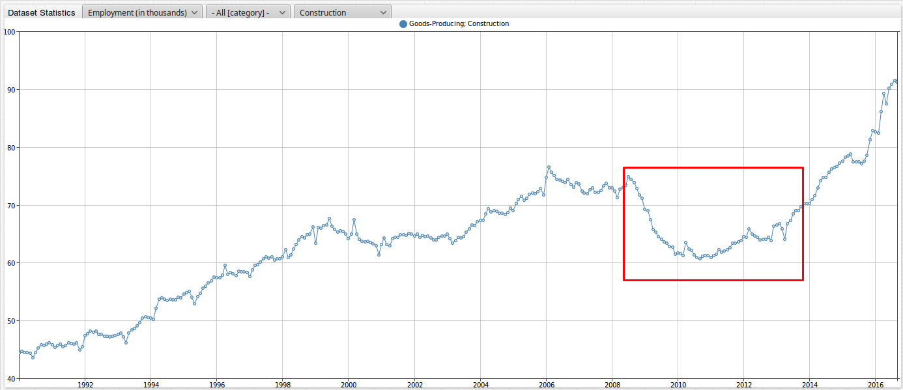
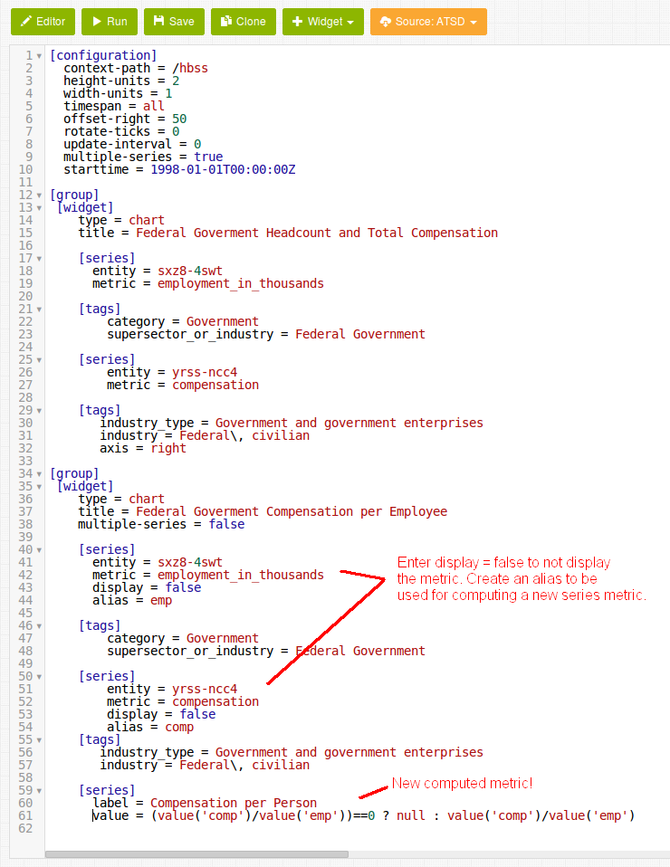
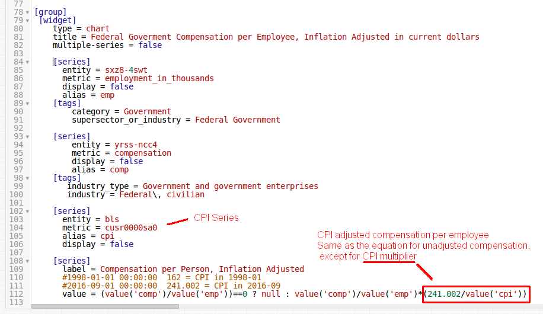

# Analyzing and Combining Iowa Employment and Consumer Price Index Socrata Datasets

## Introduction

To grant easier access to public datasets such as **Employee Financial Compensation by Industry in Iowa**, the Unites States government established [data.gov](https://www.data.gov/). Datasets are available online to conduct research, develop web applications, and design data visualizations, on a variety of topics ranging
from agriculture and manufacturing, to healthcare and society.

* According to the [US Bureau of Labor Statistics](http://www.bls.gov/news.release/laus.nr0.htm), as of September 2016, Iowa had an unemployment rate of 4.2% which is lower than then US average of 5.0%.
* [From September of 2015 to September 2016](http://www.bls.gov/news.release/laus.t05.htm), the state of Iowa added 29,600 non-farm jobs to bring the number of non-farm employed persons in the state to 1,587,800. This amounted to a growth rate of 1.9%. The US as a whole for this same period experienced a slightly lower growth rate of 1.8%.

The governments at the federal, state, city, and county level publish datasets in [Socrata Open Data Format](https://socrata.com).

Using ATSD, you can combine datasets from multiple entities in one portal.

This article uses data collected from the [Bureau of Labor Statistics](http://www.bls.gov/home.htm).

## Iowa Employee Compensation Dataset

Explore the **Employee Financial Compensation by Industry in Iowa** on [`data.gov`](http://catalog.data.gov/dataset/employee-compensation-by-industry-in-iowa)

The state of Iowa collects estimated employee compensation values in non-adjusted dollar value. Compensation is the total remuneration, both monetary and in kind, payable by employers to employees in return for work during some period.

The state aggregates data in to one of three industries, each with sub-categories:

* Farm
  * Farm
* Government and Government Enterprises
  * Federal and Civilian
  * Military
  * State and Local
* Private Non-farm
  * Administrative and support of waste management and remediation   services
  * Accommodation and food services
  * Arts, entertainment, and recreation
  * Construction
  * Educational services
  * Finance and insurance
  * Forestry, fishing, and related activities
  * Health care and social assistance
  * Information
  * Management of companies and enterprises
  * Manufacturing
  * Mining, quarrying, and oil and gas extraction
  * Professional, scientific, and technical services
  * Real estate and rental and leasing
  * Retail trade
  * Transportation and warehousing
  * Wholesale trade
  * Utilities
  * Other Services (except public administration)

Download the dataset in CSV, RDF, JSON, or XML format.

## Axibase Time Series Database

Processing datasets using ATSD is simple because the [Collector](https://axibase.com/docs/axibase-collector/) tool has built-in heuristics to handle the Socrata format which `data.gov` entities publish datasets.

Collector uses Socrata metadata to interpret the meaning of columns and extract times, dates, and categories from the raw data. Additionally, ATSD stores data in a local database instance which allows you to combine this public dataset with those generated locally.

The following tasks become trivial with ATSD:

* Adding additional datasets from data.gov.
* Manipulating and designing table schema.
* Provisioning an application server.
* Writing programs to parse and digest files.

Configure a [scheduled job](https://axibase.com/docs/axibase-collector/#job-types) to retrieve the data from a specified endpoint ATSD parses the dataset according to pre-defined rules. Once the database contains the needed data, creating and sharing reports with built-in widgets is simple using examples from [axibase.com](https://axibase.com/products/axibase-time-series-database/visualization/widgets/). The database continuously updates the dataset as new data is published by the state of Iowa.

The figure below shows total statewide employee compensation for each of the 23 recorded industries.


[](https://apps.axibase.com/chartlab/f5eae012)

Filter data and create interactive functions for any visualization. Open the **ChartLab** portal above and explore the Iowa compensation dataset using the drop-down lists:

* **Metric**: view data for a specified metric. In the default portal, the only current option is to filter by US dollars amount.
* **Industry**: filter each of the 23 industries. The visualization above shows all industries.
* **Sub-Category**: filter by industry group.

Select **Farm** from the **`industry_type`** drop-down list.The total employee compensation for farming fluctuates quite
often based on seasonality.


[](https://apps.axibase.com/chartlab/131b7670)

Next, select **Government and Government Enterprises** from the **`industry_type`** drop-down list. The compensation for
**federal and civilian** and **military** barely increases over time but **state and local** compensation shows steady growth.



Exclude series from the filtered view by clicking on the series legend. The image below does not display the **state and local** series. The growth of the **federal, civilian** and **military** series appears more significant.


[](https://apps.axibase.com/chartlab/cb62aab7)

Select the **private non-farm** series using the **`industry_type`** drop-down list.


[](https://apps.axibase.com/chartlab/0c459d5f)

Filter for the **Construction** and **Manufacturing** metrics by using the **`industry`** drop-down list. Both industries visibly suffered during the Great Recession.


The portal below explores total compensation change per industry in Iowa since 2008 and 2000 using a bar chart. Explore other available **ChartLab** widgets on the [Axibase website](https://axibase.com/products/axibase-time-series-database/visualization/widgets/).



[](https://apps.axibase.com/chartlab/8323be2f/5/)

## Additional Iowa Datasets: State of Iowa Employment by Month and Industry

Insert an additional dataset into ATSD to give the above data context. For example, use a dataset which provides information on the gross number of employees working in the state.

1. Navigate to [https://data.iowa.gov](https://data.iowa.gov).
2. On the home page, select the **Employment** tab.
3. Scroll to the bottom of the page and open the **Topics** drop-down list. Select **Employment**.

   

4. Select [**Iowa Seasonally Adjusted Non-Farm Employment by Month and Industry**](https://data.iowa.gov/Economy/Iowa-Seasonally-Adjusted-Non-Farm-Employment-by-Mo/sxz8-4swt).
5. Open the **Download** drop-down list and select **JSON**.

   

The image below shows the dataset **Iowa Seasonally Adjusted Non-Farm Employment by Month and Industry**.



The state of Iowa publishes data for each of the following industries and sub-categories:

* Goods producing
  * Construction
  * Manufacturing
  * Mining and Logging
* Government
  * Federal Government
  * Local Government
  * State Government
* Service providing
  * Education and Health Services
  * Financial Activities
  * Information
  * Leisure and Hospitality
  * Professional and Business Services
  * Retail Trade
  * Transportation and Utilities
  * Wholesale Trade

Other Services

Filter data and create interactive functions for any visualization. Open the **ChartLab** portal above and explore the Iowa employment dataset using the drop-down lists:

* **Metric**: view data for a specified metric. In the default portal, the only current option is to filter by US dollars amount.
* **Industry**: filter by each of the three industries.
* **Sub-Category**: filter by sun-category.

[](https://apps.axibase.com/chartlab/1ac33603)

Explore specific metrics in the **Iowa Seasonally Adjusted Non-Farm Employment by Month and Industry** dataset. As with the total statewide employee compensation dataset, filter for the **Construction** and **Manufacturing** metrics. Below are images of the
**Construction** and **Manufacturing** metrics, respectively.




The same decline correlating with the recession period is highlighted the figures above.

Below is a table of datasets from `data.iowa.gov` already available in **ChartLab**. Modify configuration in the **Editor** window to compare data across entities. For more information about **ChartLab** syntax or selecting series, see the [ChartLab Introduction](../../shared/chartlab.md).

|Entity     | Dataset Title     |
|-----------|--------------------------|
| `ytnz-cckp` | [Gross seasonally adjusted non-farm employment by month](https://data.iowa.gov/Economy/Iowa-Seasonally-Adjusted-Non-Farm-Employment-by-Mo/sxz8-4swt)|
| `n74v-z6ct` | [Average monthly non-farm employment by year and category](https://data.iowa.gov/Economy/Iowa-Seasonally-Adjusted-Non-Farm-Employment-by-Mo/sxz8-4swt)|
| `jpje-kkb9` | [Unemployment insurance claims and payments (statewide - monthly)](https://data.iowa.gov/Economy/Unemployment-Insurance-Claims-And-Payments-Statewi/jpje-kkb9)|
| `njph-rx66` | [Unemployment insurance claims (statewide - weekly)](https://data.iowa.gov/Economy/Unemployment-Insurance-Claims-Statewide-Weekly-/njph-rx66)|
| `b38f-jgn3` | [Unemployment insurance benefit payments by industry](https://data.iowa.gov/Economy/Unemployment-Insurance-Benefit-Payments-by-Industr/b38f-jgn3)|
| `yhbr-3t8a` | [Unemployment insurance recipients and unemployment insurance benefit payments by county (annual)](https://data.iowa.gov/Economy/Unemployment-Insurance-Recipients-and-UI-Benefit-P/yhbr-3t8a)|
| `rmcb-sifx` | [Unemployment insurance payments (statewide - yearly)](https://data.iowa.gov/Economy/Unemployment-Insurance-Recipients-and-UI-Benefit-P/yhbr-3t8a)|
| `rigx-2vau` | [Unemployment insurance initial claims by county](https://data.iowa.gov/Economy/Unemployment-Insurance-Initial-Claims-by-County/rigx-2vau)|
| `aeyn-twxp` | [Unemployment insurance recipients and unemployment insurance benefit payments by county (monthly)](https://data.iowa.gov/Economy/Unemployment-Insurance-Recipients-and-UI-Benefit-P/aeyn-twxp)|

> If you do not see the dataset that you are looking for, raise and [issue](https://github.com/axibase/atsd-use-cases/issues/new) on the Axibase GitHub page.

Change the entity in the default portal to **Unemployment insurance benefit payments by industry**.


Marked with red boxes in the image above for the **Construction**, **Manufacturing**, and **Administration and Support of Waste Management and Remediation Services**
metrics, insurance benefit payments tend to follow a yearly pattern.

Navigate to **Unemployment insurance claims and payments (statewide - monthly)** by using entity `jpje-kkb9`.


This dataset follows the same general trend, with payments tending to peak in January of each year and fall throughout
the remaining months. However, in the late 2000's, the series shifted upward, highlighted in the figure above.

Use a [`time-offset`](https://axibase.com/products/axibase-time-series-database/visualization/widgets/time-chart/) setting to compare previous year data.

```ls
     [series]
       time-offset = 1 year
       color = silver
```

2016 is the blue series and the 2015 is the grey series. The red box below highlights the dramatic difference when making year-on-year comparisons.


[](https://apps.axibase.com/chartlab/08e6e6f0)

To summarize the effects of the Great Recession in three parts:

* Decrease in total compensation for the state of Iowa.
* Decrease in total number of non-farm employees in the state of Iowa.
* Increase in total of unemployment insurance benefit payments for the state of Iowa.

## A Closer look at the Iowa Economy

A powerful capability of ATSD is the ability to combine datasets from multiple entities in a single portal. Take these 2 datasets and
compute additional metrics to create more in-depth level of analysis. The following sections explore compensation per employee,
adjusted with consumer price index (CPI) statistics to account for inflation for employees in the federal government working in the state of Iowa.

The image below shows year-on-year growth experienced by the **government and government enterprises** industry in Iowa. While growth has slowed slightly over recent
years, as a whole the growth has been quite significant.


[](https://apps.axibase.com/chartlab/f5eae012/3/)

Divide total employee compensation by the total number of employees to compute an average
wage (adjusted with CPI values) for this industry as a new metric.

The image below shows the initial configuration for this visualization.


Add a **[series]** clause for both fields by specifying the respective entity and metric names. Next, use a **[tags]** clause to display only relevant information, in this case federal government data. Finally, specify the [**Dual Axis**](https://axibase.com/products/axibase-time-series-database/visualization/widgets/time-chart/#tab-id-2) setting.

Below is an image of the output in **ChartLab**:


Over time, in spite the fact that the total number of employees has decreased, the total employee compensation has increased. The number of federal government employees in the state decreased from 20,300 to 17,700 but the total compensation increased from $999,528,000 to
$1,629,778,000. Next, compute the average federal government compensation per employee.

Below is an image of the configuration in **ChartLab**:



Begin by specifying the **[series]** and **[tags]** clauses. To display only the average employee compensation in this output, specify `display = false` for both series used for calculation. Next, assign these series an [`alias`](https://axibase.com/products/axibase-time-series-database/visualization/widgets/configuring-the-widgets/). Finally, specify a `value` with the formula used by **ChartLab** to calculate the new derived series.

The underlying formula is shown here:

```javascript
value = (value('comp')/value('emp'))==0 ? null : value('comp')/value('emp')
```

Divide the total employee compensation in the state (`comp`) by the total number of employees in the state (`emp`). Because the `starttime` of these two series differ, the beginning of the equation serves to set any non-real values (timestamps which do not contain data for both series) as `NULL`.

Below is an image of the average employee compensation for the federal government industry in the state of Iowa.


[](https://apps.axibase.com/chartlab/202133dd)

The unadjusted average salary for a federal government employee in the state increased from $50,211 in March of 1998 to $92,078 in September of 2016.

This visualization below shows the average salary for local and state government employees in Iowa. Per the visualization, the unadjusted average salary increased from $32,711 in March 1998 to $59,196 in September 2016. During this time, the number of employees in Iowa for local and state government increased from 155,000 to 174,000 and 61,000 to 66,000 persons, respectively.


Follow the same configuration procedure as shown above. Calculate the compensation per employee value,by dividing the average total compensation for employees (`emps`) by the number of employees (`empl`).

The underlying formula is shown here:

```txt
value = (value('comp')/(value('emps')+value('empl')))==0 ? null : (value('comp')/(value('emps')+value('empl')))
```

[](https://apps.axibase.com/chartlab/1ac33603/3/)

## Consumer Price Index (CPI) Dataset

Add another dataset to this analysis to adjust for inflation: the consumer price index (CPI).

According to the [Bureau of Labor Statistics (BLS)](http://www.bls.gov/cpi/cpifaq.htm), CPI is a measure of the average change over time in the prices
paid by urban consumers for a market basket of goods and services. This market basket includes a wide variety of consumer items such as chicken, bedroom furniture, jewelry, eyeglasses, college tuition,
tobacco, and many more items. Use CPI to index the real value of average employee salaries change over time using current dollars.

Calculate adjusted dollar value by multiplying unadjusted value and the current CPI divided the CPI at any specified time period to project that amount in current dollars. In other words, the rate of change for CPI creates a simple conversion factor for comparing dollar value through time using the amount of goods the same dollar can buy.

Download the CPI dataset from the [Bureau of Labor Statistics](http://data.bls.gov/cgi-bin/surveymost). Data is available in XLSX format.

Create a job Axibase Collector to download the tabular data from the Bureau of Labor Statistics file format and then upload the data into
ATSD. Because the file format is nonstandard, configure ATSD to properly upload the data via [CSV Parser](https://axibase.com/docs/atsd/parsers/csv/).

Download the required [job configurations](jobs.xml) and [parser configuration](csv-configs.xml).

Add the newly inserted data to the configuration.


Adjust compensation per employee to account for inflation. Below is a screenshot of the required configuration. The key difference between this and earlier portals, is that each series now includes the CPI multiplier.



The portal contains three active series:

* Federal government head count and total compensation (not displayed).
* Federal government compensation per employee (derived).
* CPI: all urban customers (raw).
* Federal government compensation per employee, inflation adjusted in current dollars (derived).


[](https://apps.axibase.com/chartlab/1ac33603/6/)

Below is a screenshot of the complete portal for the local and state government dataset.


[](https://apps.axibase.com/chartlab/6019ae9c)

With adjusted compensation per employee values derived series, meaningful conclusions can be made by the economically minded observer. The ability of ATSD to easily combine multiple datasets, regardless of standard or non-standard formats, into one visualization makes comparing employee average compensation simple and straightforward and provides outputs that are easy to interpret.

## Action Items

* See the [ATSD Documentation](https://axibase.com/docs/atsd/installation/) for installation instructions.

* For more information about ATSD Chart services, see the [Charts Documentation](https://github.com/axibase/charts).

* See the [**ChartLab** Introduction](../../shared/chartlab.md) for more information about **ChartLab** functionality.

* Raise an [issue](https://github.com/axibase/atsd-use-cases/issues/new) in the Axibase GitHub repository if you need help.