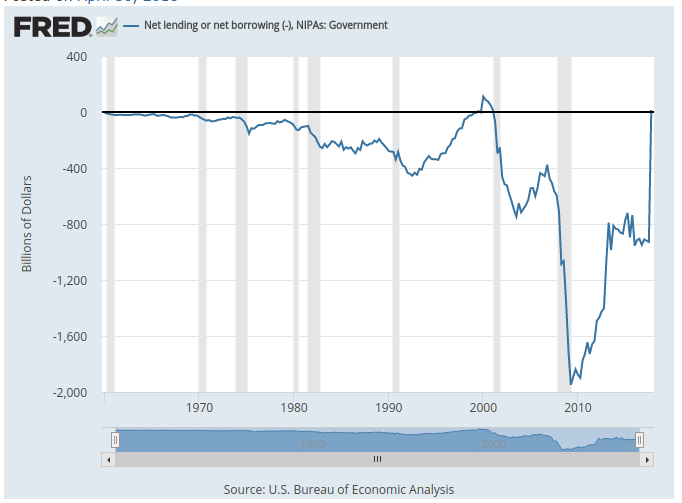
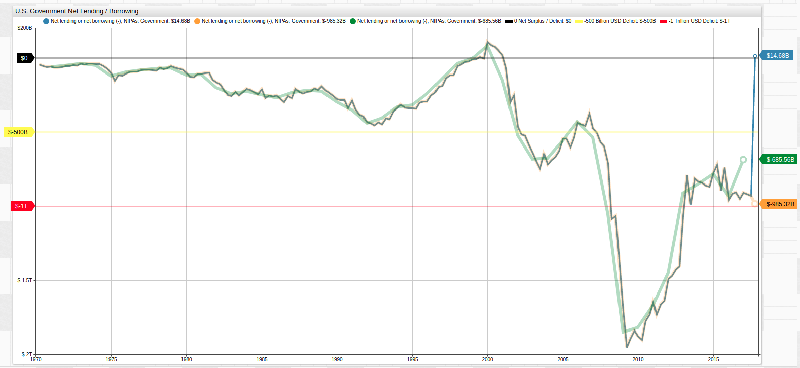

# Wrangling Federal Reserve Economic Data with SQL and Declarative Graphics

## Introduction

The [Federal Reserve Economic Research Division](https://fred.stlouisfed.org/)(FRED) of the St. Louis Federal Reserve publishes publicly available data on a range of topics related to macroeconomic trends such as GDP, employment and other national statistics.

This article will focus on the [`AD01RC1Q027SBEA`](https://fred.stlouisfed.org/series/AD01RC1Q027SBEA) series which tracks net lending and borrowing of the United States Government.

### Handling Special Items

The `AD01RC1Q027SBEA` series is annualized and each quarterly value is therefore multiplied by `4` to arrive at an annual estimate. This calculation is used to show the annual total should a specific quarter's trends be replicated over the course of the year. During the final quarter of 2017, a **potential** `$250` billion windfall from one-time corporate repatriation taxes was added to the total by virtue of annualized calculation. As a result, the `$250` billion extra quarterly income was translated into `$1` trillion after transformation. The original [FRED blog post](https://fredblog.stlouisfed.org/?s=surplus) discussing this data includes a visualization which considers this annualized value:



As a result of this transformation, the annual budget of the U.S. government is estimated to be a positive `$14.68` million, an accomplishment that was last reported in 2001.

This article illustrates how SQL and the declarative graphics library in ATSD can be utilized to perform ad-hoc data transformations such as the removal of special items.

The original data and new data are shown together. The range of conclusions one can draw from these three series are vastly different.



[](https://trends.axibase.com/2b56345c#fullscreen)

The special item was removed using a simple [`replace-value`](https://axibase.com/products/axibase-time-series-database/visualization/widgets/configuring-the-widgets/) setting:

```javascript
# remove extraordinary item completely.
replace-value = time == new Date('2017-10-01T00:00:00Z').getTime() ? value-1000 : value
```

This setting targets a specific date, and evaluates an `if-else` expression which subtracts `$1` trillion or `$750` billion from the defined date's value.

The `group-period` and `group-statistic` settings are used to return non-annualized data, which still includes the `$250` billion extraordinary item, but doesn't include the additional `$750` billion from annualization.

```javascript
# remove annualization factor from raw data, group by annual period, sum samples for actual results.
replace-value = value/4
group-period = 1 year
group-statistic = sum
```

The data is presented using our [**Trends**](https://github.com/axibase/atsd-use-cases/blob/master/how-to/shared/trends.md) service.

### Querying FRED Data with SQL

Similar to the above visualizations, data cleanup may be performed with SQL.

By de-annualizing quarterly values and aggregating them back into annual totals using [date aggregation](https://axibase.com/docs/atsd/sql/#period) in ATSD SQL, the effect of the phantom `$750B` is removed from the annual series.

```sql
SELECT date_format(time, 'yyyy') "Year", SUM(value/4) "Net Lending/Borrowing"
  FROM "ad01rc1q027sbea"
GROUP BY period(1 year)
  ORDER BY datetime DESC
```

The ten most recent years of federal government lending / borrowing:

| Year | Net Lending/Borrowing |
|------|-----------------------|
| 2017 | -685.56               |
| 2016 | -931.36               |
| 2015 | -781.12               |
| 2014 | -851.12               |
| 2013 | -913.30               |
| 2012 | -1447.01              |
| 2011 | -1666.73              |
| 2010 | -1818.96              |
| 2009 | -1847.06              |
| 2008 | -1054.96              |
| 2007 | -535.13               |

As a result, the estimated annual budget balance is now a deficit of `$685` billion, a number that is materially different from the estimated surplus of `$15` billion.

The above query may be executed in the ATSD web console or using the [ATSD API Client for Python](https://github.com/axibase/atsd-api-python), where the data may be queried using SQL and converted to `pandas` dataframes for further analysis.

```python
>>> q = """
... SELECT date_format(time, 'yyyy') "Year", SUM(value/4) "Net Lending/Borrowing"
... FROM "ad01rc1q027sbea"
... GROUP BY period(1 year)
... ORDER BY datetime DESC
... """
```

<details><summary>View the complete result set here:</summary>
<p>

| Year | Net Lending/Borrowing |
|------|-----------------------|
| 2017 | -685.56               |
| 2016 | -931.36               |
| 2015 | -781.12               |
| 2014 | -851.12               |
| 2013 | -913.30               |
| 2012 | -1447.01              |
| 2011 | -1666.73              |
| 2010 | -1818.96              |
| 2009 | -1847.06              |
| 2008 | -1054.96              |
| 2007 | -535.13               |
| 2006 | -429.80               |
| 2005 | -556.31               |
| 2004 | -675.52               |
| 2003 | -684.35               |
| 2002 | -523.37               |
| 2001 | -149.72               |
| 2000 | 81.14                 |
| 1999 | -2.84                 |
| 1998 | -37.36                |
| 1997 | -139.61               |
| 1996 | -244.25               |
| 1995 | -319.11               |
| 1994 | -330.87               |
| 1993 | -406.51               |
| 1992 | -441.19               |
| 1991 | -352.32               |
| 1990 | -296.46               |
| 1989 | -225.68               |
| 1988 | -217.87               |
| 1987 | -237.38               |
| 1986 | -270.47               |
| 1985 | -248.06               |
| 1984 | -224.12               |
| 1983 | -242.26               |
| 1982 | -201.48               |
| 1981 | -113.69               |
| 1980 | -115.53               |
| 1979 | -67.98                |
| 1978 | -73.20                |
| 1977 | -80.50                |
| 1976 | -96.37                |
| 1975 | -123.55               |
| 1974 | -51.64                |
| 1973 | -39.21                |
| 1972 | -52.12                |
| 1971 | -63.07                |
| 1970 | -49.26                |
</p>
</details>

To show only years where the United States had an annual lending surplus, execute this query with the [`HAVING`](https://axibase.com/docs/atsd/sql/#having-filter) condition:

```sql
SELECT date_format(time, 'yyyy') "year", SUM(value)/4 "surplus"
  FROM "ad01rc1q027sbea"
  WHERE datetime >= '1970'
  GROUP BY period(1 year)
HAVING SUM(value) > 0
```

The result set shows only one year since 1970 when the United States achieved a net lending surplus:

| year | surplus |
|------|---------|
| 2000 | 81.14   |

Although in the FRED visualization it appeared that the United States government has finally achieved a budget surplus, in fact the nature of the data is such that it only seems that way. The dataset here is annualized, meaning that each quarter's data is plotted as if the trend were to remain constant for the entire year. Thus, the administration's `$250` billion tax relief is considered as `$1` trillion due to annualization calculations.

The special item can be completely removed from the series using the [`CASE`](https://axibase.com/docs/atsd/sql/#case-expression) expression:

```sql
SELECT date_format(time, 'yyyy') "Year",
  CASE
  WHEN datetime = '2017-01-01' THEN SUM(value/4) - 250
  -- alternatively THEN (SUM(value)-1000)/4
  ELSE SUM(value/4)
  END AS "Annual Lending / Borrowing"
FROM "ad01rc1q027sbea"
  GROUP BY period(1 year)
ORDER BY datetime DESC
```

The result set from 2007 onward:

| Year | Annual Lending / Borrowing |
|------|----------------------------|
| 2017 | -935.56                    |
| 2016 | -931.36                    |
| 2015 | -781.12                    |
| 2014 | -851.12                    |
| 2013 | -913.30                    |
| 2012 | -1447.01                   |
| 2011 | -1666.73                   |
| 2010 | -1818.96                   |
| 2009 | -1847.06                   |
| 2008 | -1054.96                   |
| 2007 | -535.13                    |

## Accessing Data

The dataset used for this article is stored in the **Trends** instance of ATSD.

If you [installed](https://axibase.com/docs/atsd/installation/) your own ATSD instance, upload the [FRED data crawler](https://github.com/axibase/atsd-data-crawlers/blob/master/crawlers/fred-category-crawler/README.md#fred-category-crawler). The data crawler can upload the needed dataset along with all metadata information.

If you would like read-only credentials to the database to recreate the queries shown here, test drive the **ATSD API Client for Python**, or query any of the other [datasets](https://trends.axibase.com/public/reference.html) stored there, [reach out to us](https://axibase.com/feedback/), we're happy to provide them.
