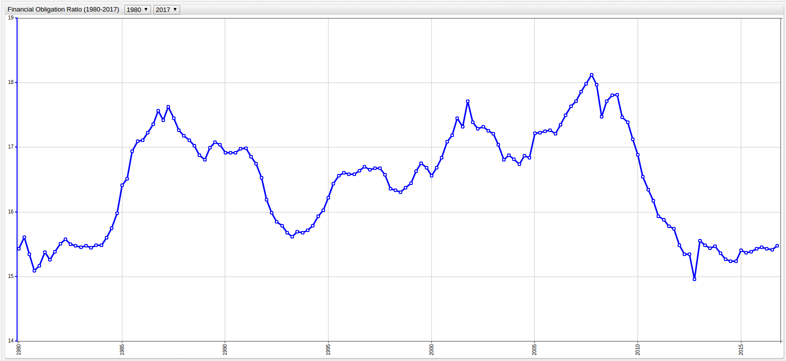
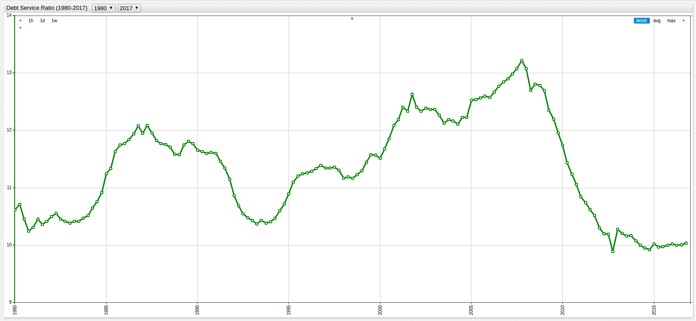
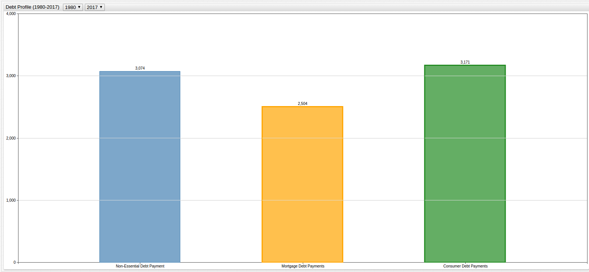

# The Average American Debt Profile


## Introduction

Debt is a complicated concept. After the sub-prime mortgage crisis of the late 2000s, modern Americans are all too familiar
with the problems of irresponsible spending on credit. Student loan recipients who queue up to drop off another application
for a job in a field they did not study are quick to point to the trappings of deficit spending as a means of wealth creation.
Politicians and voters on both sides of the aisle point to the ever-growing [United States Government debt](http://www.usdebtclock.org/)
with anxiety for the future.

And yet despite all the doom and gloom, the American financial system is one of the most stable and robust in the world, in
no small part thanks to ingenious monetary policy and hegemonic economic position organized over the entire course of the country's history,
modern American consumers are among the wealthiest on the planet.

The United States Federal Reserve is the central banking system of the United States, responsible for monitoring the global
financial climate and enacting policy that supports the American economy and American consumers. They maintain a number of statistics
about these consumers and their monetary practices to better inform their decisions and practices.

## Data

Provided by the [Federal Reserve](https://www.federalreserve.gov/), this [dataset](https://www.federalreserve.gov/datadownload/Download.aspx?rel=FOR&series=91e0f9a6b8e6a4b1ef334ce2eaf22860&filetype=csv&label=include&layout=seriescolumn&from=01/01/1980&to=12/31/2017)
must be correctly parsed during import. The quarterly date format needs to be converted into a monthly format that ATSD can interpret (`Q/q` letter is not supported). We also need to discard metadata lines contained in the multi-line header. This can be accomplished with a [schema-based parser](https://axibase.com/docs/atsd/parsers/csv/) that provides granular control over the document's rows and columns using RFC 7111 selectors and Javascript:

```javascript
/*
  Convert yyyy'Q'q to yyyy-MM, e.g. 2017Q2 to 201704
*/
function quarterToMonth(yearAndQuarter) {
    var month;
    switch (yearAndQuarter.charAt(5)) {
        case '1': month = '01'; break;
        case '2': month = '04'; break;
        case '3': month = '07'; break;
        case '4': month = '10'; break;
    }
    return yearAndQuarter.substring(0, 4) + '-' + month;
}
```

```javascript
/*
  Select all rows starting from 7th row.
  Select all columns in the row starting with the 2nd column.
*/
select("#row=7-*").select("#col=2-*").
addSeries().
timestamp(quarterToMonth(cell(row,1))).
metric(cell(6,col));
```

For step-by-step instructions on data customization with schema based parsing, see this [support tutorial](../../tutorials//schema-based-parser-mod).

### Financial Obligation Ratio

The Financial Obligation Ratio (FOR) is an estimate of the ratio of required debt payments to disposable income. This is a broad
calculation and includes all kinds of debt:  mortgage payments, credit cards, property tax and lease payments. Each of these
metrics can be expanded further to include associated costs, such as homeowner's insurance for example. The Federal Reserve
releases this number each quarter.



[](https://apps.axibase.com/chartlab/842f1dd9/#fullscreen)

> Use the dropdown menus at the top of the visualization screen to navigate through time, selecting the `starttime` and `endtime` values
to observe a desired period.

The data can also be queried using the web-based [SQL Console](https://axibase.com/docs/atsd/sql/) in [ATSD](https://axibase.com/docs/atsd/).
The data will be aggregated annually, derived from the average value of each quarter within a given year:

```sql
SELECT date_format(time, 'yyyy') AS "Year", AVG(value) AS "Average FOR"
  FROM "dtf%ypd.q"
GROUP BY date_format(time, 'yyyy')
```

| Year | Average FOR |
|------|-------------|
| 1980 | 15.32       |
| 1981 | 15.31       |
| 1982 | 15.51       |
| 1983 | 15.47       |
| 1984 | 15.76       |
| 1985 | 16.84       |
| 1986 | 17.37       |
| 1987 | 17.42       |
| 1988 | 17.02       |
| 1989 | 17.01       |
| 1990 | 16.94       |
| 1991 | 16.74       |
| 1992 | 15.91       |
| 1993 | 15.68       |
| 1994 | 15.91       |
| 1995 | 16.50       |
| 1996 | 16.64       |
| 1997 | 16.64       |
| 1998 | 16.34       |
| 1999 | 16.66       |
| 2000 | 16.85       |
| 2001 | 17.45       |
| 2002 | 17.31       |
| 2003 | 16.94       |
| 2004 | 16.83       |
| 2005 | 17.25       |
| 2006 | 17.48       |
| 2007 | 17.97       |
| 2008 | 17.75       |
| 2009 | 17.39       |
| 2010 | 16.42       |
| 2011 | 15.81       |
| 2012 | 15.24       |
| 2013 | 15.48       |
| 2014 | 15.26       |
| 2015 | 15.40       |
| 2016 | 15.45       |
| 2017 | 15.47       |

> All values are shown as a percent of one hundred, where the whole is representative of the total income of the average person.

### Debt Service Ratio

The Debt Service Ratio (DSR) is more specific than the Financial Obligation Ratio in that it typically does not include
non-essential debt payments. Here, it has been parsed into two categories, mortgage debt and consumer debt. These numbers represent
the average percent of a person's earned salary each month which much be used to make the required payments associated with
consumer credit and mortgage.

Typically the DSR is an initial calculation performed to determine a person's eligibility to receive a mortgage. A DSR value
of less than 48% is generally preferred, meaning that with a particular mortgage plus other credit obligations at least 52%
of a person's gross monthly earning would still be available to them after making the required payments.



[](https://apps.axibase.com/chartlab/85522dd3/#fullscreen)

```sql
SELECT date_format(time, 'yyyy') AS "Year", AVG(value) AS "Average FOR"
  FROM "dtfd%ypd.q"
GROUP BY date_format(time, 'yyyy')
```

| Year | Average FOR |
|------|-------------|
| 1980 | 10.46       |
| 1981 | 10.39       |
| 1982 | 10.47       |
| 1983 | 10.43       |
| 1984 | 10.75       |
| 1985 | 11.56       |
| 1986 | 11.94       |
| 1987 | 11.93       |
| 1988 | 11.69       |
| 1989 | 11.75       |
| 1990 | 11.62       |
| 1991 | 11.34       |
| 1992 | 10.61       |
| 1993 | 10.41       |
| 1994 | 10.59       |
| 1995 | 11.15       |
| 1996 | 11.34       |
| 1997 | 11.34       |
| 1998 | 11.19       |
| 1999 | 11.51       |
| 2000 | 11.85       |
| 2001 | 12.42       |
| 2002 | 12.38       |
| 2003 | 12.21       |
| 2004 | 12.20       |
| 2005 | 12.57       |
| 2006 | 12.75       |
| 2007 | 13.08       |
| 2008 | 12.83       |
| 2009 | 12.23       |
| 2010 | 11.30       |
| 2011 | 10.64       |
| 2012 | 10.11       |
| 2013 | 10.19       |
| 2014 | 9.97        |
| 2015 | 9.99        |
| 2016 | 10.02       |
| 2017 | 10.04       |

## Analysis

Because the FOR value includes the DSR value plus additional non-essential credit values, and the DSR value is parsed into both consumer and mortgage
related debt, these three values can be shown in a new visualization that creates a typical consumer profile of the average
American. By using the calculated value setting shown below, additional data not specifically included in the set can be
displayed:

```ls
    [series]
      metric = dtfd%ypd.q
      display = false
      alias = dsr

    [series]
      metric = dtf%ypd.q
      display = false
      alias = for

    [series]
      value = value('for') - value('dsr')
      label = Non-Essential Debt Payment
```

Shown below is the debt profile of the average American consumer from 1980 to 2017, navigate through time using the drop-down
menus at the top of the screen to select a desired span of time and compare how bearing debt has changed over the course of
the last three decades.


[](https://apps.axibase.com/chartlab/f25de723/#fullscreen)

The visualization can also be organized to show the amount of each type of debt as it relates to the others:


[](https://apps.axibase.com/chartlab/f25de723/3/#fullscreen)

Additionally, these values can be compared on an annual basis as shown in the visualization below:


[](https://apps.axibase.com/chartlab/81ea0ea0/#fullscreen)

To view the distribution of these values across time, a histogram is shown below:


[](https://apps.axibase.com/chartlab/9f74c179/#fullscreen)

Use the box diagram to explore time with the dropdown menus at the top of the visualization screen. The visualization
shows the distribution of debt values as a percentage of total income, with the initial time period set to include the
entire data set:


[](https://apps.axibase.com/chartlab/20ff0ade/#fullscreen)

The following SQL query will detail the above visualizations in one table, displaying averaged annual values of each component
described above: non-essential credit payments, mortgage credit payments, and consumer credit payments, as well as the Financial
Obligation Ratio (FOR), or total debt obligations.

```sql
SELECT date_format(time, 'yyyy') AS "Year", AVG(dsrM.value) AS "Mortgage", AVG(dsrC.value) AS "Consumer", AVG(for.value - dsr.value) AS "Non-Essential", AVG(for.value) AS "Total"
  FROM "dtfm%ypd.q" AS dsrM JOIN "dtfc%ypd.q" AS dsrC JOIN "dtf%ypd.q" AS for JOIN "dtfd%ypd.q" AS dsr
GROUP BY date_format(time, 'yyyy')
```

| Year | Mortgage | Consumer | Non-Essential | Total |
|------|----------|----------|---------------|-------|
| 1980 | 4.49     | 5.97     | 4.86          | 15.32 |
| 1981 | 4.75     | 5.64     | 4.92          | 15.31 |
| 1982 | 4.92     | 5.56     | 5.04          | 15.51 |
| 1983 | 4.88     | 5.55     | 5.04          | 15.47 |
| 1984 | 4.99     | 5.76     | 5.01          | 15.76 |
| 1985 | 5.39     | 6.17     | 5.28          | 16.84 |
| 1986 | 5.62     | 6.32     | 5.42          | 17.37 |
| 1987 | 5.77     | 6.16     | 5.48          | 17.42 |
| 1988 | 5.77     | 5.92     | 5.33          | 17.02 |
| 1989 | 5.92     | 5.83     | 5.26          | 17.01 |
| 1990 | 6.12     | 5.51     | 5.32          | 16.94 |
| 1991 | 6.18     | 5.16     | 5.39          | 16.74 |
| 1992 | 5.87     | 4.74     | 5.30          | 15.91 |
| 1993 | 5.69     | 4.71     | 5.27          | 15.68 |
| 1994 | 5.57     | 5.02     | 5.32          | 15.91 |
| 1995 | 5.66     | 5.49     | 5.35          | 16.50 |
| 1996 | 5.61     | 5.73     | 5.31          | 16.64 |
| 1997 | 5.62     | 5.72     | 5.31          | 16.64 |
| 1998 | 5.48     | 5.71     | 5.15          | 16.34 |
| 1999 | 5.56     | 5.95     | 5.16          | 16.66 |
| 2000 | 5.67     | 6.18     | 5.00          | 16.85 |
| 2001 | 5.81     | 6.61     | 5.03          | 17.45 |
| 2002 | 5.82     | 6.56     | 4.93          | 17.31 |
| 2003 | 5.82     | 6.39     | 4.72          | 16.94 |
| 2004 | 5.91     | 6.28     | 4.63          | 16.83 |
| 2005 | 6.38     | 6.19     | 4.68          | 17.25 |
| 2006 | 6.80     | 5.96     | 4.73          | 17.48 |
| 2007 | 7.11     | 5.97     | 4.89          | 17.97 |
| 2008 | 6.97     | 5.86     | 4.92          | 17.75 |
| 2009 | 6.68     | 5.55     | 5.16          | 17.39 |
| 2010 | 6.17     | 5.13     | 5.12          | 16.42 |
| 2011 | 5.59     | 5.06     | 5.17          | 15.81 |
| 2012 | 5.14     | 4.97     | 5.13          | 15.24 |
| 2013 | 4.96     | 5.23     | 5.29          | 15.48 |
| 2014 | 4.70     | 5.27     | 5.29          | 15.26 |
| 2015 | 4.57     | 5.42     | 5.41          | 15.40 |
| 2016 | 4.47     | 5.55     | 5.43          | 15.45 |
| 2017 | 4.42     | 5.63     | 5.43          | 15.47 |

The above dataset can illuminate a number of features of the American economy and a number of characteristics of the average
American consumer. While modern Americans are quick to denounce the zeitgeist of living outside of one's means, the data
shows that in fact, the amount of debt carried by the average American is on par with or even lower in some cases than that
of his 1980's counterpart. In fact, the only metric which has demonstrated a legitimate increase in value over the last
several decades has been the roughly one percent increase in non-essential credit holdings by the average consumer.

According to [data](https://fred.stlouisfed.org/series/MEHOINUSA646N) from the [Economic Research Department](https://research.stlouisfed.org/)
of the [Saint Louis Branch of the Federal Reserve](https://www.stlouisfed.org/), the 2015 US median household income was $56,516
per year in 2015 USD. This number can be applied to the above table and visualized in [ChartLab](https://apps.axibase.com/chartlab)
to create more comprehensive data.



[](https://apps.axibase.com/chartlab/da132e01/11/#fullscreen)

The above visualization aggregates the values from **Table 3.1** based on a time period of the user's selection. Use the drop-down
menu at the top of the screen to select the aggregation period. The initial visualization shows the average values for each
metric over the entire period of time in 2015 USD by obligation amount per quarter.

The following query summons the same data shown above, but further parses it to show annual average monthly payments instead
of quarterly values in 2015 USD for a person making the 2015 median United States income of $56,516 a year.

```sql
SELECT date_format(time, 'yyyy') AS "Year", AVG((56516 * (dsrM.value/100))/4) AS "Mortgage", AVG((56516 * (dsrC.value/100))/4) AS "Consumer", AVG((56516 *(((for.value - dsr.value)/100)))/4) AS "Non-Essential", AVG((56516 * (for.value/100))/4) AS "Total"
  FROM "dtfm%ypd.q" AS dsrM JOIN "dtfc%ypd.q" AS dsrC JOIN "dtf%ypd.q" AS for JOIN "dtfd%ypd.q" AS dsr
GROUP BY date_format(time, 'yyyy')
```

| Year | Mortgage | Consumer | Non-Essential | Total   |
|------|----------|----------|---------------|---------|
| 1980 | 634.66   | 843.18   | 686.24        | 2164.09 |
| 1981 | 670.68   | 797.06   | 694.95        | 2162.68 |
| 1982 | 694.45   | 785.18   | 711.73        | 2191.36 |
| 1983 | 689.28   | 784.77   | 711.79        | 2185.83 |
| 1984 | 705.73   | 813.54   | 707.29        | 2226.56 |
| 1985 | 762.24   | 871.09   | 745.49        | 2378.83 |
| 1986 | 793.90   | 893.61   | 766.40        | 2453.91 |
| 1987 | 815.50   | 870.77   | 774.30        | 2460.57 |
| 1988 | 814.82   | 836.88   | 752.87        | 2404.57 |
| 1989 | 836.59   | 823.09   | 743.20        | 2402.87 |
| 1990 | 864.41   | 777.87   | 751.23        | 2393.50 |
| 1991 | 873.18   | 729.66   | 761.71        | 2364.55 |
| 1992 | 829.38   | 669.13   | 749.26        | 2247.78 |
| 1993 | 804.52   | 665.92   | 744.85        | 2215.29 |
| 1994 | 786.64   | 709.37   | 751.59        | 2247.59 |
| 1995 | 799.97   | 775.76   | 755.67        | 2331.40 |
| 1996 | 792.08   | 809.50   | 749.70        | 2351.28 |
| 1997 | 793.36   | 808.77   | 749.61        | 2351.73 |
| 1998 | 774.82   | 806.85   | 727.44        | 2309.11 |
| 1999 | 785.68   | 840.11   | 728.50        | 2354.28 |
| 2000 | 800.56   | 873.65   | 706.96        | 2381.16 |
| 2001 | 821.56   | 933.70   | 710.64        | 2465.90 |
| 2002 | 822.32   | 926.71   | 696.41        | 2445.44 |
| 2003 | 822.65   | 903.18   | 667.14        | 2392.98 |
| 2004 | 835.52   | 887.89   | 654.61        | 2378.03 |
| 2005 | 901.38   | 874.39   | 661.35        | 2437.12 |
| 2006 | 960.16   | 841.45   | 667.72        | 2469.34 |
| 2007 | 1004.30  | 843.73   | 691.45        | 2539.47 |
| 2008 | 984.93   | 827.93   | 695.13        | 2507.99 |
| 2009 | 943.18   | 784.59   | 728.75        | 2456.53 |
| 2010 | 871.66   | 724.35   | 723.46        | 2319.47 |
| 2011 | 789.23   | 714.30   | 729.96        | 2233.49 |
| 2012 | 726.30   | 702.25   | 725.29        | 2153.84 |
| 2013 | 700.91   | 738.76   | 747.11        | 2186.78 |
| 2014 | 663.93   | 744.76   | 748.06        | 2156.75 |
| 2015 | 645.60   | 765.92   | 764.57        | 2176.08 |
| 2016 | 631.26   | 784.32   | 767.62        | 2183.20 |
| 2017 | 623.89   | 794.83   | 767.67        | 2186.39 |

## Conclusions

As it turns out, the idea that your parents paid less for their house than you will is only true in absolute terms. When
compared with current numbers and controlled for inflation, the average 2017 consumer will pay roughly the same portion of their
income towards a place to hang their hat up as the average 1980 consumer.

The Federal Reserve is able to pull certain levers of power from the Eccles Building in Washington, D.C. such as printing
more money, or raising and lowering interest rates to cope with inflation. However, all of these are reactionary measures meant
to create small changes that have a butterfly effect over time. Ultimately, the machinations of the Board of Governors have
always be something opaque and esoteric to the average man, leading to many people denouncing the Federal Reserve System entirely, occasionally
opting for a return of the gold standard or leveling accusations of wrong-doing.

However, after reviewing the data above, it seems that at least on a consumer level, the average American actually has more
today than they would have had thirty years ago, or even just five years ago. Of course, the Federal Reserve isn't completely
responsible for the wise consumer choices made in the current decades, but monetary policy enacted by the various branches of the Federal
Reserve are responsible for maintaining the economic conditions that Americans, and consumers the world over, have come to expect
from the United States economy.
