# Violence Begets Violence: An Analysis of the Baltimore Police Force and Baltimore Homicide Data


## Methodology

The City of Baltimore, Maryland has published [data](https://catalog.data.gov/dataset/2013-2014-bpd-officer-involved-shootings-bcf3c)
about incidents of force used by the Police Department which have come under investigation by
the BPD Force Investigation Team. Using this data set, which begins in 2013 and continues until the end of 2015,
these actions can be scrutinized based on a number of criteria including the location
of the incident, the nature of the incident, and the date of the incident.

Additionally, the City of Baltimore has recorded crime incidents in the city,
including homicide rates during the years 2013 and 2014. Baltimore has one of the highest murder
rates in the country, and even ranks 19th on the planet
[for highest per capita murder rate](http://www.worldatlas.com/articles/most-dangerous-cities-in-the-world.html).
These two data sets can be compared and contrasted to underline a number of features
regarding the nature and the scope of the violence that occurs against the backdrop of a nearly three hundred
year old city less than forty miles from the nation's capital.

To establish a correlation between incidents of police use of force and incidents of homicide,
it must be possible to effectively predict the occurrence of an above average amount of incidents of
police use of force using data about the number of homicides that occurred in a given
neighborhood. To establish a standard, for the sake of testing, mean values from each dataset
will be collected. This mean will be compared to observed data from each dataset, and if
a district is found to have witnessed an above average number of murders during the observed
period, the alternative hypothesis will predict that the district will have also seen an
above average number of incidents of police use of force.

Both of these datasets can be analyzed in the Axibase Time Series Database which provides a built-in support for the [Socrata](https://axibase.com/docs/axibase-collector/jobs/socrata.html) Open Data format used by the majority of government agencies in the United States. ATSD also includes graphics capabilities to analyze the data with [SQL](https://axibase.com/docs/atsd/sql/)
and visualize it with graphs.

> For information about performing these steps in your own ATSD instance, see the [Action Items](#action-items)
section below.

## Data

The general format for SQL queries for this dataset is:

```sql
SELECT tags.$TAG_NAME$, count(*), datetime
  FROM "row_number.3w4d-kckv"
GROUP BY tags.$TAG_NAME$, PERIOD(1 MONTH)
  ORDER BY tags.$TAG_NAME$, datetime
```

The `$TAG_NAME$` represents one of the dimensions of the time series collected within the dataset, such AS "district", while  `3w4d-kckv` represents the dataset's unique identifier in the data.gov catalog.

The SQL syntax allows the user to ask and answer a series of relevant questions
about both sets of data, and ChartLab allow the user to visualize and compare this data for
a deeper understanding of the information.

### Location of Homicides

To organize the data so that the location of the incident is considered, this SQL query
is used:

```sql
SELECT tags.district, count(*)
  FROM "row_number.3w4d-kckv"
GROUP BY tags.district
  ORDER BY tags.district
```

Notice the time period is not set to calculate the break-down of police use of force incidents for the entire timespan.

This results of this query are as follows:

```sql
| tags.district | count(*) |
|---------------|----------|
| null          | 3        |
| CD            | 3        |
| ED            | 11       |
| ND            | 5        |
| NED           | 8        |
| NWD           | 8        |
| SD            | 6        |
| SED           | 5        |
| SWD           | 10       |
| WD            | 9        |
```

The data has been sorted by district which names correspond to the Baltimore City Planning Map
shown below. Data lacking location information has been displayed with the district tag `null`.
Please notice that the Eastern District of the city is split into two Police Precincts
(Eastern and Southeastern), and the unlabeled blue area just below the Central District is
considered to be Downtown for planning purposes but is patrolled by police from the Central
Precinct, so that data will be included with other Central District data.

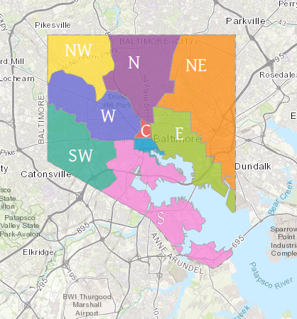

> [Source](http://cityview.baltimorecity.gov/planningmaps/index.html#/map/1389e1fceb374e1e98a82800e46a8a63):
Baltimore City Planning Department.

The results from the first query can also be visualized as shown below, by precinct:

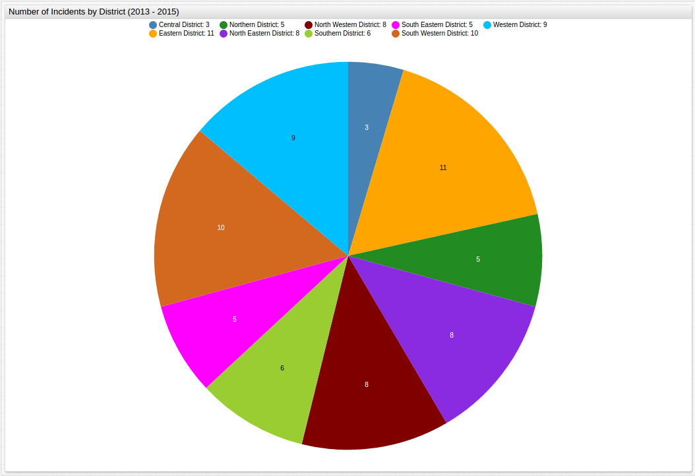

### Nature of Homicides

To organize the data so that the nature of the incident is considered, this SQL query
is used:

```sql
SELECT tags.type, count(*)
  FROM "row_number.3w4d-kckv"
GROUP BY tags.type
  ORDER BY count(*) DESC
```

Because of the `ORDER BY count(*) DESC` command, the data will be displayed in descending
order. This query's results are displayed as follows:

| tags.type                | count(*) |
|--------------------------|----------|
| Shooting                 | 33       |
| Vehicle                  | 10       |
| Discharge                | 5        |
| Taser                    | 4        |
| Head Injury              | 3        |
| Injured Person           | 3        |
| In Custody Death         | 2        |
| Fall/Head                | 1        |
| Taser / In Custody Death | 1        |
| Shooting (Animal)        | 1        |
| Self Inflicted Shooting  | 1        |
| Head Injury & Taser      | 1        |
| Impact Weapon            | 1        |
| In Custody Injury        | 1        |
| Hands                    | 1        |

Shown below is a visualization of three years' worth of incidents, sorted by the type of
altercation:


### Date of Homicides

To organize the data so that the year of the incident is considered, this SQL query is
used:

```sql
SELECT datetime, count(*)
  FROM "row_number.3w4d-kckv"
GROUP BY period(1 year)
  ORDER BY datetime
```

Notice here that the time aggregation interval is now set to 1 year because it is the variable being considered.

This query's results are displayed as follows:

| datetime   | count(*) |
|------------|----------|
| 2013-01-01 | 12       |
| 2014-01-01 | 34       |
| 2015-01-01 | 22       |

To organize the data so that the month of the incident is considered, this SQL query is
used:

```sql
SELECT datetime, count(*)
  FROM "row_number.3w4d-kckv"
GROUP BY period(1 month, VALUE 0)
  ORDER BY datetime
```

This query's results are displayed as follows:

| datetime   | count(*) |
|------------|----------|
| 2013-01-01 | 5        |
| 2013-02-01 | 0        |
| 2013-03-01 | 1        |
| 2013-04-01 | 2        |
| 2013-05-01 | 1        |
| 2013-06-01 | 0        |
| 2013-07-01 | 0        |
| 2013-08-01 | 1        |
| 2013-09-01 | 1        |
| 2013-10-01 | 1        |
| 2013-11-01 | 0        |
| 2013-12-01 | 0        |
| 2014-01-01 | 2        |
| 2014-02-01 | 4        |
| 2014-03-01 | 2        |
| 2014-04-01 | 2        |
| 2014-05-01 | 4        |
| 2014-06-01 | 3        |
| 2014-07-01 | 3        |
| 2014-08-01 | 7        |
| 2014-09-01 | 3        |
| 2014-10-01 | 0        |
| 2014-11-01 | 3        |
| 2014-12-01 | 1        |
| 2015-01-01 | 2        |
| 2015-02-01 | 3        |
| 2015-03-01 | 1        |
| 2015-04-01 | 4        |
| 2015-05-01 | 0        |
| 2015-06-01 | 2        |
| 2015-07-01 | 1        |
| 2015-08-01 | 0        |
| 2015-09-01 | 1        |
| 2015-10-01 | 2        |
| 2015-11-01 | 6        |

In order to maintain the chronology of the display, interpolation is used here to display
those months without incident as well.

>To view this table without interpolation see the [Appendix](#appendix)

This data can be further visualized in ChartLab:

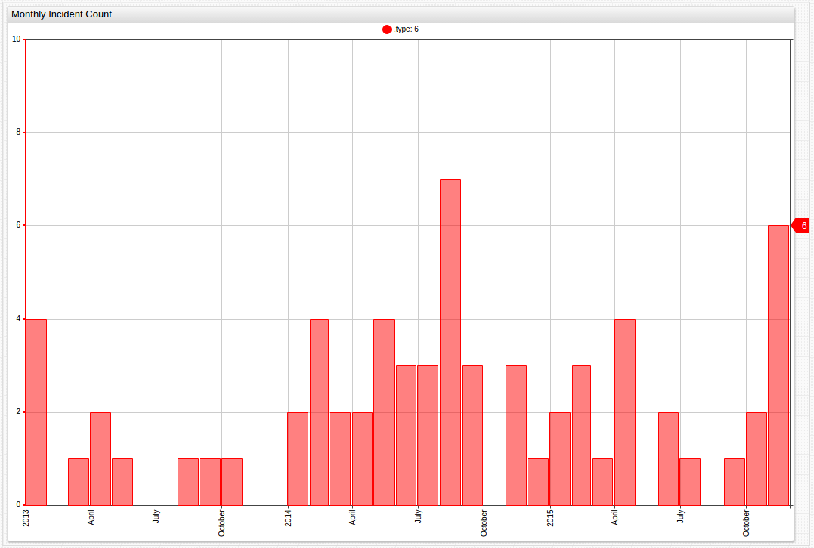

[](https://apps.axibase.com/chartlab/3f33d4ba/19/)

Because the nature of the visualization is such that the omission of empty months
would distort the chronology of the data, interpolation is used once again.

To organize the data so that the week of the incident is considered, this SQL
query is used:

```sql
SELECT datetime, count(*)
  FROM "row_number.3w4d-kckv"
GROUP BY period(1 week)
  ORDER BY datetime
```

These results can also be visualized in ChartLab:


[](https://apps.axibase.com/chartlab/3f33d4ba/21/)

The day of the week of these incidents can also be considered using this query:

```sql
SELECT date_format(time, 'u'), count(*)
  FROM "row_number.3w4d-kckv"
GROUP BY date_format(time, 'u')
  ```

The results of this query are displayed as followed:

| date_format(time, 'u') | count(*) |
|------------------------|----------|
| 1                      | 11       |
| 2                      | 11       |
| 3                      | 9        |
| 4                      | 5        |
| 5                      | 9        |
| 6                      | 8        |
| 7                      | 15       |

When using the `'u'` configuration in the `DARE_FORMAT` clause, the days of the week
are displayed in order beginning with Monday, and represented with a number.

Using [homicide data](https://data.baltimorecity.gov/Crime/Homicides-2013-Present/33zm-qy8h#rateUp)
also provided by the City of Baltimore, the scale of police brutality can be shown alongside
instances of homicide by civilians on other civilians. Does an increase in homicides result in
an increase in police use of force? Do districts that see high levels of police use of force
also see high levels of homicide? Is there a correlation at all?

Similar to the first data set, [Socrata](https://axibase.com/docs/axibase-collector/jobs/socrata.html)
should be used to compile the data in meaningful way and a [Structured Query Language](https://axibase.com/docs/atsd/sql/)
should be used again.

>For a more detailed explanation of performing SQL Queries, see the [Appendix](#appendix)
below

### District of Homicides

To organize the data so that the location of the incident is considered, this SQL query is used:

```sql
SELECT tags.district, count(*)
  FROM "row_number.33zm-qy8h"
GROUP BY tags.district
  ORDER BY tags.district
```

| tags.district | count(*) |
|---------------|----------|
| CENTRAL       | 31       |
| EASTERN       | 57       |
| NORTHEASTERN  | 64       |
| NORTHERN      | 33       |
| NORTHWESTERN  | 69       |
| SOUTHEASTERN  | 26       |
| SOUTHERN      | 36       |
| SOUTHWESTERN  | 51       |
| WESTERN       | 59       |

A second visualization of the data shows nearly identical results to those seen above, the rates
of homicides and incidents of police use of force follow a similar pattern:


Using a side-by-side comparison in ChartLab, the data can be viewed even more precisely,
and the relationship between incidents resulting in the use of force by police, the local
rate of homicide, and the location of the incident is underscored:

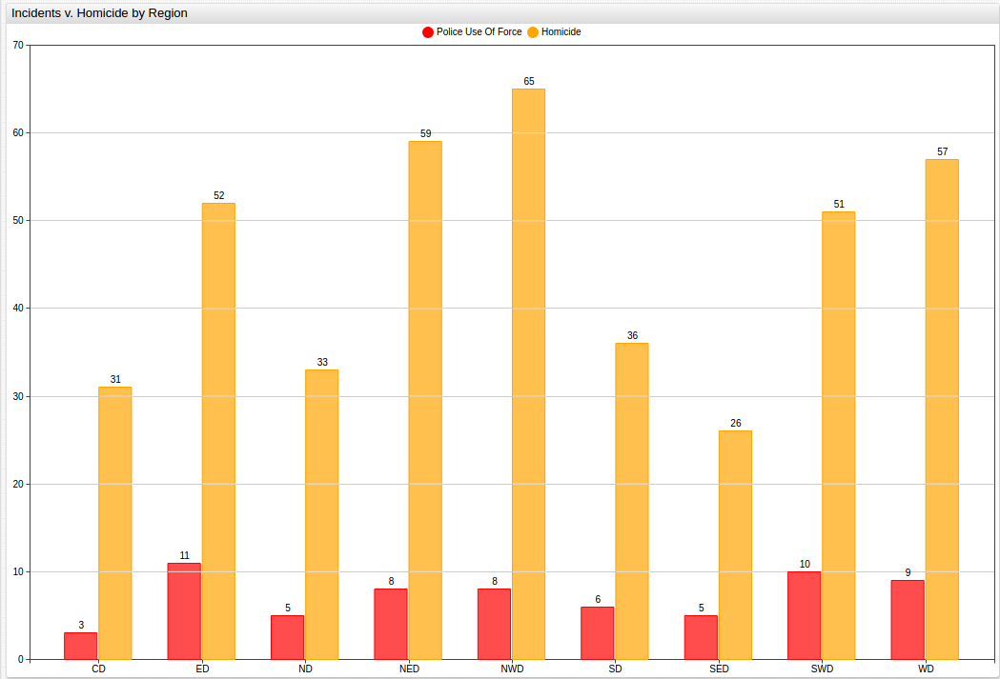

[](https://apps.axibase.com/chartlab/e3872c5c/5/)

Although the recorded incidents of police use of force are not necessarily fatal, for the
given time period eight of them resulted in the death of the victim, there is ostensibly
a correlation between incidents of homicide and incidents of police use of force when the
data is controlled for location. Areas with a higher frequency of homicides often see
an increase in the number of events that the Baltimore Police use force to apprehend
someone with whom they come in contact.

### Weapon of Homicides

The City of Baltimore includes figures that consider the weapon used in the commission of
recorded homicides, queried in [SQL Console](https://axibase.com/docs/atsd/sql/):

```sql
SELECT tags.weapon, count(*)
  FROM "row_number.33zm-qy8h"
GROUP BY tags.weapon
  ORDER BY tags.weapon
```

Unsurprisingly, firearms are the primary tool of homicide for the observed period. The results
of this query are displayed as follows:

| tags.weapon | count(*) |
|-------------|----------|
| FIREARM     | 329      |
| KNIFE       | 62       |
| OTHER       | 35       |

These results can be shown graphically as well:

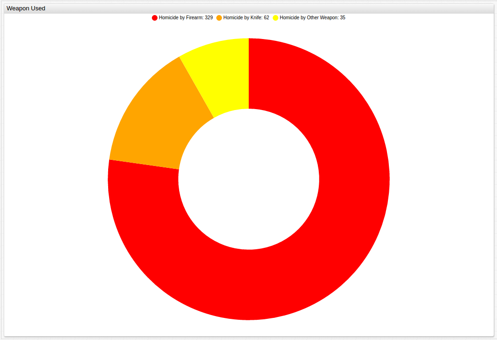

To organize the data so that the year of the incident is considered, this SQL query
is used:

```sql
SELECT datetime, count(*)
  FROM "row_number.33zm-qy8h"
GROUP BY period (1 year)
  ORDER BY datetime
```

The results of this query are displayed as follows:

| datetime   | count(*) |
|------------|----------|
| 2013-01-01 | 222      |
| 2014-01-01 | 204      |

Because of the way the data is stored, modifications need to be made to the way the collector
reads the data for effective use, see the [Action Items](#action-items) below for the assignment code
needed.

To organize the data so that the month of the incident is considered, this SQL
query is used:

```sql
SELECT datetime, count(*)
  FROM "row_number.33zm-qy8h"
GROUP BY period (1 month)
  ORDER BY datetime
```

The results of this query are displayed as follows:

| datetime   | count(*) |
|------------|----------|
| 2013-01-01 | 14       |
| 2013-02-01 | 13       |
| 2013-03-01 | 18       |
| 2013-04-01 | 20       |
| 2013-05-01 | 20       |
| 2013-06-01 | 24       |
| 2013-07-01 | 18       |
| 2013-08-01 | 15       |
| 2013-09-01 | 23       |
| 2013-10-01 | 18       |
| 2013-11-01 | 20       |
| 2013-12-01 | 19       |
| 2014-01-01 | 24       |
| 2014-02-01 | 10       |
| 2014-03-01 | 7        |
| 2014-04-01 | 12       |
| 2014-05-01 | 22       |
| 2014-06-01 | 18       |
| 2014-07-01 | 21       |
| 2014-08-01 | 26       |
| 2014-09-01 | 18       |
| 2014-10-01 | 18       |
| 2014-11-01 | 13       |
| 2014-12-01 | 15       |

Notice here that although there is no command to interpolate the data, because there
were no months without a homicide, the chronology of the data is not disrupted.

Using ChartLab, a side-by-side comparison of incidents of police use of force and homicides in
the city of Baltimore can be done on a monthly basis:


[](https://apps.axibase.com/chartlab/3f33d4ba/22/)

Here, the same correlation is less visible, with only one of the three spikes in homicides
matched by a similar spike in police use of force.

Likewise, a side-by-side comparison of incidents of police use of force and homicides in the
city of Baltimore can be done on a weekly basis:


[](https://apps.axibase.com/chartlab/3f33d4ba/23/)

Here, the peaks in police use of force are further smoothed to indicate that the hypothetically
resultant increase in police use of force actually occurs on a somewhat delayed basis after
a spike in the number of homicides.

Notice that in ChartLab, the `endtime` command has to be modified to reflect the
difference in observation periods of the two data sets.

Additionally, this syntax can be used so that the day of the week of the homicide is considered:

```sql
SELECT date_format(time, 'u'), count(*)
  FROM "row_number.33zm-qy8h"
GROUP BY date_format(time, 'u')
```

This query's results are displayed as follows:

| date_format(time, 'u') | count(*) |
|------------------------|----------|
| 1                      | 52       |
| 2                      | 70       |
| 3                      | 49       |
| 4                      | 58       |
| 5                      | 71       |
| 6                      | 64       |
| 7                      | 62       |

The above datasets can be combined to show the total number of incidents of police use of force and homicides
over the span of the entire observed period.


[](https://apps.axibase.com/chartlab/3f33d4ba/26/)

## Analysis

The baseline average for number of homicides in a given Baltimore neighborhood was
47 (47.33) for the given time period. The average number of incidents of police
use of force was 7 (7.22) during the same time period. If the null hypothesis is to be
rejected and the alternative hypothesis considered to be at least possibly true, an
above average amount of homicides in a given neighborhood should predict an above average
number of incidents of police use of force.

| Neighborhood | O1 (Homicide) | E1 (Homicide) | O2(Police) | E2 (Police) |
|--------------|---------------|---------------|------------|-------------|
| Central | 31 | 47 | 3 | 7 |
| Eastern | 57 | 47 | 11 | 7 |
| Northeastern | 64 | 47 | 8 | 7 |
| North | 33 | 47 | 5 | 7 |
| Northwestern | 69 | 47 | 8 | 7 |
| Southeastern | 26 | 47 | 5 | 7 |
| Southern | 36 | 47 | 6 | 7|
| Southwestern | 51 | 47 | 10 | 7 |
| Western | 59 | 47 | 9 | 7 |

The trend is effectively predicted using the model described in [Methodology](#methodology).

| Neighborhood | O1/E1 | O2/E2 |
|--------------|-------|-------|
| Central | 0.6596 | 0.4286 |
| Eastern | 1.2128 | 1.5714 |
| Northeastern | 1.3617 | 1.1429 |
| North | 0.7021 | 0.7143 |
| Northwestern | 1.4681 | 1.1429 |
| Southeastern | 0.5532 | 0.7143 |
| Southern | 0.7660 | 0.8571 |
| Southwestern | 1.0851 | 1.4286 |
| Western | 1.2553 | 1.2857 |

The mean value of O1/E1 is 1.0426 and the standard deviation is 0.3398. The mean value of O2/E2
is 1.0317 and the standard deviation is 0.3765.

| Neighborhood | (O1-E1)^2/E1 | (O2-E2)^2/E2 |
|--------------|-------|-------|
| Central | 5.4460 | 2.2857 |
| Eastern | 1.7544 | 2.2857 |
| Northeastern | 4.5156 | 0.1429 |
| North | 4.1702 | 0.5714 |
| Northwestern | 9.3830 | 0.1429 |
| Southeastern | 9.3830 | 0.5714 |
| Southern | 2.5745 | 0.1429 |
| Southwestern | 0.3404 | 1.2857 |
| Western | 3.0638 | 0.5714 |

The _p-value_ for the given series is 0.002, which is well within the acceptable range of
significance, generally set around 0.05. Keep in mind, _p-value_ is used to reject the
null hypothesis but does not indicate the absolute validity of the alternative
hypothesis.

After the death of Freddie Gray at the hands of the Baltimore Police Department in 2015, widespread
protests broke out across the country with the epicenter of the demonstrations in the city of
Baltimore itself. These demonstrations quickly led to violence, with drugstores looted, vehicles
set on fire, and police officers and protesters alike injured in the ensuing melee. The
city was ultimately placed under an official state of emergency by the Governor of Maryland and
the State National Guard was deployed to quash the unrest. The incident brought to light
a range of issues with the way the American police force deals with the people they are sworn to
protect and serve.

Across the entire United States, official data on people killed by the police is surprisingly difficult to find.
Police agencies are not obligated to provide this data and as a result many of them do not. There are several citizen-run
operations that collect data but [the most reliable of these](http://www.killedbypolice.net/)
did not begin operation until May of 2013. Based on their figures, which cite news stories for each killing they claim,
777 Americans were killed in 2013 and 1,112 were killed in 2014 at the hands of the
police. Fifteen of these victims were killed in the state of Maryland in 2013 and seventeen were killed in 2014.
From these numbers, four victims were killed in Baltimore in 2013 and four more were killed in 2014. Officer-involved
homicide made up 1.9% of total Baltimore homicides in 2013, and 1.8% of total Baltimore homicides in 2014.

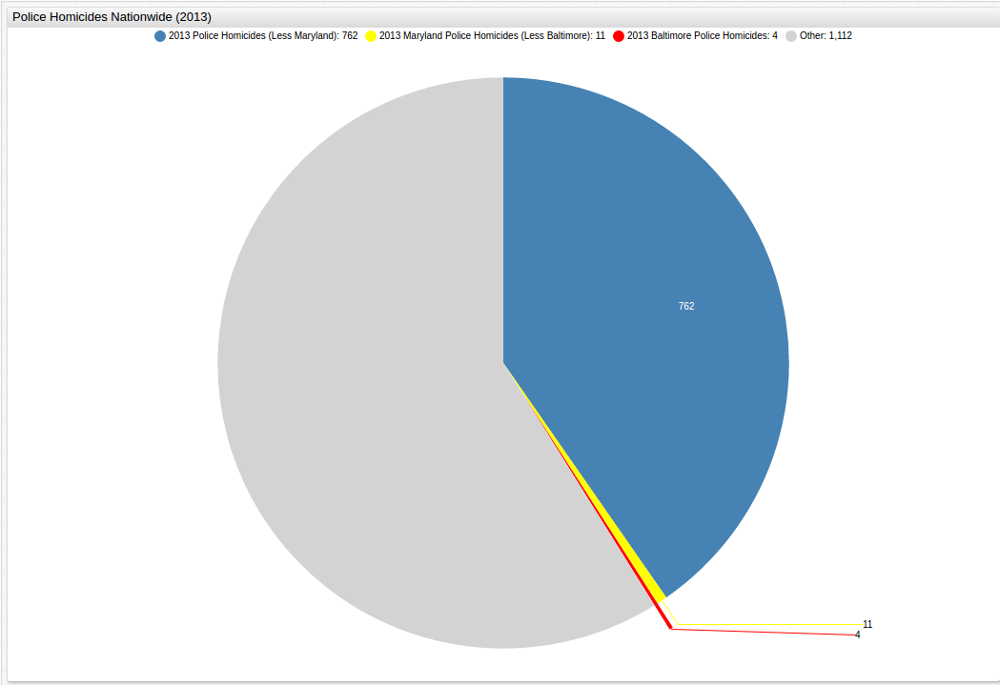

In order to display the total number of police homicides for the observed years, the `[other]`
function can be used, only displaying the desired year's data, but still showing other data
alongside for perspective.

>See the [Appendix](#appendix) below for more detailed instructions.

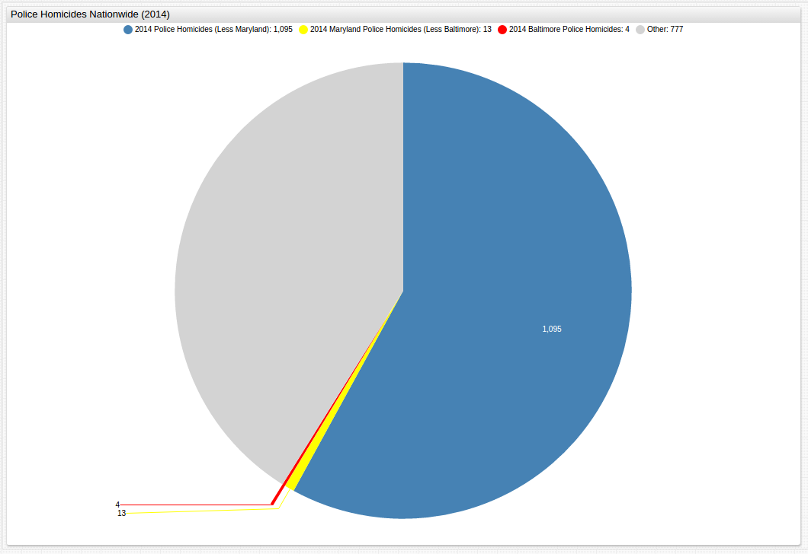

The protest actions centered around the claim that the death of Mr. Gray was yet another unneeded and
careless casualty at the hands of a violent and overly-militarized police force, and
officials' inability to explain the incident clearly only frustrated those who
felt that the problem was far from resolved by their internal investigations. Countless stories have been published
by various media outlets that have both defended and defamed law enforcement officers and their actions.

Using these two datasets, it can be shown that while there is certainly a strong correlation
between police precincts that have a high rate of homicide and the number of incidents that
involve police use of force, the classic paradigm of the chicken and its egg come to mind.
When trying to draw correlation on a short-term basis by comparing incidents of murder followed
by incidents of police use of force, theoretically indicating that in precincts where a murder
occurs, the following days are likely to see an incident of police violence the data
shown above just cannot support the claim. Likewise the opposite claim,
that precincts where the police use force to make an arrest are likely to have a homicide in the
following days is equally unsupported by the data here. Perhaps the only true conclusion
that can be drawn using such comparison methods is one that has been made since biblical
times, and was reiterated again during the Civil Rights Movement by Martin Luther King, Jr: "Violence begets more violence."

A total of six officers would be indicted and charged in a second-degree murder case that would
ultimately see all six either acquitted, released on a mistrial, or free to go because the
charges against them were dropped. Now, as the incident fades into memory, questions still remain
about the ability of the citizenry to police the police, and thankfully, public data is
available that allows them to do just that.

## Action Items

1. Download [Docker](https://docs.docker.com/engine/installation/linux/ubuntu/).
2. Download the [`docker-compose.yml`](resources/docker-compose.yml) file to launch the ATSD container bundle.
3. Launch containers by specifying the built-in collector account credentials that will be used by Axibase Collector to insert data into ATSD.

```sh
export C_USER=myuser; export C_PASSWORD=mypassword; docker-compose pull && docker-compose up -d
```

Note that both data sets have been collected under one Socrata job.

Contact [Axibase](https://axibase.com/feedback/) with any questions.

## Appendix

### Using the [`EXPAND`](https://axibase.com/products/axibase-time-series-database/visualization/widgets/pie-chart-widget/) Command

In order to highlight specific data, as shown in the [Nature of the Homicides](#nature-of-homicides) section,
use the command `expand = true` under the `[series]` which should be expanded:

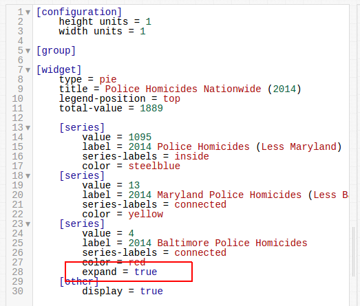

### Using the [`OTHER`](https://axibase.com/products/axibase-time-series-database/visualization/widgets/pie-chart-widget/) Command

In order to display a full series of data, but only show detailed information for a desired
portion of that data, the `[other]` command needs to be included in the `[series]` cluster, and a
value for `total-value = x` needs to be added under the `[widget]` cluster as shown below,


The default setting for the `[other]` command is `false` so if the `display = true` command
is not entered, the visualization will lack the `total-value` information.

### Performing Queries in SQL Console

```sql
SELECT tags.$TAG_NAME$, count(*), datetime
  FROM "row_number.3w4d-kckv"
GROUP BY tags.$TAG_NAME$, PERIOD(1 MONTH)
  ORDER BY tags.$TAG_NAME$, datetime
```

Using this generic model, a series of queries can be performed in [SQL Console](https://axibase.com/docs/atsd/sql/).

The `tags.$TAG_NAME$` corresponds to the metric the user is interested in querying.


With the results displayed below, after the `execute` command is given. Erroneous data, or
data lacking the desired information with be displayed as `null`.

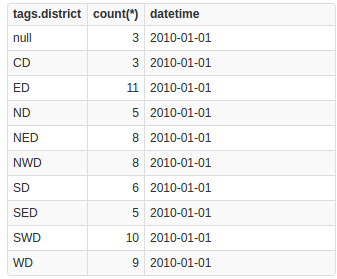

The `datetime` column can be modified to display day in any desirable format, in cases of
data with more specific time specifications:

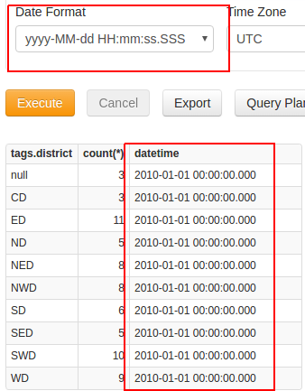

Changing between data sets only requires the modification of one line:

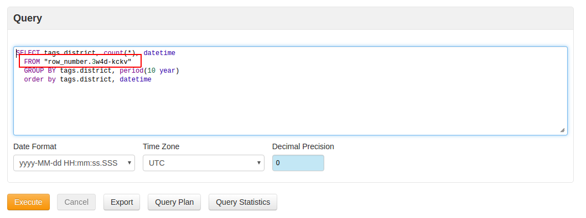

When controlling this data for time, because the data has been collected and
stored as a time series, no additional `tags` commands are needed, but a slightly different
syntax is used:

```sql
SELECT datetime, count(*)
  FROM "row_number.3w4d-kckv"
GROUP BY period(1 day)
  ORDER BY datetime
```

The period of observation can be modified on the third line using a myriad of [time units](https://axibase.com/docs/atsd/api/data/series/time-unit.html).

### Monthly Police Incident Data Without Interpolation

```sql
SELECT datetime, count(*)
  FROM "row_number.3w4d-kckv"
GROUP BY period(1 month)
  ORDER BY datetime
```

Removing the `VALUE 0` clause from the `GROUP BY` command renders the chart without
interpolation. This query's results are as shown below:

| datetime   | count(*) |
|------------|----------|
| 2013-01-01 | 5        |
| 2013-03-01 | 1        |
| 2013-04-01 | 2        |
| 2013-05-01 | 1        |
| 2013-08-01 | 1        |
| 2013-09-01 | 1        |
| 2013-10-01 | 1        |
| 2014-01-01 | 2        |
| 2014-02-01 | 4        |
| 2014-03-01 | 2        |
| 2014-04-01 | 2        |
| 2014-05-01 | 4        |
| 2014-06-01 | 3        |
| 2014-07-01 | 3        |
| 2014-08-01 | 7        |
| 2014-09-01 | 3        |
| 2014-11-01 | 3        |
| 2014-12-01 | 1        |
| 2015-01-01 | 2        |
| 2015-02-01 | 3        |
| 2015-03-01 | 1        |
| 2015-04-01 | 4        |
| 2015-06-01 | 2        |
| 2015-07-01 | 1        |
| 2015-09-01 | 1        |
| 2015-10-01 | 2        |
| 2015-11-01 | 6        |

Please contact [Axibase](https://axibase.com/feedback/) with any questions.