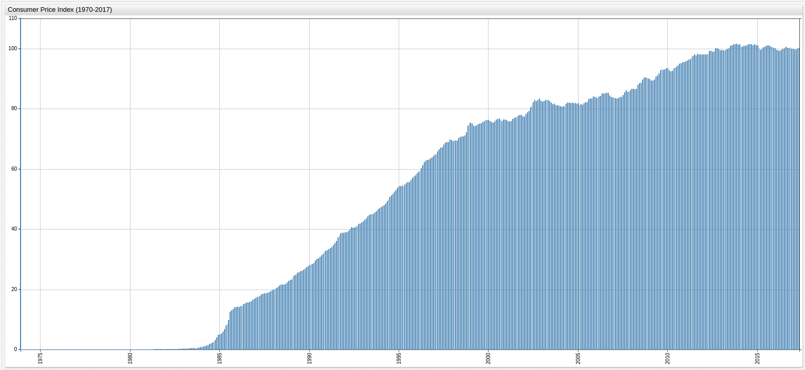
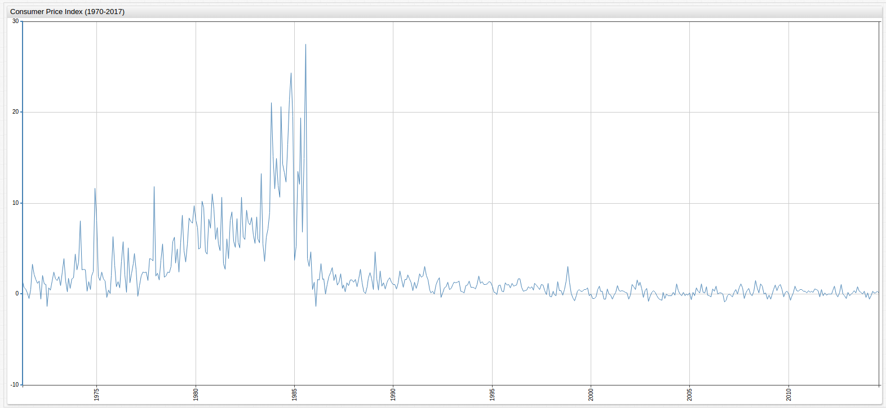
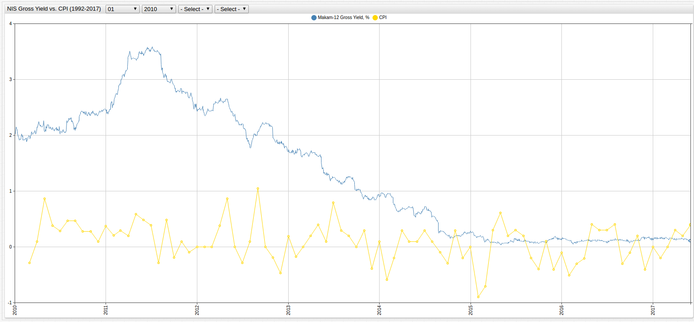
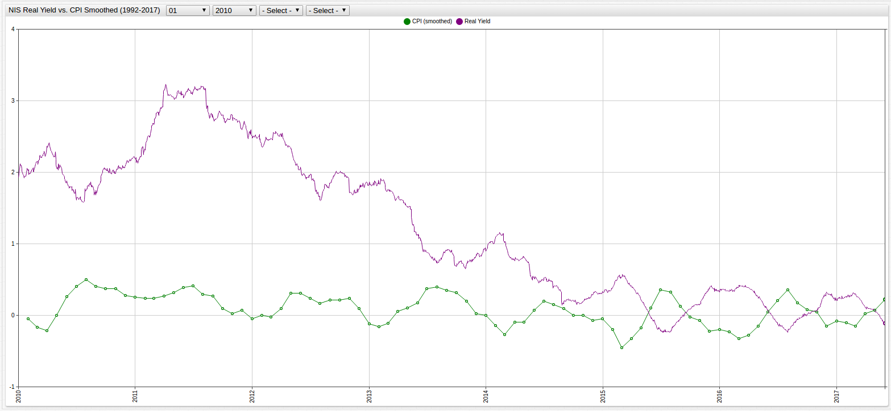
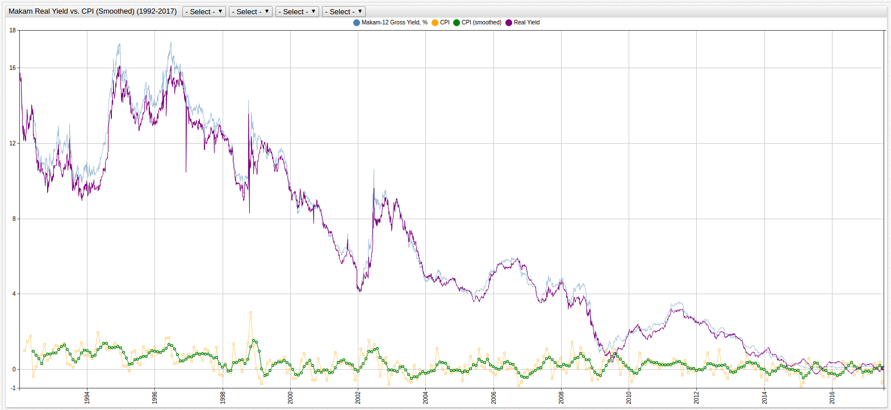

# The Consumer Price Index Versus Your Savings Account


## Introduction

The [Consumer Price Index](https://www.bls.gov/cpi/home.htm) (CPI) is a weighted measurement of the average price for various types of consumer goods and services.
The CPI of a given set of goods like transportation, food costs, or medical care is a strong indicator of inflation and deflation
because it tracks the amount that consumers are paying for various products as well as how that value is changing
over time. Government and Central Bank officials all over the globe use the Consumer Price Index to create effective fiscal policy that
will be beneficial to their people and attempt to control internal inflation with information gleaned from CPI values.

The [Bank of Israel](http://www.boi.org.il/en/Pages/Default.aspx) is no stranger to managing inflation, after the 1983 Israeli bank stock crisis following a decade of economic stagnation,
Israel's four largest banks were nationalized, following massive devaluation of their stock, to offset public investment
losses. New, stricter banking regulations were eventually put in place as a result of the crisis, many of which afforded Israel relative
stability during the worldwide recession of the late 2000's. The bank itself creates solutions and manages fiscal policy
independently and its current Governor is considered among [the best central bankers in the world](https://d2tyltutevw8th.cloudfront.net/media/document/central-bankers-2016-1472776973.pdf).

Using [data](http://www.boi.org.il/en/DataAndStatistics/Pages/Default.aspx) from the Bank of Israel, the phenomenon of
liquid currency's decreasing intrinsic value over time can be observed and with analytics tools in [Axibase Time Series Database](https://axibase.com/docs/atsd/),
these changes can be tracked and interpreted to learn why simply holding your nest egg in
a savings account is quickly becoming the modern-day equivalent of the shoebox of cash hidden underneath your bed.

The [Axibase Time Series Database](https://axibase.com/docs/atsd/) is also developed for integration with a number of industry standard advanced analytics
tools, if it is preferable to perform calculations in an interface that is already familiar to you, follow the integration
examples in the documentation below to extract a series from ATSD, perform calculations in the interface of your choice, and
then submit the new, derived series back in to ATSD:

* [Alteryx Designer](https://axibase.com/docs/atsd/integration/alteryx/)
* [IBM SPSS Modeler](https://axibase.com/docs/atsd/integration/spss/modeler/)
* [IBM SPSS Statistics](https://axibase.com/docs/atsd/integration/spss/statistics/)
* [Pentaho Data Integration](https://axibase.com/docs/atsd/integration/pentaho/data-integration/#pentaho-data-integration)
* [Pentaho Report Designer](https://axibase.com/docs/atsd/integration/pentaho/report-designer/#pentaho-report-designer)
* [MatLab](https://axibase.com/docs/atsd/integration/matlab/)

## Data

The following visualization will be the primary subject of analysis, it tracks the overall price levels compared to 2017
values and is shown below:



[](https://apps.axibase.com/chartlab/f322562c/10/#fullscreen)

> Open the dropdown menu in any of these visualizations to navigate through time.

Calculation tools built in to the [ChartLab](https://apps.axibase.com/) interface make long-term analysis of complex data more simple than manual or
other methods of computer-assisted computation by allowing mathematical functions determined by some underlying data to be
used as guides for visualization. These tools will be used to showcase the inflation Israeli consumers face as a result of
local CPI values.



[](https://apps.axibase.com/chartlab/f322562c/7/#fullscreen)

Shown above is the percent change of almost half of century's worth of CPI data tracked by the Bank of Israel. The hyperinflation that resulted
in the establishment of Israel's contemporary currency, the New Israeli Shekel (NIS), in 1985 is detailed by the absolute maxima
seen here. The value shown is a calculated percentile based on this setting, which is visible in
the Editor window:

`replace-value = (value/previousValue-1)*100`

Where,

`replace-value` = F(X),
`value` = X,
`previousValue` = previous value of X

This script simply replaces the value stored in the database with the value calculated by the equation, which returns the change in CPI. In order to smooth the variance of the curve, this setting may be added to the Editor:

```ls
[series]
  label = CPI (Adjusted)
  value = movavg ('cpi', 4)
  alias = cpi_smoothed
```

The `label` tag describes the visualization and is used in the legend at the top of the screen, the `value` tag here contains
the [`movavg`](https://axibase.com/products/axibase-time-series-database/visualization/widgets/time-chart/) or moving average
method, built in to ChartLab. Moving average is an aggregation of a variable number of years, set by the user as the second
parameter in the brackets, with the first indicating the alias to be averaged. The resulting graph is shown below:


[](https://apps.axibase.com/chartlab/f322562c/8/#fullscreen)

Inflation and deflation have a number of tangible effects, the most obvious of which is the increase and decrease in the prices
of everyday purchases, measured by CPI as shown above. Additionally, gross yield of cash can be measured to track the appreciation
or depreciation of the value of liquid currency. In a country experiencing serious hyperinflation, such as the Weimar Republic
in the twenties, Japan in the forties, Israel in the eighties, or Russia in the nineties, the value of liquid currency can
depreciate to the point of worthlessness very quickly. But this phenomenon is simply an accelerated version of the natural
inflation that occurs in even the most dynamic and robust economies.

Since its first printing in the eighties, the NIS has grown to become a stable, and freely-tradeable currency but that doesn't
mean that it has become immune to the effects of inflation. Shown below is the Gross Yield of cash holdings in shekels since
the early nineties to present day, contrasted against the percent change of the Consumer Price Index:


[](https://apps.axibase.com/chartlab/f322562c/13/#fullscreen)

The decreasing difference in absolute value of the two lines here, representing the Gross Yield of cash in blue, and the change
in CPI value in gold, shows that over the observed period of time the gross yield of cash (or makam) is decreasing, with
some exceptions. To simplify, a cash gross yield of 0 (no slope) shows that the value of a given amount of cash is increasing
or decreasing in parallel with inflation, not that the value of the cash is stagnant (unless of course there was also zero percent inflation
in the observed year).

Using the derived series `CPI (Smoothed)` in a new function, the value of cash's Real Yield can be calculated by adding the
following script in the Editor window:

```ls
[series]
  label = Real Yield
  value = value('nominal_yield') - value('cpi_smoothed')
```

Here, an entirely new series is calculated by subtracting the value of the CPI (Smoothed) function from the value of Cash's
Annual Nominal Yield and the series is named Real Yield to reflect that it has been adjusted to include calculated CPI values.


[](https://apps.axibase.com/chartlab/f322562c/12/#fullscreen)

The above visualization details the real yield of cash (makam) and not just the absolute,
or gross, yield. Looking closely from 2010 to present day highlights the differences in visualization:



[](https://apps.axibase.com/chartlab/f322562c/16/#fullscreen)



[](https://apps.axibase.com/chartlab/f322562c/18/#fullscreen)

## Conclusions

Comparing the visualizations above, the difference in cash's absolute gross yield and calculated real yield is shown
compared to the percent change in Consumer Price Index and calculated average Consumer Price Index.
In the gross yield visualization, the slope of the line is approaching zero. As noted above,
a true zero-slope gross yield line would represent cash value that is not inflating or deflating each year. However, the value of CPI
shows that in fact, inflation and deflation is occurring, and the prices of consumer goods are affected by that.

The interaction between CPI (Smoothed) and the Real Yield of cash is shown to be closely related in recent years. In fact, the cyclical nature of CPI is shown to be occurring in parallel
to the now-cyclical real yield in cash value. The stability of Israel's economy during recent years is highlighted by low inflation and deflation
and stable CPI.



[](https://apps.axibase.com/chartlab/f322562c/19/#fullscreen)

This visualization includes all visualizations discussed in this report, with emphasis added to the calculated metrics. The table below shows how this information applies in a real-world example:

| Initial Cash Value (1992) | Cash Value (2000) | Cash Value (2010) | Cash Value (2015) | Cash Value (2017) |
|-----------------------------|----------------------|----------------------|----------------------|----------------------|
| 100 NIS | 94.70 NIS | 87.59 NIS | 86.13 NIS | 86.03 NIS |
| 100 NIS (Earning 2% Interest Annually) | 96.59 NIS | 91.14 NIS | 91.39 NIS | 93.12 NIS |

The calculated loss in Real Yield shows that over a quarter century, cash held without interest would depreciate in value almost
14% as a result of changes to the Consumer Price Index and inflation. Cash held in an account yielding two percent annual
interest, which is typical of a normal depository bank's saving options, managed to see real returns one of the four observed
years, but otherwise suffered a similar fate to the money held as cash. Examples like this highlight the need for consumers
to diversify their holdings, whether that be through investing in something like an index fund to see slow growth over a long
period of time, or something higher risk like futures contracts, simply holding on to the money you have is no longer enough
to save it.
