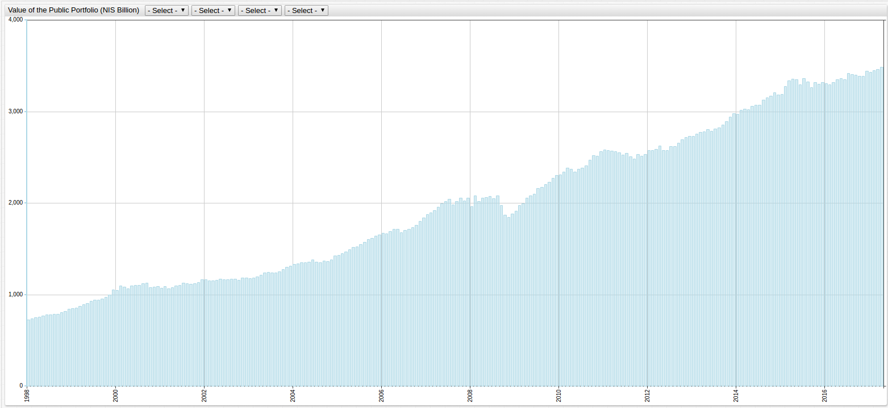

# Distribution of the Public Asset Portfolio, 1998-2017

[ChartLab](https://apps.axibase.com/chartlab) and SQL Console in ATSD

> Data Source: [Bank of Israel](http://www.boi.org.il/en/DataAndStatistics)

## Value of the Public Portfolio (NIS Billion)



[](https://apps.axibase.com/chartlab/24b59799/2/#fullscreen)

```sql
SELECT date_format(time, 'yyyy-MM') AS "Date", tv.value AS "Total Value (NIS Billion)"
  FROM "total_(nis_billion)" AS tv WHERE date_format(time, 'MM') = '01'
GROUP BY 'Date', tv.value
  ORDER BY 'Date'
```

| Date    | Total Value (NIS Billion) |
|---------|---------------------------|
| 1998-01 | 725                       |
| 1999-01 | 847                       |
| 2000-01 | 1048                      |
| 2001-01 | 1074                      |
| 2002-01 | 1162                      |
| 2003-01 | 1177                      |
| 2004-01 | 1331                      |
| 2005-01 | 1433                      |
| 2006-01 | 1675                      |
| 2007-01 | 1878                      |
| 2008-01 | 1960                      |
| 2009-01 | 1916                      |
| 2010-01 | 2312                      |
| 2011-01 | 2581                      |
| 2012-01 | 2574                      |
| 2013-01 | 2730                      |
| 2014-01 | 2974                      |
| 2015-01 | 3190                      |
| 2016-01 | 3306                      |
| 2017-01 | 3429                      |


[](https://apps.axibase.com/chartlab/24b59799/6/#fullscreen)

> Months with negative growth are shown in red, and months with positive growth exceeding 25 billion NIS are shown in dark blue.

```sql
SELECT date_format(time, 'yyyy-MM') AS "Date", ROUND(tv.value, 1) AS "Total Value (NIS Billion)", ROUND((tv.value/3428.9)*100, 1) AS "Percent of Current Value", ROUND(tv.value - LAG(tv.value), 1) AS "Delta"
  FROM "total_(nis_billion)" AS tv WHERE date_format(time, 'MM') = '01'
GROUP BY 'Date', tv.value
  ORDER BY 'Date'
```

```txt
| Date    | Total Value (NIS Billion) | Percent of Current Value | Delta |
|---------|---------------------------|--------------------------|-------|
| 1998-01 | 725.1                     | 21.1                     | null  |
| 1999-01 | 846.6                     | 24.7                     | 121.5 |
| 2000-01 | 1047.9                    | 30.6                     | 201.3 |
| 2001-01 | 1074.1                    | 31.3                     | 26.2  |
| 2002-01 | 1162.3                    | 33.9                     | 88.2  |
| 2003-01 | 1177.4                    | 34.3                     | 15.1  |
| 2004-01 | 1331.1                    | 38.8                     | 153.7 |
| 2005-01 | 1432.8                    | 41.8                     | 101.7 |
| 2006-01 | 1674.7                    | 48.8                     | 241.9 |
| 2007-01 | 1878.2                    | 54.8                     | 203.5 |
| 2008-01 | 1959.8                    | 57.2                     | 81.6  |
| 2009-01 | 1916.4                    | 55.9                     | -43.4 |
| 2010-01 | 2311.9                    | 67.4                     | 395.5 |
| 2011-01 | 2581.2                    | 75.3                     | 269.3 |
| 2012-01 | 2574.5                    | 75.1                     | -6.7  |
| 2013-01 | 2730.4                    | 79.6                     | 155.9 |
| 2014-01 | 2974.3                    | 86.7                     | 243.9 |
| 2015-01 | 3189.5                    | 93                       | 215.2 |
| 2016-01 | 3305.5                    | 96.4                     | 116   |
| 2017-01 | 3428.9                    | 100                      | 123.4 |
```

## Distributions of Assets by Type (Percent)


[](https://apps.axibase.com/chartlab/040c4e03/5/#fullscreen)

```sql
SELECT date_format(time, 'MM-yyyy') AS "Date",  cd.value AS "Cash and Deposits", gbn.value AS "Government Bonds (Non-Tradeable)", gbt.value AS "Government Bonds (Tradeable)", cbn.value AS "Corporate Bonds (Non-Tradeable)", cbt.value AS "Corporate Bonds (Tradeable)", cm.value AS "Cash (Makam)", i.value AS "Shares in Israel", iad.value AS "Investments Abroad (Deposits)", iab.value AS "Investments Abroad (Bonds)", ias.value AS "Investments Abroad (Shares)", iao.value AS "Investments Abroad (Other)"
  FROM "cash_and_desposits" AS cd JOIN "government_bonds_(non-tradeable)" AS gbn JOIN "government_bonds_(tradeable)" AS gbt JOIN "corporate_bonds_(non-tradeable)" AS cbn JOIN "corporate_bonds_(tradeable)" AS cbt JOIN "cash_(makam)" AS cm JOIN "shares_in_israel" AS i JOIN "investments_abroad_(deposits)" AS iad JOIN "investments_abroad_(bonds)" AS iab JOIN "investments_abroad_(shares)" AS ias JOIN "investments_abroad_(other)" AS iao WHERE date_format(time, 'MM') = '01'
GROUP BY 'Date', cd.value, gbn.value, gbt.value, cbn.value, cbt.value, cm.value, i.value, iab.value, iad.value, ias.value, iao.value
  ORDER BY 'Date'
```

| Date    | Cash and Deposits | Government Bonds (Non-Tradeable) | Government Bonds (Tradeable) | Corporate Bonds (Non-Tradeable) | Corporate Bonds (Tradeable) | Cash (Makam) | Shares in Israel | Investments Abroad (Deposits) | Investments Abroad (Bonds) | Investments Abroad (Shares) | Investments Abroad (Other) |
|---------|-------------------|----------------------------------|------------------------------|---------------------------------|-----------------------------|--------------|------------------|-------------------------------|----------------------------|-----------------------------|-----------------------------|
| 01-1998 | 44.7              | 13.5                             | 12.9                         | 0.8                             | 1.2                         | 2            | 15.9             | 0.9                           | 2.2                        | 0                           | 5.9                         |
| 01-1999 | 45.5              | 13.3                             | 12                           | 0                               | 1.1                         | 2.1          | 15.4             | 2.4                           | 2.5                        | 0                           | 5.7                         |
| 01-2000 | 41.6              | 11.5                             | 10.7                         | 0.8                             | 1.5                         | 1.9          | 19.6             | 2.4                           | 0.3                        | 4.9                         | 4.8                         |
| 01-2001 | 44.3              | 11.5                             | 11.7                         | 1.3                             | 1.3                         | 2.5          | 16.6             | 3                             | 0.8                        | 3.5                         | 3.5                         |
| 01-2002 | 43.4              | 11.5                             | 13.4                         | 1.6                             | 1.5                         | 2.5          | 15.6             | 4.1                           | 2.1                        | 2                           | 2.3                         |
| 01-2003 | 45.4              | 12.4                             | 12.9                         | 2                               | 1.6                         | 3.5          | 10.7             | 4.7                           | 3.2                        | 1.4                         | 2.2                         |
| 01-2004 | 39.6              | 11.2                             | 14.2                         | 2.3                             | 1.8                         | 3.8          | 16.3             | 3.8                           | 3.4                        | 2.3                         | 1.5                         |
| 01-2005 | 37.3              | 10.1                             | 14.2                         | 2.8                             | 2.5                         | 4.6          | 17               | 3.7                           | 3.7                        | 2.7                         | 1.4                         |
| 01-2006 | 33.7              | 8.5                              | 12.6                         | 3.6                             | 4                           | 3.7          | 20.1             | 4                             | 4                          | 3.9                         | 1.9                         |
| 01-2007 | 31.6              | 7.3                              | 10.8                         | 4                               | 5                           | 4.4          | 22.4             | 3.7                           | 4.4                        | 4                           | 2.4                         |
| 01-2008 | 32.1              | 6.9                              | 10.8                         | 4                               | 7.9                         | 3.4          | 21.6             | 3.9                           | 3.5                        | 3.5                         | 2.4                         |
| 01-2009 | 36.1              | 10.9                             | 13.9                         | 3                               | 7.3                         | 3.4          | 11.9             | 4.1                           | 3.2                        | 3.4                         | 2.7                         |
| 01-2010 | 31.6              | 9.3                              | 12.5                         | 2.6                             | 9                           | 2.7          | 19               | 3.1                           | 3.1                        | 4.6                         | 2.6                         |
| 01-2011 | 29.8              | 9.3                              | 11.9                         | 2.3                             | 9.4                         | 2.5          | 20.7             | 2.3                           | 3.6                        | 5.7                         | 2.5                         |
| 01-2012 | 33.1              | 9.4                              | 12                           | 2.2                             | 9.6                         | 3.1          | 16               | 1.8                           | 4.2                        | 5.8                         | 2.8                         |
| 01-2013 | 33.1              | 9.4                              | 12.9                         | 2.1                             | 9.6                         | 2.7          | 14.8             | 1.1                           | 4.4                        | 6.7                         | 3.2                         |
| 01-2014 | 31.5              | 9.4                              | 13                           | 1.7                             | 9.1                         | 2.7          | 16.6             | 0.9                           | 4.3                        | 7.4                         | 3.4                         |
| 01-2015 | 32.2              | 10.1                             | 12.7                         | 1.6                             | 7.8                         | 3            | 15               | 0.7                           | 5.3                        | 8.4                         | 3.4                         |
| 01-2016 | 33.9              | 9.9                              | 11.9                         | 1.3                             | 8.3                         | 2            | 14.5             | 0.8                           | 5.4                        | 7.9                         | 4                           |
| 01-2017 | 35.3              | 9.6                              | 11.1                         | 1.1                             | 9                           | 1.5          | 14               | 0.5                           | 5.3                        | 7.9                         | 4.6                         |


[](https://apps.axibase.com/chartlab/040c4e03/8/#fullscreen)
