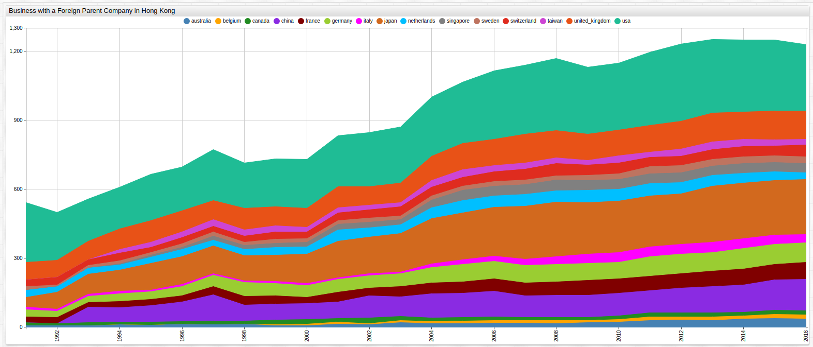
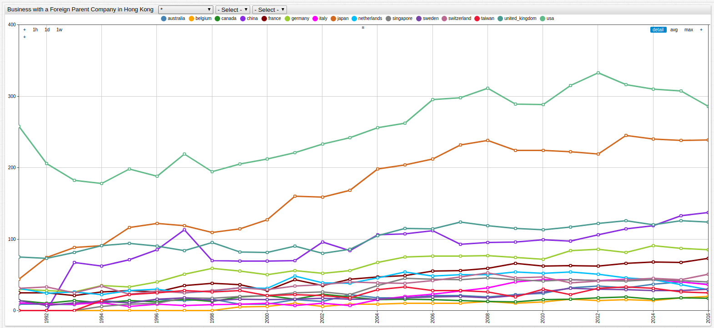
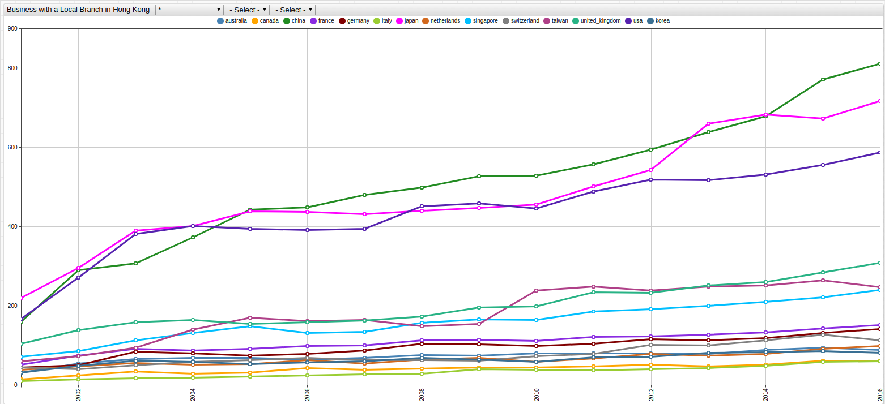
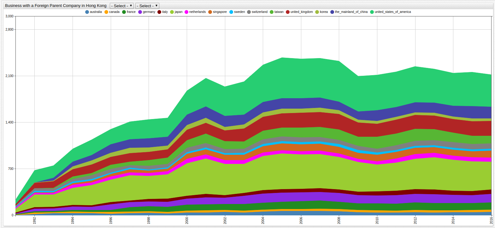

# Foreign Businesses Operating in Hong Kong (1996-2016)

Data Source: [data.gov.hk](https://data.gov.hk/en-data/dataset/hk-censtatd-tablechart-scorp)

Visualization: [ChartLab](https://apps.axibase.com/chartlab)

Structured Query Language: [SQL Console](https://axibase.com/docs/atsd/sql/) in ATSD

The data records three types of foreign companies operating in Hong Kong: local companies with foreign parent companies,
foreign companies with locals branches in Hong Kong, and foreign companies with regional branches in Hong Kong. The differences
are subtle but most likely recorded for tax purposes.

Use the Metric Index and Country Index below to navigate between countries and metrics.

## Metric Index

* [Businesses in Hong Kong with a Foreign Parent Company](#businesses-representing-parent-companies-outside-of-hong-kong-sorted-by-country-1996-2016)
* [Foreign Businesses with a Local Branch in Hong Kong](#foreign-businesses-with-a-local-branch-in-hong-kong-sorted-by-country-2001-2016)
* [Foreign Businesses with a Regional Branch in Hong Kong](#foreign-businesses-with-a-regional-branch-in-hong-kong-sorted-by-country-1991-2016)

### Businesses Representing Parent Companies Outside of Hong Kong Sorted by Country (1996-2016)



[](https://apps.axibase.com/chartlab/0a0bc0af/2/#fullscreen)

> Open the visualization in ChartLab and use the dropdown menus at the top of the screen to select the desired observation period.

Total Foreign Businesses Operating in Hong Kong Representing a Foreign Parent Company, by Country:

```sql
SELECT YEAR(time) AS 'Year', value as 'Businesses in Hong Kong',ROUND((value/ LAG(value)-1)*100, 2) AS 'Y-o-Y Change (%)'
  FROM "foreign-parent" WHERE entity LIKE "tot*"
```

| Year | Businesses in Hong Kong | Y-o-Y Change (%) |
|------|-------------------------|------------------|
| 1991 | 602                     | null             |
| 1992 | 588                     | -2.33            |
| 1993 | 624                     | 6.12             |
| 1994 | 714                     | 14.42            |
| 1995 | 782                     | 9.52             |
| 1996 | 816                     | 4.35             |
| 1997 | 903                     | 10.66            |
| 1998 | 819                     | -9.3             |
| 1999 | 840                     | 2.56             |
| 2000 | 855                     | 1.79             |
| 2001 | 944                     | 10.41            |
| 2002 | 948                     | 0.42             |
| 2003 | 966                     | 1.9              |
| 2004 | 1098                    | 13.66            |
| 2005 | 1167                    | 6.28             |
| 2006 | 1228                    | 5.23             |
| 2007 | 1246                    | 1.47             |
| 2008 | 1298                    | 4.17             |
| 2009 | 1252                    | -3.54            |
| 2010 | 1285                    | 2.64             |
| 2011 | 1340                    | 4.28             |
| 2012 | 1367                    | 2.01             |
| 2013 | 1379                    | 0.88             |
| 2014 | 1389                    | 0.73             |
| 2015 | 1401                    | 0.86             |
| 2016 | 1379                    | -1.57            |

### Country Index

* [Australia](#australia)
* [Belgium](#belgium)
* [Canada](#canada)
* [China](#china)
* [France](#france)
* [Germany](#germany)
* [Italy](#italy)
* [Japan](#japan)
* [Netherlands](#netherlands)
* [Singapore](#singapore)
* [Sweden](#sweden)
* [Switzerland](#switzerland)
* [Taiwan](#taiwan)
* [United Kingdom](#united-kingdom)
* [United States](#united-states)



[](https://apps.axibase.com/chartlab/0a0bc0af/5/#fullscreen)

> Open the ChartLab visualization to toggle between observed countries or navigate through time using the drop-down menu.

### Australia

```sql
SELECT YEAR(time) AS 'Year', value as 'Businesses in Hong Kong',ROUND((value/ LAG(value)-1)*100, 2) AS 'Y-o-Y Change (%)'
  FROM "foreign-parent" WHERE entity LIKE "aus*"
```

| Year | Businesses in Hong Kong | Y-o-Y Change (%) |
|------|-------------------------|------------------|
| 1991 | 9                       | null             |
| 1992 | 9                       | 0                |
| 1993 | 8                       | -11.11           |
| 1994 | 14                      | 75               |
| 1995 | 11                      | -21.43           |
| 1996 | 15                      | 36.36            |
| 1997 | 14                      | -6.67            |
| 1998 | 16                      | 14.29            |
| 1999 | 9                       | -43.75           |
| 2000 | 9                       | 0                |
| 2001 | 15                      | 66.67            |
| 2002 | 13                      | -13.33           |
| 2003 | 22                      | 69.23            |
| 2004 | 18                      | -18.18           |
| 2005 | 18                      | 0                |
| 2006 | 21                      | 16.67            |
| 2007 | 21                      | 0                |
| 2008 | 19                      | -9.52            |
| 2009 | 22                      | 15.79            |
| 2010 | 24                      | 9.09             |
| 2011 | 32                      | 33.33            |
| 2012 | 34                      | 6.25             |
| 2013 | 32                      | -5.88            |
| 2014 | 37                      | 15.63            |
| 2015 | 40                      | 8.11             |
| 2016 | 37                      | -7.5             |

Return to the [Country Index](#country-index)

Return to the [Metric Index](#metric-index)

### Belgium

```sql
SELECT YEAR(time) AS 'Year', value as 'Businesses in Hong Kong',ROUND((value/ LAG(value)-1)*100, 2) AS 'Y-o-Y Change (%)'
  FROM "foreign-parent" WHERE entity LIKE "bel*"
```

| Year | Businesses in Hong Kong | Y-o-Y Change (%) |
|------|-------------------------|------------------|
| 1991 | 0                       | null             |
| 1992 | 0                       | NaN              |
| 1993 | 0                       | NaN              |
| 1994 | 0                       | NaN              |
| 1995 | 0                       | NaN              |
| 1996 | 0                       | NaN              |
| 1997 | 0                       | NaN              |
| 1998 | 0                       | NaN              |
| 1999 | 5                       | ∞                |
| 2000 | 6                       | 20               |
| 2001 | 10                      | 66.67            |
| 2002 | 6                       | -40              |
| 2003 | 9                       | 50               |
| 2004 | 9                       | 0                |
| 2005 | 10                      | 11.11            |
| 2006 | 10                      | 0                |
| 2007 | 10                      | 0                |
| 2008 | 13                      | 30               |
| 2009 | 10                      | -23.08           |
| 2010 | 12                      | 20               |
| 2011 | 16                      | 33.33            |
| 2012 | 14                      | -12.5            |
| 2013 | 15                      | 7.14             |
| 2014 | 14                      | -6.67            |
| 2015 | 18                      | 28.57            |
| 2016 | 20                      | 11.11            |

> Review [SQL Console Documentation](https://axibase.com/docs/atsd/sql/#null) here to read about handling
procedures for mathematical operations involving `0`, `null`, and `NaN`.

Return to the [Country Index](#country-index)

Return to the [Metric Index](#metric-index)

### Canada

```sql
SELECT YEAR(time) AS 'Year', value as 'Businesses in Hong Kong',ROUND((value/ LAG(value)-1)*100, 2) AS 'Y-o-Y Change (%)'
  FROM "foreign-parent" WHERE entity LIKE "can*"
```

| Year | Businesses in Hong Kong | Y-o-Y Change (%) |
|------|-------------------------|------------------|
| 1991 | 14                      | null             |
| 1992 | 10                      | -28.57           |
| 1993 | 14                      | 40               |
| 1994 | 11                      | -21.43           |
| 1995 | 14                      | 27.27            |
| 1996 | 12                      | -14.29           |
| 1997 | 16                      | 33.33            |
| 1998 | 13                      | -18.75           |
| 1999 | 19                      | 46.15            |
| 2000 | 21                      | 10.53            |
| 2001 | 16                      | -23.81           |
| 2002 | 23                      | 43.75            |
| 2003 | 19                      | -17.39           |
| 2004 | 15                      | -21.05           |
| 2005 | 16                      | 6.67             |
| 2006 | 15                      | -6.25            |
| 2007 | 14                      | -6.67            |
| 2008 | 13                      | -7.14            |
| 2009 | 12                      | -7.69            |
| 2010 | 15                      | 25               |
| 2011 | 16                      | 6.67             |
| 2012 | 18                      | 12.5             |
| 2013 | 19                      | 5.56             |
| 2014 | 16                      | -15.79           |
| 2015 | 18                      | 12.5             |
| 2016 | 17                      | -5.56            |

Return to the [Country Index](#country-index)

Return to the [Metric Index](#metric-index)

### China

```sql
SELECT YEAR(time) AS 'Year', value as 'Businesses in Hong Kong',ROUND((value/ LAG(value)-1)*100, 2) AS 'Y-o-Y Change (%)'
  FROM "foreign-parent" WHERE entity LIKE "chi*"
```

| Year | Businesses in Hong Kong | Y-o-Y Change (%) |
|------|-------------------------|------------------|
| 1991 | 0                       | null             |
| 1992 | 0                       | NaN              |
| 1993 | 67                      | ∞                |
| 1994 | 62                      | -7.46            |
| 1995 | 71                      | 14.52            |
| 1996 | 85                      | 19.72            |
| 1997 | 113                     | 32.94            |
| 1998 | 70                      | -38.05           |
| 1999 | 69                      | -1.43            |
| 2000 | 69                      | 0                |
| 2001 | 70                      | 1.45             |
| 2002 | 96                      | 37.14            |
| 2003 | 84                      | -12.5            |
| 2004 | 106                     | 26.19            |
| 2005 | 107                     | 0.94             |
| 2006 | 112                     | 4.67             |
| 2007 | 93                      | -16.96           |
| 2008 | 95                      | 2.15             |
| 2009 | 96                      | 1.05             |
| 2010 | 99                      | 3.13             |
| 2011 | 97                      | -2.02            |
| 2012 | 106                     | 9.28             |
| 2013 | 114                     | 7.55             |
| 2014 | 119                     | 4.39             |
| 2015 | 133                     | 11.76            |
| 2016 | 137                     | 3.01             |

> Review [SQL Console Documentation](https://axibase.com/docs/atsd/sql/#null) here to read about handling
procedures for mathematical operations involving `0`, `null`, and `NaN`.

Return to the [Country Index](#country-index)

Return to the [Metric Index](#metric-index)

### France

```sql
SELECT YEAR(time) AS 'Year', value as 'Businesses in Hong Kong',ROUND((value/ LAG(value)-1)*100, 2) AS 'Y-o-Y Change (%)'
  FROM "foreign-parent" WHERE entity LIKE "fra*"
```

| Year | Businesses in Hong Kong | Y-o-Y Change (%) |
|------|-------------------------|------------------|
| 1991 | 25                      | null             |
| 1992 | 25                      | 0                |
| 1993 | 21                      | -16              |
| 1994 | 26                      | 23.81            |
| 1995 | 28                      | 7.69             |
| 1996 | 26                      | -7.14            |
| 1997 | 35                      | 34.62            |
| 1998 | 38                      | 8.57             |
| 1999 | 36                      | -5.26            |
| 2000 | 28                      | -22.22           |
| 2001 | 43                      | 53.57            |
| 2002 | 35                      | -18.6            |
| 2003 | 44                      | 25.71            |
| 2004 | 47                      | 6.82             |
| 2005 | 49                      | 4.26             |
| 2006 | 55                      | 12.24            |
| 2007 | 56                      | 1.82             |
| 2008 | 59                      | 5.36             |
| 2009 | 66                      | 11.86            |
| 2010 | 62                      | -6.06            |
| 2011 | 63                      | 1.61             |
| 2012 | 62                      | -1.59            |
| 2013 | 66                      | 6.45             |
| 2014 | 68                      | 3.03             |
| 2015 | 67                      | -1.47            |
| 2016 | 73                      | 8.96             |

Return to the [Country Index](#country-index)

Return to the [Metric Index](#metric-index)

### Germany

```sql
SELECT YEAR(time) AS 'Year', value as 'Businesses in Hong Kong',ROUND((value/ LAG(value)-1)*100, 2) AS 'Y-o-Y Change (%)'
  FROM "foreign-parent" WHERE entity LIKE "ger*"
```

| Year | Businesses in Hong Kong | Y-o-Y Change (%) |
|------|-------------------------|------------------|
| 1991 | 30                      | null             |
| 1992 | 28                      | -6.67            |
| 1993 | 26                      | -7.14            |
| 1994 | 35                      | 34.62            |
| 1995 | 33                      | -5.71            |
| 1996 | 40                      | 21.21            |
| 1997 | 51                      | 27.5             |
| 1998 | 59                      | 15.69            |
| 1999 | 55                      | -6.78            |
| 2000 | 50                      | -9.09            |
| 2001 | 56                      | 12               |
| 2002 | 52                      | -7.14            |
| 2003 | 56                      | 7.69             |
| 2004 | 67                      | 19.64            |
| 2005 | 75                      | 11.94            |
| 2006 | 76                      | 1.33             |
| 2007 | 76                      | 0                |
| 2008 | 77                      | 1.32             |
| 2009 | 74                      | -3.9             |
| 2010 | 72                      | -2.7             |
| 2011 | 84                      | 16.67            |
| 2012 | 86                      | 2.38             |
| 2013 | 81                      | -5.81            |
| 2014 | 91                      | 12.35            |
| 2015 | 87                      | -4.4             |
| 2016 | 85                      | -2.3             |

Return to the [Country Index](#country-index)

Return to the [Metric Index](#metric-index)

### Italy

```sql
SELECT YEAR(time) AS 'Year', value as 'Businesses in Hong Kong',ROUND((value/ LAG(value)-1)*100, 2) AS 'Y-o-Y Change (%)'
  FROM "foreign-parent" WHERE entity LIKE "ita*"
```

| Year | Businesses in Hong Kong | Y-o-Y Change (%) |
|------|-------------------------|------------------|
| 1991 | 11                      | null             |
| 1992 | 9                       | -18.18           |
| 1993 | 9                       | 0                |
| 1994 | 11                      | 22.22            |
| 1995 | 6                       | -45.45           |
| 1996 | 9                       | 50               |
| 1997 | 7                       | -22.22           |
| 1998 | 8                       | 14.29            |
| 1999 | 9                       | 12.5             |
| 2000 | 10                      | 11.11            |
| 2001 | 7                       | -30              |
| 2002 | 10                      | 42.86            |
| 2003 | 7                       | -30              |
| 2004 | 15                      | 114.29           |
| 2005 | 20                      | 33.33            |
| 2006 | 23                      | 15               |
| 2007 | 27                      | 17.39            |
| 2008 | 32                      | 18.52            |
| 2009 | 40                      | 25               |
| 2010 | 43                      | 7.5              |
| 2011 | 43                      | 0                |
| 2012 | 42                      | -2.33            |
| 2013 | 44                      | 4.76             |
| 2014 | 43                      | -2.27            |
| 2015 | 40                      | -6.98            |
| 2016 | 36                      | -10              |

Return to the [Country Index](#country-index)

Return to the [Metric Index](#metric-index)

### Japan

```sql
SELECT YEAR(time) AS 'Year', value as 'Businesses in Hong Kong',ROUND((value/ LAG(value)-1)*100, 2) AS 'Y-o-Y Change (%)'
  FROM "foreign-parent" WHERE entity LIKE "jap*"
```

| Year | Businesses in Hong Kong | Y-o-Y Change (%) |
|------|-------------------------|------------------|
| 1991 | 44                      | null             |
| 1992 | 74                      | 68.18            |
| 1993 | 88                      | 18.92            |
| 1994 | 91                      | 3.41             |
| 1995 | 116                     | 27.47            |
| 1996 | 122                     | 5.17             |
| 1997 | 119                     | -2.46            |
| 1998 | 109                     | -8.4             |
| 1999 | 114                     | 4.59             |
| 2000 | 127                     | 11.4             |
| 2001 | 160                     | 25.98            |
| 2002 | 159                     | -0.62            |
| 2003 | 168                     | 5.66             |
| 2004 | 198                     | 17.86            |
| 2005 | 204                     | 3.03             |
| 2006 | 212                     | 3.92             |
| 2007 | 232                     | 9.43             |
| 2008 | 238                     | 2.59             |
| 2009 | 224                     | -5.88            |
| 2010 | 224                     | 0                |
| 2011 | 222                     | -0.89            |
| 2012 | 219                     | -1.35            |
| 2013 | 245                     | 11.87            |
| 2014 | 240                     | -2.04            |
| 2015 | 238                     | -0.83            |
| 2016 | 239                     | 0.42             |

Return to the [Country Index](#country-index)

Return to the [Metric Index](#metric-index)

### Netherlands

```sql
SELECT YEAR(time) AS 'Year', value as 'Businesses in Hong Kong',ROUND((value/ LAG(value)-1)*100, 2) AS 'Y-o-Y Change (%)'
  FROM "foreign-parent" WHERE entity LIKE "net*"
```

| Year | Businesses in Hong Kong | Y-o-Y Change (%) |
|------|-------------------------|------------------|
| 1991 | 31                      | null             |
| 1992 | 24                      | -22.58           |
| 1993 | 26                      | 8.33             |
| 1994 | 22                      | -15.38           |
| 1995 | 28                      | 27.27            |
| 1996 | 30                      | 7.14             |
| 1997 | 25                      | -16.67           |
| 1998 | 27                      | 8                |
| 1999 | 32                      | 18.52            |
| 2000 | 31                      | -3.13            |
| 2001 | 48                      | 54.84            |
| 2002 | 39                      | -18.75           |
| 2003 | 38                      | -2.56            |
| 2004 | 46                      | 21.05            |
| 2005 | 54                      | 17.39            |
| 2006 | 48                      | -11.11           |
| 2007 | 50                      | 4.17             |
| 2008 | 50                      | 0                |
| 2009 | 54                      | 8                |
| 2010 | 52                      | -3.7             |
| 2011 | 54                      | 3.85             |
| 2012 | 51                      | -5.56            |
| 2013 | 46                      | -9.8             |
| 2014 | 43                      | -6.52            |
| 2015 | 36                      | -16.28           |
| 2016 | 29                      | -19.44           |

Return to the [Country Index](#country-index)

Return to the [Metric Index](#metric-index)

### Singapore

```sql
SELECT YEAR(time) AS 'Year', value as 'Businesses in Hong Kong',ROUND((value/ LAG(value)-1)*100, 2) AS 'Y-o-Y Change (%)'
  FROM "foreign-parent" WHERE entity LIKE "sin*"
```

| Year | Businesses in Hong Kong | Y-o-Y Change (%) |
|------|-------------------------|------------------|
| 1991 | 0                       | null             |
| 1992 | 0                       | NaN              |
| 1993 | 0                       | NaN              |
| 1994 | 6                       | ∞                |
| 1995 | 9                       | 50               |
| 1996 | 10                      | 11.11            |
| 1997 | 18                      | 80               |
| 1998 | 17                      | -5.56            |
| 1999 | 20                      | 17.65            |
| 2000 | 21                      | 5                |
| 2001 | 25                      | 19.05            |
| 2002 | 26                      | 4                |
| 2003 | 22                      | -15.38           |
| 2004 | 35                      | 59.09            |
| 2005 | 45                      | 28.57            |
| 2006 | 44                      | -2.22            |
| 2007 | 43                      | -2.27            |
| 2008 | 46                      | 6.98             |
| 2009 | 43                      | -6.52            |
| 2010 | 41                      | -4.65            |
| 2011 | 43                      | 4.88             |
| 2012 | 42                      | -2.33            |
| 2013 | 41                      | -2.38            |
| 2014 | 43                      | 4.88             |
| 2015 | 42                      | -2.33            |
| 2016 | 40                      | -4.76            |

> Review [SQL Console Documentation](https://axibase.com/docs/atsd/sql/#null) here to read about handling
procedures for mathematical operations involving `0`, `null`, and `NaN`.

Return to the [Country Index](#country-index)

Return to the [Metric Index](#metric-index)

### Sweden

```sql
SELECT YEAR(time) AS 'Year', value as 'Businesses in Hong Kong',ROUND((value/ LAG(value)-1)*100, 2) AS 'Y-o-Y Change (%)'
  FROM "foreign-parent" WHERE entity LIKE "swe*"
```

| Year | Businesses in Hong Kong | Y-o-Y Change (%) |
|------|-------------------------|------------------|
| 1991 | 14                      | null             |
| 1992 | 7                       | -50              |
| 1993 | 11                      | 57.14            |
| 1994 | 13                      | 18.18            |
| 1995 | 11                      | -15.38           |
| 1996 | 16                      | 45.45            |
| 1997 | 18                      | 12.5             |
| 1998 | 14                      | -22.22           |
| 1999 | 16                      | 14.29            |
| 2000 | 15                      | -6.25            |
| 2001 | 16                      | 6.67             |
| 2002 | 17                      | 6.25             |
| 2003 | 16                      | -5.88            |
| 2004 | 16                      | 0                |
| 2005 | 18                      | 12.5             |
| 2006 | 19                      | 5.56             |
| 2007 | 20                      | 5.26             |
| 2008 | 18                      | -10              |
| 2009 | 21                      | 16.67            |
| 2010 | 26                      | 23.81            |
| 2011 | 31                      | 19.23            |
| 2012 | 30                      | -3.23            |
| 2013 | 29                      | -3.33            |
| 2014 | 28                      | -3.45            |
| 2015 | 28                      | 0                |
| 2016 | 30                      | 7.14             |

Return to the [Country Index](#country-index)

Return to the [Metric Index](#metric-index)

### Switzerland

```sql
SELECT YEAR(time) AS 'Year', value as 'Businesses in Hong Kong',ROUND((value/ LAG(value)-1)*100, 2) AS 'Y-o-Y Change (%)'
  FROM "foreign-parent" WHERE entity LIKE "swi*"
```

| Year | Businesses in Hong Kong | Y-o-Y Change (%) |
|------|-------------------------|------------------|
| 1991 | 31                      | null             |
| 1992 | 33                      | 6.45             |
| 1993 | 25                      | -24.24           |
| 1994 | 34                      | 36               |
| 1995 | 23                      | -32.35           |
| 1996 | 27                      | 17.39            |
| 1997 | 25                      | -7.41            |
| 1998 | 28                      | 12               |
| 1999 | 32                      | 14.29            |
| 2000 | 29                      | -9.38            |
| 2001 | 34                      | 17.24            |
| 2002 | 36                      | 5.88             |
| 2003 | 40                      | 11.11            |
| 2004 | 39                      | -2.5             |
| 2005 | 38                      | -2.56            |
| 2006 | 42                      | 10.53            |
| 2007 | 47                      | 11.9             |
| 2008 | 53                      | 12.77            |
| 2009 | 46                      | -13.21           |
| 2010 | 47                      | 2.17             |
| 2011 | 39                      | -17.02           |
| 2012 | 41                      | 5.13             |
| 2013 | 43                      | 4.88             |
| 2014 | 45                      | 4.65             |
| 2015 | 43                      | -4.44            |
| 2016 | 51                      | 18.6             |

Return to the [Country Index](#country-index)

Return to the [Metric Index](#metric-index)

### Taiwan

```sql
SELECT YEAR(time) AS 'Year', value as 'Businesses in Hong Kong',ROUND((value/ LAG(value)-1)*100, 2) AS 'Y-o-Y Change (%)'
  FROM "foreign-parent" WHERE entity LIKE "tai*"
```

| Year | Businesses in Hong Kong | Y-o-Y Change (%) |
|------|-------------------------|------------------|
| 1991 | 0                       | null             |
| 1992 | 0                       | NaN              |
| 1993 | 0                       | NaN              |
| 1994 | 14                      | ∞                |
| 1995 | 22                      | 57.14            |
| 1996 | 25                      | 13.64            |
| 1997 | 28                      | 12               |
| 1998 | 26                      | -7.14            |
| 1999 | 28                      | 7.69             |
| 2000 | 21                      | -25              |
| 2001 | 22                      | 4.76             |
| 2002 | 21                      | -4.55            |
| 2003 | 18                      | -14.29           |
| 2004 | 29                      | 61.11            |
| 2005 | 33                      | 13.79            |
| 2006 | 28                      | -15.15           |
| 2007 | 28                      | 0                |
| 2008 | 26                      | -7.14            |
| 2009 | 19                      | -26.92           |
| 2010 | 30                      | 57.89            |
| 2011 | 22                      | -26.67           |
| 2012 | 31                      | 40.91            |
| 2013 | 33                      | 6.45             |
| 2014 | 31                      | -6.06            |
| 2015 | 26                      | -16.13           |
| 2016 | 25                      | -3.85            |

> Review [SQL Console Documentation](https://axibase.com/docs/atsd/sql/#null) here to read about handling
procedures for mathematical operations involving `0`, `null`, and `NaN`.

Return to the [Country Index](#country-index)

Return to the [Metric Index](#metric-index)

### United Kingdom

```sql
SELECT YEAR(time) AS 'Year', value as 'Businesses in Hong Kong',ROUND((value/ LAG(value)-1)*100, 2) AS 'Y-o-Y Change (%)'
  FROM "foreign-parent" WHERE entity LIKE "united_k*"
```

| Year | Businesses in Hong Kong | Y-o-Y Change (%) |
|------|-------------------------|------------------|
| 1991 | 75                      | null             |
| 1992 | 73                      | -2.67            |
| 1993 | 81                      | 10.96            |
| 1994 | 91                      | 12.35            |
| 1995 | 94                      | 3.3              |
| 1996 | 90                      | -4.26            |
| 1997 | 84                      | -6.67            |
| 1998 | 95                      | 13.1             |
| 1999 | 82                      | -13.68           |
| 2000 | 81                      | -1.22            |
| 2001 | 90                      | 11.11            |
| 2002 | 80                      | -11.11           |
| 2003 | 86                      | 7.5              |
| 2004 | 105                     | 22.09            |
| 2005 | 115                     | 9.52             |
| 2006 | 114                     | -0.87            |
| 2007 | 124                     | 8.77             |
| 2008 | 119                     | -4.03            |
| 2009 | 115                     | -3.36            |
| 2010 | 113                     | -1.74            |
| 2011 | 117                     | 3.54             |
| 2012 | 122                     | 4.27             |
| 2013 | 126                     | 3.28             |
| 2014 | 120                     | -4.76            |
| 2015 | 126                     | 5                |
| 2016 | 124                     | -1.59            |

Return to the [Country Index](#country-index)

Return to the [Metric Index](#metric-index)

### United States

```sql
SELECT YEAR(time) AS 'Year', value as 'Businesses in Hong Kong',ROUND((value/ LAG(value)-1)*100, 2) AS 'Y-o-Y Change (%)'
  FROM "foreign-parent" WHERE entity LIKE "usa*"
```

| Year | Businesses in Hong Kong | Y-o-Y Change (%) |
|------|-------------------------|------------------|
| 1991 | 258                     | null             |
| 1992 | 206                     | -20.16           |
| 1993 | 182                     | -11.65           |
| 1994 | 178                     | -2.2             |
| 1995 | 198                     | 11.24            |
| 1996 | 188                     | -5.05            |
| 1997 | 219                     | 16.49            |
| 1998 | 194                     | -11.42           |
| 1999 | 205                     | 5.67             |
| 2000 | 212                     | 3.41             |
| 2001 | 221                     | 4.25             |
| 2002 | 233                     | 5.43             |
| 2003 | 242                     | 3.86             |
| 2004 | 256                     | 5.79             |
| 2005 | 262                     | 2.34             |
| 2006 | 295                     | 12.6             |
| 2007 | 298                     | 1.02             |
| 2008 | 311                     | 4.36             |
| 2009 | 289                     | -7.07            |
| 2010 | 288                     | -0.35            |
| 2011 | 315                     | 9.38             |
| 2012 | 333                     | 5.71             |
| 2013 | 316                     | -5.11            |
| 2014 | 310                     | -1.9             |
| 2015 | 307                     | -0.97            |
| 2016 | 286                     | -6.84            |

Return to the [Country Index](#country-index)

Return to the [Metric Index](#metric-index)

## Foreign Businesses With a Local Branch in Hong Kong Sorted by Country (2001-2016)


[](https://apps.axibase.com/chartlab/0a0bc0af/4/#fullscreen)

> Open the visualization in ChartLab and use the drop-down menus at the top of the screen to select the desired observation period.

Total Foreign Businesses Operating a Local Branch in Hong Kong:

```sql
SELECT YEAR(time) AS 'Year', value as 'Businesses in Hong Kong',ROUND((value/ LAG(value)-1)*100, 2) AS 'Y-o-Y Change (%)'
  FROM "local-branch" WHERE entity LIKE "tot*"
```

| Year | Businesses in Hong Kong | Y-o-Y Change (%) |
|------|-------------------------|------------------|
| 2001 | 1230                    | null             |
| 2002 | 1748                    | 42.11            |
| 2003 | 2207                    | 26.26            |
| 2004 | 2334                    | 5.75             |
| 2005 | 2474                    | 6                |
| 2006 | 2509                    | 1.41             |
| 2007 | 2550                    | 1.63             |
| 2008 | 2730                    | 7.06             |
| 2009 | 2817                    | 3.19             |
| 2010 | 2923                    | 3.76             |
| 2011 | 3196                    | 9.34             |
| 2012 | 3367                    | 5.35             |
| 2013 | 3614                    | 7.34             |
| 2014 | 3801                    | 5.17             |
| 2015 | 4106                    | 8.02             |
| 2016 | 4255                    | 3.63             |

### Country Index (Local)

* [Australia](#australia-local)
* [Canada](#cananda-local)
* [China](#china-local)
* [France](#france-local)
* [Germany](#germany-local)
* [Italy](#italy-local)
* [Japan](#japan-local)
* [Netherlands](#netherlands-local)
* [Singapore](#singapore-local)
* [Sweden](#sweden-local)
* [Switzerland](#switzerland-local)
* [Taiwan](#taiwan-local)
* [United Kingdom](#united-kingdom-local)
* [United States](#usa-local)



[](https://apps.axibase.com/chartlab/0a0bc0af/7/#fullscreen)

> Open the ChartLab visualization to toggle between observed countries or navigate through time using the drop-down menu.

### Australia (Local)

```sql
SELECT YEAR(time) AS 'Year', value as 'Businesses in Hong Kong',ROUND((value/ LAG(value)-1)*100, 2) AS 'Y-o-Y Change (%)'
  FROM "local-branch" WHERE entity LIKE "aus*"
```

| Year | Businesses in Hong Kong | Y-o-Y Change (%) |
|------|-------------------------|------------------|
| 2001 | 32                      | null             |
| 2002 | 55                      | 71.88            |
| 2003 | 66                      | 20               |
| 2004 | 69                      | 4.55             |
| 2005 | 68                      | -1.45            |
| 2006 | 64                      | -5.88            |
| 2007 | 69                      | 7.81             |
| 2008 | 76                      | 10.14            |
| 2009 | 75                      | -1.32            |
| 2010 | 80                      | 6.67             |
| 2011 | 80                      | 0                |
| 2012 | 80                      | 0                |
| 2013 | 78                      | -2.5             |
| 2014 | 89                      | 14.1             |
| 2015 | 94                      | 5.62             |
| 2016 | 88                      | -6.38            |

Return to the [Country Index](#country-index-local)

Return to the [Metric Index](#metric-index)

### Canada (Local)

```sql
SELECT YEAR(time) AS 'Year', value as 'Businesses in Hong Kong',ROUND((value/ LAG(value)-1)*100, 2) AS 'Y-o-Y Change (%)'
  FROM "local-branch" WHERE entity LIKE "can*"
```

| Year | Businesses in Hong Kong | Y-o-Y Change (%) |
|------|-------------------------|------------------|
| 2001 | 14                      | null             |
| 2002 | 25                      | 78.57            |
| 2003 | 34                      | 36               |
| 2004 | 29                      | -14.71           |
| 2005 | 32                      | 10.34            |
| 2006 | 43                      | 34.38            |
| 2007 | 38                      | -11.63           |
| 2008 | 41                      | 7.89             |
| 2009 | 44                      | 7.32             |
| 2010 | 44                      | 0                |
| 2011 | 47                      | 6.82             |
| 2012 | 52                      | 10.64            |
| 2013 | 47                      | -9.62            |
| 2014 | 52                      | 10.64            |
| 2015 | 61                      | 17.31            |
| 2016 | 61                      | 0                |

Return to the [Country Index](#country-index-local)

Return to the [Metric Index](#metric-index)

### China (Local)

```sql
SELECT YEAR(time) AS 'Year', value as 'Businesses in Hong Kong',ROUND((value/ LAG(value)-1)*100, 2) AS 'Y-o-Y Change (%)'
  FROM "local-branch" WHERE entity LIKE "chi*"
```

| Year | Businesses in Hong Kong | Y-o-Y Change (%) |
|------|-------------------------|------------------|
| 2001 | 160                     | null             |
| 2002 | 290                     | 81.25            |
| 2003 | 307                     | 5.86             |
| 2004 | 373                     | 21.5             |
| 2005 | 443                     | 18.77            |
| 2006 | 449                     | 1.35             |
| 2007 | 480                     | 6.9              |
| 2008 | 499                     | 3.96             |
| 2009 | 527                     | 5.61             |
| 2010 | 528                     | 0.19             |
| 2011 | 557                     | 5.49             |
| 2012 | 595                     | 6.82             |
| 2013 | 639                     | 7.39             |
| 2014 | 678                     | 6.1              |
| 2015 | 772                     | 13.86            |
| 2016 | 812                     | 5.18             |

Return to the [Country Index](#country-index-local)

Return to the [Metric Index](#metric-index)

### France (Local)

```sql
SELECT YEAR(time) AS 'Year', value as 'Businesses in Hong Kong',ROUND((value/ LAG(value)-1)*100, 2) AS 'Y-o-Y Change (%)'
  FROM "local-branch" WHERE entity LIKE "fra*"
```

| Year | Businesses in Hong Kong | Y-o-Y Change (%) |
|------|-------------------------|------------------|
| 2001 | 51                      | null             |
| 2002 | 75                      | 47.06            |
| 2003 | 91                      | 21.33            |
| 2004 | 87                      | -4.4             |
| 2005 | 92                      | 5.75             |
| 2006 | 99                      | 7.61             |
| 2007 | 100                     | 1.01             |
| 2008 | 113                     | 13               |
| 2009 | 114                     | 0.88             |
| 2010 | 111                     | -2.63            |
| 2011 | 122                     | 9.91             |
| 2012 | 123                     | 0.82             |
| 2013 | 127                     | 3.25             |
| 2014 | 133                     | 4.72             |
| 2015 | 143                     | 7.52             |
| 2016 | 152                     | 6.29             |

Return to the [Country Index](#country-index-local)

Return to the [Metric Index](#metric-index)

### Germany (Local)

```sql
SELECT YEAR(time) AS 'Year', value as 'Businesses in Hong Kong',ROUND((value/ LAG(value)-1)*100, 2) AS 'Y-o-Y Change (%)'
  FROM "local-branch" WHERE entity LIKE "ger*"
```

| Year | Businesses in Hong Kong | Y-o-Y Change (%) |
|------|-------------------------|------------------|
| 2001 | 45                      | null             |
| 2002 | 50                      | 11.11            |
| 2003 | 84                      | 68               |
| 2004 | 80                      | -4.76            |
| 2005 | 74                      | -7.5             |
| 2006 | 79                      | 6.76             |
| 2007 | 87                      | 10.13            |
| 2008 | 104                     | 19.54            |
| 2009 | 103                     | -0.96            |
| 2010 | 99                      | -3.88            |
| 2011 | 104                     | 5.05             |
| 2012 | 116                     | 11.54            |
| 2013 | 113                     | -2.59            |
| 2014 | 119                     | 5.31             |
| 2015 | 132                     | 10.92            |
| 2016 | 141                     | 6.82             |

Return to the [Country Index](#country-index-local)

Return to the [Metric Index](#metric-index)

### Italy (Local)

```sql
SELECT YEAR(time) AS 'Year', value as 'Businesses in Hong Kong',ROUND((value/ LAG(value)-1)*100, 2) AS 'Y-o-Y Change (%)'
  FROM "local-branch" WHERE entity LIKE "ita*"
```

| Year | Businesses in Hong Kong | Y-o-Y Change (%) |
|------|-------------------------|------------------|
| 2001 | 10                      | null             |
| 2002 | 14                      | 40               |
| 2003 | 17                      | 21.43            |
| 2004 | 19                      | 11.76            |
| 2005 | 21                      | 10.53            |
| 2006 | 24                      | 14.29            |
| 2007 | 27                      | 12.5             |
| 2008 | 29                      | 7.41             |
| 2009 | 40                      | 37.93            |
| 2010 | 39                      | -2.5             |
| 2011 | 37                      | -5.13            |
| 2012 | 40                      | 8.11             |
| 2013 | 43                      | 7.5              |
| 2014 | 48                      | 11.63            |
| 2015 | 58                      | 20.83            |
| 2016 | 60                      | 3.45             |

Return to the [Country Index](#country-index-local)

Return to the [Metric Index](#metric-index)

### Japan (Local)

```sql
SELECT YEAR(time) AS 'Year', value as 'Businesses in Hong Kong',ROUND((value/ LAG(value)-1)*100, 2) AS 'Y-o-Y Change (%)'
  FROM "local-branch" WHERE entity LIKE "jap*"
```

| Year | Businesses in Hong Kong | Y-o-Y Change (%) |
|------|-------------------------|------------------|
| 2001 | 220                     | null             |
| 2002 | 296                     | 34.55            |
| 2003 | 390                     | 31.76            |
| 2004 | 402                     | 3.08             |
| 2005 | 439                     | 9.2              |
| 2006 | 437                     | -0.46            |
| 2007 | 431                     | -1.37            |
| 2008 | 440                     | 2.09             |
| 2009 | 447                     | 1.59             |
| 2010 | 456                     | 2.01             |
| 2011 | 502                     | 10.09            |
| 2012 | 543                     | 8.17             |
| 2013 | 660                     | 21.55            |
| 2014 | 683                     | 3.48             |
| 2015 | 673                     | -1.46            |
| 2016 | 717                     | 6.54             |

Return to the [Country Index](#country-index-local)

Return to the [Metric Index](#metric-index)

### Netherlands (Local)

```sql
SELECT YEAR(time) AS 'Year', value as 'Businesses in Hong Kong',ROUND((value/ LAG(value)-1)*100, 2) AS 'Y-o-Y Change (%)'
  FROM "local-branch" WHERE entity LIKE "net*"
```

| Year | Businesses in Hong Kong | Y-o-Y Change (%) |
|------|-------------------------|------------------|
| 2001 | 38                      | null             |
| 2002 | 47                      | 23.68            |
| 2003 | 56                      | 19.15            |
| 2004 | 51                      | -8.93            |
| 2005 | 53                      | 3.92             |
| 2006 | 63                      | 18.87            |
| 2007 | 54                      | -14.29           |
| 2008 | 65                      | 20.37            |
| 2009 | 68                      | 4.62             |
| 2010 | 58                      | -14.71           |
| 2011 | 67                      | 15.52            |
| 2012 | 78                      | 16.42            |
| 2013 | 74                      | -5.13            |
| 2014 | 79                      | 6.76             |
| 2015 | 92                      | 16.46            |
| 2016 | 98                      | 6.52             |

Return to the [Country Index](#country-index-local)

Return to the [Metric Index](#metric-index)

### Singapore (Local)

```sql
SELECT YEAR(time) AS 'Year', value as 'Businesses in Hong Kong',ROUND((value/ LAG(value)-1)*100, 2) AS 'Y-o-Y Change (%)'
  FROM "local-branch" WHERE entity LIKE "sin*"
```

| Year | Businesses in Hong Kong | Y-o-Y Change (%) |
|------|-------------------------|------------------|
| 2001 | 71                      | null             |
| 2002 | 86                      | 21.13            |
| 2003 | 113                     | 31.4             |
| 2004 | 132                     | 16.81            |
| 2005 | 148                     | 12.12            |
| 2006 | 132                     | -10.81           |
| 2007 | 134                     | 1.52             |
| 2008 | 157                     | 17.16            |
| 2009 | 166                     | 5.73             |
| 2010 | 165                     | -0.6             |
| 2011 | 186                     | 12.73            |
| 2012 | 192                     | 3.23             |
| 2013 | 200                     | 4.17             |
| 2014 | 210                     | 5                |
| 2015 | 222                     | 5.71             |
| 2016 | 240                     | 8.11             |

Return to the [Country Index](#country-index-local)

Return to the [Metric Index](#metric-index)

### Switzerland (Local)

```sql
SELECT YEAR(time) AS 'Year', value as 'Businesses in Hong Kong',ROUND((value/ LAG(value)-1)*100, 2) AS 'Y-o-Y Change (%)'
  FROM "local-branch" WHERE entity LIKE "swi*"
```

| Year | Businesses in Hong Kong | Y-o-Y Change (%) |
|------|-------------------------|------------------|
| 2001 | 45                      | null             |
| 2002 | 40                      | -11.11           |
| 2003 | 50                      | 25               |
| 2004 | 58                      | 16               |
| 2005 | 63                      | 8.62             |
| 2006 | 68                      | 7.94             |
| 2007 | 63                      | -7.35            |
| 2008 | 63                      | 0                |
| 2009 | 61                      | -3.17            |
| 2010 | 73                      | 19.67            |
| 2011 | 78                      | 6.85             |
| 2012 | 101                     | 29.49            |
| 2013 | 100                     | -0.99            |
| 2014 | 113                     | 13               |
| 2015 | 127                     | 12.39            |
| 2016 | 113                     | -11.02           |

Return to the [Country Index](#country-index-local)

Return to the [Metric Index](#metric-index)

### Taiwan (Local)

```sql
SELECT YEAR(time) AS 'Year', value as 'Businesses in Hong Kong',ROUND((value/ LAG(value)-1)*100, 2) AS 'Y-o-Y Change (%)'
  FROM "local-branch" WHERE entity LIKE "tai*"
```

| Year | Businesses in Hong Kong | Y-o-Y Change (%) |
|------|-------------------------|------------------|
| 2001 | 60                      | null             |
| 2002 | 73                      | 21.67            |
| 2003 | 94                      | 28.77            |
| 2004 | 140                     | 48.94            |
| 2005 | 170                     | 21.43            |
| 2006 | 161                     | -5.29            |
| 2007 | 164                     | 1.86             |
| 2008 | 149                     | -9.15            |
| 2009 | 154                     | 3.36             |
| 2010 | 238                     | 54.55            |
| 2011 | 249                     | 4.62             |
| 2012 | 239                     | -4.02            |
| 2013 | 249                     | 4.18             |
| 2014 | 251                     | 0.8              |
| 2015 | 265                     | 5.58             |
| 2016 | 247                     | -6.79            |

Return to the [Country Index](#country-index-local)

Return to the [Metric Index](#metric-index)

### United Kingdom (Local)

```sql
SELECT YEAR(time) AS 'Year', value as 'Businesses in Hong Kong',ROUND((value/ LAG(value)-1)*100, 2) AS 'Y-o-Y Change (%)'
  FROM "local-branch" WHERE entity LIKE "uni*"
```

| Year | Businesses in Hong Kong | Y-o-Y Change (%) |
|------|-------------------------|------------------|
| 2001 | 104                     | null             |
| 2002 | 138                     | 32.69            |
| 2003 | 159                     | 15.22            |
| 2004 | 164                     | 3.14             |
| 2005 | 154                     | -6.1             |
| 2006 | 159                     | 3.25             |
| 2007 | 163                     | 2.52             |
| 2008 | 173                     | 6.13             |
| 2009 | 196                     | 13.29            |
| 2010 | 198                     | 1.02             |
| 2011 | 235                     | 18.69            |
| 2012 | 233                     | -0.85            |
| 2013 | 251                     | 7.73             |
| 2014 | 260                     | 3.59             |
| 2015 | 285                     | 9.62             |
| 2016 | 309                     | 8.42             |

Return to the [Country Index](#country-index-local)

Return to the [Metric Index](#metric-index)

### United States (Local)

```sql
SELECT YEAR(time) AS 'Year', value as 'Businesses in Hong Kong',ROUND((value/ LAG(value)-1)*100, 2) AS 'Y-o-Y Change (%)'
  FROM "local-branch" WHERE entity LIKE "usa*"
```

| Year | Businesses in Hong Kong | Y-o-Y Change (%) |
|------|-------------------------|------------------|
| 2001 | 167                     | null             |
| 2002 | 272                     | 62.87            |
| 2003 | 381                     | 40.07            |
| 2004 | 401                     | 5.25             |
| 2005 | 395                     | -1.5             |
| 2006 | 391                     | -1.01            |
| 2007 | 394                     | 0.77             |
| 2008 | 452                     | 14.72            |
| 2009 | 458                     | 1.33             |
| 2010 | 446                     | -2.62            |
| 2011 | 488                     | 9.42             |
| 2012 | 519                     | 6.35             |
| 2013 | 517                     | -0.39            |
| 2014 | 531                     | 2.71             |
| 2015 | 556                     | 4.71             |
| 2016 | 587                     | 5.58             |

Return to the [Country Index](#country-index-local)

Return to the [Metric Index](#metric-index)

## Foreign Businesses with a Regional Branch in Hong Kong Sorted by Country (1991-2016)



[](https://apps.axibase.com/chartlab/0a0bc0af/8/#fullscreen)

> Open the visualization in ChartLab and use the drop-down menus at the top of the screen to select the desired observation period.

Total Foreign Businesses Operating a Regional Branch in Hong Kong:

```sql
SELECT YEAR(time) AS 'Year', value as 'Businesses in Hong Kong',ROUND((value/ LAG(value)-1)*100, 2) AS 'Y-o-Y Change (%)'
  FROM "regional-branch" WHERE entity LIKE "tot*"
```

| Year | Businesses in Hong Kong | Y-o-Y Change (%) |
|------|-------------------------|------------------|
| 1991 | 278                     | null             |
| 1992 | 757                     | 172.3            |
| 1993 | 844                     | 11.49            |
| 1994 | 1132                    | 34.12            |
| 1995 | 1286                    | 13.6             |
| 1996 | 1491                    | 15.94            |
| 1997 | 1611                    | 8.05             |
| 1998 | 1630                    | 1.18             |
| 1999 | 1650                    | 1.23             |
| 2000 | 2146                    | 30.06            |
| 2001 | 2293                    | 6.85             |
| 2002 | 2171                    | -5.32            |
| 2003 | 2241                    | 3.22             |
| 2004 | 2511                    | 12.05            |
| 2005 | 2631                    | 4.78             |
| 2006 | 2617                    | -0.53            |
| 2007 | 2644                    | 1.03             |
| 2008 | 2584                    | -2.27            |
| 2009 | 2328                    | -9.91            |
| 2010 | 2353                    | 1.07             |
| 2011 | 2412                    | 2.51             |
| 2012 | 2516                    | 4.31             |
| 2013 | 2456                    | -2.38            |
| 2014 | 2395                    | -2.48            |
| 2015 | 2397                    | 0.08             |
| 2016 | 2352                    | -1.88            |

### Country Index (Regional)

* [Australia](#australia-regional)
* [Canada](#canada-regional)
* [China](#china-regional)
* [France](#france-regional)
* [Germany](#germany-regional)
* [Italy](#italy-regional)
* [Japan](#japan-regional)
* [Korea](#korea-regional)
* [Netherlands](#netherlands-regional)
* [Singapore](#singapore-regional)
* [Sweden](#sweden-regional)
* [Switzerland](#switzerland-regional)
* [Taiwan](#taiwan-regional)
* [United Kingdom](#united-kingdom-regional)
* [United States](#united-states-regional)


[](https://apps.axibase.com/chartlab/0a0bc0af/9/#fullscreen)

> Open the ChartLab visualization to toggle between observed countries or navigate through time using the drop-down menu.

### Australia (Regional)

```sql
SELECT YEAR(time) AS 'Year', value as 'Businesses in Hong Kong',ROUND((value/ LAG(value)-1)*100, 2) AS 'Y-o-Y Change (%)'
  FROM "regional-branch" WHERE entity LIKE "aus*"
```

| Year | Businesses in Hong Kong | Y-o-Y Change (%) |
|------|-------------------------|------------------|
| 1991 | 5                       | null             |
| 1992 | 20                      | 300              |
| 1993 | 35                      | 75               |
| 1994 | 31                      | -11.43           |
| 1995 | 33                      | 6.45             |
| 1996 | 26                      | -21.21           |
| 1997 | 33                      | 26.92            |
| 1998 | 38                      | 15.15            |
| 1999 | 29                      | -23.68           |
| 2000 | 42                      | 44.83            |
| 2001 | 43                      | 2.38             |
| 2002 | 52                      | 20.93            |
| 2003 | 45                      | -13.46           |
| 2004 | 57                      | 26.67            |
| 2005 | 69                      | 21.05            |
| 2006 | 65                      | -5.8             |
| 2007 | 69                      | 6.15             |
| 2008 | 61                      | -11.59           |
| 2009 | 46                      | -24.59           |
| 2010 | 41                      | -10.87           |
| 2011 | 41                      | 0                |
| 2012 | 48                      | 17.07            |
| 2013 | 43                      | -10.42           |
| 2014 | 47                      | 9.3              |
| 2015 | 48                      | 2.13             |
| 2016 | 54                      | 12.5             |

Return to the [Country Index](#country-index-regional)

Return to the [Metric Index](#metric-index)

### Canada (Regional)

```sql
SELECT YEAR(time) AS 'Year', value as 'Businesses in Hong Kong',ROUND((value/ LAG(value)-1)*100, 2) AS 'Y-o-Y Change (%)'
  FROM "regional-branch" WHERE entity LIKE "can*"
```

| Year | Businesses in Hong Kong | Y-o-Y Change (%) |
|------|-------------------------|------------------|
| 1991 | 6                       | null             |
| 1992 | 22                      | 266.67           |
| 1993 | 14                      | -36.36           |
| 1994 | 24                      | 71.43            |
| 1995 | 21                      | -12.5            |
| 1996 | 26                      | 23.81            |
| 1997 | 24                      | -7.69            |
| 1998 | 23                      | -4.17            |
| 1999 | 25                      | 8.7              |
| 2000 | 30                      | 20               |
| 2001 | 34                      | 13.33            |
| 2002 | 28                      | -17.65           |
| 2003 | 27                      | -3.57            |
| 2004 | 29                      | 7.41             |
| 2005 | 25                      | -13.79           |
| 2006 | 31                      | 24               |
| 2007 | 32                      | 3.23             |
| 2008 | 32                      | 0                |
| 2009 | 33                      | 3.13             |
| 2010 | 33                      | 0                |
| 2011 | 32                      | -3.03            |
| 2012 | 33                      | 3.13             |
| 2013 | 31                      | -6.06            |
| 2014 | 29                      | -6.45            |
| 2015 | 31                      | 6.9              |
| 2016 | 32                      | 3.23             |

Return to the [Country Index](#country-index-regional)

Return to the [Metric Index](#metric-index)

### China (Regional)

```sql
SELECT YEAR(time) AS 'Year', value as 'Businesses in Hong Kong',ROUND((value/ LAG(value)-1)*100, 2) AS 'Y-o-Y Change (%)'
  FROM "regional-branch" WHERE entity LIKE "the*"
```

| Year | Businesses in Hong Kong | Y-o-Y Change (%) |
|------|-------------------------|------------------|
| 1991 | 0                       | null             |
| 1992 | 0                       | NaN              |
| 1993 | 42                      | ∞                |
| 1994 | 69                      | 64.29            |
| 1995 | 81                      | 17.39            |
| 1996 | 128                     | 58.02            |
| 1997 | 130                     | 1.56             |
| 1998 | 135                     | 3.85             |
| 1999 | 136                     | 0.74             |
| 2000 | 160                     | 17.65            |
| 2001 | 172                     | 7.5              |
| 2002 | 170                     | -1.16            |
| 2003 | 148                     | -12.94           |
| 2004 | 156                     | 5.41             |
| 2005 | 160                     | 2.56             |
| 2006 | 156                     | -2.5             |
| 2007 | 152                     | -2.56            |
| 2008 | 128                     | -15.79           |
| 2009 | 127                     | -0.78            |
| 2010 | 162                     | 27.56            |
| 2011 | 151                     | -6.79            |
| 2012 | 152                     | 0.66             |
| 2013 | 148                     | -2.63            |
| 2014 | 160                     | 8.11             |
| 2015 | 186                     | 16.25            |
| 2016 | 174                     | -6.45            |

> Review [SQL Console Documentation](https://axibase.com/docs/atsd/sql/#null) here to read about handling
procedures for mathematical operations involving `0`, `null`, and `NaN`.

Return to the [Country Index](#country-index-regional)

Return to the [Metric Index](#metric-index)

### France (Regional)

```sql
SELECT YEAR(time) AS 'Year', value as 'Businesses in Hong Kong',ROUND((value/ LAG(value)-1)*100, 2) AS 'Y-o-Y Change (%)'
  FROM "regional-branch" WHERE entity LIKE "fra*"
```

| Year | Businesses in Hong Kong | Y-o-Y Change (%) |
|------|-------------------------|------------------|
| 1991 | 7                       | null             |
| 1992 | 22                      | 214.29           |
| 1993 | 20                      | -9.09            |
| 1994 | 25                      | 25               |
| 1995 | 26                      | 4                |
| 1996 | 31                      | 19.23            |
| 1997 | 65                      | 109.68           |
| 1998 | 76                      | 16.92            |
| 1999 | 74                      | -2.63            |
| 2000 | 88                      | 18.92            |
| 2001 | 88                      | 0                |
| 2002 | 91                      | 3.41             |
| 2003 | 101                     | 10.99            |
| 2004 | 106                     | 4.95             |
| 2005 | 110                     | 3.77             |
| 2006 | 117                     | 6.36             |
| 2007 | 121                     | 3.42             |
| 2008 | 111                     | -8.26            |
| 2009 | 104                     | -6.31            |
| 2010 | 105                     | 0.96             |
| 2011 | 105                     | 0                |
| 2012 | 114                     | 8.57             |
| 2013 | 114                     | 0                |
| 2014 | 110                     | -3.51            |
| 2015 | 105                     | -4.55            |
| 2016 | 109                     | 3.81             |

Return to the [Country Index](#country-index-regional)

Return to the [Metric Index](#metric-index)

### Germany (Regional)

```sql
SELECT YEAR(time) AS 'Year', value as 'Businesses in Hong Kong',ROUND((value/ LAG(value)-1)*100, 2) AS 'Y-o-Y Change (%)'
  FROM "regional-branch" WHERE entity LIKE "ger*"
```

| Year | Businesses in Hong Kong | Y-o-Y Change (%) |
|------|-------------------------|------------------|
| 1991 | 12                      | null             |
| 1992 | 35                      | 191.67           |
| 1993 | 35                      | 0                |
| 1994 | 52                      | 48.57            |
| 1995 | 48                      | -7.69            |
| 1996 | 85                      | 77.08            |
| 1997 | 78                      | -8.24            |
| 1998 | 74                      | -5.13            |
| 1999 | 76                      | 2.7              |
| 2000 | 93                      | 22.37            |
| 2001 | 108                     | 16.13            |
| 2002 | 96                      | -11.11           |
| 2003 | 122                     | 27.08            |
| 2004 | 135                     | 10.66            |
| 2005 | 139                     | 2.96             |
| 2006 | 136                     | -2.16            |
| 2007 | 129                     | -5.15            |
| 2008 | 133                     | 3.1              |
| 2009 | 123                     | -7.52            |
| 2010 | 120                     | -2.44            |
| 2011 | 125                     | 4.17             |
| 2012 | 130                     | 4                |
| 2013 | 133                     | 2.31             |
| 2014 | 125                     | -6.02            |
| 2015 | 121                     | -3.2             |
| 2016 | 131                     | 8.26             |

Return to the [Country Index](#country-index-regional)

Return to the [Metric Index](#metric-index)

### Italy (Regional)

```sql
SELECT YEAR(time) AS 'Year', value as 'Businesses in Hong Kong',ROUND((value/ LAG(value)-1)*100, 2) AS 'Y-o-Y Change (%)'
  FROM "regional-branch" WHERE entity LIKE "ita*"
```

| Year | Businesses in Hong Kong | Y-o-Y Change (%) |
|------|-------------------------|------------------|
| 1991 | 11                      | null             |
| 1992 | 24                      | 118.18           |
| 1993 | 25                      | 4.17             |
| 1994 | 25                      | 0                |
| 1995 | 24                      | -4               |
| 1996 | 33                      | 37.5             |
| 1997 | 24                      | -27.27           |
| 1998 | 36                      | 50               |
| 1999 | 47                      | 30.56            |
| 2000 | 43                      | -8.51            |
| 2001 | 52                      | 20.93            |
| 2002 | 38                      | -26.92           |
| 2003 | 41                      | 7.89             |
| 2004 | 54                      | 31.71            |
| 2005 | 53                      | -1.85            |
| 2006 | 52                      | -1.89            |
| 2007 | 57                      | 9.62             |
| 2008 | 52                      | -8.77            |
| 2009 | 51                      | -1.92            |
| 2010 | 62                      | 21.57            |
| 2011 | 68                      | 9.68             |
| 2012 | 71                      | 4.41             |
| 2013 | 69                      | -2.82            |
| 2014 | 61                      | -11.59           |
| 2015 | 61                      | 0                |
| 2016 | 64                      | 4.92             |

Return to the [Country Index](#country-index-regional)

Return to the [Metric Index](#metric-index)

### Japan (Regional)

```sql
SELECT YEAR(time) AS 'Year', value as 'Businesses in Hong Kong',ROUND((value/ LAG(value)-1)*100, 2) AS 'Y-o-Y Change (%)'
  FROM "regional-branch" WHERE entity LIKE "jap*"
```

| Year | Businesses in Hong Kong | Y-o-Y Change (%) |
|------|-------------------------|------------------|
| 1991 | 61                      | null             |
| 1992 | 193                     | 216.39           |
| 1993 | 185                     | -4.15            |
| 1994 | 257                     | 38.92            |
| 1995 | 303                     | 17.9             |
| 1996 | 338                     | 11.55            |
| 1997 | 379                     | 12.13            |
| 1998 | 347                     | -8.44            |
| 1999 | 368                     | 6.05             |
| 2000 | 492                     | 33.7             |
| 2001 | 533                     | 8.33             |
| 2002 | 471                     | -11.63           |
| 2003 | 442                     | -6.16            |
| 2004 | 515                     | 16.52            |
| 2005 | 537                     | 4.27             |
| 2006 | 519                     | -3.35            |
| 2007 | 516                     | -0.58            |
| 2008 | 494                     | -4.26            |
| 2009 | 447                     | -9.51            |
| 2010 | 405                     | -9.4             |
| 2011 | 426                     | 5.19             |
| 2012 | 456                     | 7.04             |
| 2013 | 484                     | 6.14             |
| 2014 | 465                     | -3.93            |
| 2015 | 447                     | -3.87            |
| 2016 | 420                     | -6.04            |

Return to the [Country Index](#country-index-regional)

Return to the [Metric Index](#metric-index)

### Korea (Regional)

```sql
SELECT YEAR(time) AS 'Year', value as 'Businesses in Hong Kong',ROUND((value/ LAG(value)-1)*100, 2) AS 'Y-o-Y Change (%)'
  FROM "regional-branch" WHERE entity LIKE "kor*"
```

| Year | Businesses in Hong Kong | Y-o-Y Change (%) |
|------|-------------------------|------------------|
| 1991 | 0                       | null             |
| 1992 | 7                       | ∞                |
| 1993 | 10                      | 42.86            |
| 1994 | 45                      | 350              |
| 1995 | 60                      | 33.33            |
| 1996 | 60                      | 0                |
| 1997 | 80                      | 33.33            |
| 1998 | 66                      | -17.5            |
| 1999 | 56                      | -15.15           |
| 2000 | 71                      | 26.79            |
| 2001 | 76                      | 7.04             |
| 2002 | 49                      | -35.53           |
| 2003 | 60                      | 22.45            |
| 2004 | 67                      | 11.67            |
| 2005 | 68                      | 1.49             |
| 2006 | 62                      | -8.82            |
| 2007 | 64                      | 3.23             |
| 2008 | 56                      | -12.5            |
| 2009 | 44                      | -21.43           |
| 2010 | 43                      | -2.27            |
| 2011 | 42                      | -2.33            |
| 2012 | 38                      | -9.52            |
| 2013 | 43                      | 13.16            |
| 2014 | 40                      | -6.98            |
| 2015 | 44                      | 10               |
| 2016 | 41                      | -6.82            |

Return to the [Country Index](#country-index-regional)

Return to the [Metric Index](#metric-index)

### Netherlands (Regional)

```sql
SELECT YEAR(time) AS 'Year', value as 'Businesses in Hong Kong',ROUND((value/ LAG(value)-1)*100, 2) AS 'Y-o-Y Change (%)'
  FROM "regional-branch" WHERE entity LIKE "net*"
```

| Year | Businesses in Hong Kong | Y-o-Y Change (%) |
|------|-------------------------|------------------|
| 1991 | 16                      | null             |
| 1992 | 24                      | 50               |
| 1993 | 22                      | -8.33            |
| 1994 | 46                      | 109.09           |
| 1995 | 42                      | -8.7             |
| 1996 | 48                      | 14.29            |
| 1997 | 47                      | -2.08            |
| 1998 | 46                      | -2.13            |
| 1999 | 48                      | 4.35             |
| 2000 | 65                      | 35.42            |
| 2001 | 62                      | -4.62            |
| 2002 | 57                      | -8.06            |
| 2003 | 55                      | -3.51            |
| 2004 | 52                      | -5.45            |
| 2005 | 50                      | -3.85            |
| 2006 | 47                      | -6               |
| 2007 | 51                      | 8.51             |
| 2008 | 51                      | 0                |
| 2009 | 49                      | -3.92            |
| 2010 | 50                      | 2.04             |
| 2011 | 61                      | 22               |
| 2012 | 74                      | 21.31            |
| 2013 | 68                      | -8.11            |
| 2014 | 65                      | -4.41            |
| 2015 | 62                      | -4.62            |
| 2016 | 63                      | 1.61             |

Return to the [Country Index](#country-index-regional)

Return to the [Metric Index](#metric-index)

### Singapore (Regional)

```sql
SELECT YEAR(time) AS 'Year', value as 'Businesses in Hong Kong',ROUND((value/ LAG(value)-1)*100, 2) AS 'Y-o-Y Change (%)'
  FROM "regional-branch" WHERE entity LIKE "sin*"
```

| Year | Businesses in Hong Kong | Y-o-Y Change (%) |
|------|-------------------------|------------------|
| 1991 | 0                       | null             |
| 1992 | 6                       | ∞                |
| 1993 | 14                      | 133.33           |
| 1994 | 25                      | 78.57            |
| 1995 | 27                      | 8                |
| 1996 | 35                      | 29.63            |
| 1997 | 44                      | 25.71            |
| 1998 | 37                      | -15.91           |
| 1999 | 39                      | 5.41             |
| 2000 | 76                      | 94.87            |
| 2001 | 77                      | 1.32             |
| 2002 | 79                      | 2.6              |
| 2003 | 81                      | 2.53             |
| 2004 | 97                      | 19.75            |
| 2005 | 103                     | 6.19             |
| 2006 | 106                     | 2.91             |
| 2007 | 105                     | -0.94            |
| 2008 | 98                      | -6.67            |
| 2009 | 91                      | -7.14            |
| 2010 | 98                      | 7.69             |
| 2011 | 101                     | 3.06             |
| 2012 | 93                      | -7.92            |
| 2013 | 86                      | -7.53            |
| 2014 | 90                      | 4.65             |
| 2015 | 93                      | 3.33             |
| 2016 | 102                     |                  |

> Review [SQL Console Documentation](https://axibase.com/docs/atsd/sql/#null) here to read about handling
procedures for mathematical operations involving `0`, `null`, and `NaN`.

Return to the [Country Index](#country-index-regional)

Return to the [Metric Index](#metric-index)

### Sweden (Regional)

```sql
SELECT YEAR(time) AS 'Year', value as 'Businesses in Hong Kong',ROUND((value/ LAG(value)-1)*100, 2) AS 'Y-o-Y Change (%)'
  FROM "regional-branch" WHERE entity LIKE "swe*"
```

| Year | Businesses in Hong Kong | Y-o-Y Change (%) |
|------|-------------------------|------------------|
| 1991 | 12                      | null             |
| 1992 | 25                      | 108.33           |
| 1993 | 17                      | -32              |
| 1994 | 26                      | 52.94            |
| 1995 | 25                      | -3.85            |
| 1996 | 22                      | -12              |
| 1997 | 23                      | 4.55             |
| 1998 | 15                      | -34.78           |
| 1999 | 18                      | 20               |
| 2000 | 23                      | 27.78            |
| 2001 | 27                      | 17.39            |
| 2002 | 25                      | -7.41            |
| 2003 | 28                      | 12               |
| 2004 | 33                      | 17.86            |
| 2005 | 33                      | 0                |
| 2006 | 34                      | 3.03             |
| 2007 | 36                      | 5.88             |
| 2008 | 43                      | 19.44            |
| 2009 | 42                      | -2.33            |
| 2010 | 32                      | -23.81           |
| 2011 | 29                      | -9.38            |
| 2012 | 31                      | 6.9              |
| 2013 | 31                      | 0                |
| 2014 | 28                      | -9.68            |
| 2015 | 28                      | 0                |
| 2016 | 29                      | 3.57             |

Return to the [Country Index](#country-index-regional)

Return to the [Metric Index](#metric-index)

### Switzerland (Regional)

```sql
SELECT YEAR(time) AS 'Year', value as 'Businesses in Hong Kong',ROUND((value/ LAG(value)-1)*100, 2) AS 'Y-o-Y Change (%)'
  FROM "regional-branch" WHERE entity LIKE "swi*"
```

| Year | Businesses in Hong Kong | Y-o-Y Change (%) |
|------|-------------------------|------------------|
| 1991 | 18                      | null             |
| 1992 | 39                      | 116.67           |
| 1993 | 38                      | -2.56            |
| 1994 | 38                      | 0                |
| 1995 | 57                      | 50               |
| 1996 | 57                      | 0                |
| 1997 | 42                      | -26.32           |
| 1998 | 54                      | 28.57            |
| 1999 | 50                      | -7.41            |
| 2000 | 69                      | 38               |
| 2001 | 68                      | -1.45            |
| 2002 | 61                      | -10.29           |
| 2003 | 61                      | 0                |
| 2004 | 70                      | 14.75            |
| 2005 | 73                      | 4.29             |
| 2006 | 68                      | -6.85            |
| 2007 | 64                      | -5.88            |
| 2008 | 63                      | -1.56            |
| 2009 | 61                      | -3.17            |
| 2010 | 57                      | -6.56            |
| 2011 | 69                      | 21.05            |
| 2012 | 75                      | 8.7              |
| 2013 | 73                      | -2.67            |
| 2014 | 84                      | 15.07            |
| 2015 | 82                      | -2.38            |
| 2016 | 80                      | -2.44            |

Return to the [Country Index](#country-index-regional)

Return to the [Metric Index](#metric-index)

### Taiwan (Regional)

```sql
SELECT YEAR(time) AS 'Year', value as 'Businesses in Hong Kong',ROUND((value/ LAG(value)-1)*100, 2) AS 'Y-o-Y Change (%)'
  FROM "regional-branch" WHERE entity LIKE "tai*"
```

| Year | Businesses in Hong Kong | Y-o-Y Change (%) |
|------|-------------------------|------------------|
| 1991 | 0                       | null             |
| 1992 | 0                       | NaN              |
| 1993 | 8                       | ∞                |
| 1994 | 39                      | 387.5            |
| 1995 | 30                      | -23.08           |
| 1996 | 59                      | 96.67            |
| 1997 | 49                      | -16.95           |
| 1998 | 85                      | 73.47            |
| 1999 | 97                      | 14.12            |
| 2000 | 113                     | 16.49            |
| 2001 | 142                     | 25.66            |
| 2002 | 121                     | -14.79           |
| 2003 | 111                     | -8.26            |
| 2004 | 128                     | 15.32            |
| 2005 | 133                     | 3.91             |
| 2006 | 149                     | 12.03            |
| 2007 | 155                     | 4.03             |
| 2008 | 158                     | 1.94             |
| 2009 | 138                     | -12.66           |
| 2010 | 184                     | 33.33            |
| 2011 | 175                     | -4.89            |
| 2012 | 180                     | 2.86             |
| 2013 | 166                     | -7.78            |
| 2014 | 144                     | -13.25           |
| 2015 | 122                     | -15.28           |
| 2016 | 115                     | -5.74            |

> Review [SQL Console Documentation](https://axibase.com/docs/atsd/sql/#null) here to read about handling
procedures for mathematical operations involving `0`, `null`, and `NaN`.

Return to the [Country Index](#country-index-regional)

Return to the [Metric Index](#metric-index)

### United Kingdom (Regional)

```sql
SELECT YEAR(time) AS 'Year', value as 'Businesses in Hong Kong',ROUND((value/ LAG(value)-1)*100, 2) AS 'Y-o-Y Change (%)'
  FROM "regional-branch" WHERE entity LIKE "united_k*"
```

| Year | Businesses in Hong Kong | Y-o-Y Change (%) |
|------|-------------------------|------------------|
| 1991 | 25                      | null             |
| 1992 | 79                      | 216              |
| 1993 | 102                     | 29.11            |
| 1994 | 107                     | 4.9              |
| 1995 | 132                     | 23.36            |
| 1996 | 123                     | -6.82            |
| 1997 | 130                     | 5.69             |
| 1998 | 128                     | -1.54            |
| 1999 | 124                     | -3.13            |
| 2000 | 155                     | 25               |
| 2001 | 163                     | 5.16             |
| 2002 | 163                     | 0                |
| 2003 | 196                     | 20.25            |
| 2004 | 211                     | 7.65             |
| 2005 | 215                     | 1.9              |
| 2006 | 223                     | 3.72             |
| 2007 | 223                     | 0                |
| 2008 | 234                     | 4.93             |
| 2009 | 213                     | -8.97            |
| 2010 | 194                     | -8.92            |
| 2011 | 210                     | 8.25             |
| 2012 | 210                     | 0                |
| 2013 | 209                     | -0.48            |
| 2014 | 204                     | -2.39            |
| 2015 | 220                     | 7.84             |
| 2016 | 223                     | 1.36             |

Return to the [Country Index](#country-index-regional)

Return to the [Metric Index](#metric-index)

### United States (Regional)

```sql
SELECT YEAR(time) AS 'Year', value as 'Businesses in Hong Kong',ROUND((value/ LAG(value)-1)*100, 2) AS 'Y-o-Y Change (%)'
  FROM "regional-branch" WHERE entity LIKE "united_s*"
```

| Year | Businesses in Hong Kong | Y-o-Y Change (%) |
|------|-------------------------|------------------|
| 1991 | 62                      | null             |
| 1992 | 178                     | 187.1            |
| 1993 | 183                     | 2.81             |
| 1994 | 193                     | 5.46             |
| 1995 | 228                     | 18.13            |
| 1996 | 226                     | -0.88            |
| 1997 | 261                     | 15.49            |
| 1998 | 285                     | 9.2              |
| 1999 | 278                     | -2.46            |
| 2000 | 358                     | 28.78            |
| 2001 | 420                     | 17.32            |
| 2002 | 437                     | 4.05             |
| 2003 | 498                     | 13.96            |
| 2004 | 557                     | 11.85            |
| 2005 | 606                     | 8.8              |
| 2006 | 594                     | -1.98            |
| 2007 | 593                     | -0.17            |
| 2008 | 612                     | 3.2              |
| 2009 | 526                     | -14.05           |
| 2010 | 529                     | 0.57             |
| 2011 | 525                     | -0.76            |
| 2012 | 536                     | 2.1              |
| 2013 | 506                     | -5.6             |
| 2014 | 490                     | -3.16            |
| 2015 | 505                     | 3.06             |
| 2016 | 480                     | -4.95            |

Return to the [Country Index](#country-index-regional)

Return to the [Metric Index](#metric-index)