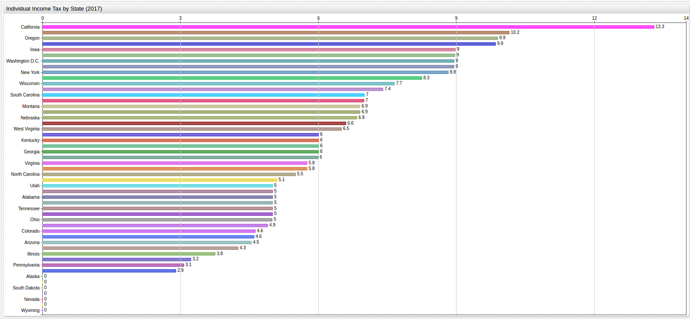
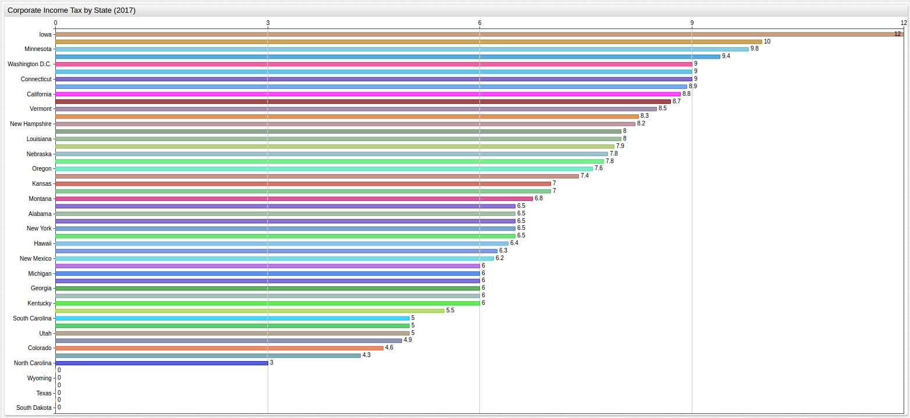
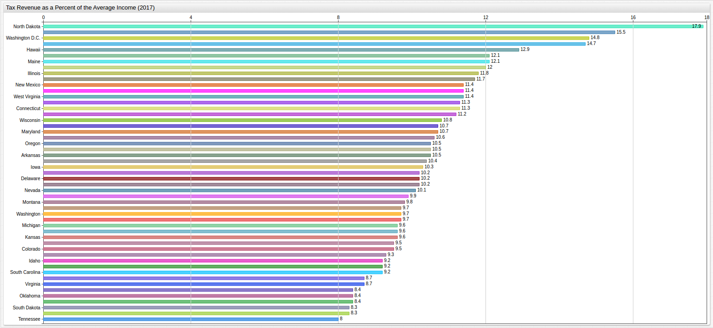

# Tax Rates by State: Corporate, Individual, Sales (2017)

Visualization and analysis tools from [Axibase](https://axibase.com)

Source: [State of Maryland](https://axibase.com/datasets/socrata/t833-r94z.html)

## State Level Individual Income Tax Rate



[](https://apps.axibase.com/chartlab/d7c5125c/2/#fullscreen)

```sql
SELECT tags.state AS "State", value AS "Individual Income Tax Rate (%)"
  FROM  state_individual_income_taxrate
GROUP BY 'State', value
  ORDER BY value desc
```

| State           | Individual Income Tax Rate (%) |
|-----------------|--------------------------------|
| California      | 13.30                          |
| Maine           | 10.15                          |
| Oregon          | 9.90                           |
| Minnesota       | 9.85                           |
| Iowa            | 8.98                           |
| New Jersey      | 8.97                           |
| Vermont         | 8.95                           |
| Washington D.C. | 8.95                           |
| New York        | 8.82                           |
| Hawaii          | 8.25                           |
| Wisconsin       | 7.65                           |
| Idaho           | 7.40                           |
| South Carolina  | 7.00                           |
| Connecticut     | 6.99                           |
| Montana         | 6.90                           |
| Arkansas        | 6.90                           |
| Nebraska        | 6.84                           |
| Delaware        | 6.60                           |
| West Virginia   | 6.50                           |
| Georgia         | 6.00                           |
| Louisiana       | 6.00                           |
| Kentucky        | 6.00                           |
| Missouri        | 6.00                           |
| Rhode Island    | 5.99                           |
| Maryland        | 5.75                           |
| Virginia        | 5.75                           |
| North Carolina  | 5.50                           |
| Massachusetts   | 5.10                           |
| Alabama         | 5.00                           |
| Tennessee       | 5.00                           |
| Oklahoma        | 5.00                           |
| New Hampshire   | 5.00                           |
| Mississippi     | 5.00                           |
| Utah            | 5.00                           |
| Ohio            | 5.00                           |
| New Mexico      | 4.90                           |
| Colorado        | 4.63                           |
| Kansas          | 4.60                           |
| Arizona         | 4.54                           |
| Michigan        | 4.25                           |
| Illinois        | 3.75                           |
| Indiana         | 3.23                           |
| Pennsylvania    | 3.07                           |
| North Dakota    | 2.90                           |
| Washington      | 0.00                           |
| Wyoming         | 0.00                           |
| Florida         | 0.00                           |
| South Dakota    | 0.00                           |
| Nevada          | 0.00                           |
| Texas           | 0.00                           |
| Alaska          | 0.00                           |

## State Level Corporate Income Tax Rate



[](https://apps.axibase.com/chartlab/d7c5125c/3/#fullscreen)

```sql
SELECT tags.state AS "State", value AS "Corporate Income Tax Rate (%)"
  FROM  state_corporate_income_taxrate
GROUP BY 'State', value
  ORDER BY value desc
```

| State           | Corporate Income Tax Rate (%) |
|-----------------|-------------------------------|
| Iowa            | 12.00                         |
| Pennsylvania    | 9.99                          |
| Minnesota       | 9.80                          |
| Alaska          | 9.40                          |
| Connecticut     | 9.00                          |
| New Jersey      | 9.00                          |
| Washington D.C. | 9.00                          |
| Maine           | 8.93                          |
| California      | 8.84                          |
| Delaware        | 8.70                          |
| Vermont         | 8.50                          |
| Maryland        | 8.25                          |
| New Hampshire   | 8.20                          |
| Louisiana       | 8.00                          |
| Massachusetts   | 8.00                          |
| Wisconsin       | 7.90                          |
| Nebraska        | 7.81                          |
| Illinois        | 7.75                          |
| Oregon          | 7.60                          |
| Idaho           | 7.40                          |
| Kansas          | 7.00                          |
| Rhode Island    | 7.00                          |
| Montana         | 6.75                          |
| New York        | 6.50                          |
| Alabama         | 6.50                          |
| Tennessee       | 6.50                          |
| West Virginia   | 6.50                          |
| Arkansas        | 6.50                          |
| Hawaii          | 6.40                          |
| Missouri        | 6.25                          |
| New Mexico      | 6.20                          |
| Georgia         | 6.00                          |
| Indiana         | 6.00                          |
| Oklahoma        | 6.00                          |
| Kentucky        | 6.00                          |
| Michigan        | 6.00                          |
| Virginia        | 6.00                          |
| Florida         | 5.50                          |
| South Carolina  | 5.00                          |
| Mississippi     | 5.00                          |
| Utah            | 5.00                          |
| Arizona         | 4.90                          |
| Colorado        | 4.63                          |
| North Dakota    | 4.31                          |
| North Carolina  | 3.00                          |
| Washington      | 0.00                          |
| Wyoming         | 0.00                          |
| Ohio            | 0.00                          |
| South Dakota    | 0.00                          |
| Nevada          | 0.00                          |
| Texas           | 0.00                          |

## State Level Sales Tax Rate


[](https://apps.axibase.com/chartlab/d7c5125c/4/#fullscreen)

```sql
SELECT tags.state AS "State", value AS "Sales Tax Rate (%)"
  FROM  state_sales_taxrate
GROUP BY 'State', value
  ORDER BY value desc
```

| State           | Sales Tax Rate (%) |
|-----------------|--------------------|
| California      | 7.25               |
| Indiana         | 7.00               |
| Tennessee       | 7.00               |
| Mississippi     | 7.00               |
| Rhode Island    | 7.00               |
| New Jersey      | 6.88               |
| Minnesota       | 6.88               |
| Nevada          | 6.85               |
| Washington      | 6.50               |
| Arkansas        | 6.50               |
| Kansas          | 6.50               |
| Connecticut     | 6.35               |
| Illinois        | 6.25               |
| Massachusetts   | 6.25               |
| Texas           | 6.25               |
| Florida         | 6.00               |
| Maryland        | 6.00               |
| South Carolina  | 6.00               |
| Iowa            | 6.00               |
| Idaho           | 6.00               |
| Kentucky        | 6.00               |
| West Virginia   | 6.00               |
| Michigan        | 6.00               |
| Pennsylvania    | 6.00               |
| Vermont         | 6.00               |
| Utah            | 5.95               |
| Ohio            | 5.75               |
| Washington D.C. | 5.75               |
| Arizona         | 5.60               |
| Nebraska        | 5.50               |
| Maine           | 5.50               |
| Virginia        | 5.30               |
| New Mexico      | 5.13               |
| Louisiana       | 5.00               |
| North Dakota    | 5.00               |
| Wisconsin       | 5.00               |
| North Carolina  | 4.75               |
| South Dakota    | 4.50               |
| Oklahoma        | 4.50               |
| Missouri        | 4.23               |
| New York        | 4.00               |
| Georgia         | 4.00               |
| Wyoming         | 4.00               |
| Alabama         | 4.00               |
| Hawaii          | 4.00               |
| Colorado        | 2.90               |
| Delaware        | 0.00               |
| Oregon          | 0.00               |
| Montana         | 0.00               |
| Alaska          | 0.00               |
| New Hampshire   | 0.00               |

## State and Local Tax Revenue Expressed as a Percent of the Average Income

> This is the percent of their income the average filer in a given state can expect to pay out through state and local taxes.



[](https://apps.axibase.com/chartlab/d7c5125c/5/#fullscreen)

```sql
SELECT tags.state AS "State", value AS "Total Tax Rate (%)"
  FROM state_local_tax_revenue_perc_income
GROUP BY 'State', value
  ORDER BY value desc
```

| State           | Total Tax Rate (%) |
|-----------------|--------------------|
| North Dakota    | 17.90              |
| New York        | 15.50              |
| Washington D.C. | 14.80              |
| Alaska          | 14.70              |
| Hawaii          | 12.90              |
| Maine           | 12.10              |
| Vermont         | 12.10              |
| Minnesota       | 12.00              |
| Illinois        | 11.80              |
| New Jersey      | 11.70              |
| California      | 11.40              |
| New Mexico      | 11.40              |
| West Virginia   | 11.40              |
| Wyoming         | 11.30              |
| Connecticut     | 11.30              |
| Rhode Island    | 11.20              |
| Wisconsin       | 10.80              |
| Maryland        | 10.70              |
| Nebraska        | 10.70              |
| Massachusetts   | 10.60              |
| Oregon          | 10.50              |
| Arkansas        | 10.50              |
| Mississippi     | 10.50              |
| Ohio            | 10.40              |
| Iowa            | 10.30              |
| Delaware        | 10.20              |
| Kentucky        | 10.20              |
| Pennsylvania    | 10.20              |
| Nevada          | 10.10              |
| Utah            | 9.90               |
| Montana         | 9.80               |
| Washington      | 9.70               |
| Louisiana       | 9.70               |
| North Carolina  | 9.70               |
| Indiana         | 9.60               |
| Michigan        | 9.60               |
| Kansas          | 9.60               |
| Colorado        | 9.50               |
| Texas           | 9.50               |
| Arizona         | 9.30               |
| Georgia         | 9.20               |
| South Carolina  | 9.20               |
| Idaho           | 9.20               |
| Missouri        | 8.70               |
| Virginia        | 8.70               |
| Alabama         | 8.40               |
| Oklahoma        | 8.40               |
| New Hampshire   | 8.40               |
| Florida         | 8.30               |
| South Dakota    | 8.30               |
| Tennessee       | 8.00               |

>Any of these tables or charts can be freely reproduced without the express permission of the author.

Contact [Axibase](https://axibase.com/feedback/) with any questions.