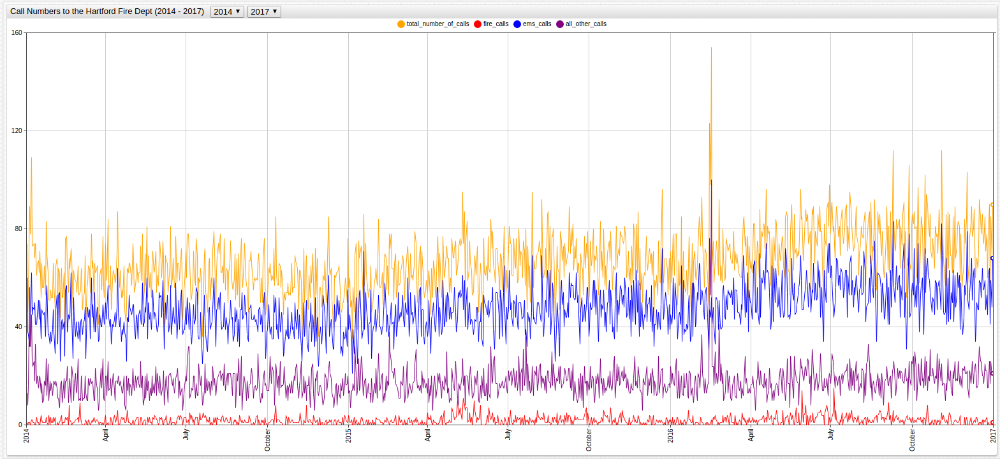
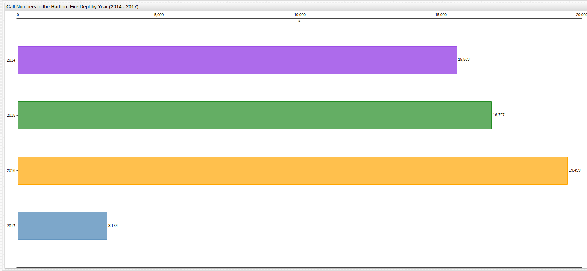
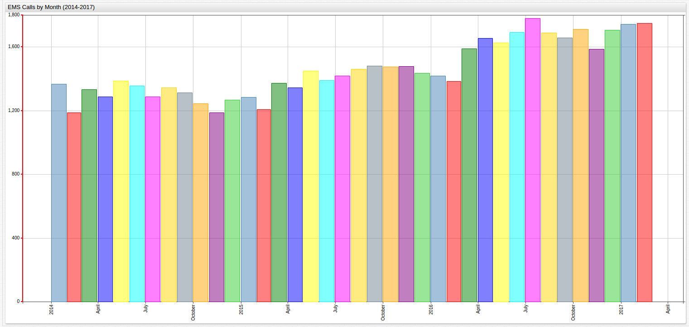
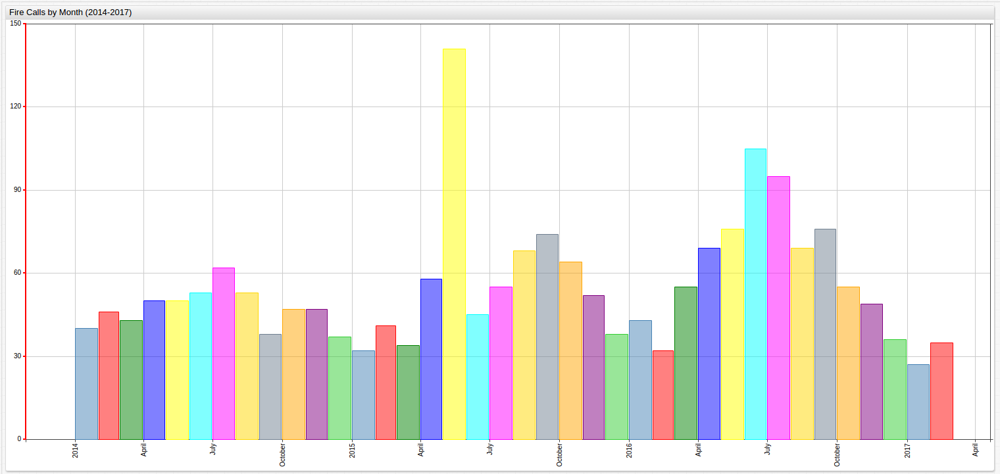
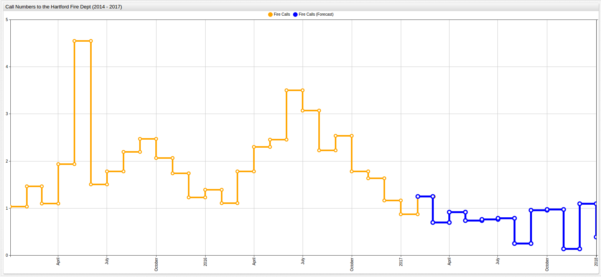

# How to Predict a Fire in Hartford


## Introduction

Time sensitive industries the world over are constantly trying to innovate new ways to maximize their staffing efficiency,
making sure to have the exact number of needed personnel on hand at all times. Too many people incurs unnecessary costs, while too few
guarantees poor output.

Nobody knows this need better then those working in emergency services. Too many people on the clock at once can lay waste to
a fragile operating income, while too few at the wrong time can spell disaster for those in need of emergency services.

## Methodology

Using data from [Axibase Dataset Catalog](https://axibase.com/datasets/socrata/izai-dug8.html) released by the
City of Hartford, call volume to the local fire department can be analyzed and visualized to predict future infrastructural
needs in one of the most vital sectors of the city. The data is divided to indicate whether the call is about a fire incident
or routed to the paramedics' Emergency Services Department, which includes Medical First Response and Emergency Medical Services
(EMS).

The data is parsed and examined to note trends based on the day of the week of calls, monthly and annual figures, and
compared to Year 2017 data to determine whether the volume is on pace with previous years, in decline, or experiencing
growth.

Predicting future personnel and supply needs is a vital step in readiness preparation but making such judgments is impossible
without the needed data, and in the case of emergency services this preparation can literally be the difference between life and death.

## Data

> Visualizations created using [ChartLab](https://apps.axibase.com/)



[](https://apps.axibase.com/chartlab/0af389cf/2/#fullscreen)

From just a glance at the above visualization, it is obvious that the number of calls being placed to the Hartford Fire Department
is on the rise. Unfortunately, this knowledge alone is insufficient to determine the rate at which the number of
calls is increasing, and even less helpful in making predictions about future call volume. Readiness is an essential skill set
for those working in emergency services, and thanks to an increased focus on data tracking, that readiness can be buttressed
by sound data analysis.

Using the SQL Console in ATSD to query the dataset:

### Call Numbers by Year

```sql
SELECT  date_format(time, 'yyyy') AS "Year", sum(value) AS "Total Calls"
  FROM total_number_of_calls
GROUP BY period(1 year)
  ORDER BY 'Year' ASC
```

| Year  | Total Calls |
|-------|-------------|
| 2014  | 22196       |
| 2015  | 23829       |
| 2016  | 27267       |
| 2017* | 4266        |

While undoubtedly important, the annual information here is not scalable to an applicable level. Using yearly increments
of calls cannot provide insight about seasonal increases and decreases, and certainly cannot be used to predict an increase in type
of calls made to the Hartford Fire Department.

> *Year 2017 data is indexed until February 25


[](https://apps.axibase.com/chartlab/0af389cf/6/#fullscreen)

### Call Numbers by Month

```sql
SELECT  date_format(time, 'MM, yyyy') AS "Month, Year", sum(value) AS "Total Calls"
  FROM total_number_of_calls
GROUP BY period(1 month)
  ORDER BY time ASC
```

| Month, Year | Total Calls |
|-------------|-------------|
| 01, 2014    | 2029        |
| 02, 2014    | 1673        |
| 03, 2014    | 1827        |
| 04, 2014    | 1810        |
| 05, 2014    | 1946        |
| 06, 2014    | 1892        |
| 07, 2014    | 1885        |
| 08, 2014    | 1960        |
| 09, 2014    | 1835        |
| 10, 2014    | 1829        |
| 11, 2014    | 1730        |
| 12, 2014    | 1780        |
| 01, 2015    | 1810        |
| 02, 2015    | 1763        |
| 03, 2015    | 1934        |
| 04, 2015    | 1875        |
| 05, 2015    | 2100        |
| 06, 2015    | 1952        |
| 07, 2015    | 2083        |
| 08, 2015    | 2120        |
| 09, 2015    | 2058        |
| 10, 2015    | 2075        |
| 11, 2015    | 2060        |
| 12, 2015    | 1999        |
| 01, 2016    | 1975        |
| 02, 2016    | 2182        |
| 03, 2016    | 2129        |
| 04, 2016    | 2206        |
| 05, 2016    | 2275        |
| 06, 2016    | 2378        |
| 07, 2016    | 2494        |
| 08, 2016    | 2302        |
| 09, 2016    | 2312        |
| 10, 2016    | 2415        |
| 11, 2016    | 2213        |
| 12, 2016    | 2386        |
| 01, 2017    | 2362        |
| 02, 2017    | 1904        |


[](https://apps.axibase.com/chartlab/83d2a616/3/#fullscreen)

While this visualization shows that despite an overall increase in calls to the department has been observed throughout the
entire observation period, recently, the data shows a certain amount of stability and even decline.

### Call Numbers by Day of the Week

Diurnal analysis shows that instances of calls to the Hartford Fire Department remain fairly consistent throughout the week,
and while the highest volume of calls came on Friday, the deviation from the average is quite low. Likewise, the lowest call
volume, which came on Sunday, did not significantly deviate from the average either.

```sql
SELECT  date_format(time, 'E') AS "Day of the Week", sum(value)/1000 AS "Total Calls (Thousand)"
  FROM total_number_of_calls
GROUP BY date_format(time, 'E'), date_format(time, 'u')
  ORDER BY date_format(time, 'u') ASC
```

| Day of the Week | Total Calls (Thousand) |
|-----------------|------------------------|
| Mon             | 33.16                  |
| Tue             | 33.47                  |
| Wed             | 33.41                  |
| Thu             | 33.42                  |
| Fri             | 34.46                  |
| Sat             | 33.37                  |
| Sun             | 31.39                  |


[](https://apps.axibase.com/chartlab/83d2a616/9/#fullscreen)

Open [ChartLab](https://www.axibase.com) with the button above and navigate through time using the drop-down list.

Despite consistent overall call numbers throughout the week, it is interesting to note that the number of fire-related calls
made to the Hartford Fire Department is the highest on Sundays:

```sql
SELECT  date_format(time, 'E') AS "Day of the Week", sum(value) AS "Fire Calls"
  FROM fire_calls
GROUP BY date_format(time, 'E'), date_format(time, 'u')
  ORDER BY date_format(time, 'u') ASC
```

| Day of the Week | Fire Calls |
|-----------------|------------|
| Mon             | 591        |
| Tue             | 564        |
| Wed             | 562        |
| Thu             | 546        |
| Fri             | 600        |
| Sat             | 648        |
| Sun             | 696        |

Additionally, the number of EMS calls is highest on Mondays:

```sql
SELECT  date_format(time, 'E') AS "Day of the Week", sum(value)/1000 AS "EMS Calls (Thousand)"
  FROM ems_calls
GROUP BY date_format(time, 'E'), date_format(time, 'u')
  ORDER BY date_format(time, 'u') ASC
```

| Day of the Week | EMS Calls (Thousand) |
|-----------------|----------------------|
| Mon             | 18.56                |
| Tue             | 15.95                |
| Wed             | 16.05                |
| Thu             | 15.82                |
| Fri             | 16.38                |
| Sat             | 15.33                |
| Sun             | 14.61                |

### EMS Calls by Year

```sql
SELECT  date_format(time, 'yyyy') AS "Year", sum(value) AS "Total Calls"
  FROM ems_calls
GROUP BY period(1 year)
  ORDER BY 'Year' ASC
```

| Year | Total Calls |
|------|-------------|
| 2014 | 15563       |
| 2015 | 16797       |
| 2016 | 19499       |
| 2017 | 3164        |



[](https://apps.axibase.com/chartlab/0af389cf/7/#fullscreen)

### Fire Calls by Year

```sql
SELECT  date_format(time, 'yyyy') AS "Year", sum(value) AS "Total Calls"
  FROM fire_calls
GROUP BY period(1 year)
  ORDER BY 'Year' ASC
```

| Year | Total Calls |
|------|-------------|
| 2014 | 566         |
| 2015 | 702         |
| 2016 | 760         |
| 2017 | 58          |


[](https://apps.axibase.com/chartlab/0af389cf/8/#fullscreen)

### EMS Calls by Month

```sql
SELECT  date_format(time, 'MM, yyyy') AS "Month, Year", sum(value) AS "Total Calls"
  FROM ems_calls
GROUP BY period(1 month)
  ORDER BY time ASC
```

| Month, Year | Total Calls |
|-------------|-------------|
| 01, 2014    | 1367        |
| 02, 2014    | 1188        |
| 03, 2014    | 1332        |
| 04, 2014    | 1288        |
| 05, 2014    | 1387        |
| 06, 2014    | 1357        |
| 07, 2014    | 1287        |
| 08, 2014    | 1344        |
| 09, 2014    | 1313        |
| 10, 2014    | 1245        |
| 11, 2014    | 1188        |
| 12, 2014    | 1267        |
| 01, 2015    | 1285        |
| 02, 2015    | 1207        |
| 03, 2015    | 1374        |
| 04, 2015    | 1344        |
| 05, 2015    | 1451        |
| 06, 2015    | 1391        |
| 07, 2015    | 1419        |
| 08, 2015    | 1460        |
| 09, 2015    | 1480        |
| 10, 2015    | 1474        |
| 11, 2015    | 1477        |
| 12, 2015    | 1435        |
| 01, 2016    | 1418        |
| 02, 2016    | 1385        |
| 03, 2016    | 1590        |
| 04, 2016    | 1656        |
| 05, 2016    | 1625        |
| 06, 2016    | 1691        |
| 07, 2016    | 1781        |
| 08, 2016    | 1690        |
| 09, 2016    | 1658        |
| 10, 2016    | 1713        |
| 11, 2016    | 1587        |
| 12, 2016    | 1705        |
| 01, 2017    | 1744        |
| 02, 2017    | 1420        |



[](https://apps.axibase.com/chartlab/83d2a616/4/#fullscreen)

### Fire Calls by Month

```sql
SELECT  date_format(time, 'MM, yyyy') AS "Month, Year", sum(value) AS "Total Calls"
  FROM fire_calls
GROUP BY period(1 month)
  ORDER BY time ASC
```

| Month, Year | Total Calls |
|-------------|-------------|
| 01, 2014    | 40          |
| 02, 2014    | 46          |
| 03, 2014    | 43          |
| 04, 2014    | 50          |
| 05, 2014    | 50          |
| 06, 2014    | 53          |
| 07, 2014    | 62          |
| 08, 2014    | 53          |
| 09, 2014    | 38          |
| 10, 2014    | 47          |
| 11, 2014    | 47          |
| 12, 2014    | 37          |
| 01, 2015    | 32          |
| 02, 2015    | 41          |
| 03, 2015    | 34          |
| 04, 2015    | 58          |
| 05, 2015    | 141         |
| 06, 2015    | 45          |
| 07, 2015    | 55          |
| 08, 2015    | 68          |
| 09, 2015    | 74          |
| 10, 2015    | 64          |
| 11, 2015    | 52          |
| 12, 2015    | 38          |
| 01, 2016    | 43          |
| 02, 2016    | 32          |
| 03, 2016    | 55          |
| 04, 2016    | 69          |
| 05, 2016    | 76          |
| 06, 2016    | 105         |
| 07, 2016    | 95          |
| 08, 2016    | 69          |
| 09, 2016    | 76          |
| 10, 2016    | 55          |
| 11, 2016    | 49          |
| 12, 2016    | 36          |
| 01, 2017    | 27          |
| 02, 2017    | 31          |



[](https://apps.axibase.com/chartlab/83d2a616/5/#fullscreen)

## Analysis

The percent by year change in number of calls received by the Hartford Fire Department is shown below:

### Previous Year Baseline

| Year | EMS | Fire | Other | Total |
|------|----:|-----:|------:|------:|
| 2015 | +7.33% | +19.37% | +4.15% | +6.85% |
| 2016 | +13.86% | +7.63% | +9.67% | +12.61% |

### First Year Baseline

| Year | EMS | Fire | Other | Total |
|------|----:|-----:|------:|------:|
| 2015 | +7.33% | +19.37% | +4.15% | +6.85% |
| 2016 | +18.59% | +20.19% | +25.52% | +13.43% |

### Average Value Baseline

| Year | EMS | Fire | Other | Total |
|------|----:|-----:|------:|------:|
| Baseline | 17,286 | 676 | 6,468 | 24,430 |
| 2014 | -9.97% | -5.98% | -6.20% | -9.14% |
| 2015 | -2.83% | +3.85% | +2.13% | +2.46% |
| 2016 | +12.8% | +12.42% | +8.35% | +11.61% |

>Based on the first two baseline tables, predicting fire call growth is difficult due to the irregularly large amount of
calls received in 2015, however, when modeling using an average value baseline, consistent 8% annual growth is shown.

### Median Value Baseline

| Year | EMS | Fire | Other | Total |
|------|----:|-----:|------:|------:|
| Baseline | 16,797 | 702 | 6330 | 23,829 |
| 2014 | -7.34% | -19.37% | -4.15% | -6.85% |
| 2015* | 0% | 0% | 0% | 0% |
| 2016 | +16.01% | +8.26% | +10.71% | +14.43% |

>2015 is the median baseline

### Growth Rates

| Baseline | Average Percent Growth Per Year |
|-------|------------------------:|
| Previous Year | +9.73% |
| First Year | +10.14% |
| **Average Value** | +7.34%* |
| Median Value | +7.09%* |

> *Absolute value of percent change is used for percent growth calculations.

## Validation

Since data is already available for the first two months of 2017, but not included in the above calculations, it can be
used as holdout data and used to test the validity of the above models. Likewise, this exercise can be used to demonstrate
the potential scalability of such modeling:

### January (2014-2017)

```sql
SELECT date_format(time, 'MM, yyyy') AS "Month, Year", SUM(value) AS "Total Calls"
  FROM total_number_of_calls WHERE date_format(time, 'MM') = '01'
GROUP BY 'Month, Year'
```

| Month, Year | Total Calls |
|-------------|-------------|
| 01, 2014    | 2029        |
| 01, 2015    | 1810        |
| 01, 2016    | 1975        |
| 01, 2017    | 2362        |

The expected total calls for January 2017 are predicted using each of the models:

| PYB | FYB | AVB* | MVB* |
|----:|----:|----:|----:|
| 2,167 | 2,646 | 2,477 | 2,454 |

> *AVB and MVB values for one month are taken by dividing the year total AVB and MVB by twelve. The average value is 2,036. The median value is 1,986.

Observed Growth Rates:

| Year | Total Calls | PYB | FYB | AVB* | MVB* |
|------|------------:|----:|----:|----:|----:|
| 2014 | 2,029 | +0% | +0% | -0.07% | +1.33% |
| 2015 | 1,810 | -12.01% | -12.01%| -11.45% | -10.60% |
| 2016 | 1,975 | +9.11% | -2.73 % | -3.38% | -1.37% |
| 2017 | 2,362 | +19.60% | +16.41% | +15.56% | +17.98% |

> *The average value is 2,044. The median value is 2,002.

Error Calculations:

| Baseline | Average Percent Growth Per Year | Baseline Error | Model Error | p-value* |
|----------|--------------------------------:|---------------:|------------:|---------:|
| Previous Year | +10.81% | +11.10% | -8.26% | p > 0.20 |
| First Year | +7.78% | -23.27% | +12.02% | p > 0.20 |
| **Average Value** | +7.6% | +3.68% | +4.87% | 0.025 > p > 0.02 |
| Median Value | +7.82% | +10.30% | +3.92% | 0.10 > p > 0.05 |

> *p-value is calculated using the expected versus actual measurements. For these values, there is one degree of freedom.

### February (2014-2017)

```sql
SELECT date_format(time, 'MM, yyyy') AS "Month, Year", SUM(value) AS "Total Calls"
  FROM total_number_of_calls WHERE date_format(time, 'MM') = '02'
GROUP BY 'Month, Year'
```

| Month, Year | Total Calls |
|-------------|-------------|
| 02, 2014    | 1673        |
| 02, 2015    | 1763        |
| 02, 2016    | 2182        |
| 02, 2017    | 1904        |

The expected total calls for February 2017 are predicted using each of the models:

| PYB | FYB | AVB* | MVB* |
|----:|----:|----:|----:|
| 2384 | 1,836 | 2,087 | 2,095 |

Observed Growth Rates:

| Year | Total Calls | PYB | FYB | AVB*  | MVB* |
|------|------------:|----:|----:|----:|----:|
| 2014 | 1,673 | +0% | +0% | -12.43% | -9.63% |
| 2015 | 1,763 | +5.10% | +5.10% | -6.27% | -3.87% |
| 2016 | 2,182 | +27.77% | +30.45% | +16.00% | +18.98% |
| 2017 | 1,904 | -12.74% | +13.81% | +1.22% | +3.82% |

> *The average value is 1,881. The median value is 1,834.

Error Calculations:

| Baseline | Average Percent Growth Per Year | Baseline Error | Model Error | p-value |
|----------|--------------------------------:|---------------:|------------:|--------:|
| Previous Year | +11.40%| +17.16% | +25.21% | p > 0.20 |
| First Year | +15.45% | +52.36% | -3.57% | 0.20 > p > 0.10 |
| **Average Value** | +8.98% | +22.34% | +11.40% | p > 0.20 |
| Median Value | +9.08% | +28.01% | +10.03% | p > 0.20 |

Based on the results of the validation testing, the Average Value Baseline model is alternatively successful and unsuccessful
in predicting the number of calls placed to the Hartford Fire Department; 100% prediction accuracy is almost impossible to achieve
without drastically overfitting the model to the data, which is also undesirable. Here, when the data showed a sub-standard level of consistency to the
trend with a major outlier point (January), the model is effectively able to negotiate the irregularity
and still predict the number of calls placed in the holdout data to within 5%. When the
target variable itself is the outlier (February) the error percentage of this model grew to almost 12%. This shows that the model itself
is unable to predict whether or not the target data point is an outlier or not, and the very definition of an outlier
makes its prediction near impossible.

## Implementation

Continuing to manually input this data for the remaining ten months would be a practice in patience, but the AVB model just effectively demonstrated
above is the same method used to predict future values with the Forecast feature in the [Axibase Time Series Database](https://axibase.com).
The visualizations have been converted to display average monthly values.


[](https://apps.axibase.com/chartlab/0c2f51ef/2/#fullscreen)

> Note the model error here is consistent with the error demonstrated in the [Validation](#validation) section above.

Data Forecasting has the scalability to render predictions for any desired amount of time, in this case, the
numerical predictions in **ChartLab** are given for the day as such they are on the order of `10 x 10^0`.

Below are the anticipated levels of fire-related calls yet-to-be received for the remainder of 2017:



[](https://apps.axibase.com/chartlab/0af389cf/19/#fullscreen)

The forecast feature is able to both effectively predict the increase in fire-related calls the Hartford Fire Department is likely
to receive during the summer and demonstrate its ability to scale to smaller problems.


[](https://apps.axibase.com/chartlab/1ee63842/2/#fullscreen)

Because of the recent trend of increased call volume to the Fire Department Emergency Medical Services Department, a lower
scoring interval is applied to this data set. The scoring interval determines the weight of recent data compared to the entire set.
A lower scoring interval, like that which is used in this case, applies a stronger weight to recent data. The low scoring
interval here is demonstrated by the replication of the patterns seen throughout the year 2016.

> Because the third category of calls placed to the Department is titled "All Other Calls," analysis is not performed
because of the ambiguous nature of such a category. Additional data would be needed, for example, about Fire Department events
or public outreach efforts since likely such a category contains calls of a non-emergency nature.

## Conclusion

This particular data set is extremely responsive to the Average Value Baseline modeling techniques demonstrated above and
the number of calls to be placed to the Hartford Fire Department about its most serious responsibilities modeled to anticipate
the future needs of the department.

Often, such models are extremely case-sensitive and are unable to significantly generalize to either a larger population, or a
different set of data, but the techniques demonstrated above can be applied to a different instance of the same type of data,
or even an entirely different dataset should the need arise.

> Forecast settings used here are contained in the [Resources](./resources/forecastSettingsList.xml) folder. Launch the Forecast feature with the `.xml` file contained there by opening your instance of ATSD and following the path Configuration > Forecasts. At the bottom of the screen click `import` and launch the Forecast feature with the provided `.xml` file. Contact [Axibase](https://axibase.com) with any questions.