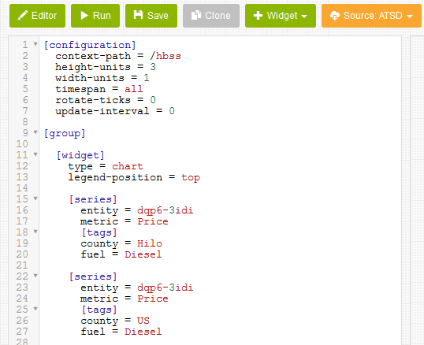
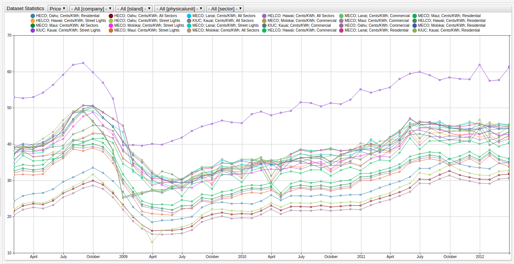

# Pain at the Pump - a Closer Look at Hawaiian High Fuel Prices

## Introduction

Hawaii has some of the most expensive consumer products in the nation. According to [`expatistan.com`](https://www.expatistan.com/cost-of-living/comparison/new-york-city/honolulu),
most Hawaiian good are more expensive than those of New York City:

* 1 liter of whole fat milk: +41%.
* 1 kg (2 lbs) of apples: +68%.
* Bread for 2 people for 1 day: +67%.

In addition to exorbitant food prices, Hawaii also has highest fuel prices in the entire United States, according to [`gasbuddy.com`](https://www.gasbuddy.com/USA). The Aloha State has long had the
dubious honor of the most expensive fuel in the nation but until recently quantifying additional metrics was difficult. To better analyze such data in 2009 the US government established the data aggregation website [`data.gov`](https://www.data.gov/). Datasets are available online to conduct research, develop web applications, and design data visualizations on a variety of topics ranging from agriculture and manufacturing, to health and economics.

These datasets are published in the [Socrata Open Data Format](https://socrata.com/). Socrata is a Seattle-based company that develops software for government agencies to publish and manage their data in an open format. The Socrata Open Data Format is used by the US Federal Government, as well as 25 US states, and more than 300 cities. So far, more than 4,000 government datasets are published in Socrata format.

## Hawaiian Fuel Prices Dataset

This article use data sourced from [`data.gov`](https://www.data.gov/) concerning Hawaiian fuel prices.

From 2006 to 2012, the State of Hawaii compiled AAA fuel prices for each of these fuel types:

**Diesel**, **Gasoline - Regular**, **Gasoline - Midgrade**, **Gasoline - Premium**

In turn, fuel prices are recorded for the following Hawaiian locales:

**Hilo**, **Honolulu**, **Wailuku**, **US**, **State of Hawaii**

> Access the raw dataset on [`data.gov`](http://catalog.data.gov/dataset/aaa-fuel-prices-52bf0).

`data.gov` supports data download in the following formats: CSV, RDF, JSON, and XML. `data.gov` also supports several visualization tools directly from the site: [CartoDB](https://carto.com/) and [plotly](https://plot.ly/) are currently available.

### plotly

This visualization tool supports time series visualization but lacks tools to perform ad hoc data transformations.

These instructions enumerate the process of using plotly to visualize the data.

Open the Hawaii Fuel Prices dataset, and select **plotly** from the **Open With** drop-down list.

Select a **Filter** from the **Data Tools** menu, as shown below.

Open the **Gasoline - Regular** filter and select **choose as x**.

Open the **Group By** option and select **Month_of_Price** for the `x` axis, **County** as `G`, and **Price** for the `y` axis.

Using plotly to analyze datasets from `data.gov` is rendered inefficient due to the number of settings required to create a single visualization. Data in plotly is static and cannot be transformed using group statistics or aggregators.

## Axibase Time Series Database

ATSD supports several collection tools with built-in heuristics to handle `data.gov` and other Socrata datasets. The [Axibase Collector](https://axibase.com/docs/axibase-collector/) uses Socrata metadata to interpret the meaning of columns and extract dates, times, and categories from data files.

ATSD stores the data in a local database instance. As such open source and other public data can be combined with private, institutional, or other internal data
sources.

ATSD does not require you to design database table schema, provision an application server, or write parsing programs to import new data.

Configure a scheduled [job](https://axibase.com/docs/axibase-collector/#jobs) to retrieve data from a specified endpoint import the data into ATSD according to [pre-defined rules](https://axibase.com/docs/atsd/rule-engine/). Once the data is stored in ATSD, creating and sharing reports and creating interactive visualizations with built-in widgets is trivial. Reports are continuously updated with the flow of incoming data.

The plotly visualization above is replicated in **ChartLab** below. **ChartLab** is a visualizaton application that relies on data processing and stored from ATSD.

Sort the dataset by location or fuel type and easily navigate through the entire dataset using [`[dropdown]`](https://axibase.com/products/axibase-time-series-database/visualization/widgets/dropdown/) settings to create variable data inputs.

### Hilo Fuel Prices (All Fuel Types)

### Diesel Fuel Prices (All Locations)

## Creating Custom Portals

Create custom portals using the example portal above as a template. Change or display particular aspects of the dataset as needed. **ChartLab** supports complete visualization customization.

### Recreate Hilo Fuel Prices Visualization

1. Open the Fuel Portal above.
1. Define the `county` and `fuel` tags. Use **Hilo** for county and [wildcard](https://axibase.com/products/axibase-time-series-database/visualization/widgets/wildcards/) `*` for fuel to select all types.
1. Click **Run** to render the visualization.

### Diesel [Histogram](https://axibase.com/products/axibase-time-series-database/visualization/widgets/histogram-chart/)

1. In the **Editor Window** define the `county` and `fuel` tags as `Hilo` and `diesel` respectively.
1. To calculate the difference between Hilo and mainland diesel prices, create a second series. Define the `county` tag as `US`.

  

Create a derived series to calculate the difference between local and mainland prices:

1. In the `Hilo` series, define an alias `alias = s1`. In the `US` series, define a second alias `alias = s2`. Hide both series using a `display=false` setting.
1. Define a new series with `label = Hilo over US Diesel Surcharges` setting included. Use the expression `value = value('s1') - value('s2')` to calculate the desired metric.

Make additional optional changes to fine tune the visualization:

* Modify the range of the visualization with `min-range = 0` setting.
* Change the type of visualization rendered with `mode = column` setting.
* Define custom colors with `color = red` setting.
* Under `[configuration]` scale the visualization with `height-units = 2` or `width-settings 2`.

> Read [Charts Documentation](https://axibase.com/products/axibase-time-series-database/visualization/widgets/time-chart/) for an exhaustive list of available settings.

### Combining Datasets

Exploring the complete dataset for fuel prices, Wailuku is more expensive for any fuel type than Hilo and Honolulu. Are products generally more expensive in Wailuku than the other islands, or is fuel an anomaly? One way to investigate further is to investigate a second dataset tracking consumer products in Hawaii.

On `data.gov`, locate the [Hawaii Electricity Prices](https://catalog.data.gov/dataset/hi-electricity-prices-815fa) dataset.

From 2008 to 2012, the State of Hawaii collected electricity prices (in cents/kwh) for each of the Hawaiian islands:

**Hawaii**, **Kauai**, **Lanai**, **Maui**, **Molokai**, **Oahu**

The electricity metric is tracked by sector:

**All Sectors**, **Commercial**, **Residential**, **Street Lights**

The geographic tags for the gasoline and electricity datasets are different: the former is county-based while the latter is island-based. Regions with data for both metrics are highlighted below:

Compare Diesel prices in Honolulu, Wailuku, and Hilo with residential electricity rates on their corresponding islands (Oahu, Maui, Hawaii).

> For more information about generating custom portals, see the [Charts Documentation](https://axibase.com/products/axibase-time-series-database/visualization/widgets/time-chart/).

### Additional Datasets

|State|data.gov dataset|Axibase Portal|
|-----------|-----------------------|-----------------------|
|Illinois |[Abortion Demographics, 1995-2012](http://catalog.data.gov/dataset/abortion-demographics-1995-2012-8f496)|[Portal](https://apps.axibase.com/chartlab/55eb27ce)|
|Maryland |[Anne Arundel County Crime Rate By Type](http://catalog.data.gov/dataset/anne-arundel-county-crime-rate-by-type-e5923)|[Portal](https://apps.axibase.com/chartlab/a85c4f60)|
|New York |[Automobiles Annual Imports and Exports Through Port Authority of NY NJ Maritime Terminals: Beginning 2000](http://catalog.data.gov/dataset/automobiles-annual-imports-and-exports-through-port-authority-of-ny-nj-maritime-terminals-)|[Portal](https://apps.axibase.com/chartlab/c041c40b)|
|Maryland |[Employment Figures](http://catalog.data.gov/dataset/employment-figures-f55ae)|[Portal](https://apps.axibase.com/chartlab/fc75db9b)|
|New York |[Solar Photovoltaic (PV) Incentive Program Completed Projects by City and Contractor: Beginning 2010](http://catalog.data.gov/dataset/solar-photovoltaic-pv-incentive-program-completed-projects-by-city-and-contractor-beginnin)|[Portal](https://apps.axibase.com/chartlab/a4936180)|
|Hawaii |[Solid Waste Recycled (in tons)](http://catalog.data.gov/dataset/table-17-solid-waste-recycled-in-tons-851c9)|[Portal](https://apps.axibase.com/chartlab/48b1d9b2)|
|Iowa |[Math And Reading Proficiency by School Year, Public School District and Grade Level](http://catalog.data.gov/dataset/math-and-reading-proficiency-by-school-year-public-school-district-and-grade-level)|[Portal](https://apps.axibase.com/chartlab/bc9ba2d9)|
|Connecticut|[Sales and Use Tax per Town by NAICS (2013 and 2014)](http://catalog.data.gov/dataset/sales-and-use-tax-per-town-by-naics-2013-and-2014)|[Portal](https://apps.axibase.com/chartlab/6be07c75)|
|Maryland |[Per Capita Electricity Consumption](http://catalog.data.gov/dataset/per-capita-electricity-consumption-7b888)|[Portal](https://apps.axibase.com/chartlab/db5aa772)|
|Maryland |[MVA Vehicle Sales Counts by Month for CY 2002-2015](http://catalog.data.gov/dataset/mva-vehicle-sales-counts-by-month-for-cy-2002-2015)|[Portal](https://apps.axibase.com/chartlab/f2083bc9)|
|Connecticut|[DAS HR Almanac - Executive Branch Employment By Race](http://catalog.data.gov/dataset/das-hr-almanac-executive-branch-employment-by-race)|[Portal](https://apps.axibase.com/chartlab/88942f63)|
|New York |[Scholarship Recipients and Dollars by Sector Group: Beginning 2009](http://catalog.data.gov/dataset/scholarship-recipients-and-dollars-by-sector-group-beginning-2009)|[Portal](https://apps.axibase.com/chartlab/9026c3d7)|
|New York |[Public Assistance and SNAP Fraud Prevention Performance Measures: Beginning 2013](http://catalog.data.gov/dataset/public-assistance-and-snap-fraud-prevention-performance-measures-beginning-2013)|[Portal](https://apps.axibase.com/chartlab/0e4a225d)|
|Maryland |[Maryland Veterans Unemployment Rate](http://catalog.data.gov/dataset/maryland-veterans-unemployment-rate-3ea61)|[Portal](https://apps.axibase.com/chartlab/61e23fa5)|
|Maryland |[Trips Taken on Public Transit by Transit Type - Monthly Total Trips](http://catalog.data.gov/dataset/trips-taken-on-public-transit-by-transit-type-4abd1)|[Portal](https://apps.axibase.com/chartlab/fd596ed9)|
|Iowa |[Employee Compensation by Industry in Iowa](http://catalog.data.gov/dataset/employee-compensation-by-industry-in-iowa)|[Portal](https://apps.axibase.com/chartlab/f5eae012)|

### Action Items

1. [Install ATSD](https://axibase.com/docs/atsd/installation/) on a virtual machine or in a Linux container.
2. [Install Axibase Collector](https://axibase.com/docs/axibase-collector/#installation) and configure Collector to write data into your ATSD instance.
3. Upload the [Job](./hawaii_gas_prices.xml) file to Axibase Collector.
4. Import the desired `data.gov` datasets to enable data collection.
5. Log in to ATSD and open a sample Socrata portal to explore the data.