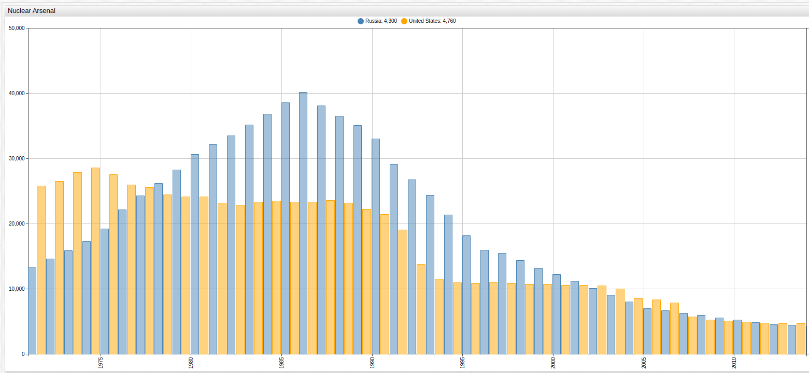
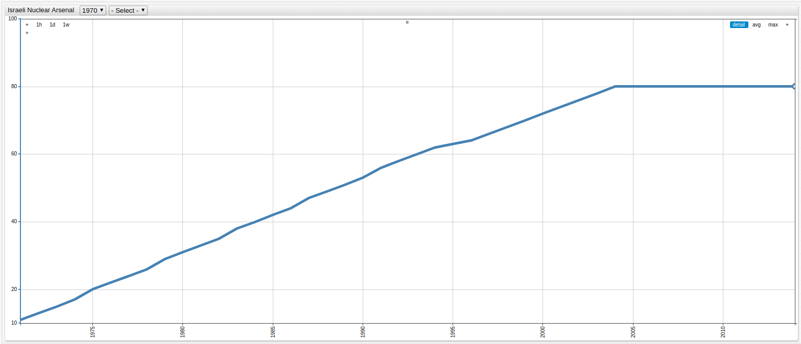

# The New Face of Nuclear Proliferation

## Introduction

Since taking effect in 1970, the [Non-Proliferation Treaty](https://www.iaea.org/publications/documents/infcircs/treaty-non-proliferation-nuclear-weapons)
(NPT) has required that the foremost nuclear powers of the world take dramatic steps to reduce their inventory of atomic bombs and has
sought to prevent the spread of weaponized nuclear technology to countries who lack it. Signed as the Cold War began to reach its peak in 1968,
less than a decade after the Cuban Missile Crisis but almost twenty years before the fall of the Berlin Wall, the NPT has
served an important role in international cooperation over the last 47 years.

## Cold War Rivals Lead De-escalation

The NPT was primarily targeted at combating the military principal of mutually assured destruction (MAD). The logic behind MAD is straight
forward: in a military conflict involving two nuclear powers, should open warfare break out, the inevitable use of nuclear weapons by both
sides would result in the destruction of all belligerents, and possibly the entire world. In fact, regional detonation of
roughly [100 modern nuclear weapons](https://www.globalzero.org/blog/how-many-nukes-would-it-take-render-earth-uninhabitable),
a literal fraction of the estimated 15,000 nuclear weapons currently in operation, anywhere on the plant would render the earth
uninhabitable and likely destroy the o-zone layer holding the atmosphere in place.

The Russian Federation and United States of America control the overwhelming majority of nuclear weaponry in existence today,
shown below using [data](https://ourworldindata.org/nuclear-weapons/) from a 2016 study.

> Open the ChartLab visualization above and use the drop-down list to navigate through time and observe the changing inventories
of nuclear weapons among observed nations.

Despite this however, the former Cold War rivals have also been the most proactive about self-disarmament and as permanent
members of the [United Nations Security Council](https://www.un.org/en/sc/members/), have lead the world away from the atomic brink.
The visualization here traces the number of nuclear weapons held by the Russian Federation or Soviet Union and the United States over
the last fifty years.

> Open the ChartLab visualization above and navigate through time using the drop-down menu to change to change the observation period.

## New Players

Despite international efforts to reduce the nuclear arsenal and imminent danger of nuclear attack, the NPT has proven to be
ineffective on a number of fronts. Most conspicuous among post-treaty nuclear powers, Israel maintains an international position of
ambiguity although it is almost universally accepted that they have nuclear capabilities after the [Apollo Affair](https://nsarchive.gwu.edu/nukevault/ebb565-Was-U.S.-Nuclear-Weapons-Fuel-Diverted-to-Israel/),
which saw an estimated 300 kilograms of enriched uranium disappear, allegedly having been transported illegally to Israel.

The following visualization roughly estimates the expansion of the Israeli nuclear program over the last decades using [data](https://thebulletin.org/nuclear-notebook-multimedia)
sourced from the [Bulletin of the Atomic Scientists](https://thebulletin.org/), a nuclear think tank formed by the members
of the Manhattan Project, who created the original atomic bomb used to force Japanese surrender after German defeat in
World War Two.

> Open the ChartLab visualization to toggle between nations and navigate through time using the drop-down lists.

Additionally, neighbors and on-again off-again rivals India and Pakistan maintain a contested border that has triggered armed
military engagements as recently as 2016. Their nuclear arsenals are detailed below:

## Conclusions

The Non-Proliferation Treaty was designed to prevent the spread of nuclear capabilities to countries who lacked it at the time
of the signing. Despite this, since 1970 a number of countries have "gotten the bomb," as it is casually referred to. Among them
conflicting neighbors India, Pakistan, and contentious Middle Eastern power Israel. Conspicuously missing from the BotAS data
is current headline maker North Korea, who has been executing a series of increasingly common nuclear tests.