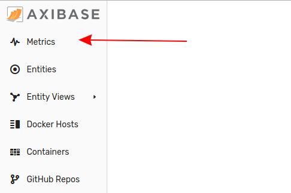
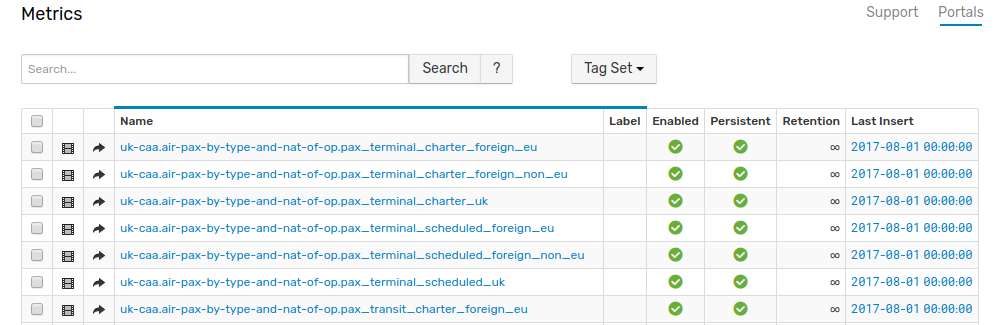

# Analyzing UK Aviation Statistics using CAA Datasets


## Introduction

Are airports more and more crowded every year?

What are the busiest airports in the United Kingdom?

How often are airplanes delayed?

To answer questions like these, the Civil Aviation Authority (CAA) serves as an independent data specialist for the British government. Established in 1972, the CAA collects and reports on key aviation metrics which quantify various activities at UK airports. According to the official [CAA website](https://www.caa.co.uk/Data-and-analysis/UK-aviation-market/Airports/Datasets/UK-Airport-data/Airport-data-2016-06/), data is collected for more than 60 UK airports. Data is collected on a variety of topics:

* International passenger traffic to and from British airports.
* Terminal passenger totals at various UK airports.
* International and domestic mail shipped to and from UK airports (tons).

## CAA Raw Datasets

CAA maintains monthly data from 1973 available in CSV and PDF format. These datasets contain raw data and as such lack any kind of analytics, figures, or graphs. View the [raw data](https://www.caa.co.uk/Data-and-analysis/UK-aviation-market/Airports/Datasets/UK-airport-data/) at `caa.co.uk`.


## CAA Aviation Trends

CAA aviation trends are published quarterly. These reports date back to 2008 and are published in PDF format. General information is included along with these detailed reports to contextualize the data. Graphs and tables tracking year-on-year growth rates are often included. These [reports and analytics](https://www.caa.co.uk/Data-and-analysis/UK-aviation-market/Airports/Aviation-Trends/) are also available at `caa.co.uk`

The table shown below is excerpted from the 2008 report [`AviationTrends_2008_Q4`](https://www.caa.co.uk/uploadedFiles/CAA/Content/Standard_Content/Data_and_analysis/Analysis_reports/Aviation_trends/AviationTrends_2008_Q4.pdf). Terminal passengers are defined as "those travelers who board or disembark an aircraft on a commercial flight at a reporting UK airport."

The data tracks scheduled and chartered flights in London and other regional airports.


These reports also track destinations.


From the report: "Passenger numbers to all destination groups fell in quarter 4 2008, by around 8%, except for passengers numbers to the **Rest of the World** destination group, which fell by considerably less."

## Axibase Time Series Database

Loading this data into a database that supports data transformation and visualization, encourages users to more meaningfully interact with the information. ATSD supports dynamic [CSV parsing](https://axibase.com/docs/atsd/parsers/csv/#schema-based-parsing), to handle irregular datasets and because data is stored locally, you can combine open-source data with private or institutional data to enhance an analysis.

ATSD does not require you to design database table schema, provision an application server, or write parsing programs to import new data.

Configure a scheduled [job](https://axibase.com/docs/axibase-collector/#jobs) to retrieve data from a specified endpoint import the data into ATSD according to [pre-defined rules](https://axibase.com/docs/atsd/rule-engine/). Once the data is stored in ATSD, creating and sharing reports and creating interactive visualizations with built-in widgets is trivial. Reports are continuously updated with the flow of incoming data.


Explore the CAA dataset in the portal below. Filter data using the three drop-down lists along the top of the visualization:

* **CAA Metric**: Airport aviation metrics. See the complete list in the [Appendix](#appendix-caa-metric-list).
* **Airport**: Navigate between all tracked UK airports.
* **Regional Groups**: CAA additionally groups airports based on geographical location.

### Total Passengers


### Total Cargo


## Creating Custom Portals

Create additional portals using the example as a template. **ChartLab** supports complete customization for all visualizations. See the [Charts Documentation](https://axibase.com/products/axibase-time-series-database/visualization/widgets/) for complete instructions.

### Year-On-Year Domestic Traffic

1. Modify the configuration as shown in the image below.

    

1. Select the desired `metric`. The first drop-down list in **ChartLab** only contains the shortened version of the metric names. This text file which contains the full raw metric names: [uk-caa-metrics.txt](uk-caa-metrics.txt).

    

    Metric information is also available in the ARSD web interface on the **Metrics** page.

    

1. Enter `uk-caa` in the **Search Bar** along the top menu.

    

1. A list of matching metrics is visible. The desired metric for this visualization is `uk-caa.air-pax-by-type-and-nat-of-op.pax_terminal_scheduled_uk`.

    

1. Modify the `metric` setting to designate the `air-pax-by-type` metric.
1. Use the settings `starttime = current_year` and `endtime = next_year` to define the timespan.
1. For total domestic travel, enter `group-statistic = sum` and change mode from `column-stack` to `column`. The `group-statistic = sum` command calculates the total number of passengers for all airports in a given month, and the `column` shows the total number of passengers together as one column per month.

    

1. To track total domestic value select all airport and group names.  Create a new `[tags]` configuration group under `[widget]` and enter `airport_name = *` and `group_name = *` (Asterisk `*` is one of the supported [wildcard](https://axibase.com/products/axibase-time-series-database/visualization/widgets/wildcards/) symbols in the Charts API).
1. To display data for 2016, create a new `[series]` and enter `label = current year`.
1. To display data for 2015, create a new `[series]` and enter `label = previous year`. Enter `time-offset = 1 year` and `color = orange`. The `time-offset = 1 year` command shifts historical data by the specific lag to the current time. In this case, data for the year 2015 is displayed as data for 2016.

    

1. Press **Run** to render the visualization.

    

[](https://apps.axibase.com/chartlab/cca64be9)

### [Calendar Chart](https://axibase.com/products/axibase-time-series-database/visualization/widgets/calendar-chart-widget/)

1. Open a [blank](https://apps.axibase.com/chartlab) **ChartLab** instance.
1. Set **Data Source** to **ATSD** and select **calendar** from the **Widget** drop-down list.
1. Delete the section of the configuration as shown in the image below.

    

1. Define the entity as `uk-caa` and `metric` as `uk-caa.eu-and-other-intl-passenger-traffic.total_pax_eu_last_period`.
1. To display international passenger figures for all available UK airports, create a **[tags]** level configuration. Under the heading, select all airports using the wildcard setting `airport_name = *`.
1. Under the `[configuration]` heading, define `timezone = UTC`.
1. Under the `[widget]` heading, delete `timespan = 3 hour`.
1. To define a new timespan, enter `starttime = 2015-01-01T00:00:00z` and `endtime = current_month`.
1. Modify the `summarize-period` setting to `1 month`.
1. Use the `label-format = tags.airport_name` setting to assign label names based on metadata information stored by ATSD in the underlying data.

    

1. Press **Run** to generate the visualization.


[](https://apps.axibase.com/chartlab/8dc941e3)

This configuration defines a month-to-month breakdown of international passenger traffic from all tracked UK airports. Use the calendar widget to gain an understanding of the general trends of a dataset. In 2015 the most popular travel season is May to October based on the visualization.

Observe outliers in Shoreham and Oxford (Kidlington) for the months of January and February, respectively, as shown in the figure below.


Additionally, observe outliers for Scatsta and Wick John O Groats for the high travel months of May to October, as can be seen in the figure below.


Use `[widget]` level settings to modify the nature of the visualization without affecting the underlying data.

1. Under the `[widget]` heading, change the `type` setting from `calendar` to `pie` and define additional settings: `summarize-period = 1 month` and `color-range = blue`.
1. Change `starttime = 2015-01-01T00:00:00Z` to `starttime = current year`.
1. Apply a limit settings using a `display` parameter: `display = value > top(15)` limits the visualization to contain on the top 15 results.
1. To show a legend with the figure, enter `legend-position = top`.
1. To display numeric values with the figure, enter `series-labels = connected`.
1. Pie charts in ChartLab support several visualization modes, for example: `mode = ring`.
1. Press **Run**.


[](https://apps.axibase.com/chartlab/1f9f05a1/4)

### Passenger Traffic Distribution

To show passenger traffic distribution between different UK airports for a given time period use the [Graph Widget](https://axibase.com/products/axibase-time-series-database/visualization/widgets/graph-widget/). This visualization tracks a base airport in relation to all associated destination airports, connected by flight path lines going from the base airport to airport `x`, and from airport `x` back to the base airport.

In the example below, Heathrow is used as the base airport in relation to available flight paths to airports across the UK for May 2016. The heavier the flight paths, the greater the traffic between the two associated airports. The CAA dataset for this figure can be found on [`caa.co.uk`](https://www.caa.co.uk/uploadedFiles/CAA/Content/Standard_Content/Data_and_analysis/Datasets/Airport_stats/Airport_data_2016_05/Table_12_3_Dom_Air_Pax_Route_Analysis_by_Each_Reporting_Airport_PDF.pdf).


The connections between Heathrow and Edinburgh are darker, which indicates heavier traffic. The total passengers in May 2016 from Heathrow to Edinburgh is 95,569, and 92,342 for the opposite trip from Edinburgh to Heathrow. 48,566 passengers traveled from Heathrow to Aberdeen, and 48,577 passengers made the opposite journey from Aberdeen to Heathrow.

> Notice that there is no passenger traffic from several airports, including Coventry Shoreham, Prestwick, Exeter, and Humberside.

Select a different base airport by modifying the configuration. Modify the variable `var baseAirport` setting from `HEATHROW` to any tracked airport.


Using `MANCHESTER` as the argument for the `var baseAirport` variable.


[](https://apps.axibase.com/chartlab/e6822a69/5/)

## Action Items

1. [Install ATSD](https://axibase.com/docs/atsd/installation/) on a virtual machine or Linux container.
2. [Install Axibase Collector](https://axibase.com/docs/axibase-collector/#installation) and configure Collector to write data into your ATSD instance.
3. Import [`csv-configs.xml`](csv-configs.xml) into Axibase Collector.
4. Import [`jobs.xml`](jobs.xml) into Axibase Collector.
5. Read the [ChartLab Tutorial](../../tutorials/shared/chartlab.md) to get started.

## Appendix: CAA Metric List

```txt
uk-caa.air-pax-by-type-and-nat-of-op.pax_terminal_scheduled_uk <br />
uk-caa.air-pax-by-type-and-nat-of-op.pax_terminal_charter_foreign_eu <br />
uk-caa.air-pax-by-type-and-nat-of-op.pax_terminal_charter_foreign_non_eu <br />
uk-caa.air-pax-by-type-and-nat-of-op.pax_terminal_charter_uk <br />
uk-caa.air-pax-by-type-and-nat-of-op.pax_terminal_scheduled_foreign_eu <br />
uk-caa.air-pax-by-type-and-nat-of-op.pax_terminal_scheduled_foreign_non_eu <br />
uk-caa.air-pax-by-type-and-nat-of-op.pax_terminal_scheduled_uk <br />
uk-caa.air-pax-by-type-and-nat-of-op.pax_transit_charter_foreign_eu <br />
uk-caa.air-pax-by-type-and-nat-of-op.pax_transit_charter_foreign_non_eu <br />
uk-caa.air-pax-by-type-and-nat-of-op.pax_transit_charter_uk <br />
uk-caa.air-pax-by-type-and-nat-of-op.pax_transit_scheduled_foreign_eu <br />
uk-caa.air-pax-by-type-and-nat-of-op.pax_transit_scheduled_foreign_non_eu <br />
uk-caa.air-pax-by-type-and-nat-of-op.pax_transit_scheduled_uk<br />
uk-caa.air-pax-by-type-and-nat-of-op.total_pax<br />
uk-caa.air-transport-\s-comparison.atms_cargo_aircraft_last_period<br />
uk-caa.air-transport-movements-comparison.atms_cargo_aircraft_percent<br />
uk-caa.air-transport-movements-comparison.atms_cargo_aircraft_this_period<br />
uk-caa.air-transport-movements-comparison.atms_passenger_aircraft_last_period<br />
uk-caa.air-transport-movements-comparison.atms_passenger_aircraft_percent<br />
uk-caa.air-transport-movements-comparison.atms_passenger_aircraft_this_period<br />
uk-caa.air-transport-movements-comparison.total_atms_last_period<br />
uk-caa.air-transport-movements-comparison.total_atms_percent<br />
uk-caa.air-transport-movements-comparison.total_atms_this_period<br />
uk-caa.air-transport-movements-vs-prev-year.atms_cargo_aircraft_last_period<br />
uk-caa.air-transport-movements-vs-prev-year.atms_cargo_aircraft_percent<br />
uk-caa.air-transport-movements-vs-prev-year.atms_cargo_aircraft_this_period<br />
uk-caa.air-transport-movements-vs-prev-year.atms_passenger_aircraft_last_period<br />
uk-caa.air-transport-movements-vs-prev-year.atms_passenger_aircraft_percent<br />
uk-caa.air-transport-movements-vs-prev-year.atms_passenger_aircraft_this_period<br />
uk-caa.air-transport-movements-vs-prev-year.total_atms_last_period<br />
uk-caa.air-transport-movements-vs-prev-year.total_atms_percent<br />
uk-caa.air-transport-movements-vs-prev-year.total_atms_this_period<br />
uk-caa.air-transport-movements.charter_all_domestic_atm<br />
uk-caa.air-transport-movements.charter_all_eu_international_atm<br />
uk-caa.air-transport-movements.charter_all_non_eu_international_atm<br />
uk-caa.air-transport-movements.charter_eu_international_passenger_atm<br />
uk-caa.air-transport-movements.charter_passenger_domestic_atm<br />
uk-caa.air-transport-movements.charter_passenger_non_eu_international_atm<br />
uk-caa.air-transport-movements.scheduled_all_domestic_atm<br />
uk-caa.air-transport-movements.scheduled_all_eu_international_atm<br />
uk-caa.air-transport-movements.scheduled_all_non_eu_international_atm<br />
uk-caa.air-transport-movements.scheduled_passenger_domestic_atm<br />
uk-caa.air-transport-movements.scheduled_passenger_eu_international_atm<br />
uk-caa.air-transport-movements.scheduled_passenger_non_eu_international_atm<br />
uk-caa.air-transport-movements.total_domestic_atm<br />
uk-caa.air-transport-movements.total_eu_atm<br />
uk-caa.air-transport-movements.total_non_eu_international_atm<br />
uk-caa.aircraft-movements.aero_club<br />
uk-caa.aircraft-movements.air_taxi<br />
uk-caa.aircraft-movements.air_transport<br />
uk-caa.aircraft-movements.business_aviation<br />
uk-caa.aircraft-movements.grand_total<br />
uk-caa.aircraft-movements.local_movements<br />
uk-caa.aircraft-movements.military<br />
uk-caa.aircraft-movements.official<br />
uk-caa.aircraft-movements.other_flights<br />
uk-caa.aircraft-movements.positioning_flights<br />
uk-caa.aircraft-movements.private_flights<br />
uk-caa.aircraft-movements.test_and_training<br />
uk-caa.aircraft-movementsaero_club<br />
uk-caa.aircraft-movementsair_taxi<br />
uk-caa.aircraft-movementsair_transport<br />
uk-caa.aircraft-movementsbusiness_aviation<br />
uk-caa.aircraft-movementsgrand_total<br />
uk-caa.aircraft-movementslocal_movements<br />
uk-caa.aircraft-movementsmilitary<br />
uk-caa.aircraft-movementsofficial<br />
uk-caa.aircraft-movementsother_flights<br />
uk-caa.aircraft-movementspositioning_flights<br />
uk-caa.aircraft-movementsprivate_flights<br />
uk-caa.aircraft-movementstest_and_training<br />
uk-caa.airport-landings-diverted.num_flights_day_1<br />
uk-caa.airport-landings-diverted.num_flights_day_10<br />
uk-caa.airport-landings-diverted.num_flights_day_11<br />
uk-caa.airport-landings-diverted.num_flights_day_12<br />
uk-caa.airport-landings-diverted.num_flights_day_13<br />
uk-caa.airport-landings-diverted.num_flights_day_14<br />
uk-caa.airport-landings-diverted.num_flights_day_15<br />
uk-caa.airport-landings-diverted.num_flights_day_16<br />
uk-caa.airport-landings-diverted.num_flights_day_17<br />
uk-caa.airport-landings-diverted.num_flights_day_18<br />
uk-caa.airport-landings-diverted.num_flights_day_19<br />
uk-caa.airport-landings-diverted.num_flights_day_2<br />
uk-caa.airport-landings-diverted.num_flights_day_20<br />
uk-caa.airport-landings-diverted.num_flights_day_21<br />
uk-caa.airport-landings-diverted.num_flights_day_22<br />
uk-caa.airport-landings-diverted.num_flights_day_23<br />
uk-caa.airport-landings-diverted.num_flights_day_24<br />
uk-caa.airport-landings-diverted.num_flights_day_25<br />
uk-caa.airport-landings-diverted.num_flights_day_26<br />
uk-caa.airport-landings-diverted.num_flights_day_27<br />
uk-caa.airport-landings-diverted.num_flights_day_28<br />
uk-caa.airport-landings-diverted.num_flights_day_29<br />
uk-caa.airport-landings-diverted.num_flights_day_3<br />
uk-caa.airport-landings-diverted.num_flights_day_30<br />
uk-caa.airport-landings-diverted.num_flights_day_31<br />
uk-caa.airport-landings-diverted.num_flights_day_4<br />
uk-caa.airport-landings-diverted.num_flights_day_5<br />
uk-caa.airport-landings-diverted.num_flights_day_6<br />
uk-caa.airport-landings-diverted.num_flights_day_7<br />
uk-caa.airport-landings-diverted.num_flights_day_8<br />
uk-caa.airport-landings-diverted.num_flights_day_9<br />
uk-caa.airport-landings-diverted.total_flights<br />
uk-caa.domestic-air-pax-route-analysis-by-airport.total_pax_charter_last_period<br />
uk-caa.domestic-air-pax-route-analysis-by-airport.total_pax_charter_this_period<br />
uk-caa.domestic-air-pax-route-analysis-by-airport.total_pax_last_period<br />
uk-caa.domestic-air-pax-route-analysis-by-airport.total_pax_percent<br />
uk-caa.domestic-air-pax-route-analysis-by-airport.total_pax_scheduled_last_period<br />
uk-caa.domestic-air-pax-route-analysis-by-airport.total_pax_scheduled_this_period<br />
uk-caa.domestic-air-pax-route-analysis-by-airport.total_pax_this_period<br />
uk-caa.domestic-air-pax-route-analysis-by-each-reporting-airport.total_pax_charter_last_period<br />
uk-caa.domestic-air-pax-route-analysis-by-each-reporting-airport.total_pax_charter_this_period<br />
uk-caa.domestic-air-pax-route-analysis-by-each-reporting-airport.total_pax_last_period<br />
uk-caa.domestic-air-pax-route-analysis-by-each-reporting-airport.total_pax_percent<br />
uk-caa.domestic-air-pax-route-analysis-by-each-reporting-airport.total_pax_scheduled_last_period<br />
uk-caa.domestic-air-pax-route-analysis-by-each-reporting-airport.total_pax_scheduled_this_period<br />
uk-caa.domestic-air-pax-route-analysis-by-each-reporting-airport.total_pax_this_period<br />
uk-caa.domestic-terminal-passenger-traffic.total_pax_charter_last_period<br />
uk-caa.domestic-terminal-passenger-traffic.total_pax_charter_this_period<br />
uk-caa.domestic-terminal-passenger-traffic.total_pax_last_period<br />
uk-caa.domestic-terminal-passenger-traffic.total_pax_percent<br />
uk-caa.domestic-terminal-passenger-traffic.total_pax_scheduled_last_period<br />
uk-caa.domestic-terminal-passenger-traffic.total_pax_scheduled_this_period<br />
uk-caa.domestic-terminal-passenger-traffic.total_pax_this_period<br />
uk-caa.domestic-terminal-pax-traffic.total_pax_charter_this_period<br />
uk-caa.domestic-terminal-pax-traffic.total_pax_last_period<br />
uk-caa.domestic-terminal-pax-traffic.total_pax_percent<br />
uk-caa.domestic-terminal-pax-traffic.total_pax_scheduled_this_period<br />
uk-caa.domestic-terminal-pax-traffic.total_pax_this_period<br />
uk-caa.eu-and-other-intl-passenger-traffic.total_pax_eu_charter_this_period<br />
uk-caa.eu-and-other-intl-passenger-traffic.total_pax_eu_cht_tp<br />
uk-caa.eu-and-other-intl-passenger-traffic.total_pax_eu_last_period<br />
uk-caa.eu-and-other-intl-passenger-traffic.total_pax_eu_lp<br />
uk-caa.eu-and-other-intl-passenger-traffic.total_pax_eu_pc<br />
uk-caa.eu-and-other-intl-passenger-traffic.total_pax_eu_percent<br />
uk-caa.eu-and-other-intl-passenger-traffic.total_pax_eu_scheduled_this_period<br />
uk-caa.eu-and-other-intl-passenger-traffic.total_pax_eu_shd_tp<br />
uk-caa.eu-and-other-intl-passenger-traffic.total_pax_eu_this_period<br />
uk-caa.eu-and-other-intl-passenger-traffic.total_pax_eu_tp<br />
uk-caa.eu-and-other-intl-passenger-traffic.total_pax_oi_cht_tp<br />
uk-caa.eu-and-other-intl-passenger-traffic.total_pax_oi_lp<br />
uk-caa.eu-and-other-intl-passenger-traffic.total_pax_oi_pc<br />
uk-caa.eu-and-other-intl-passenger-traffic.total_pax_oi_shd_tp<br />
uk-caa.eu-and-other-intl-passenger-traffic.total_pax_oi_tp<br />
uk-caa.eu-and-other-intl-passenger-traffic.total_pax_other_international_charter_this_period<br />
uk-caa.eu-and-other-intl-passenger-traffic.total_pax_other_international_last_period<br />
uk-caa.eu-and-other-intl-passenger-traffic.total_pax_other_international_percent<br />
uk-caa.eu-and-other-intl-passenger-traffic.total_pax_other_international_scheduled_this_period<br />
uk-caa.eu-and-other-intl-passenger-traffic.total_pax_other_international_this_period<br />
uk-caa.eu-and-other-intl-passenger-traffic.total_pax_this_period<br />
uk-caa.eu-and-other-intl-passenger-traffic.total_pax_tp<br />
uk-caa.eu-and-other-intl-terminal-pax-traffic.total_pax_eu_charter_this_period<br />
uk-caa.eu-and-other-intl-terminal-pax-traffic.total_pax_eu_last_period<br />
uk-caa.eu-and-other-intl-terminal-pax-traffic.total_pax_eu_percent<br />
uk-caa.eu-and-other-intl-terminal-pax-traffic.total_pax_eu_scheduled_this_period<br />
uk-caa.eu-and-other-intl-terminal-pax-traffic.total_pax_eu_this_period<br />
uk-caa.eu-and-other-intl-terminal-pax-traffic.total_pax_other_international_charter_this_period<br />
uk-caa.eu-and-other-intl-terminal-pax-traffic.total_pax_other_international_last_period<br />
uk-caa.eu-and-other-intl-terminal-pax-traffic.total_pax_other_international_percent<br />
uk-caa.eu-and-other-intl-terminal-pax-traffic.total_pax_other_international_scheduled_this_period<br />
uk-caa.eu-and-other-intl-terminal-pax-traffic.total_pax_other_international_this_period<br />
uk-caa.eu-and-other-intl-terminal-pax-traffic.total_pax_this_period<br />
uk-caa.eu_and_other_intl_passenger_traffic.total_pax_eu_cht_tp<br />
uk-caa.eu_and_other_intl_passenger_traffic.total_pax_eu_lp<br />
uk-caa.eu_and_other_intl_passenger_traffic.total_pax_eu_pc<br />
uk-caa.eu_and_other_intl_passenger_traffic.total_pax_eu_shd_tp<br />
uk-caa.eu_and_other_intl_passenger_traffic.total_pax_eu_tp<br />
uk-caa.eu_and_other_intl_passenger_traffic.total_pax_oi_cht_tp<br />
uk-caa.eu_and_other_intl_passenger_traffic.total_pax_oi_lp<br />
uk-caa.eu_and_other_intl_passenger_traffic.total_pax_oi_pc<br />
uk-caa.eu_and_other_intl_passenger_traffic.total_pax_oi_shd_tp<br />
uk-caa.eu_and_other_intl_passenger_traffic.total_pax_oi_tp<br />
uk-caa.eu_and_other_intl_passenger_traffic.total_pax_tp<br />
uk-caa.freight-by-aircraft-configuration.total_freight_cargo_aircraft_last_period<br />
uk-caa.freight-by-aircraft-configuration.total_freight_cargo_aircraft_percent_change<br />
uk-caa.freight-by-aircraft-configuration.total_freight_cargo_aircraft_this_period<br />
uk-caa.freight-by-aircraft-configuration.total_freight_last_period<br />
uk-caa.freight-by-aircraft-configuration.total_freight_passenger_aircraft_last_period<br />
uk-caa.freight-by-aircraft-configuration.total_freight_passenger_aircraft_percent_change<br />
uk-caa.freight-by-aircraft-configuration.total_freight_passenger_aircraft_this_period<br />
uk-caa.freight-by-aircraft-configuration.total_freight_percent_change<br />
uk-caa.freight-by-aircraft-configuration.total_freight_this_period<br />
uk-caa.freight-by-type-and-nat-of-op.freight_picked_up_charter_foreign_eu<br />
uk-caa.freight-by-type-and-nat-of-op.freight_picked_up_charter_foreign_non_eu<br />
uk-caa.freight-by-type-and-nat-of-op.freight_picked_up_charter_uk<br />
uk-caa.freight-by-type-and-nat-of-op.freight_picked_up_scheduled_foreign_eu<br />
uk-caa.freight-by-type-and-nat-of-op.freight_picked_up_scheduled_foreign_non_eu<br />
uk-caa.freight-by-type-and-nat-of-op.freight_picked_up_scheduled_uk<br />
uk-caa.freight-by-type-and-nat-of-op.freight_set_down_charter_foreign_eu<br />
uk-caa.freight-by-type-and-nat-of-op.freight_set_down_charter_foreign_non_eu<br />
uk-caa.freight-by-type-and-nat-of-op.freight_set_down_charter_uk<br />
uk-caa.freight-by-type-and-nat-of-op.freight_set_down_scheduled_foreign_eu<br />
uk-caa.freight-by-type-and-nat-of-op.freight_set_down_scheduled_foreign_non_eu<br />
uk-caa.freight-by-type-and-nat-of-op.freight_set_down_scheduled_uk<br />
uk-caa.freight-by-type-and-nat-of-op.total_freight<br />
uk-caa.freight-by-type-and-nationality.freight_picked_up_charter_foreign_eu<br />
uk-caa.freight-by-type-and-nationality.freight_picked_up_charter_foreign_non_eu<br />
uk-caa.freight-by-type-and-nationality.freight_picked_up_charter_uk<br />
uk-caa.freight-by-type-and-nationality.freight_picked_up_scheduled_foreign_eu<br />
uk-caa.freight-by-type-and-nationality.freight_picked_up_scheduled_foreign_non_eu<br />
uk-caa.freight-by-type-and-nationality.freight_picked_up_scheduled_uk<br />
uk-caa.freight-by-type-and-nationality.freight_set_down_charter_foreign_eu<br />
uk-caa.freight-by-type-and-nationality.freight_set_down_charter_foreign_non_eu<br />
uk-caa.freight-by-type-and-nationality.freight_set_down_charter_uk<br />
uk-caa.freight-by-type-and-nationality.freight_set_down_scheduled_foreign_eu<br />
uk-caa.freight-by-type-and-nationality.freight_set_down_scheduled_foreign_non_eu<br />
uk-caa.freight-by-type-and-nationality.freight_set_down_scheduled_uk<br />
uk-caa.freight-by-type-and-nationality.total_freight<br />
uk-caa.international-and-domestic-freight.freight_charter_cargo_aircraft_foreign_eu<br />
uk-caa.international-and-domestic-freight.freight_charter_cargo_aircraft_foreign_non_eu<br />
uk-caa.international-and-domestic-freight.freight_charter_cargo_aircraft_uk<br />
uk-caa.international-and-domestic-freight.freight_charter_passenger_aircraft_foreign_eu<br />
uk-caa.international-and-domestic-freight.freight_charter_passenger_aircraft_foreign_non_eu<br />
uk-caa.international-and-domestic-freight.freight_charter_passenger_aircraft_uk<br />
uk-caa.international-and-domestic-freight.freight_passenger_aircraft_foreign_eu<br />
uk-caa.international-and-domestic-freight.freight_schedueld_passenger_aircraft_uk<br />
uk-caa.international-and-domestic-freight.freight_scheduled_cargo_aircraft_foreign_eu<br />
uk-caa.international-and-domestic-freight.freight_scheduled_cargo_aircraft_foreign_non_eu<br />
uk-caa.international-and-domestic-freight.freight_scheduled_cargo_aircraft_uk<br />
uk-caa.international-and-domestic-freight.freight_scheduled_passenger_aircraft_foreign_eu<br />
uk-caa.international-and-domestic-freight.freight_scheduled_passenger_aircraft_foreign_eu1<br />
uk-caa.international-and-domestic-freight.freight_scheduled_passenger_aircraft_foreign_non_eu<br />
uk-caa.international-and-domestic-mail.mail_charter_cargo_aircraft_foreign_eu<br />
uk-caa.international-and-domestic-mail.mail_charter_cargo_aircraft_foreign_non_eu<br />
uk-caa.international-and-domestic-mail.mail_charter_cargo_aircraft_uk<br />
uk-caa.international-and-domestic-mail.mail_charter_passenger_aircraft_foreign_eu<br />
uk-caa.international-and-domestic-mail.mail_charter_passenger_aircraft_foreign_non_eu<br />
uk-caa.international-and-domestic-mail.mail_charter_passenger_aircraft_uk<br />
uk-caa.international-and-domestic-mail.mail_scheduled_cargo_aircraft_foreign_eu<br />
uk-caa.international-and-domestic-mail.mail_scheduled_cargo_aircraft_foreign_non_eu<br />
uk-caa.international-and-domestic-mail.mail_scheduled_cargo_aircraft_uk<br />
uk-caa.international-and-domestic-mail.mail_scheduled_passenger_aircraft_foreign_eu<br />
uk-caa.international-and-domestic-mail.mail_scheduled_passenger_aircraft_foreign_non_eu<br />
uk-caa.international-and-domestic-mail.mail_scheduled_passenger_aircraft_uk<br />
uk-caa.intl-air-pax-traffic-route-analysis.total_pax_charter_last_period<br />
uk-caa.intl-air-pax-traffic-route-analysis.total_pax_charter_this_period<br />
uk-caa.intl-air-pax-traffic-route-analysis.total_pax_last_period<br />
uk-caa.intl-air-pax-traffic-route-analysis.total_pax_percent<br />
uk-caa.intl-air-pax-traffic-route-analysis.total_pax_scheduled_last_period<br />
uk-caa.intl-air-pax-traffic-route-analysis.total_pax_scheduled_this_period<br />
uk-caa.intl-air-pax-traffic-route-analysis.total_pax_this_period<br />
uk-caa.intl-and-domestic-freight.freight_charter_cargo_aircraft_foreign_eu<br />
uk-caa.intl-and-domestic-freight.freight_charter_cargo_aircraft_foreign_non_eu<br />
uk-caa.intl-and-domestic-freight.freight_charter_cargo_aircraft_uk<br />
uk-caa.intl-and-domestic-freight.freight_charter_passenger_aircraft_foreign_non_eu<br />
uk-caa.intl-and-domestic-freight.freight_charter_passenger_aircraft_uk<br />
uk-caa.intl-and-domestic-freight.freight_passenger_aircraft_foreign_eu<br />
uk-caa.intl-and-domestic-freight.freight_schedueld_passenger_aircraft_uk<br />
uk-caa.intl-and-domestic-freight.freight_scheduled_cargo_aircraft_foreign_eu<br />
uk-caa.intl-and-domestic-freight.freight_scheduled_cargo_aircraft_foreign_non_eu<br />
uk-caa.intl-and-domestic-freight.freight_scheduled_cargo_aircraft_uk<br />
uk-caa.intl-and-domestic-freight.freight_scheduled_passenger_aircraft_foreign_eu<br />
uk-caa.intl-and-domestic-freight.freight_scheduled_passenger_aircraft_foreign_eu1<br />
uk-caa.intl-and-domestic-mail.mail_charter_cargo_aircraft_foreign_eu<br />
uk-caa.intl-and-domestic-mail.mail_charter_cargo_aircraft_foreign_non_eu<br />
uk-caa.intl-and-domestic-mail.mail_charter_cargo_aircraft_uk<br />
uk-caa.intl-and-domestic-mail.mail_charter_passenger_aircraft_foreign_eu<br />
uk-caa.intl-and-domestic-mail.mail_charter_passenger_aircraft_foreign_non_eu<br />
uk-caa.intl-and-domestic-mail.mail_charter_passenger_aircraft_uk<br />
uk-caa.intl-and-domestic-mail.mail_scheduled_cargo_aircraft_foreign_eu<br />
uk-caa.intl-and-domestic-mail.mail_scheduled_cargo_aircraft_foreign_non_eu<br />
uk-caa.intl-and-domestic-mail.mail_scheduled_cargo_aircraft_uk<br />
uk-caa.intl-and-domestic-mail.mail_scheduled_passenger_aircraft_foreign_eu<br />
uk-caa.intl-and-domestic-mail.mail_scheduled_passenger_aircraft_foreign_non_eu<br />
uk-caa.intl-and-domestic-mail.mail_scheduled_passenger_aircraft_uk<br />
uk-caa.mail-by-aircraft-configuration.total_mail_cargo_aircraft_last_period<br />
uk-caa.mail-by-aircraft-configuration.total_mail_cargo_aircraft_percent_change<br />
uk-caa.mail-by-aircraft-configuration.total_mail_cargo_aircraft_this_period<br />
uk-caa.mail-by-aircraft-configuration.total_mail_last_period<br />
uk-caa.mail-by-aircraft-configuration.total_mail_passenger_aircraft_last_period<br />
uk-caa.mail-by-aircraft-configuration.total_mail_passenger_aircraft_percent_change<br />
uk-caa.mail-by-aircraft-configuration.total_mail_passenger_aircraft_this_period<br />
uk-caa.mail-by-aircraft-configuration.total_mail_percent_change<br />
uk-caa.mail-by-aircraft-configuration.total_mail_this_period<br />
uk-caa.mail-by-type-and-nat-of-op.mail_picked_up_charter_foreign_eu<br />
uk-caa.mail-by-type-and-nat-of-op.mail_picked_up_charter_foreign_non_eu<br />
uk-caa.mail-by-type-and-nat-of-op.mail_picked_up_charter_uk<br />
uk-caa.mail-by-type-and-nat-of-op.mail_picked_up_scheduled_foreign_eu<br />
uk-caa.mail-by-type-and-nat-of-op.mail_picked_up_scheduled_foreign_non_eu<br />
uk-caa.mail-by-type-and-nat-of-op.mail_picked_up_scheduled_uk<br />
uk-caa.mail-by-type-and-nat-of-op.mail_set_down_charter_foreign_eu<br />
uk-caa.mail-by-type-and-nat-of-op.mail_set_down_charter_foreign_non_eu<br />
uk-caa.mail-by-type-and-nat-of-op.mail_set_down_charter_uk<br />
uk-caa.mail-by-type-and-nat-of-op.mail_set_down_scheduled_foreign_eu<br />
uk-caa.mail-by-type-and-nat-of-op.mail_set_down_scheduled_foreign_non_eu<br />
uk-caa.mail-by-type-and-nat-of-op.mail_set_down_scheduled_uk<br />
uk-caa.mail-by-type-and-nat-of-op.total_mail<br />
uk-caa.mail-by-type-and-nationality.mail_picked_up_charter_foreign_eu<br />
uk-caa.mail-by-type-and-nationality.mail_picked_up_charter_foreign_non_eu<br />
uk-caa.mail-by-type-and-nationality.mail_picked_up_charter_uk<br />
uk-caa.mail-by-type-and-nationality.mail_picked_up_scheduled_foreign_eu<br />
uk-caa.mail-by-type-and-nationality.mail_picked_up_scheduled_foreign_non_eu<br />
uk-caa.mail-by-type-and-nationality.mail_picked_up_scheduled_uk<br />
uk-caa.mail-by-type-and-nationality.mail_set_down_charter_foreign_eu<br />
uk-caa.mail-by-type-and-nationality.mail_set_down_charter_foreign_non_eu<br />
uk-caa.mail-by-type-and-nationality.mail_set_down_charter_uk<br />
uk-caa.mail-by-type-and-nationality.mail_set_down_scheduled_foreign_eu<br />
uk-caa.mail-by-type-and-nationality.mail_set_down_scheduled_foreign_non_eu<br />
uk-caa.mail-by-type-and-nationality.mail_set_down_scheduled_uk<br />
uk-caa.mail-by-type-and-nationality.total_mail<br />
uk-caa.pax-and-air-transport-movements-split-by-fixed-and-rotary-wing-aircraft.total_atms_fixed_wing_last_period<br />
uk-caa.pax-and-air-transport-movements-split-by-fixed-and-rotary-wing-aircraft.total_atms_fixed_wing_percent_change<br />
uk-caa.pax-and-air-transport-movements-split-by-fixed-and-rotary-wing-aircraft.total_atms_fixed_wing_this_period<br />
uk-caa.pax-and-air-transport-movements-split-by-fixed-and-rotary-wing-aircraft.total_atms_rotary_wing_last_period<br />
uk-caa.pax-and-air-transport-movements-split-by-fixed-and-rotary-wing-aircraft.total_atms_rotary_wing_percent_change<br />
uk-caa.pax-and-air-transport-movements-split-by-fixed-and-rotary-wing-aircraft.total_atms_rotary_wing_this_period<br />
uk-caa.pax-and-air-transport-movements-split-by-fixed-and-rotary-wing-aircraft.total_pax_fixed_wing_last_period<br />
uk-caa.pax-and-air-transport-movements-split-by-fixed-and-rotary-wing-aircraft.total_pax_fixed_wing_percent_change<br />
uk-caa.pax-and-air-transport-movements-split-by-fixed-and-rotary-wing-aircraft.total_pax_fixed_wing_this_period<br />
uk-caa.pax-and-air-transport-movements-split-by-fixed-and-rotary-wing-aircraft.total_pax_rotary_wing_last_period<br />
uk-caa.pax-and-air-transport-movements-split-by-fixed-and-rotary-wing-aircraft.total_pax_rotary_wing_percent_change<br />
uk-caa.pax-and-air-transport-movements-split-by-fixed-and-rotary-wing-aircraft.total_pax_rotary_wing_this_period<br />
uk-caa.pax-and-atm-by-fixed-rotary-wing-aircraft.total_atms_fixed_wing_last_period<br />
uk-caa.pax-and-atm-by-fixed-rotary-wing-aircraft.total_atms_fixed_wing_percent_change<br />
uk-caa.pax-and-atm-by-fixed-rotary-wing-aircraft.total_atms_fixed_wing_this_period<br />
uk-caa.pax-and-atm-by-fixed-rotary-wing-aircraft.total_atms_rotary_wing_last_period<br />
uk-caa.pax-and-atm-by-fixed-rotary-wing-aircraft.total_atms_rotary_wing_percent_change<br />
uk-caa.pax-and-atm-by-fixed-rotary-wing-aircraft.total_atms_rotary_wing_this_period<br />
uk-caa.pax-and-atm-by-fixed-rotary-wing-aircraft.total_pax_fixed_wing_last_period<br />
uk-caa.pax-and-atm-by-fixed-rotary-wing-aircraft.total_pax_fixed_wing_percent_change<br />
uk-caa.pax-and-atm-by-fixed-rotary-wing-aircraft.total_pax_fixed_wing_this_period<br />
uk-caa.pax-and-atm-by-fixed-rotary-wing-aircraft.total_pax_rotary_wing_last_period<br />
uk-caa.pax-and-atm-by-fixed-rotary-wing-aircraft.total_pax_rotary_wing_percent_change<br />
uk-caa.pax-and-atm-by-fixed-rotary-wing-aircraft.total_pax_rotary_wing_this_period<br />
uk-caa.size-of-uk-airports.last_year_pax<br />
uk-caa.size-of-uk-airports.last_year_total_pax_uk_airports<br />
uk-caa.size-of-uk-airports.this_year_pax<br />
uk-caa.size-of-uk-airports.this_year_total_pax_uk_airports<br />
uk-caa.size-of-uk-airportslast_year_pax<br />
uk-caa.size-of-uk-airportslast_year_total_pax_uk_airports<br />
uk-caa.size-of-uk-airportsthis_year_pax<br />
uk-caa.size-of-uk-airportsthis_year_total_pax_uk_airports<br />
uk-caa.summary-of-activity-at-uk-airports.atms_charter<br />
uk-caa.summary-of-activity-at-uk-airports.atms_scheduled<br />
uk-caa.summary-of-activity-at-uk-airports.charter_freight<br />
uk-caa.summary-of-activity-at-uk-airports.charter_mail<br />
uk-caa.summary-of-activity-at-uk-airports.scheduled_freight<br />
uk-caa.summary-of-activity-at-uk-airports.scheduled_mail<br />
uk-caa.summary-of-activity-at-uk-airports.terminal_charter_pax<br />
uk-caa.summary-of-activity-at-uk-airports.terminal_scheduled_pax<br />
uk-caa.summary-of-activity-at-uk-airports.transit_charter_pax<br />
uk-caa.summary-of-activity-at-uk-airports.transit_scheduled_pax<br />
uk-caa.terminal-and-transit-passengers.terminal_pax_last_period<br />
uk-caa.terminal-and-transit-passengers.terminal_pax_percent<br />
uk-caa.terminal-and-transit-passengers.terminal_pax_this_period<br />
uk-caa.terminal-and-transit-passengers.total_pax_last_period<br />
uk-caa.terminal-and-transit-passengers.total_pax_percent<br />
uk-caa.terminal-and-transit-passengers.total_pax_this_period<br />
uk-caa.terminal-and-transit-passengers.transit_pax_last_period<br />
uk-caa.terminal-and-transit-passengers.transit_pax_percent<br />
uk-caa.terminal-and-transit-passengers.transit_pax_this_period<br />
uk-caa.terminal-and-transit-pax.terminal_pax_last_period<br />
uk-caa.terminal-and-transit-pax.terminal_pax_percent<br />
uk-caa.terminal-and-transit-pax.terminal_pax_this_period<br />
uk-caa.terminal-and-transit-pax.total_pax_last_period<br />
uk-caa.terminal-and-transit-pax.total_pax_percent<br />
uk-caa.terminal-and-transit-pax.total_pax_this_period<br />
uk-caa.terminal-and-transit-pax.transit_pax_last_period<br />
uk-caa.terminal-and-transit-pax.transit_pax_percent<br />
uk-caa.terminal-and-transit-pax.transit_pax_this_period<br />
uk-caa.trans-move-by-type.airport_cluster<br />
uk-caa.trans-move-by-type.atms_charter_foreign_eu_operator<br />
uk-caa.trans-move-by-type.atms_charter_foreign_non_eu_operator<br />
uk-caa.trans-move-by-type.atms_charter_uk_operator<br />
uk-caa.trans-move-by-type.atms_scheduled_foreign_eu_operator<br />
uk-caa.trans-move-by-type.atms_scheduled_foreign_non_eu_operator<br />
uk-caa.trans-move-by-type.atms_scheduled_uk_operator<br />
uk-caa.trans-move-by-type.rpt_apt_grp_cd<br />
uk-caa.trans-move-by-type.total_atms<br />
uk-caa.transport-movements-by-type.airport_cluster<br />
uk-caa.transport-movements-by-type.atms_charter_foreign_eu_operator<br />
uk-caa.transport-movements-by-type.atms_charter_foreign_non_eu_operator<br />
uk-caa.transport-movements-by-type.atms_charter_uk_operator<br />
uk-caa.transport-movements-by-type.atms_scheduled_foreign_eu_operator<br />
uk-caa.transport-movements-by-type.atms_scheduled_foreign_non_eu_operator<br />
uk-caa.transport-movements-by-type.atms_scheduled_uk_operator<br />
uk-caa.transport-movements-by-type.rpt_apt_grp_cd<br />
uk-caa.transport-movements-by-type.total_atms<br />
```
