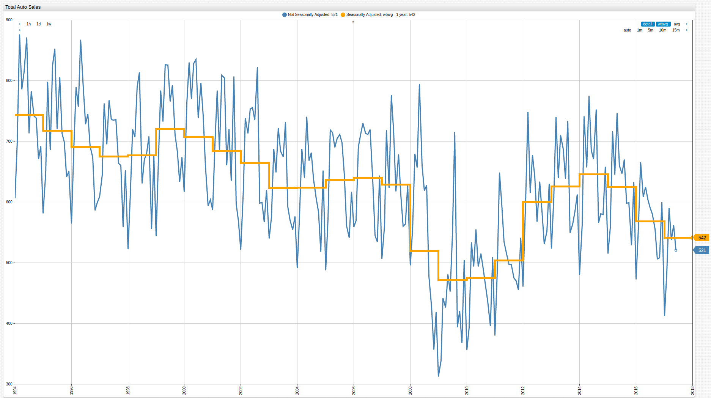
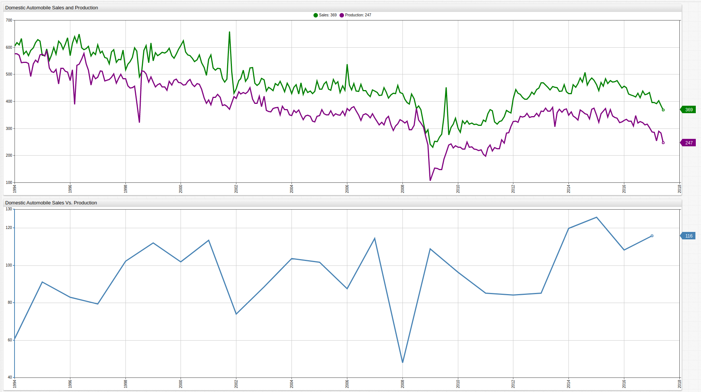

# The Slow Death of the American Automobile Industry

> Open the ChartLab visualization above and use the dropdown menus to navigate through time.

## Introduction

One of the first industries that was pioneered and perfected in America was that of the personal automobile. The roots of
industry date back to the turn of the nineteenth century, when the first internal combustion engine was invented and patented
in France. The first production automobile debuted less than a century later in Germany under the auspices of automobile
engineer Karl Benz, whose company still produces cars under the Mercedes-Benz mark. However it was Henry Ford's Model T,
which debuted in 1908, that changed the course of the personal automobile forever.

The Model T revolutionized the automobile industry for a number of reasons. Ford's introduction of assembly line production
dramatically reduced manufacturing costs which in turn lowered the car's price on the sales floor and made it affordable to
the burgeoning American middle class. In modern times however, corporate mishandling of Ford's legacy ultimately reached a low point in 2008
during the Great Recession, when the United States Government was all but forced to offer the "Big Three," that is Ford,
Chrysler, and General Motors, a bankruptcy-avoidance bailout to the tune of close to $80 billion, of which, more than $9 billion
was eventually [chalked up to a loss](https://www.treasury.gov/initiatives/financial-stability/TARP-Programs/automotive-programs/pages/default.aspx).

Economists and the American public generally view the bailout in a reluctantly positive light, after all the auto industry
employees more than [4 million Americans](https://www.bls.gov/iag/tgs/iagauto.htm) and has made models like Mustang, Corvette,
and Viper household names the world over, but it seems that even despite administration attempts to revive the dilapidated
industry, foreign imports are slowly but surely pushing American producers out of their own market.

## Data

**Figure 1**: Motor Vehicle Retail Sales (1994-2017)

_Source_: [Federal Reserve Economic Data](https://fred.stlouisfed.org/series/LAUTONSA)

Using the [moving average](../../how-to/database/moving-avg/README.md) function to seasonally-adjust the underlying data more elegantly captures
the trend of declining automobile sales. The above mentioned production downturn of the late 2000's is clearly visible, as is
the recent trend indicating less and less cars being sold.

**Figure 2**: Domestic Motor Vehicle Production and Sales (1994-2017)

_Source_: Federal Reserve Economic Data - [Domestic Motor Vehicle Production](https://fred.stlouisfed.org/series/DAUPSA), [Domestic Motor Vehicle Sales](https://fred.stlouisfed.org/series/DAUTOSA)

The second part of the above visualization tracks the difference in domestic automobile production and sales which has remained
within a range of roughly 100,000 units and was derived from the underlying data using an [ad-hoc calculation](../../how-to/database/add-calculated-value/README.md)
in the ChartLab interface. This value has been averaged over each observed year, and is an excellent metric to gauge trends
in production output. Because sales are likely a much larger factor in deciding production, then production is a factor in
predicting sales, this line shows that declining sales are being met with declining production. But more than that, production
is declining more quickly than sales, indicating an overall contraction in the entire market and a lack of confidence
in the likelihood of its eventual recovery.

**Figure 3**: Imported Motor Vehicle Sales (1994-2017)

_Source_: Federal Reserve Economic Data - [Imported and Domestic Motor Vehicle Sales](https://fred.stlouisfed.org/series/LAUTONSA), by unit; [Imported Motor Vehicle Sales](https://fred.stlouisfed.org/series/B149RC1Q027SBEA), by dollar value

In stark contrast to falling domestic sales figures, imported motor vehicle sales have shown both a quicker post-recession
recovery and more promising long-term potential. Only five of the top twenty best-selling cars in America for [May 2017](http://www.goodcarbadcar.net/2017/06/top-20-best-selling-cars-in-america-may.html)
came from American producers.

## Analysis

**Figure 4**: Imported Vs. Domestic Motor Vehicle Sales by Unit

_Source_: See **Figures 2** and **3** above.

The shrinking gap between domestic and imported automobile sales is shown above, with the lower portion of the visualization
showing a derived series obtained by subtracting the number of imported vehicles sold from the number of domestically-made vehicles
sold. Over the observed fifteen year period, the difference in sales has been reduced by more than half, which is no small feat
considering the American automobile sector is one of the country's most important.

**Figure 5**: Automobile Consumer Price Index (CPI)

_Source_: Federal Reserve Economic Data - [A Class CPI](https://fred.stlouisfed.org/series/CUURA000SS4501A), [B/C Class CPI](https://fred.stlouisfed.org/series/CUURX000SS4501A),
[D Class CPI](https://fred.stlouisfed.org/series/CUURD000SS4501A)

Further, the above chart details the Consumer Price Index (CPI) for four types of common consumer vehicles. The categorization
system ranks vehicles by size and load. The only class of vehicle which showed a significant increase in overall cost during
the observed period was the D Class, mostly populated by sport utility type vehicles.

## Conclusion

Overall automobile sales are growing smaller and smaller in the United States and amid that reduction, the market is being
further and further dominated by import manufacturers. Certainly, some of these manufacturers maintain local plants in the
United States, but their headquarters are located abroad and the majority of their profits end up there as well. As the second largest
automotive market in the world and originator of the industry, the United States should be able to leverage its home field
advantage and massive consumer base into the kind of success that made the industry what it is today, or more accurately,
what it was twenty years ago.

Instead, despite the massively expensive bailout less than ten years ago, American automobile manufacturers are struggling
to stay relevant when faced with competition from Asian and European automakers like Honda, Toyota, and Volkswagen.

If auto-makers in America are interested in keeping their hegemonic position at home, and indeed, their jobs in the future,
a serious re-structuring of the way the industry does business needs to happen and it needs to happen now. Production costs aren't to blame, there are
a number of international trade partnerships like NAFTA that allow producers to makes cars in countries with lower wages like
Mexico and bring them into the United States tariff-free. Lack of consumer demand isn't to blame, despite decreasing sales numbers
overall, what's left of the market is being gobbled up by foreign producers. Inflation isn't to blame, the CPI values for
automobiles of every size have been more stable than almost any other industry in the country. The blame lays squarely at the
feet of the executive teams who have failed to create a product of value and are soon going to once again feel the cold sting
of the free market if they cannot address the industry's current inadequacies.
