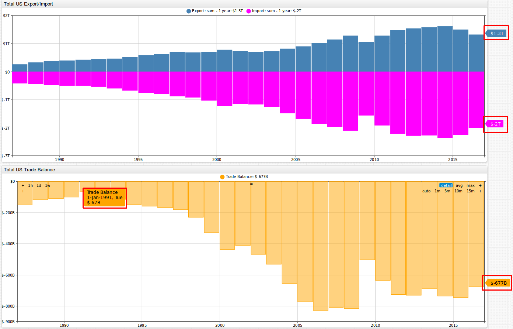
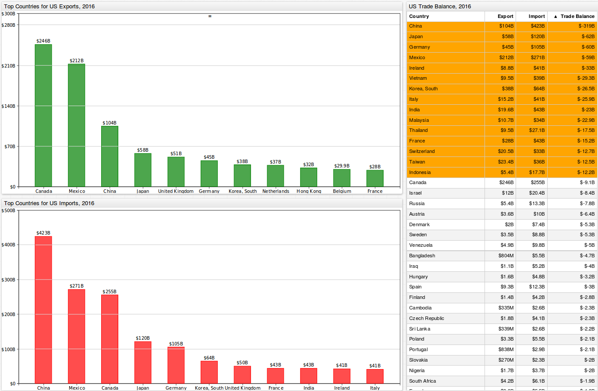

# Analyzing American International Trade History


## Introduction

Voters in the 2016 U.S. presidential election wanted to return to a time when America produced more than it consumed. According to data published by the [World Bank](https://data.worldbank.org/indicator/NY.GDP.MKTP.CD?end=2015&start=1960&view=chart&year_high_desc=true),
the United States represented **40%** of world GDP in **1960**. By 2015, that number had dropped to only **24%**. According to the [Bureau of Labor Statistics](https://www.bls.gov/opub/mlr/2012/01/art4full.pdf) (BLS), by 2020 the U.S. is predicted to have **5.7
million** less manufacturing jobs than it had in 2000. Further, the percentage of Americans employed in manufacturing dropped from **19%** in 1980 to **8%** in 2016. This article analyzes data from [`census.gov`](https://www.census.gov) concerning
the [international trade balance](https://www.census.gov/foreign-trade/balance/country.xlsx) of the United States of America from 1985 to 2016. Publicly available data from `census.gov` is loaded into the non-relational ATSD
for interactive analysis with [SQL](https://axibase.com/docs/atsd/sql/) for [partitioning](https://axibase.com/docs/atsd/sql/#partitioning) and [**ChartLab**](../../tutorials/shared/chartlab.md). See [Installation Documentation](https://axibase.com/docs/atsd/installation/) to set up a local ATSD instance.

## Dataset

Take a look at a dataset on American international trade from [`census.gov`](https://www.census.gov/foreign-trade/balance/index.html) where  The dataset is available in [`.xlsx`](https://www.census.gov/foreign-trade/balance/country.xlsx) format.

This dataset contains import and export statistics collected monthly from 1985 to 2016 concerning trade between the United States and 259 other nations and regions.

Excel can provide quick answers to simple questions, but when it comes to complex analysis it is much more convenient to interact with the data once it is loaded into a database.

Load the dataset into ATSD by following the instructions provided in [**Action Items**](#action-items).

The BLS file format presents a number of challenges when loading the data. In particular, it requires the parser to handle columns that combine metric names, `E` meaning `export` and `I` meaning `import` and irregularly named months such a `JUN`, `JAN`, etc.


ATSD handles this with a [schema-based](https://axibase.com/docs/atsd/parsers/csv/csv-schema.html) parser which can be configured to load records from non-standard CSV files, such as the BLS report.

## Overview

The image below shows import, export, and trade balance values from 1987 to 2016 between the U.S. and the sum of all countries included in this dataset.

The upper image shows exports in blue and imports in pink. In 2016, imports into the United States totalled **$2 trillion**, while exports totalled **$1.3 trillion**. The lower figure shows trade balance, the dollar amount for exports minus imports. The trade balance deficit grew from **-$152 billion** in 1987 to **-$677 billion** in 2016.



[](https://apps.axibase.com/chartlab/552d7a44/2/#fullscreen)

In addition to looking at graphical outputs, perform [SQL queries](https://axibase.com/docs/atsd/sql/) to search for specific information in this dataset. According to the query below, 1991 had the least negative trade balance of **-$66.7 billion**.

```sql
SELECT date_format(e.time, 'yyyy') AS "year", e.tags.ctyname AS country,
  SUM(e.value)/1000 AS export,
  SUM(i.value)/1000 AS import,
  (SUM(e.value)-SUM(i.value))/1000 AS trade_balance
  FROM "us-trade-export" e
  JOIN "us-trade-import" i
WHERE e.datetime >= '1970-01-01T00:00:00Z' and e.datetime < '2017-01-01T00:00:00Z'
  AND e.tags.cty_code = '0015'
GROUP BY e.period(1 year), e.tags
  WITH ROW_NUMBER(e.entity, e.tags ORDER BY SUM(e.value)-SUM(i.value) DESC) <= 1
```

```ls
| year  | country                         | export  | import  | trade_balance |
|-------|---------------------------------|---------|---------|---------------|
| 1991  | World, Not Seasonally Adjusted  | 421.7   | 488.5   | -66.7         |
```

## Trade by Country

Compare the trade balance between the U.S. and individual countries.

The image below shows import, export, and trade balance values between the U.S. and its largest trading partner, China. In 2016, exports and imports to and from China totaled **$104 billion** and **$423 billion**, respectively.
As shown in the figure below, the trade balance deficit between the U.S. and China grew from **-$6 million** in 1985 to **-$319 billion** in 2016.


[](https://apps.axibase.com/chartlab/552d7a44#fullscreen)

Explore the trade between the United States and any other country included in this dataset by opening the **ChartLab** visualization. Open the drop-down lists to navigate between countries, as well as entire continents or specific organizations. 

> There are separate filters for the upper and lower graphs.Select the desired location from the `US Import/Export` drop-down list, as well from **US Trade Balance** to perform filtering.

The SQL query below tracks the trade balance in USD millions between United States and Mexico from 1985 to 2016:

```sql
SELECT date_format(e.time, 'yyyy') AS "year",
  e.tags.ctyname AS country,
  SUM(e.value) AS export,
  SUM(i.value) AS import,
  SUM(e.value)-SUM(i.value) AS trade_balance -- apply grouped aggregation functions to calculate trade balance
FROM "us-trade-export" e
  JOIN "us-trade-import" i -- merge export and import time series using JOIN
  -- filter records by date in ISO 8601 format
WHERE e.datetime >= '1970-01-01T00:00:00Z' AND e.datetime < '2017-01-01T00:00:00Z'
  AND e.tags.ctyname IN ('Mexico') -- filter the data for country name = 'Mexico'
GROUP BY e.period(1 year), e.tags -- group values by year, tags (include country name and code)
  ORDER BY e.datetime DESC
```

```ls
| year  | country  | export    | import    | trade_balance |
|-------|----------|-----------|-----------|---------------|
| 2016  | Mexico   | 211848.7  | 270647.2  | -58798.6      |
| 2015  | Mexico   | 235745.1  | 296407.9  | -60662.8      |
| 2014  | Mexico   | 240331.2  | 295739.5  | -55408.3      |
| 2013  | Mexico   | 225954.4  | 280556.0  | -54601.7      |
| 2012  | Mexico   | 215875.1  | 277593.6  | -61718.5      |
| 2011  | Mexico   | 198288.7  | 262873.6  | -64584.9      |
| 2010  | Mexico   | 163664.6  | 229985.6  | -66321.0      |
| 2009  | Mexico   | 128892.1  | 176654.4  | -47762.2      |
...
| 1997  | Mexico   | 71388.5   | 85937.6   | -14549.1      |
| 1996  | Mexico   | 56791.6   | 74297.2   | -17505.6      |
| 1995  | Mexico   | 46292.1   | 62100.4   | -15808.3      |
| 1994  | Mexico   | 50843.5   | 49493.7   | 1349.8        |
| 1993  | Mexico   | 41580.8   | 39917.5   | 1663.3        |
| 1992  | Mexico   | 40592.3   | 35211.1   | 5381.2        |
| 1991  | Mexico   | 33277.2   | 31129.6   | 2147.6        |
| 1990  | Mexico   | 28279.0   | 30156.8   | -1877.8       |
| 1989  | Mexico   | 24982.0   | 27162.1   | -2180.1       |
| 1988  | Mexico   | 20628.5   | 23259.8   | -2631.3       |
| 1987  | Mexico   | 14582.3   | 20270.8   | -5688.5       |
| 1986  | Mexico   | 12391.7   | 17301.7   | -4910.0       |
| 1985  | Mexico   | 13634.7   | 19131.7   | -5497.0       |
```

## 2016: The Year in Review

How did 2016 look for the United States? Below is a figure of the top countries for U.S. export and imports in 2016. The table to the right of the visualizations provides
monetary values for exports, imports, and the trade balance between the U.S. and each respective country, continent, or organization. The table is sorted by
trade balance, with the highest negative trade balances showing at the top. Sort the table as needed by accessing the **ChartLab** portal and selecting the desired column headers.

In 2016, the locations with which the United States had the highest negative and positive trade balances are China and Hong Kong at **-$319 billion** and **$25.1 billion**,
respectively.



[](https://apps.axibase.com/chartlab/53e42403#fullscreen)

2016 trade balance (in billions USD) with the world as a whole:

```sql
SELECT e.tags.ctyname AS region,
  e.tags.cty_code AS code,
  SUM(e.value)/1000 AS export,
  SUM(i.value)/1000 AS import,
  (SUM(e.value)-SUM(i.value))/1000 AS trade_balance
FROM "us-trade-export" e
  JOIN "us-trade-import" i
WHERE e.datetime >= '2016-01-01T00:00:00Z' AND e.datetime < '2017-01-01T00:00:00Z'
  -- include regions (code < 1000) except regional trade unions such as OPEC, NAFTA, etc.
  AND e.tags.cty_code < '1000' AND e.tags.cty_code NOT IN ('0004', '0005', '0006', '0007', '0008', '0015', '0017')
GROUP BY e.period(1 year), e.tags
  ORDER BY region
```

```ls
| region                     | code  | export  | import  | trade_balance |
|----------------------------|-------|---------|---------|---------------|
| Africa                     | 0013  | 20.2    | 24.1    | -3.9          |
| Asia                       | 0016  | 409.3   | 902.2   | -492.9        |
| Australia and Oceania      | 0018  | 24.4    | 13.0    | 11.4          |
| Europe                     | 0012  | 291.4   | 442.6   | -151.2        |
| European Union             | 0003  | 247.4   | 381.5   | -134.1        |
| North America              | 0010  | 457.5   | 525.4   | -67.9         |
| OPEC                       | 0001  | 64.0    | 70.5    | -6.5          |
| Pacific Rim                | 0014  | 328.2   | 740.6   | -412.5        |
| South and Central America  | 0009  | 125.0   | 97.9    | 27.2          |
| Sub Saharan Africa         | 0019  | 12.4    | 18.2    | -5.8          |
```

In addition to tables output from SQL queries, display these continental relationships in **ChartLab** graphs. Below is an image for U.S. trade export and import numbers with South and
Central America, Asia, Africa, Europe, and North America for 2016. Lines represent export and import balances. The heavier the lines
 between the United States and endpoint continent, the greater the dollar amount in trade. Notice that 2016 exports from the U.S. to North America totaled
**$457 billion**, while imports from North America into the US totaled **$525 billion**, resulting in a trade balance deficit of **-$68 billion**. Further notice that the
heaviest lines are between the U.S. and Asia, indicating the enormous trade volume between the two.


[](https://apps.axibase.com/chartlab/b9f27b14/2/#fullscreen)

This query tracks the largest absolute trading partners of the United States.

```sql
SELECT date_format(e.time, 'yyyy') AS "year", e.tags.ctyname AS country, e.tags.cty_code AS code,
  SUM(e.value) AS export, SUM(i.value) AS import,
  SUM(e.value)+SUM(i.value) AS trade_total
  FROM "us-trade-export" e
  JOIN "us-trade-import" i
WHERE e.datetime >= '2016-01-01T00:00:00Z' and e.datetime < '2017-01-01T00:00:00Z'
  -- exclude regions and non-existent/non-reporting countries/codes
  AND e.tags.cty_code > '1000'
  AND e.tags.cty_code NOT IN ('7740', '4350', '8500', '5080', '5160', '4790', '4610', '4799', '4802', '7320', '2771', '8220')
GROUP BY e.period(1 year), e.tags
  ORDER BY SUM(e.value)+SUM(i.value) DESC
  -- limit results to 20 countries by trade volume in descending order
  LIMIT 20
```

```ls
| year  | country         | code  | export    | import    | trade_total   |
|-------|-----------------|-------|-----------|-----------|---------------|
| 2016  | China           | 5700  | 104149.1  | 423431.2  | 527580.3      |
| 2016  | Canada          | 1220  | 245619.2  | 254756.1  | 500375.4      |
| 2016  | Mexico          | 2010  | 211848.7  | 270647.2  | 482495.9      |
| 2016  | Japan           | 5880  | 57597.2   | 120006.5  | 177603.7      |
| 2016  | Germany         | 4280  | 44997.8   | 104553.9  | 149551.7      |
| 2016  | Korea, South    | 5800  | 37997.1   | 64465.1   | 102462.2      |
| 2016  | United Kingdom  | 4120  | 51081.3   | 49553.9   | 100635.2      |
| 2016  | France          | 4279  | 28018.7   | 43173.6   | 71192.3       |
| 2016  | India           | 5330  | 19592.9   | 42552.0   | 62144.9       |
| 2016  | Taiwan          | 5830  | 23409.5   | 35949.9   | 59359.4       |
| 2016  | Italy           | 4759  | 15243.7   | 41147.7   | 56391.4       |
| 2016  | Switzerland     | 4419  | 20468.3   | 33124.0   | 53592.3       |
| 2016  | Netherlands     | 4210  | 36955.4   | 14807.3   | 51762.7       |
| 2016  | Brazil          | 3510  | 27711.3   | 23712.0   | 51423.3       |
| 2016  | Ireland         | 4190  | 8761.2    | 41466.4   | 50227.7       |
| 2016  | Vietnam         | 5520  | 9451.9    | 38792.8   | 48244.7       |
| 2016  | Belgium         | 4231  | 29878.1   | 15749.5   | 45627.6       |
| 2016  | Malaysia        | 5570  | 10746.9   | 33600.3   | 44347.2       |
| 2016  | Singapore       | 5590  | 24528.4   | 16606.0   | 41134.4       |
| 2016  | Hong Kong       | 5820  | 31892.2   | 6821.8    | 38714.1       |
```

## A Closer Look at the Trading Partners of America

It is often claimed that developing countries are stealing American jobs and industry. If a country is poaching the jobs and industry of another, it is reasonable
to assume that the trade balance reflects those changes. For example, the more steel manufacturing jobs that leave the U.S. for Asia, the more steel the
U.S. needs to import from Asia. In this instance, `2016_GDP_per_capita` is calculated from the following two replacement tables:
[`world-population.txt`](./resources/world-population.txt) and [`world-gdp.txt`](./resources/world-gdp.txt). Results are sorted by the `2016_trade_balance_rank` of a particular country. The
more negative a trade balance, the higher the ranking. Refer to [`us-trade-balance-rank-2016.txt`](./resources/us-trade-balance-rank-2016.txt) for these rankings.

To separate rich and poor countries, calculate an average world GDP. Divide the world population
by the world GDP to get a world GDP of $10,273. Any
countries producing less than this derived average are considered poor countries for these purposes.

This query returns the year with the highest trade balance, least negative or most positive, going back to 1985
for countries in the bottom 50% by GDP per capita:

```sql
SELECT e.tags.ctyname AS country,
  date_format(e.time, 'yyyy') AS "year",
  SUM(e.value) AS export, SUM(i.value) AS import, SUM(e.value)-SUM(i.value) AS trade_balance,
  CAST(LOOKUP('us-trade-balance-2016', e.tags.ctyname) AS number) AS "2016_trade_balance",
  1000000*CAST(LOOKUP('world-gdp', e.tags.ctyname) AS number)/CAST(LOOKUP('world-population', e.tags.ctyname) AS number) AS "2016_GDP_per_capita",
  CAST(LOOKUP('us-trade-balance-rank-2016', e.tags.ctyname) as number) AS "2016_trade_balance_rank"
FROM "us-trade-export" e
  JOIN "us-trade-import" i
WHERE e.datetime >= '1970-01-01T00:00:00Z' AND e.datetime < '2017-01-01T00:00:00Z'
  AND e.tags.cty_code > '1000' AND e.tags.cty_code NOT IN ('7740', '4350', '8500', '5080', '5160', '4790', '4610', '4799', '4802', '7320', '2771', '8220')
  AND 1000000*CAST(LOOKUP('world-gdp', e.tags.ctyname) AS number)/CAST(LOOKUP('world-population', e.tags.ctyname) AS number) <= 10273
GROUP BY e.period(1 year), e.tags
  -- Use partitioning to group annual records countru and selecting one row with maximum trade balance for each country
  WITH ROW_NUMBER(e.entity, e.tags ORDER BY SUM(e.value)-SUM(i.value) DESC) <= 1
  ORDER BY CAST(LOOKUP('us-trade-balance-rank-2016', e.tags.ctyname) AS number)
  LIMIT 10
```

```ls
| country     | year  | export   | import   | trade_balance  | 2016_trade_balance  | 2016_GDP_per_capita  | 2016_trade_balance_rank |
|-------------|-------|----------|----------|----------------|---------------------|----------------------|-------------------------|
| China       | 1985  | 3855.7   | 3861.7   | -6.0           | -319282.1           | 8240.9               | 1.0                     |
| Mexico      | 1992  | 40592.3  | 35211.1  | 5381.2         | -58798.6            | 8268.6               | 4.0                     |
| Vietnam     | 1996  | 616.6    | 331.8    | 284.8          | -29340.9            | 2122.9               | 6.0                     |
| India       | 1988  | 2500.1   | 2939.5   | -439.4         | -22959.1            | 1696.6               | 9.0                     |
| Malaysia    | 1986  | 1729.6   | 2420.4   | -690.8         | -22853.4            | 9845.0               | 10.0                    |
| Thailand    | 1985  | 849.1    | 1428.3   | -579.2         | -17537.7            | 5731.6               | 11.0                    |
| Indonesia   | 1991  | 1891.5   | 3240.6   | -1349.1        | -12245.4            | 3611.0               | 15.0                    |F
| Russia      | 1992  | 2112.5   | 481.4    | 1631.1         | -7839.3             | 8838.2               | 18.0                    |
| Bangladesh  | 1985  | 218.9    | 196.0    | 22.9           | -4695.8             | 1410.3               | 23.0                    |
| Iraq        | 1993  | 4.0      | 0.0      | 4.0            | -4048.3             | 4163.3               | 24.0                    |
```

Compare these results with the most recent year the U.S. had the highest trade balance, least negative or most positive, for countries in the top 50% by
GDP per capita.

```sql
SELECT e.tags.ctyname AS country,
  date_format(e.time, 'yyyy') AS "year",
  SUM(e.value) AS export, SUM(i.value) AS import, SUM(e.value)-SUM(i.value) AS trade_balance,
  CAST(LOOKUP('us-trade-balance-2016', e.tags.ctyname) AS number) AS "2016_trade_balance",
  1000000*CAST(LOOKUP('world-gdp', e.tags.ctyname) AS number)/CAST(LOOKUP('world-population', e.tags.ctyname) AS number) AS "2016_GDP_per_capita",
  CAST(LOOKUP('us-trade-balance-rank-2016', e.tags.ctyname) as number) AS "2016_trade_balance_rank"
FROM "us-trade-export" e
  JOIN "us-trade-import" i
WHERE e.datetime >= '1970-01-01T00:00:00Z' AND e.datetime < '2017-01-01T00:00:00Z'
  AND e.tags.cty_code > '1000' AND e.tags.cty_code NOT IN ('7740', '4350', '8500', '5080', '5160', '4790', '4610', '4799', '4802', '7320', '2771', '8220')
  AND 1000000*CAST(LOOKUP('world-gdp', e.tags.ctyname) AS number)/CAST(LOOKUP('world-population', e.tags.ctyname) AS number) > 10273
GROUP BY e.period(1 year), e.tags
  WITH ROW_NUMBER(e.entity, e.tags ORDER BY SUM(e.value)-SUM(i.value) DESC) <= 1
  ORDER BY CAST(LOOKUP('us-trade-balance-rank-2016', e.tags.ctyname) AS number)
  LIMIT 10
```

```ls
| country       | year  | export   | import   | trade_balance  | 2016_trade_balance  | 2016_GDP_per_capita  | 2016_trade_balance_rank |
|---------------|-------|----------|----------|----------------|---------------------|----------------------|-------------------------|
| Japan         | 1990  | 48579.5  | 89684.0  | -41104.5       | -62409.2            | 37445.9              | 2.0                     |
| Germany       | 1991  | 21302.5  | 26136.4  | -4833.9        | -59556.1            | 43316.8              | 3.0                     |
| Ireland       | 1989  | 2482.9   | 1565.5   | 917.4          | -32705.2            | 65319.8              | 5.0                     |
| Korea, South  | 1996  | 26621.1  | 22654.9  | 3966.2         | -26468.0            | 27807.3              | 7.0                     |
| Italy         | 1991  | 8569.8   | 11764.2  | -3194.4        | -25904.0            | 30977.7              | 8.0                     |
| France        | 1991  | 15345.6  | 13333.0  | 2012.6         | -15154.9            | 38477.7              | 12.0                    |
| Switzerland   | 2008  | 22023.6  | 17781.9  | 4241.8         | -12655.6            | 79060.2              | 13.0                    |
| Taiwan        | 1993  | 16167.8  | 25101.5  | -8933.7        | -12540.4            | 22190.0              | 14.0                    |
| Canada        | 1991  | 85149.8  | 91063.9  | -5914.1        | -9136.9             | 42229.1              | 16.0                    |
| Israel        | 1987  | 3130.2   | 2639.3   | 490.9          | -8352.5             | 38051.9              | 17.0                    |
```

Comparing these two result sets, it appears the U.S. has negative trade balances with both poor and rich countries. While there may not be a direct correlation between a country losing jobs and having to increase imports, both rich and poor countries could be equally accused of taking U.S. jobs. In the top ten for trade balance rank, there are both five poor (China, Mexico, Vietnam, India, and Malaysia) and rich (Japan, Germany, Ireland, South Korea, and Italy) countries.

While improving the international trade balance of any given country may not solve all economic problems, it is certainly a good place to start looking for answers.

## Action Items

Install local instances of ATSD and [Axibase Collector](https://axibase.com/docs/axibase-collector/) and create SQL queries for analyzing trade balance data:

1. Install [Docker](https://docs.docker.com/engine/installation/linux/ubuntulinux/).
2. [Install ATSD](https://axibase.com/docs/atsd/installation/docker.html) Docker image.
3. Download the [Excel file](https://www.census.gov/foreign-trade/balance/country.xlsx) in CSV format.
4. Log in to ATSD by navigating to `https://docker_host:8443/`.
5. Import the `us-trade-ie-csv-parser.xml` file into ATSD. For a more detailed description, refer to step 9 from these [Configuration Instructions](../us-mortality/configuration.md) from an article tracking [U.S. mortality statistics](../us-mortality/README.md).
6. Upload the data in `.csv` format to ATSD.
7. Import the `us-trade-balance-2016`, `us-trade-balance-rank-2016`, `world-gdp`, and `world-population` replacement tables to ATSD.
8. Open the **SQL** menu and select **Console**.

This [CSV Parser Walkthrough](./resources/csv-parser-schema-explanation.md) describes configuring the CSV Parser for this data.

### Additional SQL Queries

Here are additional SQL queries along with abbreviated result sets which examine international trade history of the United States.

Annual exports for Mexico to the United States (USD million).

```sql
SELECT date_format(time, 'yyyy') AS "year",
  tags.ctyname AS country,
  SUM(value) AS export
FROM "us-trade-export"
WHERE datetime >= '1985-01-01T00:00:00Z' AND datetime < '2017-01-01T00:00:00Z'
  AND tags.ctyname IN ('Mexico')
GROUP BY period(1 year), tags
  ORDER BY datetime DESC
```

```ls
| year  | country  | export   |
|-------|----------|----------|
| 2016  | Mexico   | 211848.7 |
| 2015  | Mexico   | 235745.1 |
| 2014  | Mexico   | 240331.2 |
| 2013  | Mexico   | 225954.4 |
| 2012  | Mexico   | 215875.1 |
| 2011  | Mexico   | 198288.7 |
| 2010  | Mexico   | 163664.6 |
| 2009  | Mexico   | 128892.1 |
...
```

Year with the highest/best trade balance (USD million) for each country, with 2016 population estimate (absolute value).

```sql
SELECT date_format(e.time, 'yyyy') AS "year", e.tags.ctyname AS country, e.tags.cty_code AS code,
  SUM(e.value) AS export, SUM(i.value) AS import,
  SUM(e.value)-SUM(i.value) AS trade_balance,
  LOOKUP('world-population', e.tags.ctyname) AS population
  FROM "us-trade-export" e
  JOIN "us-trade-import" i
WHERE e.datetime >= '1970-01-01T00:00:00Z' and e.datetime < '2017-01-01T00:00:00Z'
  AND e.tags.cty_code > '1000'
  AND e.tags.cty_code NOT IN ('7740', '4350', '8500', '5080', '5160', '4790', '4610', '4799', '4802', '7320', '2771', '8220')
GROUP BY e.period(1 year), e.tags
  WITH ROW_NUMBER(e.entity, e.tags ORDER BY SUM(e.value)-SUM(i.value) DESC) <= 1
  ORDER BY country
```

```ls
| year  | country              | code  | export   | import  | trade_balance  | population |
|-------|----------------------|-------|----------|---------|----------------|------------|
| 2011  | Afghanistan          | 5310  | 2921.9   | 26.1    | 2895.7         | 33369945   |
| 2013  | Albania              | 4810  | 74.4     | 22.8    | 51.6           | 2903700    |
| 1994  | Algeria              | 7210  | 1191.5   | 1526.9  | -335.4         | 40375954   |
| 1998  | Andorra              | 4271  | 22.3     | 0.1     | 22.2           | 69165      |
| 1986  | Angola               | 7620  | 86.5     | 677.6   | -591.1         | 25830958   |
| 2007  | Anguilla             | 2481  | 92.5     | 4.6     | 88.0           | 14763      |
| 2015  | Antigua and Barbuda  | 2484  | 677.7    | 6.9     | 670.8          | 92738      |
| 2014  | Argentina            | 3570  | 10828.6  | 4246.4  | 6582.2         | 43847277   |
| 2008  | Armenia              | 4631  | 151.4    | 42.7    | 108.7          | 3026048    |
| 2014  | Aruba                | 2779  | 1300.2   | 60.4    | 1239.8         | 104263     |
| 2012  | Australia            | 6021  | 31161.4  | 9566.8  | 21594.6        | 24309330   |
...
```

> The following countries/codes are excluded since they either no longer exist or their codes have been modified.

```ls
|Code  |   Country                        | Modification Date |
|------|----------------------------------|-------------------|
| 7740 |   Ethiopia                       | 2003-12-01        |
| 4350 |   Czechoslovakia                 | 2003-12-01        |
| 8500 |   International Organizations    | 2003-12-01        |
| 5080 |   Israel                         | 2003-12-01        |
| 5160 |   Iraq-Saudi Arabia Neutral Zone | 2003-12-01        |
| 4790 |   Yugoslavia (former)            | 2003-12-01        |
| 4610 |   USSR                           | 2003-12-01        |
| 4799 |   Serbia and Montenegro          | 2006-12-01        |
| 4802 |   Serbia                         | 2008-12-01        |
| 7320 |   Sudan                          | 2011-12-01        |
| 2771 |   Netherlands Antilles           | 2011-12-01        |
| 8220 |   Unidentified Countries         | 2014-12-01        |
```

Year with the highest/best trade balance for the 20 largest countries by 2016 population estimate (USD million).

```sql
SELECT date_format(e.time, 'yyyy') AS "year", e.tags.ctyname AS country, e.tags.cty_code AS code,
  SUM(e.value) AS export, SUM(i.value) AS import,
  SUM(e.value)-SUM(i.value) AS trade_balance,
  CAST(LOOKUP('world-population', e.tags.ctyname))/1000000 AS population
  FROM "us-trade-export" e
  JOIN "us-trade-import" i
WHERE e.datetime >= '1970-01-01T00:00:00Z' and e.datetime < '2016-12-01T00:00:00Z'
  AND e.tags.cty_code > '1000'
  AND e.tags.cty_code NOT IN ('7740', '4350', '8500', '5080', '5160', '4790', '4610', '4799', '4802', '7320', '2771', '8220')
GROUP BY e.period(1 year), e.tags
  WITH ROW_NUMBER(e.entity, e.tags ORDER BY SUM(e.value)-SUM(i.value) DESC) <= 1
  ORDER BY CAST(LOOKUP('world-population', e.tags.ctyname)) DESC
  LIMIT 20
```

```ls
| year  | country     | code  | export   | import   | trade_balance  | population |
|-------|-------------|-------|----------|----------|----------------|------------|
| 1985  | China       | 5700  | 3855.7   | 3861.7   | -6.0           | 1382.3     |
| 1988  | India       | 5330  | 2500.1   | 2939.5   | -439.4         | 1326.8     |
| 1991  | Indonesia   | 5600  | 1891.5   | 3240.6   | -1349.1        | 260.6      |
| 2013  | Brazil      | 3510  | 44105.5  | 27541.2  | 16564.3        | 209.6      |
| 1985  | Pakistan    | 5350  | 1041.7   | 273.9    | 767.8          | 192.8      |
| 2014  | Nigeria     | 7530  | 5965.9   | 3839.5   | 2126.4         | 187.0      |
| 1985  | Bangladesh  | 5380  | 218.9    | 196.0    | 22.9           | 162.9      |
| 1992  | Russia      | 4621  | 2112.5   | 481.4    | 1631.1         | 143.4      |
...
```

Top 20 countries by largest trade deficit (USD million).

```sql
SELECT date_format(e.time, 'yyyy') AS "year", e.tags.ctyname AS country, e.tags.cty_code AS code,
  SUM(e.value) AS export, SUM(i.value) AS import,
  SUM(e.value)-SUM(i.value) AS trade_balance
  FROM "us-trade-export" e
  JOIN "us-trade-import" i
WHERE e.datetime >= '2016-01-01T00:00:00Z' and e.datetime < '2017-01-01T00:00:00Z'
  AND e.tags.cty_code > '1000'
  AND e.tags.cty_code NOT IN ('7740', '4350', '8500', '5080', '5160', '4790', '4610', '4799', '4802', '7320', '2771', '8220')
GROUP BY e.period(1 year), e.tags
  WITH ROW_NUMBER(e.entity, e.tags ORDER BY e.period(1 year)) < 10
  ORDER BY trade_balance
  LIMIT 20
```

```ls
| year  | country       | code  | export    | import    | trade_balance |
|-------|---------------|-------|-----------|-----------|---------------|
| 2016  | China         | 5700  | 104149.1  | 423431.2  | -319282.1     |
| 2016  | Japan         | 5880  | 57597.2   | 120006.5  | -62409.2      |
| 2016  | Germany       | 4280  | 44997.8   | 104553.9  | -59556.1      |
| 2016  | Mexico        | 2010  | 211848.7  | 270647.2  | -58798.6      |
| 2016  | Ireland       | 4190  | 8761.2    | 41466.4   | -32705.2      |
| 2016  | Vietnam       | 5520  | 9451.9    | 38792.8   | -29340.9      |
| 2016  | Korea, South  | 5800  | 37997.1   | 64465.1   | -26468.0      |
| 2016  | Italy         | 4759  | 15243.7   | 41147.7   | -25904.0      |
| 2016  | India         | 5330  | 19592.9   | 42552.0   | -22959.1      |
...
```

Year with the highest/best trade balance (USD million) by region.

```sql
SELECT e.tags.ctyname AS country,
  date_format(e.time, 'yyyy') AS "year",
  SUM(e.value)/1000 AS export,
  SUM(i.value)/1000 AS import,
  (SUM(e.value)-SUM(i.value))/1000 AS trade_balance
FROM "us-trade-export" e
  JOIN "us-trade-import" i
WHERE e.datetime >= '1970-01-01T00:00:00Z' AND e.datetime < '2017-01-01T00:00:00Z'
  AND e.tags.cty_code < '1000' AND e.tags.cty_code NOT IN ('0004', '0005', '0006', '0007', '0008', '0015', '0017')
GROUP BY e.period(1 year), e.tags
  WITH ROW_NUMBER(e.entity, e.tags ORDER BY SUM(e.value)-SUM(i.value) DESC) <= 1
  ORDER BY e.time
```

```ls
| country                    | year  | export  | import  | trade_balance |
|----------------------------|-------|---------|---------|---------------|
| Asia                       | 1985  | 59.3    | 131.2   | -71.9         |
| North America              | 1992  | 131.2   | 133.8   | -2.7          |
| Pacific Rim                | 1992  | 124.5   | 208.4   | -84.0         |
| European Union             | 1997  | 143.9   | 160.9   | -17.0         |
| Europe                     | 1997  | 163.3   | 181.4   | -18.2         |
| Australia and Oceania      | 2012  | 35.4    | 13.5    | 22.0          |
| Africa                     | 2014  | 38.1    | 34.6    | 3.5           |
| OPEC                       | 2015  | 72.8    | 66.2    | 6.6           |
| South and Central America  | 2015  | 152.5   | 115.9   | 36.7          |
| Sub Saharan Africa         | 2015  | 18.0    | 18.8    | -0.8          |
```