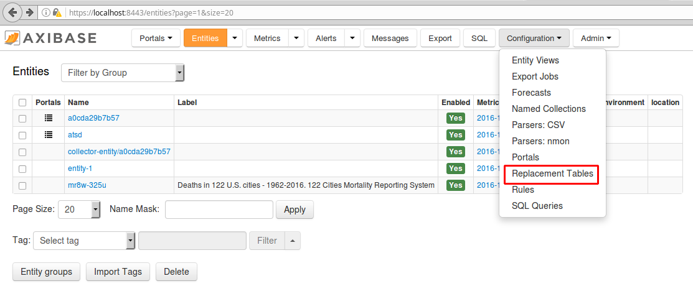
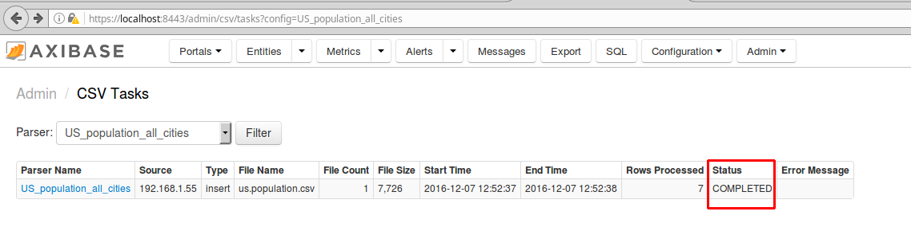
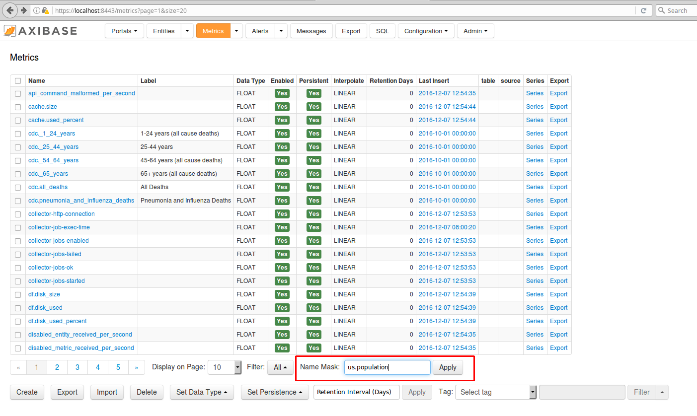

# Creating Local Instances for ATSD and Axibase Collector using Docker

Below is a step-by-step guide for setting up local instances of Axibase Time Series Database (ATSD) and Axibase Collector on a Docker host.

1. Install [Docker](https://docs.docker.com/engine/installation/linux/ubuntulinux/).

2. Download the `docker-compose.yml` file to launch the ATSD and Collector container bundle.

   ```sh
   curl -o docker-compose.yml https://raw.githubusercontent.com/axibase/atsd-use-cases/master/research/us-mortality/resources/docker-compose.yml
   ```

3. Launch containers by specifying the built-in collector account credentials used by Axibase Collector to insert data into ATSD.

   ```sh
   export C_USER=myuser; export C_PASSWORD=mypassword; docker-compose pull && docker-compose up -d
   ```

4. Access the ATSD user interface by navigating to `https://localhost:8443`. Note that it may take several minutes for the containers to launch and for ATSD to become
   available. Create a username and password.

   

5. Log in to ATSD with your newly created username and password.

    

6. Navigate to the **Entities** tab in ATSD. The job creates a new entity in ATSD named `mr8w-325u`.

   

7. Open **Data > Replacement Tables**.

   

8. Upload the files included in this repository ([`city-size`](./resources/city-size.txt), [`us-regions`](./resources/us-regions.txt),
   [`new-york-city-2010-population`](./resources/new-york-city-2010-population.txt), and [`youngstown-2010-population`](./resources/youngstown-2010-population.txt))
   into a **Replacement Table**. Click **Save**. `city-size` contains 2015 population figures for each of the 122 cities included in this dataset. `us-regions` is a list of all of the regions
   (i.e. 1=New-England, 2=Middle-Atlantic etc.). `new-york-city-2010-population` and `youngstown-2010-population` are used to compute mortality statistics.

   

9. Navigate to **Data > CSV Parsers** and import [`parser.xml`](./resources/parser.xml).

   

   

   

10. After uploading the parser import [`us.population.csv`](./resources/us.population.csv).

    This file contains population estimates from [census.gov](https://www.census.gov/data.html) for all 122 cities for 1960, 1970, 1980, 1990, 2000, 2010,
    and 2015. Save a local copy of this file. Open the `US_population_all_cities` parser and upload `us.population.csv`.

    

    

    Click **To submitted tasks** button.

    

   If the upload is successful, ATSD notifies:

   

Next, navigate to **Metrics** and enter `us.population` into the **Search Bar**.

   

   Select **Series**.

   

   