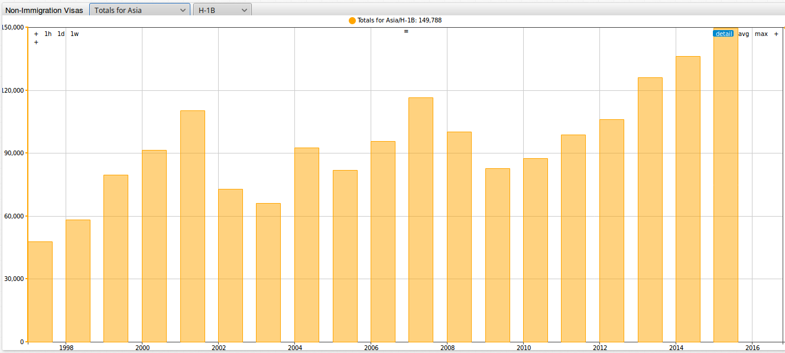
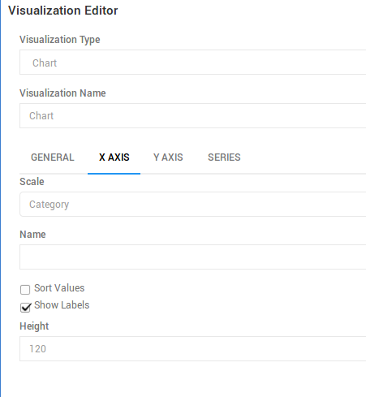
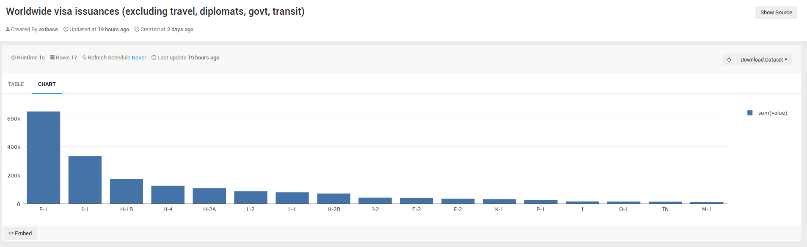
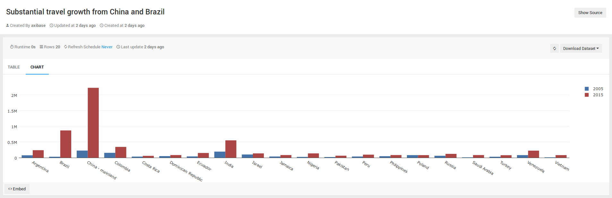
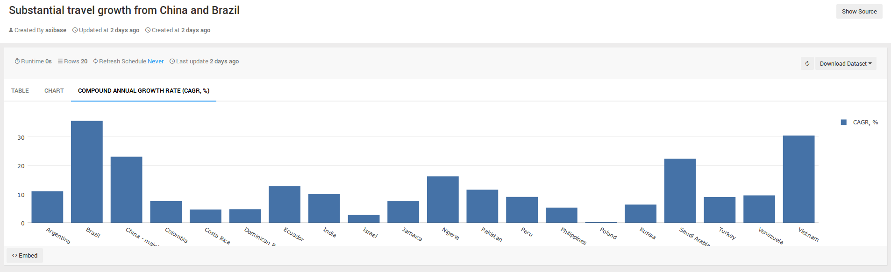

# Visa Travel to America: Identifying Trends and Outliers with Charts, SQL and Redash


In 2015, the United States is the [second most](https://en.wikipedia.org/wiki/World_Tourism_rankings) visited country in the world. Where do all of these travelers come from and
what are their reasons for coming to the United States?

This article analyzes a dataset from [`travel.state.gov`](https://travel.state.gov) concerning non-immigrant visa figures from 1997 through 2015. Publicly available data collected by government organizations can be loaded into ATSD for interactive analysis. This article illustrates some of the capabilities of [Redash](https://redash.io/), an open-source data visualization tool that is integrated with ATSD. Make [SQL queries](https://axibase.com/docs/atsd/sql/) in ATSD and create visualizations in Redash. [Install](https://axibase.com/docs/atsd/installation/) a local ATSD distance and import the data from this article to recreate any of the visualization or queries here.

## Dataset

Take a look at the dataset from `travel.state.gov`, accessible in tarball form in the [Resources](../us-visa-refusal/resources/visas.tar.gz) directory or download the Excel file from [`travel.state.gov`](https://travel.state.gov) and save each year as a CSV file. The title of file on `travel.state.gov` website is **Nonimmigrant Visa Issuances by Visa Class and by Nationality FY1997-2015 NIV Detail Table**.

This dataset contains yearly totals for non-immigrant visas issued from 1997 through 2015. Totals are collected for 84 different visa
types. The complete list of all the visa types included in this dataset is available as a `.txt` document in the [Resources](../us-visa-refusal/resources/visalist.txt) directory. The [U.S. Department of State](https://travel.state.gov) website contains detailed description of each of the available visas.

Visa figures are collected for 200 countries, seven continents, and those of unknown national origin. The complete list of all tracked countries is available in `.txt` format in the [Resources](../us-visa-refusal/resources/countrylist.txt) directory.

As opposed to analyzing the dataset in Excel, it is much more convenient to interact with the data once it is loaded into a database. Load the dataset into a local ATSD instance by following the steps provided in [Action Items](#action-items).

## Visa Travel by Country, Continent, and Visa Type

The portal below sorts by country and visa type. Navigate between different countries with the first
drop-down list and by visa type with the second. The visualization shows `H-1B` visas, which are temporary work visas for workers in specialty occupations, issued to Indian nationals from 1997 to 2015, which increased from **31,684** in 1997 to **119,952** in 2015. The number of visas issued to mainland China grew from **3,206** in 1997 to **18,306** in 2015.


[](https://apps.axibase.com/chartlab/8c9bb9cc#fullscreen)

The portal below allows you to sort between continents and visa types. Navigate between different continents with the first drop-down list, and by visa type with the second. The images below track `H-1B` visas issued to the those from Asia. The number of visas issued increased from **47,726** in 1997 to **149,788**
in 2015. The number of `H-1B` visas issued to China and India in 2015 is 138,258, meaning that only **11,530** `H-1B` visas were issued
to the rest of Asia.



[](https://apps.axibase.com/chartlab/3c55ada0#fullscreen)

## Deeper Analysis

The two **ChartLab** portals above foster a general understanding of the situation of non-immigrant travel to the United States. Broaden your understanding by examining more specialized visas, such as the `O-1` visa.

The visualization below shows countries with the greatest number of `O-1` visa, which is a work visa for individuals with exceptional abilities. The brain drain from other countries has steadily grown over the years, especially from the U.K., which in 2015 had **2,630** `O-1` visas issued. In comparison, China only had **515** `O-1` visas issued in 2015. Going back
to the first **ChartLab** portal, the total number of visas for the U.K. fell by **61%** form 1997 to 2015.


[](https://apps.axibase.com/chartlab/3a320d35#fullscreen)

The visualization below tracks the total visas issued for the countries included in the revised [travel ban](https://www.washingtonpost.com/graphics/national/immigration-order-explainer/)
of the current administration. The countries affected are Iran, Libya, Somalia, Sudan, Syria, and Yemen. After September 11th, the number of visas issued
to these countries dropped to only **16,076** in 2003 but climbed back up to **62,464** in 2015. Visas to the United States are generally priced at [$160](https://travel.state.gov),
which amounted to **$10 million** in revenue in 2015.


[](https://apps.axibase.com/chartlab/16c6e667/3/#fullscreen)

According to a recent article published by [Reuters](http://www.reuters.com/article/us-eu-usa-visa-idUSKBN1691Q9), the [European Union](https://en.wikipedia.org/wiki/European_Union) (EU) is becoming increasingly insistent on requiring American citizens to
obtain travel visas to visit Europe. This is in response to Washington refusing to grant visa-free access to five EU countries: Poland, Croatia,
Bulgaria, Romania, and Cyprus. All EU countries except for these five can travel to the United States without a travel visa. The following visualization shows the number of `B-1` and `B-2` visas
from these countries between 1997 and 2015. The start of the new millennium saw the peak number of `B-1` and `B-2` visas issued to these countries, but in recent years
these numbers have decreased dramatically, falling to 9,977 in 2015 ($1,596,320 in revenue at $160 per visa).


[](https://apps.axibase.com/chartlab/82d4e825#fullscreen)

If the EU required U.S. citizens to obtain travel visas, Washington would likely reciprocate the demand and require the currently visa-exempt countries of the EU to obtain visas to visit the country. The total
[number of European travelers](https://en.wikipedia.org/wiki/Visa_Waiver_Program ) to the U.S. utilizing the visa waiver program is 14,043,823 and 13,997,570 in 2014 and 2015, respectively. At $160 per visa, this amounts to roughly **$2.24** and **$2.239 billion**, respectively.

This below figure shows how many dependents come with each primary visa holder. Saudi Arabian visa holders are currently bringing in the most dependents. Below are percentile ratios for Saudi nationals tracking the number of dependent travelers coming to the United States per primary visa holder.

* `H-4` (family members of `H-1B` visa holders) to `H-1B` (general temporary work visa): **170**
* `L-2` (spouse of `L-1` visa holder) to `L-1` (work visa available to employees of international companies with offices abroad and in the U.S.): **245**
* `F-2` (dependents of `F-1` visa holders) to `F-1` (student visa): **31**
* `J-2` (dependents of `J-1` visa holders) to `J-1` (research scholars, professors, exchange visitors): **79**


[](https://apps.axibase.com/chartlab/1bc51064/2/#fullscreen)

## SQL Queries

In addition to outputs from **ChartLab**, ATSD also supports [SQL queries](https://axibase.com/docs/atsd/sql/) from the web-based [**SQL Console**](https://axibase.com/docs/atsd/sql/sql-console.html).

This query shows the number of the most popular visas issued worldwide, except for `B` (travel), `C` (transit), `G` (government), and `A` (diplomatic). By far the greatest number of visas issued in 2015 is the `F-1` student visa, of which 644,233 were issued.

```sql
SELECT tags.visa_type, sum(value)
  FROM "state.non-immigrant-visa"
WHERE tags.visa_type NOT LIKE 'A%'
  AND tags.visa_type NOT LIKE 'B%'
  AND tags.visa_type NOT LIKE 'C%'
  AND tags.visa_type NOT LIKE 'G%'
  AND tags.visa_type NOT LIKE '%Total%' AND tags.country NOT LIKE '%Total%'
AND datetime = '2015-01-01T00:00:00Z'
GROUP BY tags.visa_type
HAVING sum(value) > 10000
ORDER BY 2 DESC
```

```ls
| tags.visa_type  | sum(value) |
|-----------------|------------|
| F-1             | 644233     |
| J-1             | 332540     |
| H-1B            | 172748     |
| H-4             | 124484     |
| H-2A            | 108144     |
| L-2             | 86067      |
| L-1             | 78537      |
| H-2B            | 69684      |
| J-2             | 42289      |
| E-2             | 41162      |
| F-2             | 33632      |
| K-1             | 30947      |
| P-1             | 24262      |
| I               | 14447      |
| O-1             | 13865      |
| TN              | 13093      |
| M-1             | 11058      |
```

This query shows the top 15 largest countries by non-immigrant visas in 2015, for all visa types except `B` (travel), `C` (transit), `G` (government), and `A` (diplomatic).

```sql
SELECT tags.country, sum(value)
  FROM "state.non-immigrant-visa"
WHERE tags.visa_type NOT LIKE 'A%'
  AND tags.visa_type NOT LIKE 'B%'
  AND tags.visa_type NOT LIKE 'C%'
  AND tags.visa_type NOT LIKE 'G%'
  AND tags.visa_type NOT LIKE '%Total%' AND tags.country NOT LIKE '%Total%'
AND datetime = '2015-01-01T00:00:00Z'
GROUP BY tags.country
ORDER BY 2 DESC
LIMIT 15
```

```ls
| tags.country                        | sum(value) |
|-------------------------------------|------------|
| China - mainland                    | 373275     |
| India                               | 368884     |
| Mexico                              | 231186     |
| Japan                               | 58333      |
| Korea, South                        | 58060      |
| Great Britain and Northern Ireland  | 56302      |
| Brazil                              | 47694      |
| Germany                             | 47680      |
| Saudi Arabia                        | 40333      |
| France                              | 37301      |
| Australia                           | 25035      |
| Philippines                         | 23269      |
| Vietnam                             | 22710      |
| Spain                               | 22640      |
| Italy                               | 20603      |
```

The query below shows statistics for `B-1` and `B-2` business and tourist visas. This query returns the number of these visas issued in 2005 and
2010 totals, 10-year percentile change, and the compound annual growth rate. The table is ordered by the number of visas issued in 2015.

```sql
SELECT tags.country, first(value) AS "2005",
  last(value) AS "2015",
  (last(value)/first(value)-1)*100 AS "10 Year Change, %",
  (POWER(last(value)/first(value), 1/count(value))-1)*100 AS "CAGR, %"
  FROM "state.non-immigrant-visa"
WHERE tags.visa_type = 'B-1,2'
  AND tags.country NOT LIKE '%Total%'
  AND LOOKUP('us-visa-waiver-program', tags.country) IS NULL
  AND datetime >= '2005-01-01T00:00:00Z'
GROUP BY tags.country
  --HAVING last(value) > 10000 AND first(value) > 10000
ORDER BY 3 DESC
  LIMIT 20
```

```ls
| tags.country        | 2005      | 2015       | 10 Year Change, %  | CAGR, % |
|---------------------|-----------|------------|--------------------|---------|
| China - mainland    | 226722.0  | 2227670.0  | 882.6              | 23.1    |
| Brazil              | 30468.0   | 870008.0   | 2755.5             | 35.6    |
| India               | 193218.0  | 553385.0   | 186.4              | 10.0    |
| Colombia            | 155586.0  | 345233.0   | 121.9              | 7.5     |
| Argentina           | 76155.0   | 240115.0   | 215.3              | 11.0    |
| Venezuela           | 82050.0   | 223854.0   | 172.8              | 9.6     |
| Ecuador             | 39927.0   | 150458.0   | 276.8              | 12.8    |
| Israel              | 102073.0  | 137439.0   | 34.6               | 2.7     |
| Nigeria             | 26077.0   | 136409.0   | 423.1              | 16.2    |
| Russia              | 62213.0   | 122147.0   | 96.3               | 6.3     |
| Peru                | 37929.0   | 97936.0    | 158.2              | 9.0     |
| Saudi Arabia        | 9242.0    | 85303.0    | 823.0              | 22.4    |
| Dominican Republic  | 51538.0   | 85140.0    | 65.2               | 4.7     |
| Jamaica             | 37103.0   | 83483.0    | 125.0              | 7.7     |
| Philippines         | 47368.0   | 83139.0    | 75.5               | 5.2     |
| Poland              | 80777.0   | 81861.0    | 1.3                | 0.1     |
| Vietnam             | 4334.0    | 80936.0    | 1767.5             | 30.5    |
| Turkey              | 30390.0   | 78118.0    | 157.1              | 9.0     |
| Pakistan            | 18894.0   | 62714.0    | 231.9              | 11.5    |
| Costa Rica          | 35449.0   | 58139.0    | 64.0               | 4.6     |
```

Total revenue for travel visas (USD million) for the state department at $160 per visa from 1997 to 2015. Revenues from visas in this time period has more than doubled, from
**$491.3 million** in 1997 to **$1.152 billion** in 2015.

```sql
SELECT date_format(time, 'yyyy') AS "year", sum(value) * 160 / power(10, 6) AS "Visa Fees, $M"
  FROM "state.non-immigrant-visa"
WHERE tags.visa_type = 'B-1,2'
  AND tags.country NOT LIKE '%Total%'
GROUP BY datetime
```

```ls
| year  | Visa Fees, $M |
|-------|---------------|
| 1997  | 491.3         |
| 1998  | 516.3         |
| 1999  | 551.7         |
| 2000  | 570.8         |
| 2001  | 564.3         |
| 2002  | 404.5         |
| 2003  | 353.2         |
| 2004  | 374.5         |
| 2005  | 433.5         |
| 2006  | 488.6         |
| 2007  | 531.0         |
| 2008  | 558.0         |
| 2009  | 467.0         |
| 2010  | 523.0         |
| 2011  | 694.0         |
| 2012  | 854.8         |
| 2013  | 903.3         |
| 2014  | 1004.3        |
| 2015  | 1152.0        |
```

## Data Visualization with Redash

SQL queries are a great tool for searching for and displaying specific information from a dataset in tabular format. One of the biggest drawbacks of SQL is the lack of visualization. Axibase partners with [Redash](https://redash.io/), an open-source data visualization tool.
Insert your query results into Redash and create visualizations using SQL result set data. To start, [integrate Redash and ATSD](https://redash.io/help/data-sources/axibase_tsd.html). Setup takes about 10 minutes.

Prepare a visualization for the last SQL query tracking worldwide visa issuances:

1. After completing the walkthrough, from the **Queries** drop-down list select **New Queries**.

   

2. Copy and paste the SQL query configuration. Select `atsd nur.axibase.com` as **Data Source**.

   

3. Click **Execute**.

4. After clicking **Execute**, a table appears as shown below. Click **New Visualization**.

   

5. Specify visualzation details. Select `tags.country` as the **X Column** and `tags.visa_type` as the **Y Column**. Give the visualization a title with the **Visualization Name** field.

   

6. Select the **X Column** tab. Select **Category** as the **Scale**, clear the **Sort Values** checkbox, and modify the height of the column to fit all the country names. Click **Save**.

   

Mouse over any column to show data for a particular visa type in 2015. Click **Save** to save the configuration and come back to it anytime. Click **Publish** to make configuration available to other users with the appropriate log in credentials.



### Additional Redash Charts

These two visualizations show the top 20 countries issued the most `B-1` and `B-2` visas in 2005 and 2015, and the compound annual growth rate for these countries. Brazil and China experienced tremendous growth in the number of visas issued from 2005 to 2015, as well as the compound annual growth rate.

What may have been missing in the tabular SQL query result set is the fact that the number of visas issued to Vietnamese citizens remained relatively small but the compound annual growth
rate in this 10-years period is **30.2%**, less than only Brazil with 35.6%.





Using ATSD can make sense of large datasets. SQL queries
 search for specific information contained in the dataset, and Redash displays information clearly and concisely.

### Action Items

Install a local ATSD instance and recreate any of the queries of visualizations from this article:

* Install [Docker](https://docs.docker.com/engine/installation/linux/ubuntulinux/).
* Install Redash:

  ```sh
    git clone https://github.com/getredash/redash
    cd redash
    docker-compose -f docker-compose.production.yml run --rm server
    create_db to setup the database
    docker-compose -f docker-compose.production.yml up -d
  ```

   > For more details on Redash click [here](https://redash.io/help-onpremise/setup/setting-up-redash-instance.html).

* [Install ATSD](https://axibase.com/docs/atsd/installation/):

```sh
docker run \
  --detach \
  --name=atsd \
  --restart=always \
  --publish 8088:8088 \
  --publish 8443:8443 \
  --publish 8081:8081 \
  --publish 8082:8082/udp \
  axibase/atsd:latest
```

* Log in to ATSD and configure the administrator account.
* Import the [`travel_visas.xml`](../us-visa-refusal/resources/travel_visas.xml) data into ATSD.
* Import the [`visas.tar.gz`](../us-visa-refusal/resources/visas.tar.gz) tarball into ATSD.
* Navigate to the Docker machine IP at port `5000`.
* Follow the steps in the [ATSD Data Source Guide](https://redash.io/help/data-sources/axibase_tsd.html) to create a `read-only` account in ATSD and add a new ATSD data source in Redash.
* Create a sample query configuration, and execute this query to validate integration:

   ```sql
   SELECT * FROM jvm_memory_free LIMIT 10
   ```
