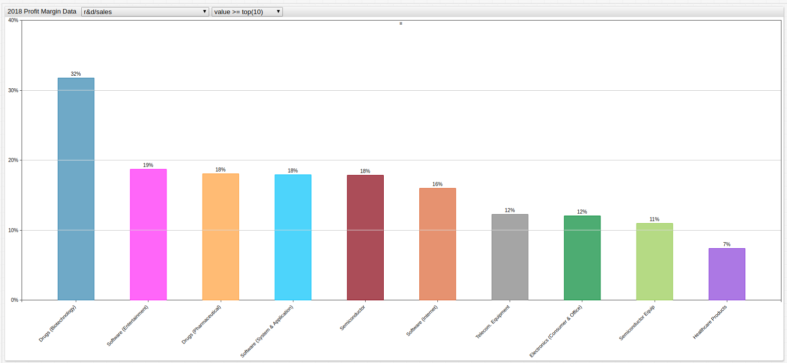

# Profit Margin by Industry Explorer


[](https://trends.axibase.com/54f3afeb)

*Fig 1.* Open the **Trends** explorer above to navigate through the visualization of the data used to for a recent AEI article written by economist Mike J. Perry.

## Data Overview

The **American Enterprise Institute** is a Washington D.C.-based think tank that is dedicated to researching issues of government, politics, economics, and social welfare. Recently, they published an article titles: *The Public Thinks the Average Company Makes a 35% Profit Margin Which is about 5x Too High*, which described the average American's perception of the profit margins that companies from various industries are able to make on a consistent basis.

The article drew information from a variety of polling agencies who had sampled large groups of the population and came away with the conclusion that the average American believes most companies, regardless of industry are consistently making profits on the order of 36%. Using data from NYU professor and researcher [Aswath Damodaran](http://people.stern.nyu.edu/adamodar/New_Home_Page/home.htm) AEI came to the conclusion that the average American's estimation was off by about 500%. They concluded that the average company makes around 7.9% after taxes and an entire percent lower, 6.9% if the financial industry is excluded.

## Metrics Legend

The metrics stored in ATSD follow the same naming patters as the [raw data](http://people.stern.nyu.edu/adamodar/New_Home_Page/datafile/margin.html) stored on Dr. Damodaran's website and are abbreviated as follows:

| Metric Name | Definition |
|:---|:---|
|`after-tax_lease_&_r&d_adj_margin`| Profit margin, after deducting taxes, overhead costs and research and development expenses.|
|`after-tax_lease_adjusted_margin`| Profit margin, after deducting taxes and overhead costs.|
|`after-tax_unadjusted_operating_margin`| Profit margin, after deducting only taxes.|
|`cogs/sales`| Cost of goods versus sales comparisons. This figure does not consider operating costs like taxes, overhead, or research and development.|
|`ebitda/sales`| Earnings before interest, taxes, depreciation, and amortization is abbreviated ABITDA. It refers to the net earnings of a company.|
|`ebitdar&d/sales`| The net earnings of a company, not including research and development.|
|`ebitdasg&a/sales`| The net earnings of a company not including sales, general, or administrative costs.|
|`gross_margin`| Sales revenue minus cost of goods, divided by sales revenue. The amount of value that is created by the industry compared to the intrinsic value of the product. |
|`lease_expense/sales`| Sales revenue minus the cost of goods, overhead, and sales staff, divided by sales revenue. The amount of value created by the industry, less their costs of creating such value. |
|`net_margin`| The final profit margin for the industry. This is the crucial metric for the AEI article.|
|`pre-tax_lease_&_r&d_adj_margin`| The adjusted profit margin before tax, overhead, and research and development. Adjusted for the cost of distribution and storage of goods.|
|`pre-tax_lease_adjusted_margin`| The adjusted profit margin before tax and overhead. Adjusted for the cost of distribution and storage of goods.|
|`pre-tax_unadjusted_operating_margin`| The unadjusted profit margin before tax. Not adjusted for distribution or storage of goods.|
|`r&d/sales`| The cost of research and development and sales staff for each industry. |
|`sg&a/_sales`| The sales, general, and administrative costs associated with each industry.|
|`stock-based_compensation/sales`| The amount of profit re-purposed as stock options for eligible employees. |

Using the [**Trends**](https://trends.axibase.com/) service and [SQL Console](https://axibase.com/docs/atsd/) tool, these data may be visualized and queried.

## Trading Value


[](https://trends.axibase.com/2eb832d7#fullscreen)

*Fig 2.* The above industries logged the highest profit margin based purely on marking up the price of their product relative to the cost it took to create and distribute it. **Metric:** `cogs/sales`.

Query:

```sql
SELECT tags.industry_name AS "Industry",
  value * 100 AS "Profit Margin (%)"
FROM "cogs/sales"
ORDER BY value DESC
LIMIT 10
```

| Industry                    | Profit Margin (%) |
|-----------------------------|-------------------|
| Farming/Agriculture         | 88.98             |
| Engineering/Construction    | 88.85             |
| Auto & Truck                | 87.78             |
| Oilfield Svcs/Equip.        | 86.95             |
| Healthcare Support Services | 85.66             |
| Reinsurance                 | 84.11             |
| Steel                       | 83.95             |
| Food Wholesalers            | 83.04             |
| Auto Parts                  | 82.36             |
| Paper/Forest Products       | 81.03             |

## Creating Value


[](https://trends.axibase.com/407829bc#fullscreen)

*Fig 3.* The above industries trade in goods that are intrinsically valueless but are deployed in such as way as to create value based on real-world transaction. Note that R.E.I.T. is an abbreviation for the real estate, investment, and trust industry. **Metric:** `gross_margin`.

Query:

```sql
SELECT tags.industry_name AS "Industry",
  value * 100 AS "Gross Margin (%)"
FROM "gross_margin"
ORDER BY value DESC
LIMIT 10
```

| Industry                               | Gross Margin (%) |
|----------------------------------------|-------------------|
| Bank (Money Center)                    | 100.00            |
| Banks (Regional)                       | 99.77             |
| Financial Svcs. (Non-bank & Insurance) | 81.50             |
| Drugs (Biotechnology)                  | 72.99             |
| Drugs (Pharmaceutical)                 | 70.96             |
| Investments & Asset Management         | 69.81             |
| Brokerage & Investment Banking         | 69.02             |
| Software (Internet)                    | 66.93             |
| Software (System & Application)        | 66.61             |
| Software (Entertainment)               | 66.18             |

## Developing Value


[](https://trends.axibase.com/be5ff3c6#fullscreen)

*Fig 4.* The above industries leverage complex development processes to use existing products in new and innovative ways to develop increased value. A new pharmecutical product, for example, may spend more than 10 years in clinical trials and development before it is approved to be used by the public. **Metric:** `r&d/sales`.

Query:

```sql
SELECT tags.industry_name AS "Industry",
  value * 100 AS "Profit Margin (%)"
FROM "r&d/sales"
ORDER BY value DESC
LIMIT 10
```

| Industry                        | Profit Margin (%) |
|---------------------------------|-------------------|
| Drugs (Biotechnology)           | 31.79             |
| Software (Entertainment)        | 18.73             |
| Drugs (Pharmaceutical)          | 18.09             |
| Software (System & Application) | 17.95             |
| Semiconductor                   | 17.82             |
| Software (Internet)             | 16.02             |
| Telecom. Equipment              | 12.24             |
| Electronics (Consumer & Office) | 12.05             |
| Semiconductor Equip             | 10.96             |
| Healthcare Products             | 7.41              |

## Market Totals


[](https://trends.axibase.com/c78e4e04#fullscreen)

*Fig 5.* The above visualization tracks market totals across all observed metrics. Use the drop-down menu to narrow the displayed metrics to the top ten, bottom ten, or use the `*` wildcard symbol to show them all. **Metric:** `*`.

Query:

```sql
SELECT metric AS "Profitability Metric", value * 100 AS "Profit Margin (%)"
FROM atsd_series
WHERE metric IN metrics ('stern.nyu.edu')
   AND (tags.industry_name = 'Total Market')
ORDER BY value DESC
```

| Profitability Metric                  | Profit Margin (%) |
|---------------------------------------|-------------------|
| cogs/sales                            | 63.43             |
| gross_margin                          | 36.57             |
| ebitdasg&a/sales                      | 31.34             |
| ebitdar&d/sales                       | 17.41             |
| sg&a/_sales                           | 16.32             |
| ebitda/sales                          | 15.02             |
| pre-tax_lease_&_r&d_adj_margin        | 10.70             |
| pre-tax_unadjusted_operating_margin   | 10.66             |
| pre-tax_lease_adjusted_margin         | 10.56             |
| after-tax_lease_&_r&d_adj_margin      | 9.64              |
| after-tax_unadjusted_operating_margin | 9.59              |
| after-tax_lease_adjusted_margin       | 9.50              |
| net_margin                            | 7.90              |
| r&d/sales                             | 2.39              |
| lease_expense/sales                   | 1.45              |
| stock-based_compensation/sales        | 0.98              |

## Top Ten Industries with the Highest Profit Margin


[](https://trends.axibase.com/f2a850a5#fullscreen)

*Fig 6.* The top ten industries with the highest profit margin with all factors considered are shown here. Use the drop-down menu to navigate through all metrics and see the top ten or bottom ten sectors for each one, or select the `*` wildcard character to view them all together. When doing so it is recommended to apply the setting `horizontal = true` by removing the `#` comment character from the configuration window. **Metric:** `net_margin`

Query:

```sql
SELECT tags.industry_name AS "Industry",
value * 100 AS "Profit Margin (%)"
FROM "net_margin"
ORDER BY value DESC
LIMIT 10
```

| Industry                               | Profit Margin (%) |
|----------------------------------------|-------------------|
| Tobacco                                | 43.37             |
| Financial Svcs. (Non-bank & Insurance) | 26.46             |
| Bank (Money Center)                    | 26.03             |
| R.E.I.T.                               | 24.44             |
| Software (Internet)                    | 23.83             |
| Banks (Regional)                       | 23.82             |
| Investments & Asset Management         | 22.54             |
| Beverage (Alcoholic)                   | 21.18             |
| Semiconductor Equip                    | 18.74             |
| Transportation (Railroads)             | 18.68             |

## Resources

* For an introduction to the **Trends** service, see this [guide](../../integrations/shared/trends.md);

* View complete SQL Console [documentation](https://axibase.com/docs/atsd/sql);

* To access the raw data used for this article, visit [Dr. Damodaran's page](http://people.stern.nyu.edu/adamodar/New_Home_Page/datafile/margin.html);

* For more use cases like this one, check out the [Axibase Use Cases Repository](https://github.com/axibase/atsd-use-cases) on GitHub;

* For help using these services, to submit your own visualizations, or suggest a great dataset, [raise an issue](https://github.com/axibase/atsd-use-cases/issues/new) on our GitHub page.
