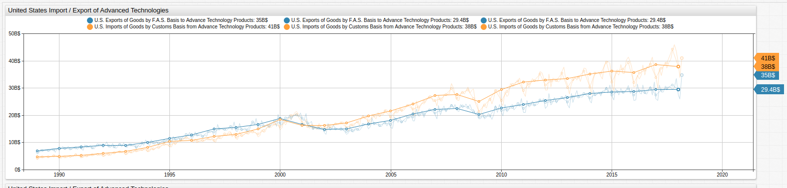
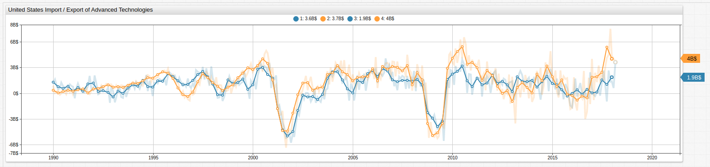

<!-- markdownlint-disable MD101 -->

# Going from Advanced Tech Exporter to Importer

The [Federal Reserve Economic Research Division](https://fred.stlouisfed.org/) of the St. Louis Federal Reserve tracks import and export statistics for the United States and other countries. The trade deficit has been in the spotlight recently as one of the primary talking points and working spaces of the current administration, with the goal of reversing the otherwise never-ending growth of American overseas expenditures. Axibase covered this phenomena back in [2017](../../research/us-international-trade/README.md), but a recent FRED [blog](https://fredblog.stlouisfed.org/2018/05/the-high-tech-trade-balance/) post, and all the attention the trade deficit has been receiving lately, certainly makes revisiting the topic relevant today.

## Advanced Technologies Defined

Advanced technologies are those technologies typically used by military or civilian government organizations for the purpose of national security. Put briefly, the three main industries covered by these data are aerospace technologies, nuclear technologies, and weaponry technologies. It seems logical that these industries be homegrown, but increasing growth in advanced technologies imports has shown that the exact opposite has been true since late 2000.

This visualization tracks the growing divide in advanced technologies imported into the country, and advanced technologies exported from the country. Expanding upon the above visualization, the difference between imports and exports in USD millions is shown below.

This visualization uses `alias` settings to capture raw data and `value` settings to create new calculated series. Periods with a trade deficit are highlighted in red using an `alert-expression`. For detailed information about syntax in the **Trends** environment, see [Visualization Documentation](https://axibase.com/products/axibase-time-series-database/visualization/widgets/).

## Tracking the Growth in Imports Against the Decline in Exports

**Trends** visualization service supports [user-defined functions](../../integrations/shared/trends.md#user-defined-functions) for ad hoc data transformations that may be performed inline without modifying the underlying data stored in ATSD.

### `fred.js` Library

A set of common econometrics used for modifying FRED, or other, economic data is the [`fred.js`](../../integrations/shared/trends.md#fred-library) library, which supports a series of pre-definied functions used to transform data such as advanced technologies import / export figures.

Using the `ChangeFromPreviousYear` function, data samples may be compared to the same `datetime` value from the previous year. This is a useful technique for mapping relative growth of a metric. The bold trend lines here have been averaged by quarter using `group-statistic` and `group-period` settings to account for the high month-to-month volatility in advanced technologies sales.

By creating an additional layer of `[series]` configurations the difference between monthly and quarterly data from the previous year sample can give even more context to the dataset.

## Advanced Technologies as a Portion of the Whole

Comparing overall trade balance data to advanced technologies shows that the deficit in advanced technologies industries has inarguably grown dramatically since 2004, when the United States became an overall importer of advanced technologies as opposed to an exporter.

Using `alias` settings once again, the impact of the advanced technologies exports as a percent of the total budget deficit may be explored. This value has increased to account for upwards of 10% of the overall deficit.

Because of the month-to-month volatility in advanced technology sales, grouping settings are used to average values quarterly and annually.

## Conclusion

Perhaps due increasing world tensions in the aftermath of the September 11th terrorist attacks on the World Trade Center in New York, the United States has backed away from its position as a global supplier of advanced technologies, but nonetheless, import levels continue to increase to the point where they represent a significant amount of the current government trade deficit.

With plans to increase munitions expenditures in its [next budget](https://www.defensenews.com/pentagon/2018/05/22/the-us-is-running-out-of-bombs-and-it-may-soon-struggle-to-make-more/), the Pentagon is already keenly aware of the potential pitfalls waiting should the United States fail to correct the current trend of bringing in products from these industries instead of creating them locally.

### Accessing Data

* Data is stored in the [**Trends**](../../integrations/shared/trends.md) instance of ATSD. To work with this or [other](https://trends.axibase.com/public/reference.html) datasets stored there, [reach out to us](https://axibase.com/feedback/), we're happy to provide them.
* The original FRED [blog post](https://fredblog.stlouisfed.org/2018/05/the-high-tech-trade-balance/) and the three datasets used in this article: [BOPGTB](https://fred.stlouisfed.org/series/BOPGTB), [EXP0007](https://fred.stlouisfed.org/series/EXP0007), and [IMP0007](https://fred.stlouisfed.org/series/IMP0007).
* Further [reading](https://www.brookings.edu/research/americas-advanced-industries-new-trends/) on growth in American advanced technologies industries.
