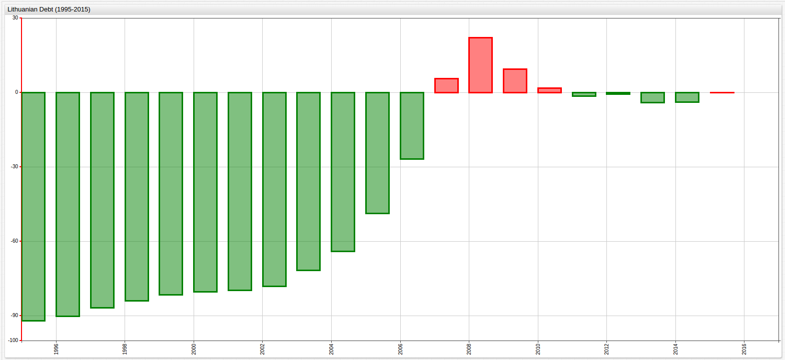

# Calculated Values in SQL Console and ChartLab

## Introduction

Raw data alone rarely contains enough information to answer meaningful questions. ATSD supports on the fly calculation in [**SQL Console**](https://axibase.com/docs/atsd/sql/) and [Charts](https://github.com/axibase/charts) services.

This article describes using the [`replace-value`](https://axibase.com/products/axibase-time-series-database/visualization/widgets/configuring-the-widgets/) in [**ChartLab**](../shared/chartlab.md) and [`LAG`](https://axibase.com/docs/atsd/sql/#lag) function in **SQL Console** to calculate percent change for a given dataset.

## Data

Data in this article is collected by entity [Eurostat](https://ec.europa.eu/eurostat) tracking [European Union Debt by Country](../../research/data-lib/eu-debt/README.md),
recorded in the [Axibase Data Library](https://axibase.com/use-cases/research/#data-library).

```sql
SELECT date_format(time, 'yyyy') AS "Year", value AS "Debt (Million Euro)"
  FROM lithuania
```

| Year | Debt (Million Euro) |
|------|---------------------|
| 1995 | 1632.0              |
| 1996 | 2034.9              |
| 1997 | 2734.3              |
| 1998 | 3306.2              |
| 1999 | 3790.3              |
| 2000 | 4028.1              |
| 2001 | 4162.2              |
| 2002 | 4517.3              |
| 2003 | 5822.8              |
| 2004 | 7372.5              |
| 2005 | 10539.2             |
| 2006 | 15023.2             |
| 2007 | 21689.8             |
| 2008 | 25084.0             |
| 2009 | 22449.2             |
| 2010 | 20892.0             |
| 2011 | 20239.2             |
| 2012 | 20381.5             |
| 2013 | 19715.7             |
| 2014 | 19748.3             |
| 2015 | 20525.2             |


[](https://apps.axibase.com/chartlab/82713e8a/#fullscreen)

To calculate the percent growth of Lithuanian debt over the 20-year observation period, use common baselines. Three common baselines are as follows:

* Previous Year Baseline (PYB)
* Average Value Baseline (AVB)
* Final Year Baseline (FYB)

### Previous Year Baseline

```sql
SELECT date_format(time, 'yyyy') AS "Year", value AS "Debt (Million Euro)", 100*((value)/LAG(value)-1) AS "Percent Change (PYB)"
  FROM lithuania
ORDER BY datetime
```

The underlying formula in this query is simple:

`100 * [(x/y)-1]`

Where,

`x = current year debt amount, and y = previous year debt amount`

```ls
| Year | Debt (Million Euro) | Percent Change (PYB) |
|------|---------------------|----------------------|
| 1995 | 1632.00             | null                 |
| 1996 | 2034.90             | 24.69                |
| 1997 | 2734.30             | 34.37                |
| 1998 | 3306.20             | 20.92                |
| 1999 | 3790.30             | 14.64                |
| 2000 | 4028.10             | 6.27                 |
| 2001 | 4162.20             | 3.33                 |
| 2002 | 4517.30             | 8.53                 |
| 2003 | 5822.80             | 28.90                |
| 2004 | 7372.50             | 26.61                |
| 2005 | 10539.20            | 42.95                |
| 2006 | 15023.20            | 42.55                |
| 2007 | 21689.80            | 44.38                |
| 2008 | 25084.00            | 15.65                |
| 2009 | 22449.20            | -10.50               |
| 2010 | 20892.00            | -6.94                |
| 2011 | 20239.20            | -3.12                |
| 2012 | 20381.50            | 0.70                 |
| 2013 | 19715.70            | -3.27                |
| 2014 | 19748.30            | 0.17                 |
| 2015 | 20525.20            | 3.93                 |
```

`LAG` function returns a [`NULL`](https://axibase.com/docs/atsd/sql/#null) value when no  data sample is found.

Use the `replace-value` setting to apply the same calculation in **ChartLab**. Open the Editor window in ChartLab and see the setting on line 16.

```javascript
replace-value = (value/previousValue-1)*100
```

Track positive debt growth with an [`alert-expression`](https://axibase.com/products/axibase-time-series-database/visualization/widgets/time-chart/#tab-id-14).


[](https://apps.axibase.com/chartlab/82713e8a/5/#fullscreen)

See lines 17 and 18 for `alert-expression` syntax.

```javascript
alert-expression = value < 0
alert-style = fill: green
```

This setting renders all incidences of negative debt growth (or debt growth less than 0) as green, while positive debt growth
is rendered in red.

### Average Value Baseline

```sql
SELECT AVG(value) AS "Debt (Million Euro)"
  FROM lithuania
```

| Debt (Million Euro) |
|---------------------|
| 12175.6             |

Use this value as a baseline.

```sql
SELECT date_format(time, 'yyyy') AS "Year", value AS "Debt (Million Euro)", (100*((value)/12175.6-1)) AS "Percent Change (AVB)"
  FROM lithuania
ORDER BY datetime
```

| Year | Debt (Million Euro) | Percent Change (AVB) |
|------|---------------------|----------------------|
| 1995 | 1632.0              | -86.6                |
| 1996 | 2034.9              | -83.3                |
| 1997 | 2734.3              | -77.5                |
| 1998 | 3306.2              | -72.8                |
| 1999 | 3790.3              | -68.9                |
| 2000 | 4028.1              | -66.9                |
| 2001 | 4162.2              | -65.8                |
| 2002 | 4517.3              | -62.9                |
| 2003 | 5822.8              | -52.2                |
| 2004 | 7372.5              | -39.4                |
| 2005 | 10539.2             | -13.4                |
| 2006 | 15023.2             | 23.4                 |
| 2007 | 21689.8             | 78.1                 |
| 2008 | 25084.0             | 106.0                |
| 2009 | 22449.2             | 84.4                 |
| 2010 | 20892.0             | 71.6                 |
| 2011 | 20239.2             | 66.2                 |
| 2012 | 20381.5             | 67.4                 |
| 2013 | 19715.7             | 61.9                 |
| 2014 | 19748.3             | 62.2                 |
| 2015 | 20525.2             | 68.6                 |

Use a similar `replace-value` setting in **ChartLab**.

```javascript
replace-value = (value/12175.6-1)*100
```

Apply an `alert-expression` to track years by percent deviation from the calculated average value.


[](https://apps.axibase.com/chartlab/82713e8a/4/#fullscreen)

### Final Year Baseline

to calculate debt growth using a FYB, the following queries are used:

```sql
SELECT last(value) AS "Final Year Baseline"
  FROM lithuania
```

| Final Year Baseline |
|---------------------|
| 20525.2             |

Again, insert the value into the percent change calculation.

```sql
SELECT date_format(time, 'yyyy') AS "Year", value AS "Debt (Million Euro)", (100*(value/20525.2-1)) AS "Percent Change (FYB)"
  FROM lithuania
GROUP BY datetime, value
  ORDER BY datetime
```

| Year | Debt (Million Euro) | Percent Change (FYB) |
|------|---------------------|----------------------|
| 1995 | 1632.0              | -92.0                |
| 1996 | 2034.9              | -90.1                |
| 1997 | 2734.3              | -86.7                |
| 1998 | 3306.2              | -83.9                |
| 1999 | 3790.3              | -81.5                |
| 2000 | 4028.1              | -80.4                |
| 2001 | 4162.2              | -79.7                |
| 2002 | 4517.3              | -78.0                |
| 2003 | 5822.8              | -71.6                |
| 2004 | 7372.5              | -64.1                |
| 2005 | 10539.2             | -48.7                |
| 2006 | 15023.2             | -26.8                |
| 2007 | 21689.8             | 5.7                  |
| 2008 | 25084.0             | 22.2                 |
| 2009 | 22449.2             | 9.4                  |
| 2010 | 20892.0             | 1.8                  |
| 2011 | 20239.2             | -1.4                 |
| 2012 | 20381.5             | -0.7                 |
| 2013 | 19715.7             | -3.9                 |
| 2014 | 19748.3             | -3.8                 |
| 2015 | 20525.2             | 0.0                  |



[](https://apps.axibase.com/chartlab/82713e8a/6/#fullscreen)

The above graph shows percent deviation for Lithuanian government debt using the final year (2015) as a baseline.