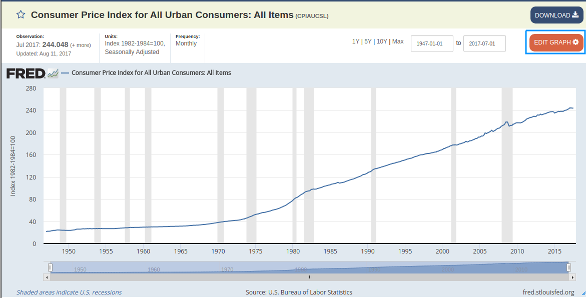
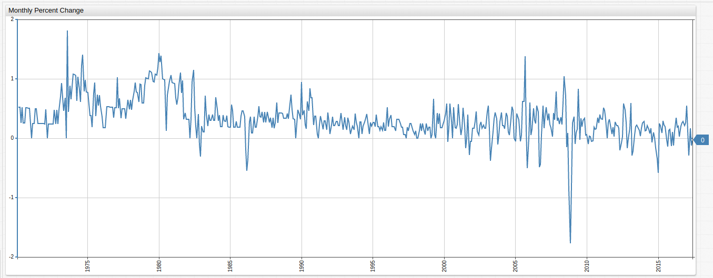
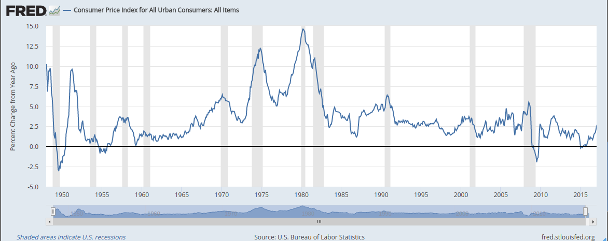
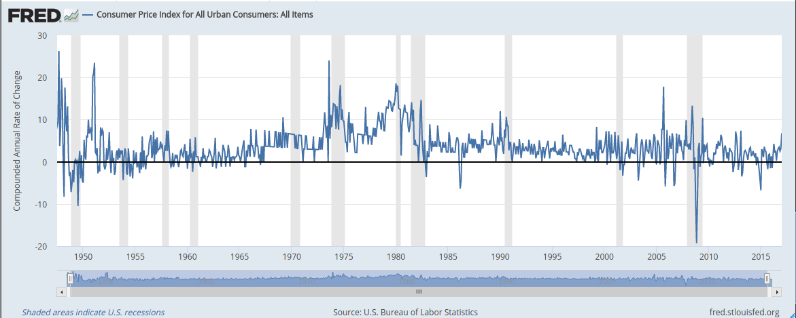

# Analyzing Econometric Datasets with Calculated Series


## Summary

[Calculated values](../add-calculated-value/README.md) in [**ChartLab**](https://apps.axibase.com/chartlab)
are useful for creating multiple visualizations from one set data. [Axibase Time Series Database](https://axibase.com/docs/atsd/)
supports a range of in-built functions which allow end-users to manipulate a dataset.

The St. Louis branch of the Federal Reserve branch maintains [Federal Reserve Economic Data](https://fred.stlouisfed.org/) (FRED), an
open-access platform for analyzing the data collected and published by the Federal Reserve. One important metric tracked
by FRED is **CPIAUCSL**: [Consumer Price Index](https://fred.stlouisfed.org/series/CPIAUCSL#0), or CPI. The Consumer Price Index tracks inflation by measuring the costs of goods.

## Problem Brief

Replicate and modify the FRED [CPI visualization](https://fred.stlouisfed.org/series/CPIAUCSL#0) using **ChartLab**.

Modify the FRED visualization by clicking **EDIT GRAPH** and selecting the desired transformation. To learn more about how any of the metrics are calculated from the underlying data, [What Formulas are Used to Calculate Growth Rates?](https://fredhelp.stlouisfed.org/fred/data/understanding-the-data/formulas-calculate-growth-rates/)
provides information about the underlying mathematics.

A brief tutorial on data modification in the FRED interface is shown below:



* Open the transformation interface by clicking **EDIT GRAPH**.


* From the **Units** drop-down list, select the desired transformation.


* Modify any sub-features of the transformation as needed.

## Solution

A side-by-side comparison of each feature of the Consumer Price Index transformation is shown below, as well as links to the accompanying
visualizations.

Note that because ATSD supports storing historical data from the year 1970 onward while the Federal Reserve tracks
data from 1947 onward, small scale differences are expected in the outputs of each graph.

## Index

* [Consumer Price Index](#consumer-price-index)
* [Monthly Change](#monthly-change)
* [CPI Calculated from a Variable Baseline](#cpi-calculated-from-a-variable-baseline)
* [Change from a Year Ago](#change-from-a-year-ago)
* [Monthly Percent Change](#monthly-percent-change)
* [Monthly Percent Change from a Year Ago](#monthly-percent-change-from-a-year-ago)
* [Compounded Annual Rate of Change](#compounded-annual-rate-of-change)
* [Continuously Compounded Rate of Change](#continuously-compounded-rate-of-change)
* [Continuously Compounded Annual Rate of Change](#continuously-compounded-annual-rate-of-change)
* [Natural Logarithm of CPI](#natural-logarithm-of-cpi)
* [Max Index](#max-index)

### Consumer Price Index

**Figure 1**: Consumer Price Index for Baseline Year 1982 (1947-2017) **FRED**


[**View FRED Graph**](https://fred.stlouisfed.org/graph/?graph_id=402645)

**Figure 1**: Consumer Price Index (1970-2017) **ATSD**


[](https://apps.axibase.com/chartlab/383632d5/#fullscreen)

Return to the [Index](#index)

### CPI Calculated from a Variable Baseline

The index is the baseline year when performing calculations. Years showing an increase in the cost of consumer
goods are therefore greater than 100.00 while years exhibiting deflation in the cost of consumer goods based on the index are less than 100.00.

**Figure 2.2**: CPI Calculated from a Variable Baseline (1990-07-01) **FRED**


[**View FRED Graph**](https://fred.stlouisfed.org/graph/?graph_id=402648)

**Figure 2.1**: CPI Calculated from a Variable Baseline (1990-07-01) **ATSD**


[](https://apps.axibase.com/chartlab/978c79b4/4/#fullscreen)

In **ChartLab**, use the drop-down list at the top of the visualization to select the year to be used as a baseline, or hardcode
a year not included in the dropdown by modifying one of the dates in the `keyDates` list.

Key Components of This Visualization:

> Open the ChartLab visualization shown above and view the Editor window to see these features of the chart.

* The list `keyDates` contains the same dates as the FRED chart referenced in the [Problem Brief](#problem-brief):

```javascript
list keyDates = 1970-11-01,
  1973-11-01, 1975-03-01,
  1980-01-01, 1980-07-01,
  1981-07-01, 1982-11-01,
  1990-07-01, 1991-03-01,
  2001-03-01, 2001-11-01,
  2007-12-01, 2009-06-01
endlist
```

* These dates are displayed in the drop-down list. The dates represent the official start dates of recessions throughout U.S. history.

The syntax for this drop-down list is shown below:

```ls
  [dropdown]
    on-change = widget.config.series[0].value = this.value; widget.replaceSeries(widget.config.series);
    for date in keyDates
      [option]
        text = Index (Scale to 100 for @{date})
        value = value("cpi") / value("cpi_@{date}") * 100 || null
    endfor
```

> For more information about the above syntax see the [Charts Documentation](https://axibase.com/products/axibase-time-series-database/visualization/widgets/dropdown/).

By modifying any of the dates contained in the `keyDates` list above, the user can select any desired date to set as the
baseline value, and the `value` equation contained in the `[option]` portion of the `[dropdown]` configuration above uses
a simple formula to establish the new index.

The `on-change` setting defines this newly calculated series, and is explained piecewise below:

* `widget.config.series[0]` selects the series to be replaced. Series are indexed beginning with `0` and increasing by a single step for each additional series (`0`,`1`,`2`,`3`....). There is only one underlying series in this visualization.
* `value = this.value` assigns a user-defined value, the option selected in the drop-down list, as the value for the series defined in the the `widget.config` portion of the script. `this` defines the specific object to be modified, in this case the drop-down list.
* `widget.replaceSeries(widget.config.series)` replaces the underlying values of the original series defined as a parameter of the function, with the newly calculated values defined in the `[option]` setting.

Return to the [Index](#index)

### Monthly Change

The monthly numerical change in CPI value over the observed period.

**Figure 3.1**: Monthly Change (1947-2017) **FRED**


[**View FRED Graph**](https://fred.stlouisfed.org/graph/?graph_id=402654)

**Figure 3.2**: Monthly Change (1970-2017) **ATSD**


[](https://apps.axibase.com/chartlab/5267b4a7/2/#fullscreen)

Underlying Formula:

```javascript
value = delta("cpi", "1 month")
```

* This setting uses the [`delta`](https://axibase.com/products/axibase-time-series-database/visualization/widgets/configuring-the-widgets/aggregators/) function.

Return to the [Index](#index)

### Change From a Year Ago

The numerical change in CPI value from the same month of the previous year.

**Figure 4.1**: Change From Previous Year (1947-2017) **FRED**


[**View FRED Graph**](https://fred.stlouisfed.org/graph/?graph_id=402657)

**Figure 4.2**: Change From Previous Year (1970-2017) **ATSD**


[](https://apps.axibase.com/chartlab/5267b4a7/#fullscreen)

Underlying Formula:

```javascript
value = var v = value('cpi'); var p = value('prev_cpi'); if(p != null && v != null) return v - p;
```

* This setting uses a second underlying series to select values of the Consumer Price Index from one year ago using a [`time-offset`](https://axibase.com/products/axibase-time-series-database/visualization/widgets/time-chart/) setting and comparing the data to the current year values.

Return to the [Index](#index)

### Monthly Percent Change

The monthly percentile change in CPI value over the entire observed period.

**Figure 5.1**: Monthly Percent Change (1947-2017) **FRED**


[**View FRED Graph**](https://fred.stlouisfed.org/graph/?graph_id=402658)

**Figure 5.2**: Monthly Percent Change (1970-2017) **ATSD**



[](https://apps.axibase.com/chartlab/ab06efab/#fullscreen)

Underlying Formula:

```javascript
value = (value("cpi") / previous("cpi") - 1) * 100
```

* This setting uses the `previous()` function.

Return to the [Index](#index)

### Monthly Percent Change From a Year Ago

The percentile change in CPI from the same month of the previous year.

**Figure 6.1**: Monthly Percent Change From Previous Year (1947-2017) **FRED**



[**View FRED Graph**](https://fred.stlouisfed.org/graph/?graph_id=402660)

**Figure 6.2**: Monthly Percent Change From Previous Year (1970-2017) **ATSD**


[](https://apps.axibase.com/chartlab/4f192b00/#fullscreen)

Underlying Formula:

```javascript
value = var v = value('cpi'); var p = value('prev_cpi'); if(p!=null && v!=null) return (v / p - 1) * 100
```

Return to the [Index](#index)

### Compounded Annual Rate of Change

The mean annual rate of change for the Consumer Price Index.

**Figure 7.1**: Compounded Annual Rate of Change (1947-2017) **FRED**



[**View FRED Graph**](https://fred.stlouisfed.org/graph/?graph_id=402666)

**Figure 7.2**: Compounded Annual Rate of Change (1970-2017) **ATSD**


[](https://apps.axibase.com/chartlab/f6fee48e/#fullscreen)

Underlying Formula:

```javascript
value = (Math.pow(( value("cpi") / previous("cpi") ), 12) - 1) * 100
 ```

* This setting uses the built-in [`Math`](https://developer.mozilla.org/en-US/docs/Web/JavaScript/Reference/Global_Objects/Math) javascript object.

Return to the [Index](#index)

### Continuously Compounded Rate of Change

The mean rate of change for the Consumer Price Index compounded continuously.

**Figure 8.1**: Continuously Compounded Rate of Change (1947-2017) **FRED**


[**View FRED Graph**](https://fred.stlouisfed.org/graph/?graph_id=402668)

**Figure 8.2**: Continuously Compounded Rate of Change (1970-2017) **ATSD**


[](https://apps.axibase.com/chartlab/cae3b970/#fullscreen)

Underlying Formula:

```javascript
value = ( Math.log(value("cpi")) - Math.log(previous("cpi")) ) * 100
```

Return to the [Index](#index)

### Continuously Compounded Annual Rate of Change

 The annual rate of change compounded continuously for the observed period.

**Figure 9.1**: Continuously Compounded Annual Rate of Change (1947-2017) **FRED**


[**View FRED Graph**](https://fred.stlouisfed.org/graph/?graph_id=402818)

**Figure 9.2**: Continuously Compounded Annual Rate of Change (1970-2017) **ATSD**


[](https://apps.axibase.com/chartlab/225e74f9/#fullscreen)

Underlying Formula:

```javascript
value = ( Math.log(value("cpi")) - Math.log(previous("cpi")) ) * 100 * 12
```

Return to the [Index](#index)

### Natural Logarithm of CPI

The logarithm of each value set to base of the mathematical constant _e_

**Figure 10.1**: Natural Logarithm of CPI (1947-2017) **FRED**


[**View FRED Graph**](https://fred.stlouisfed.org/graph/?graph_id=402819)

**Figure 10.2**: Natural Logarithm of CPI (1970-2017) **ATSD**


[](https://apps.axibase.com/chartlab/d2ced747/#fullscreen)

 Underlying Formula:

```javascript
value = Math.log(value("cpi"))
```

Return to the [Index](#index)

### Max Index

Indexes the Consumer Price Index by maximum and most recent value.

**Figure 11.1**: CPI with Most Recent Data as Index (1947-2017) **FRED**


[**View FRED Graph**](https://fred.stlouisfed.org/graph/?graph_id=402820)

**Figure 11.2**: CPI with Most Recent Data as Index (1970-2017) **ATSD**


Underlying Formula:

```javascript
value = value("cpi") / value("cpi_max") * 100 || null
```

Return to the [Index](#index)