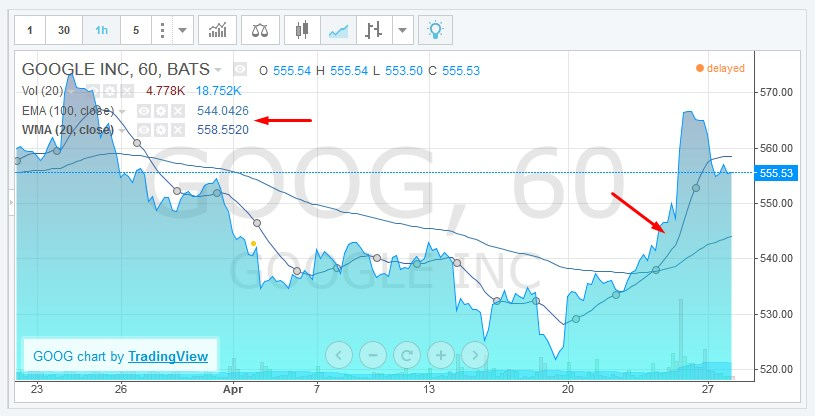

# Combining Periodic and Sliding Windows

## Fixed Period Aggregation

The range of techniques to analyze trends and minimize noise in time series is extensive. One of the most common approaches is to regularize time series by applying a grouping function to observations made within each fixed-duration period. This transformation is called aggregation and it can be applied to raw series to calculate hourly averages from irregular samples, for example. Each period in such an example starts at exactly `0` minutes `0` seconds each hour and has a duration of 60 minutes. The period includes all values that occurred between `HH:00:00.000` and `HH:59:59.999`.

The most commonly used aggregation functions:

* Sum
* Minimum
* Maximum
* Median
* Average / Mean
* Percentile (0 to 100%)
* Standard Deviation
* Variance

In relational databases aggregation for specific periods such as one minute, one hour, one day, one month, and one year can be easily computed with `GROUP BY` function by formatting a timestamp with a truncated datetime pattern. Any other period is more difficult to implement and the query often involves database-specific syntax and nested queries.

```sql
SELECT server, AVG(cpu_busy), TO_CHAR(sample_time, 'YYYY-MM-DD HH24')
FROM metrics_os_intraday GROUP BY server, TO_CHAR(sample_time, 'YYYY-MM-DD HH24')
```

On the other hand, non-relational time series databases are built with support for custom aggregation periods and allow the user to easily specify any period. In ATSD the period is specified with `interval = [count] [unit]` format, for example: `interval = 15 minute`. The aggregation period can be also customized interactively using aggregation controls in time series chart.

List of aggregators supported in [ATSD](https://axibase.com/docs/atsd/api/data/aggregation.html):

* `COUNT`
* `MIN`
* `MAX`
* `AVG`
* `SUM`
* `PERCENTILE`
* `STANDARD_DEVIATION`
* `FIRST`
* `LAST`
* `DELTA`
* `WAVG`
* `WTAVG`
* `THRESHOLD_COUNT`
* `THRESHOLD_DURATION`
* `THRESHOLD_PERCENT`

## Sliding Window Aggregation

Sliding window aggregation is closely related to moving average which is another widely used method to smooth effects of individual observations and to display trends behind raw data. Such an average is computed for the last `n` samples, or for samples taken during the last `n` minutes.
In both cases, the calculation relies on the concept of a count-based or time-based sliding window whose boundaries are continuously adjusted as you progress along the timeline.

WINDOW TYPE | EXAMPLE | DESCRIPTION
:--:|:--:|:--:|:--:
`count` | `average(100)` | Average value of the last 100 samples.
`time` | `average(’15 minute’)` | Average value of all samples collected during the last 15 minutes.

There are different types of moving averages with better control over smoothing with linear, geometric or exponentially decreasing weights (see [Wikipedia](https://en.wikipedia.org/wiki/Moving_average)). Likewise, it is possible to utilize any grouping function such as `percentile(95)` instead of average.

In terms of visualization, moving averages are often displayed alongside raw values and the chart can include multiple moving averages for different time intervals. This is especially common in technical analysis used in finance and econometrics.



**Source**: [Trading View](https://www.tradingview.com/stock-charts/)

The product of sliding window aggregation is not the same as periodic aggregation. Moving average series contains the same timestamps as the underlying raw series which means that such series can be irregular and contain an arbitrarily large number of samples.

## Combined Aggregation

Scenarios when it is beneficial to combine periodic and sliding aggregates in one representation exist.

Consider the case of CPU utilization where you need to display hourly CPU averages over the last 24 hours and display values for the current hour since incoming data is streaming continuously. If you compute periodic aggregations, the average for the last and most current hour is quite volatile at the beginning of the hour because the grouping function is computed for only the first few samples. As a result, end users receive false alarms for sudden changes in monitored metrics at the start of every hour.


Consider the above example. Notice how average for the last hour spikes from 5% to 23% and back within a matter of several minutes. This can raise false positive alerts, particularly if the underlying metric is collected at high frequency and exhibits significant variance.

The solution is to implement a `moving-average` setting, which controls how the aggregate for the most recent period is calculated. If `moving-average` is enabled, the last period is computed as a sliding window. The end of the sliding window is equal to last sample time, and the length of the window equals aggregation period. This allows you to smooth aggregate values displayed at the beginning of the period. This [setting](https://axibase.com/products/axibase-time-series-database/visualization/widgets/time-chart/#settings) is useful and enabled by default.

[ChartLab](../shared/chartlab.md) is a data visualization service which uses ATSD for data monitoring and storage tasks which is tracking CPU utilization right now.

[](http://apps.axibase.com/chartlab/7edd79fe/5/)