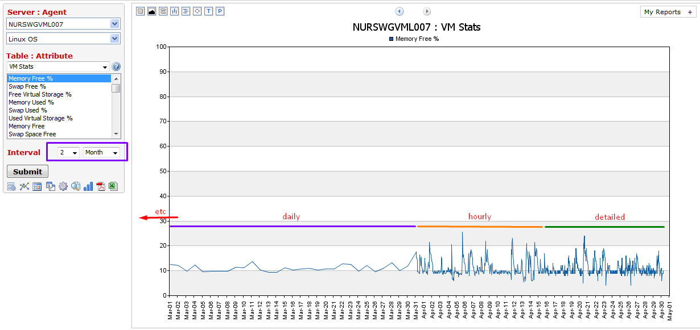
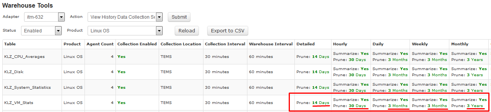
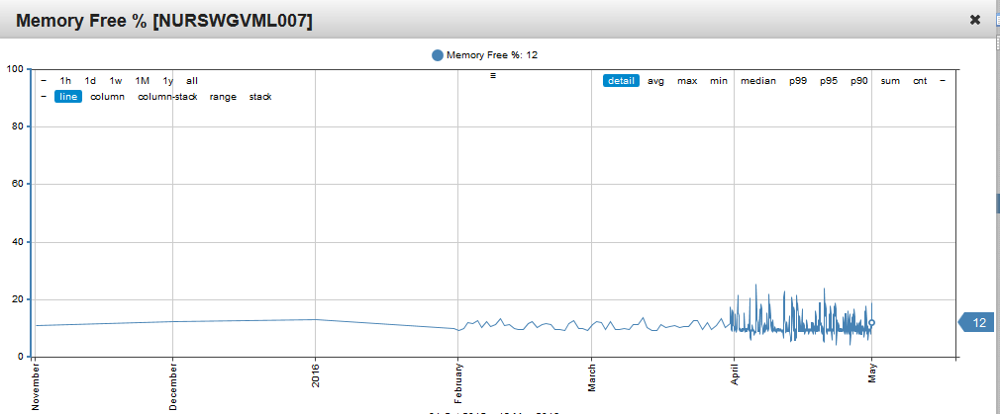
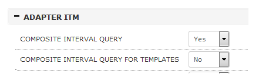

# Composite Interval Queries in Axibase Enterprise Reporter

The latest [Axibase Enterprise Reporter](https://axibase.com/products/axibase-enterprise-reporter/) release provides a highly requested composite query capability for customers using [IBM Tivoli Monitoring](https://www.ibm.com/support/knowledgecenter/en/SSTFXA_6.3.0/com.ibm.itm.doc_6.3/install/itm_over.htm) `6.x` adapters.

This enables AER to merge statistics from multiple tables when the requested interval is outside of retention period for the selected table.

For instance, if a user requests a two month chart from a detailed table which is pruned after two weeks, AER loads historical data for earlier periods from summarized tables: hourly, daily, etc.

These background queries are executed transparently for the end user and the choice of tables is based on history pruning settings defined in ITM.

This capability is relevant for warehouse and metrics databases that implement a tiered data retention schema where detailed data is deleted after some time period to reduce the amount of disk space consumed. This includes IBM Tivoli Monitoring (TDW), Microsoft Systems Center Operations Manager SCOM DWH, VMWare vSphere vCenter, Oracle Enterprise Manager, and most other infrastructure monitoring tools.

Composite queries are supported in widgets and multi-server report formats:

**COMPOSITE INTERVAL QUERY** is enabled by default for all queries except template reports.

Review intervals specified in template reports to ensure that query intervals are within the retention interval of the underlying table.

Once this is verified, set **COMPOSITE INTERVAL QUERY FOR TEMPLATES** to **Yes** in **Admin > Settings**.
