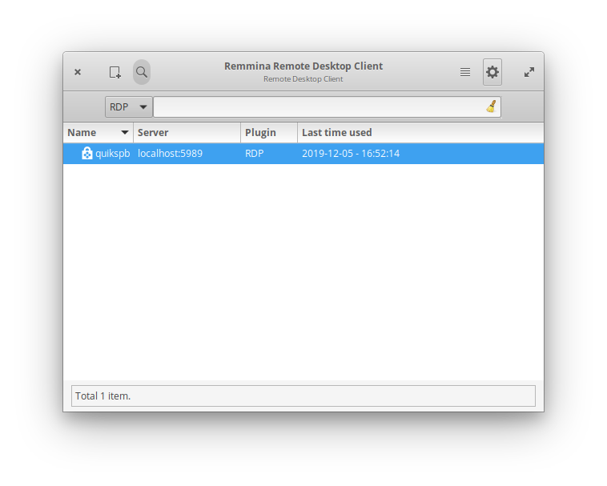
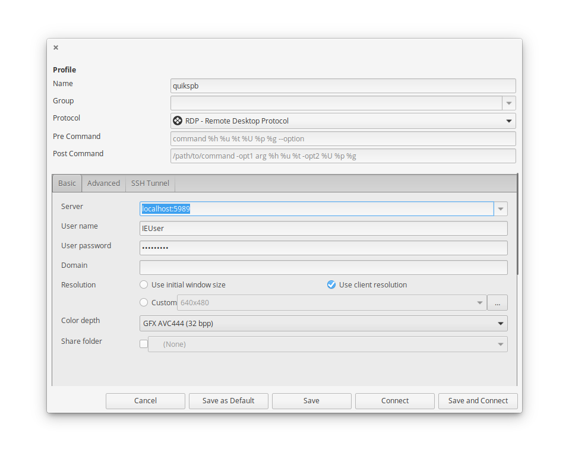
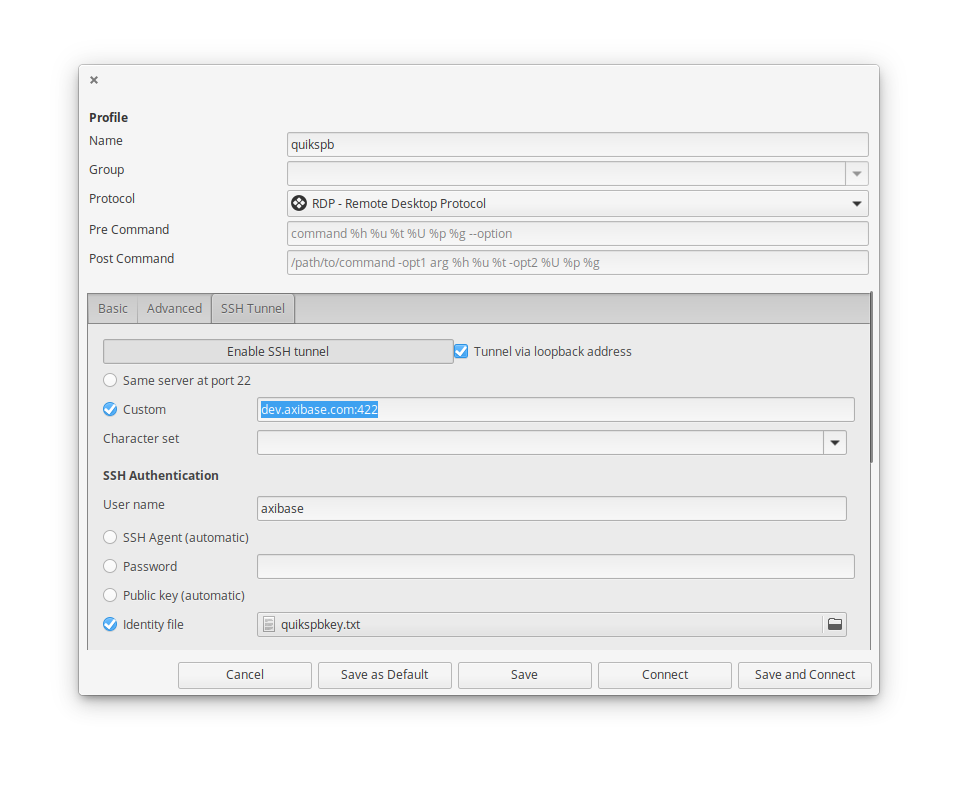
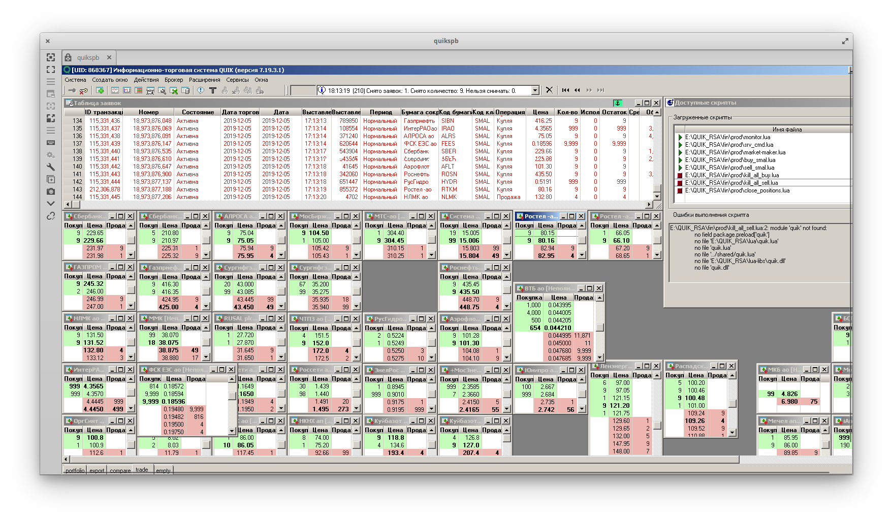

# Подключение к Windows машине по `RDP`

1. [Установить клиент Remmina](https://remmina.org/how-to-install-remmina/) для своей версии Ubuntu.

2. Перезагрузить компьютер.

3. Запустить Remmmina

4.Добавить Следующую конфигурацию соединения:

- **Name** : `quikspb`
- **Protocol** : `RDP`
- _Basic_
  - **Server** :`localhost:5989`
  - **User name** : `IEUser`
  - **User password**: `Xa3293215`
  - **Resolution**: `Use client resoltion`
    
- _SSH Tunnel_
  - Click **Enable SSH Tunnel**
  - **Tunnel via loopback address**: `Chcecked`
  - **Custom**: `dev.axibase.com:422`
  - **User Name**: `axibase`
  - **Identity file**: `/path/to/identity/file`
    

5. Нажать `Save and Connect`

6. При успешном соединении откроется окном с экземпляром Windows

