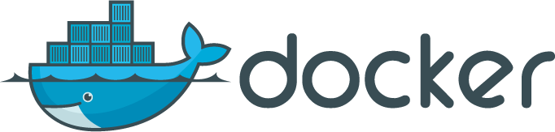
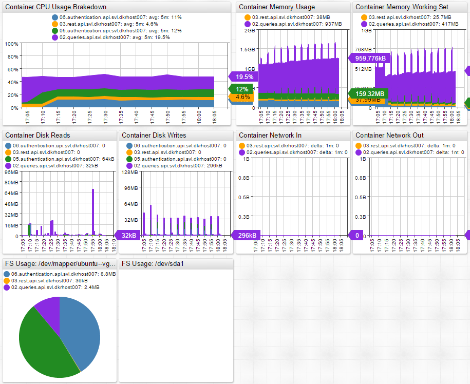
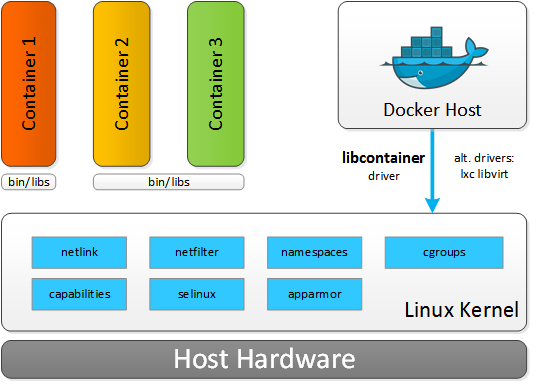
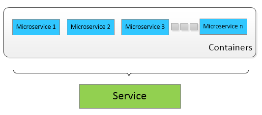
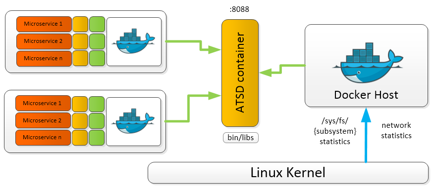

# Monitoring Docker Containers



In recent months, Docker is the hot topic in Server Infrastructure and DevOps conversations. It seems like everyone is either deploying on Docker, integrating with Docker, or developing for Docker. It is an understandable position: Linux containers provide many of benefits for developers while allowing the operations team to manage infrastructure as a homogeneous pool of computing resources, as opposed to siloed, host-based installations.

## Summary

Are you already familiar with Docker and Linux containers? Do you need to monitor containerized services for availability and performance without resorting to legacy approaches such as using host naming conventions or scheduled CMDB discovery?

Adopt a policy of assigning [container labels](https://docs.docker.com/engine/userguide/labels-custom-metadata/) to monitor your services based on a combination of built-time and run-time metadata.

Leverage the fact that container labels override image labels by delegating labeling responsibilities to operations and development teams.

For build-time metadata, collaborate with developers to ensure that Dockerfiles include labels classifying images with service, application, product, function, and versioning information.

```txt
FROM ubuntu:14.04
MAINTAINER ATSD Developers <dev-atsd@axibase.com>
ENV version 12.1.2

#metadata
LABEL com.axibase.vendor="Axibase Corporation" \
  com.axibase.product="Axibase Time Series Database" \
  com.axibase.code="ATSD" \
  com.axibase.function="database" \
  com.axibase.revision="${version}"</dev-atsd@axibase.com>
```

See ATSD [Dockerfile](https://github.com/axibase/dockers/blob/master/Dockerfile) as an example.

On the operating side, assign runtime labels when starting containers:

```sh
docker run \
  --detach \
  --name=atsd \
  --publish 8443:8443 \
  --label=com.axibase.service=metrics \
  --label=com.axibase.business-unit=monitoring \
  --label=com.axibase.region=us-east-1 \
  --label=com.axibase.zone=us-east-1b \
  --label=com.axibase.environment=production \
  axibase/atsd:latest
```

Whether or not you manually assign container labels using deployment scripts or through orchestration frameworks such as [Kubernetes](http://kubernetes.io/) or [Mesos](http://mesos.apache.org/documentation/latest/docker-containerizer/) that manage containers on a large fleet of machines is an implementation detail that is specific to each organization.

Once you have container labeling in place, you can create roll-up dashboards and configure alerting without referring to hostnames or container ids and aliases.

Instead, containers can be grouped and filtered based on labels using expressions.

```sh
tags['com.axibase.service'] == 'metrics' &amp;&amp; tags['com.axibase.environment'] == 'production'
```

> Tags contain [ATSD](https://axibase.com/docs/atsd/) terms.

This expression groups all containers that support `metrics` service in production. New containers are automatically added to the roll-up. When a container is stopped, it is not removed from the group, allowing you to see detailed historical data for the selected service.

Grouping based on metadata allows you to build roll-up portals. Below is an example of a portal for `API` service containers running in the `SVL` data center. You can see the API service broken down by container, which gives insight into the overall service performance and the performance of individual microservices.



See [Writing Docker Data](https://axibase.com/products/axibase-time-series-database/writing-data/docker/) for deployment instructions.

## Docker

The Docker set of tools includes a runtime engine for managing containers, a layered file system format, and a publicly hosted registry of images for widely used off-the-shelf applications. In basic terms, the Docker engine provides automation for the deployment of applications inside Linux containers.

Resource isolation features of the Linux kernel, such as `cgroups`, namespaces, and `chroot`, allow groups of processes to have a private view of the system and run independently on a single Linux host. This architecture allows you to avoid the overhead of starting and running several virtual machines (VMs). Since VMs run on a Host OS, each new application needs to start a Guest OS. This process does not scale well for microservice architectures, where the footprint of services is smaller but at the count is greater. In Docker, you simply start applications as a group of processes that remain separate from one another while sharing underlying computing resources.

When comparing Linux containers with virtual machines, VMs require more resources but provide better isolation since VM Hypervisors emulate the full operating system stack including virtual hardware. Containers, on the other hand, run on a shared operating system. Containers leave most of the VM bulk behind, VM sizes can often reach tens of gigabytes, in favor of a miniature package that contains the application and dependencies. As a result, a Docker host can run many more applications on identical hardware.



## Linux Containers

Containers are wrapped-up applications and pieces of software that include all dependencies but use a shared kernel with other containers. Essentially, containers are isolated sets of processes in the userspace on the host operating system. While Hypervisors abstract the entire device, containers just abstract the operating system kernel. One important limitation is the fact that all containers running on a single machine must use the same kernel, Host OS, whereas with Hypervisors each VM can run its own Guest OS with different kernels.

Another key difference between containers and VMs is execution speed. Launching a VM can take several minutes and is often very resource intensive. As such, launching several VMs requires some planning and scheduling. You can launch multiple containers within seconds, as they are very lightweight. This kind of performance and scalability leads to a new type, or even a new generation, of distributed applications where containers are automatically launching and stopping depending on various factors like user traffic, events, queries, scheduled tasks, etc.



### Micro-services and the Right Approach to Collecting Docker Performance Data

Executing containers on Docker enables decomposition of applications into microservices which improves fault tolerance and manageability. However, the side effect is more challenging performance monitoring, since microservice life cycles are often very short. The lifespan of containers can be as short as just a few minutes – in some cases even seconds – while Virtual Machines can have lifespans measured in years. Treating containers like VMs might seem convenient, it is a misleading analogy.

Container statistics are often gathered for a short timespan, meaning that traditional ways of monitoring are not applicable. Once the container is stopped, the data becomes obsolete for the purpose of troubleshooting, since the workload has been taken over by a new container. Instead of chasing individual container identifiers, consider monitoring applications and services based on labels: application name, type, role, function, etc. This can be accomplished by leveraging container labels to encode type, role, or function groups. To provide a meaningful amount of metadata about each micro-service, container labels needs to include:

* Service or application name.
* Function such as database, message-broker, http-server.
* Environment such as testing, staging, production.
* Data center topology: dc name, region, availability zone.

When such a naming conventions are enforced, monitoring and alerting tools can visualize and prioritize data based on predefined labels. For example, you can easily report on several critical metrics:

* Average CPU utilization for containers that are part of the specified service name.
* Number of logins for micro-services that execute the authentication function for web applications.
* Total memory allocated and used by containers that are part of API applications hosted in a particular data center.

The more metadata you have about each container, the easier to aggregate relevant information. With this approach you are not looking at statistics from stopped containers. Moreover, you see exactly what is happening at the microservice, service, and application level. You can look at the big picture or drilldown to the smallest details.

## Allocating Resources

Allocation of resources to containers is especially important as containers are less isolated than virtual machines. A single runaway container can lead to performance issues and degradation across the entire host. In Hypervisors, VMs are normally allocated a fixed amount of CPU resources, RAM, and disk space, meaning that the applications work within set limits regardless of the load to which the VM or application is subjected.

### CPU

Each container is assigned a share of the CPU, set to `1024` by default. By itself, `1024` CPU share does not mean anything. If there is only a single container running, then the container can use all the available CPU resources. However, if you launch another container and both containers have `1024` CPU share, then each container can claim only 50% of the total available CPU resources.

CPU share is set using the `-c` or `--cpu-shares` setting when launching the container:

```sh
docker run -ti -c 1024 ubuntu:14.04 /bin/bash
```

Suppose there are three containers running, two with `1024` CPU share and one with `512`. This means that the two containers with `1024` CPU share can each use 40% of the CPU, while the container with `512` CPU share is limited to 20%. The logic here is that the total number of shares the CPU currently uses are split up like corporate stock. If you have half of all the shares, then you get 50% of the voting rights. The same principle applies here to container CPU usage.

This scenario is only applicable for hosts operating under load where CPU resources are scarce. On an idle system running multiple containers, a single container with a small CPU share is able to utilize 100% of the unused CPU capacity.

Another option for setting CPU limits is CPU CFS. In this case, set CPU Period, 100 ms by default, and CPU Quota, number of CPU ticks allocated to a container:

```sh
docker run -ti --cpu-period=50000 --cpu-quota=10000 ubuntu:14.04 /bin/bash
```

This results in the container getting 20% of the CPU run time every 50 ms. This is a stricter limit than when setting CPU shares, since in this case the container is not able to surpass the set limit on an idle system.

Containers can also be assigned to use only specific CPUs or CPU cores. In this case, the CPU share system only applies to processes running on the same core. If you have two containers that are assigned to different CPU cores, assuming that there are no other containers running, then both of these containers are able to utilize 100% of their CPU core regardless of the shares. That is, until other containers are launched or assigned to these CPU cores.

### Memory

Things are more simple when it comes to memory. Memory can be limited with a short command, `-m`, and the limits are applied to both memory and swap:

```sh
docker run -ti -m 300M --memory-swap 300M ubuntu:14.04 /bin/bash
```

This sample command limits the container memory and swap space usage to 300 MB each.

Currently, it is not possible to separately control the amount of allocated memory and swap in Docker. By default, when a container is launched, there are no set memory limits. This can lead to a single container using all the memory and making the entire system unstable.

### Disk

Disk space and `read/write` speed can be limited in Docker. By default, `read/write` speed is unlimited. However, if required, it can be limited as needed using the I/O controller in `cgroups`.

In conclusion, controlling resource allocation is easy. Resource management can be controlled automatically based on the container type, application, and microservice launched. In production deployments, resource allocation must be planned well ahead of time and done automatically, as it is becoming the norm to constantly launch and stop containers depending on various events and factors. The bottom line is that managing resources by hand in production environments is simply out of question.

## Collected Docker Metrics

Currently, there are a variety of metrics collected by Docker. They are broken down into several categories: **CPU**, **memory**, **`I/O`**, and **network**. See the complete list in [Collected Metrics](#collected-metrics).

## Docker Monitoring Scenarios

The main point of monitoring Docker performance is to maximize the efficiency of your hardware. You certainly do not want those expensive machines and cloud infrastructure units standing idle and you definitely do not want your hosts being unusable due to the load of resource-starved containers. The goal is to maximize the load of your infrastructure without sacrificing performance of any applications or microservices.

Collected Docker metrics can be used to automate a large part of the capacity planning.

### Resource-Aware Scheduling and Auto-Scaling

Control the creation and deletion of containers to optimize performance:

* Start new containers on machines where the load is lower.
* Stop containers on machines where performance thresholds are being reached.

This type of implementation is constantly stopping, starting, and migrating containers from within infrastructure. That ensures that all containers have the needed resources and all the machines are running at the most efficient capacity. Automation of this magnitude must be based on advanced machine learning algorithms and forecasts. The automated system also must have the capability to make decisions based on analysis of system performance metrics.

In complex infrastructures, a single resource-starved microservice can lead to a chain reaction across the whole application. Automating capacity planning is key for managing large numbers of Linux containers.

### Automated Monitoring and Alerting

Of course machines and systems fail if thresholds are breached or forecasts and trends are negative. In that case, container owners need to be alerted immediately of performance issues.

To raise and deliver these alerts proactively using system performance forecasting and trending methods, an automated thresholding and alerting system must be in place. ATSD [Rule Engine](https://axibase.com/docs/atsd/rule-engine/) and with [Data Forecasting](https://axibase.com/docs/atsd/forecasting/) are capable of resolving this issue autonomously.

Rule Engine applies statistical functions to incoming data streams before the data is stored on disk. You can create alerting rules with time or count-based sliding windows, aggregation, and forecasting functions. Deliver raised alerts to enterprise consoles, email, or ticketing systems. Execute system commands automatically based on alert-action settings.

In other words, Rule Engine can monitor a wide collection of metrics based on a set of smart rules such as raising alerts and informing container owners of performance issues. Further, Rule Engine is capable of executing system commands to potentially start or stop containers or modify certain settings.

Rule Engine works based on machine learning algorithms. Together with advanced Holt-Winters and ARIMA forecasting functions, Rule Engine enables  predictive maintenance when the system forecasts issues before they occur based on negative trends and historical data. This gives you valuable time to navigate the rough patches and prevents you from having to revive a crashed system.

Most customers almost completely eliminate base thresholds from the alerting catalog in favor of automated thresholds and dynamic rules.

Here are a few sample rules applied to various metrics:

```sh
abs(avg() - forecast()) > 25
```

This rule raises an alert if the absolute forecast deviates from the 5-minute average by more than 25.

```sh
abs(forecast_deviation(wavg())) > 2
```

This rule raises an alert if the absolute forecast deviates from the 15-minute weighted average by more than 2 standard deviations.

```sh
avg(value) / avg(value(time: '1 hour')) > 1.25
```

This rule raises an alert if the 15-minute average exceeds the 1-hour average by more than 25%.

These rules adapt to events and change over time. If your daily number of users is growing, the load on your infrastructure is growing as well. This rule takes that fact into account when calculating thresholds. This is where daily recalculation of forecasts in ATSD shows its strengths – it allows the database to determine new periods and new trends continuously. New forecasts are generated every night, taking into account all the recent developments and trends that have occurred. This kind of approach results in improved forecast accuracy and dynamic response to abnormal events and new trends.

As a result of smart rules and advanced forecasting techniques, you can leave alerting and monitoring tasks in the capable hands of ATSD. Axibase Time Series Database informs you of critical events and negative forecasts. In addition, the database eliminates the need to revisit and adapt thresholds manually, which can be a time-consuming task itself. In short, automated thresholding is the future of performance monitoring.

## Monitoring Linux Containers with the Axibase Time Series Database

Modern companies are becoming increasingly overwhelmed with machine data. They can rarely leverage this information to predict operational behavior of their systems, applications, and users because advanced analytics and forecasts require detailed data collected for several business cycles (years) to be accurate. ATSD solves this problem by storing granular data for long periods of time to support fully automated, adaptive thresholding at scale.

ATSD allows you to automate and optimize a number of tasks:

* Store detailed operational metrics for years without precision loss.
* Datamine these metrics to predict problems and uncover hidden opportunities.
* Improve precision of capacity planning and performance monitoring.

Axibase is focused on three crucial points with respect to performance monitoring:

* Visibility
* Control
* Automation

The Axibase Time Series Database collects Docker metrics for long-term retention, analytics, and visualization. A single ATSD instance can collect metrics from many Docker hosts.


ATSD stores metrics from local and remote Docker hosts for consolidated monitoring and analytics. This way, ATSD serves as a single point of access for performance monitoring and capacity planning.

To enhance the data that ATSD retrieves from Docker, install `scollector`, `tcollector`, `collectd`, or `nmon` for a more in-depth look into system performance.



To get started with Docker monitoring, continue reading ATSD setup and usage guide [Writing Docker Data](https://axibase.com/products/axibase-time-series-database/writing-data/docker/).

## Collected Metrics

Complete list of metrics collected by ATSD:

### CPU

```txt
cpu.loadaverage
cpu.usage.percpu
cpu.usage.percpu%
cpu.usage.system
cpu.usage.system%
cpu.usage.total
cpu.usage.total%
cpu.usage.user
cpu.usage.user%
```

### I/O

```txt
diskio.ioservicebytes.async
diskio.ioservicebytes.read
diskio.ioservicebytes.sync
diskio.ioservicebytes.total
diskio.ioservicebytes.write
diskio.ioserviced.async
diskio.ioserviced.read
diskio.ioserviced.sync
diskio.ioserviced.total
diskio.ioserviced.write
taskstats.nriowait
taskstats.nrrunning
taskstats.nrsleeping
taskstats.nrstopped
taskstats.nruninterruptible
```

### Memory

```txt
memory.containerdata.pgfault
memory.containerdata.pgmajfault
memory.hierarchicaldata.pgfault
memory.hierarchicaldata.pgmajfault
memory.usage
memory.workingset
```

### Network

```txt
network.rxbytes
network.rxdropped
network.rxerrors
network.rxpackets
network.txbytes
network.txdropped
network.txerrors
network.txpackets
```