# Environmental Monitoring Using Big Data

ATSD enables users to instrument information assets, systems, and sensors to provide visibility, control, and operational intelligence. The primary use cases for ATSD are system performance monitoring, sensor data storage and analytics, and Internet of Things (IoT) data storage and analytics.

ATSD excels when it comes to working with IoT and sensor-focused use cases.

A typical use case covers the collection and storage of sensor data, execution of data analytics at scale, generation of forecasts, creation of visualization portals, and the activation of an automatic alert in case of abnormal deviations or threshold breaches. ATSD is purposefully designed to handle complex projects like these from start to finish.

This article focuses on an implemented use case, monitoring and analyzing air quality sensor data using the ATSD:

* Collect and insert historical data from [AirNow](https://www.airnow.gov/) into ATSD.
* Stream new data into ATSD.
* Use the [R Language](https://www.r-project.org/) to generate forecasts for all collected entities and metrics.
* Create [Holt-Winters](https://axibase.com/docs/atsd/forecasting/calendar_exceptions_testing.html#settings-3) forecasts in ATSD for all collected entities and metrics.
* Build a [visualization portal](https://axibase.com/docs/atsd/portals/).
* Set up alert and notification rules in [Rule Engine](https://axibase.com/docs/atsd/rule-engine/).

## Data

This process uses the data from more than 2,000 monitoring sensor stations located in over 300 cities across the United States. These stations generate hourly readings of several key air quality metrics.

The data is gathered from the [AirNow API](https://www.airnowapi.org/), which is a [U.S. government EPA](https://www.epa.gov/) program that protects public health by providing forecast and real-time air quality information.

The two main collected metrics are [`PM2.5`](https://en.wikipedia.org/wiki/Particulates) and [`Ozone (o3)`](https://en.wikipedia.org/wiki/Ozone).

`PM2.5` is particulate matter that consists of particles less than 2.5 micrometers in diameter, often called fine particles. These particles are small enough that they can be detected only with an electron microscope. Sources of fine particles include all types of combustion, such as combustion in motor vehicles, power plants, residential wood burning, forest fires, agricultural burning, and industrial processes.

`Ozone (o3)` occurs naturally in the upper atmosphere of the Earth, 6 to 30 miles above the surface. There, ozone forms a protective layer that shields us from the harmful ultraviolet rays of the Sun. Man-made chemicals are known to destroy this beneficial ozone layer.

Other collected metrics:

* `PM10`: Particulate matter up to 10 micrometers in size.
* `CO`: Carbon monoxide.
* `NO2`: Nitrogen dioxide.
* `SO2`: Sulfur dioxide.

## Collecting and Streaming Data

Data is collected, stored, analyzed, and accurately forecast for a total five years of historical data. For the forecasts to have maximum accuracy and account for trends and seasonal cycles,accrue at least three to five years of detailed historical data.

The collection process immediately identified an issue with the accuracy of the data. The data is available with a fluctuating time delay of one to three hours. The analysis is conducted by collecting all values for each metric and entity. This resulted in several data points being recorded for the same metric, entity, and time. This means that there is both a time delay and a stabilization period. The results are shown below:

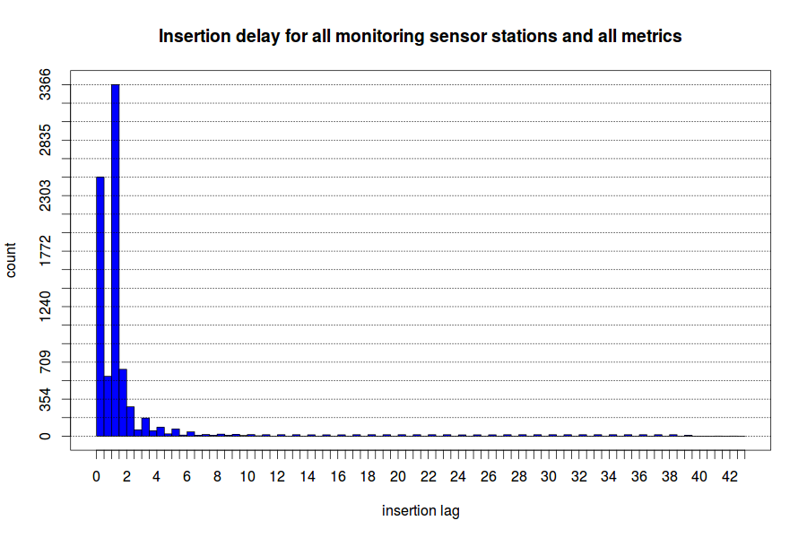

Once available, the data takes another three to twelve hours to stabilize. This means that the values are fluctuating during that time frame for most data points.

As a result of this finding, all data is collected with a 12-hour delay to increase the accuracy of the data and the forecasts.

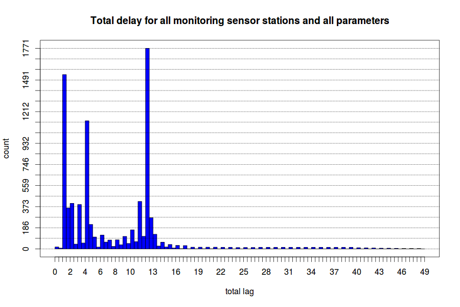

[Axibase Collector](https://axibase.com/docs/axibase-collector/) is used to collect the data from the monitoring sensor stations and to stream the data into the ATSD. Collector is an effective tool for batch downloading of historical data and streaming fresh data as it becomes available.

In Collector, set up a job to collect the data from the air monitoring sensor stations in Fresno, California. For this particular example, Fresno is used because the city is considered to be one of the most polluted in the United States, with [air quality warnings](https://www.fresnobee.com/news/local/news-columns-blogs/earth-log/article19529637.html) often issued to the public.

The [File Job](https://axibase.com/docs/axibase-collector/jobs/file.html) sets up a [`cron`](https://axibase.com/docs/axibase-collector/scheduling.html#cron-expressions) task that runs at a specified interval to collect the data and batch upload it to ATSD.

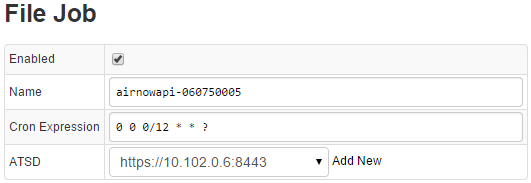

The [File Forwarding Configuration](https://axibase.com/docs/axibase-collector/jobs/file.html#configuration) is a parser configuration for incoming data from the external source. The path to the external data source is specified and a default entity is assigned to the Fresno monitoring sensor station. `Starttime` and [`endtime`](https://axibase.com/products/axibase-time-series-database/visualization/end-time/) determine the time frame for retrieving new data.

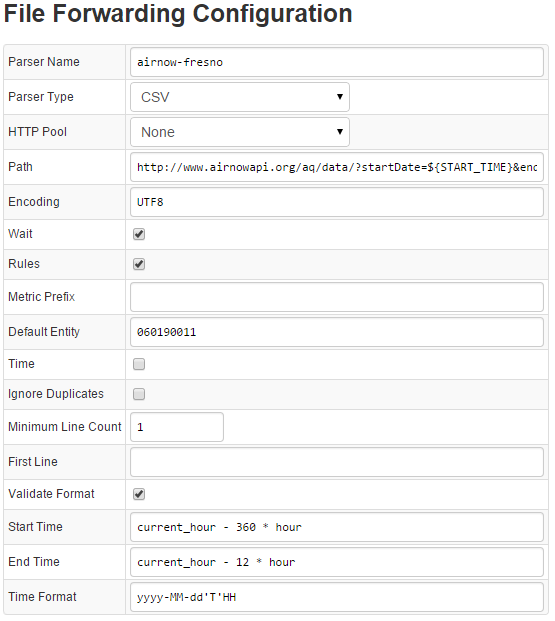

Save these two configurations, Collector starts streaming fresh data into ATSD. You can view the entities and metrics streamed by Collector into ATSD from the web interface.

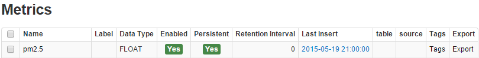

The whole data set contains over 87,000,000 records for each metric, all stored in ATSD.

## Generating Forecasts in R

The next step is analyzing the data and generating accurate forecasts using built-in Holt-Winters and ARIMA algorithms in ATSD and then R language data forecasting algorithms for comparison.

To analyze the data in R, the [R language API client](https://github.com/axibase/atsd-api-r) is used to retrieve the data and then to save the custom forecasts back into ATSD.

Forecasts are built for all metrics for the period from May 11 to June 1.

The steps taken to forecast the `PM2.5` metric are outlined below.

The [Rssa](https://cran.r-project.org/web/packages/Rssa/index.html) package is used to generate a forecast. This package implements the [Singular Spectrum Analysis](https://en.wikipedia.org/wiki/Singular_spectrum_analysis) (SSA) method.

Use the following resources to select parameters for SSA forecasting:

* [Basic Singular Spectrum Analysis and Forecasting with R, Computational Statistics and Data Analysis, Volume 71, March 2014, Pages 934-954](https://arxiv.org/abs/1206.6910)
* [Singular Spectrum Analysis for Time Series, SpringerBriefs in Statistics, 2013](https://www.springer.com/gp/book/9783642349126)

When building a forecast, follow the recommended procedure:

* Retrieve `PM2.5` series from ATSD using the [`executeSQLquery()`](https://axibase.com/docs/atsd/rule-engine/functions-sql.html#executesqlquery) function. 72 days of data are loaded from ATSD.
* Build SSA decomposition with a window of 24 days and 100 [Eigen](https://eigen.tuxfamily.org/index.php?title=Main_Page) triples:

```c++
dec <- ssa(values, L = 24 * 24, neig = 100)
```

> Eigen values, Eigenvectors, pairs of sequential Eigenvectors, and `w`-correlation matrix of the decomposition are graphed.

```r
plot(dec, type = "values")
```

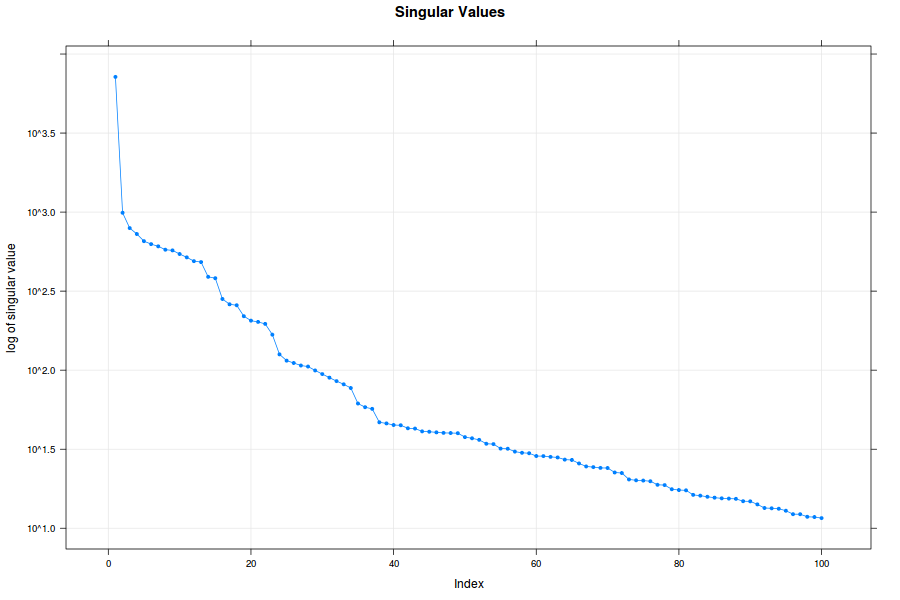

```r
plot(dec, type = "vectors", idx = 1:20)
```

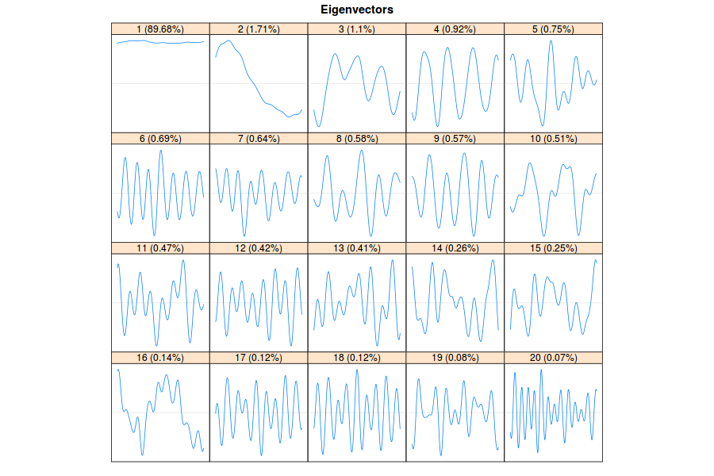

```r
plot(dec,type = "paired", idx = 1:20)
```

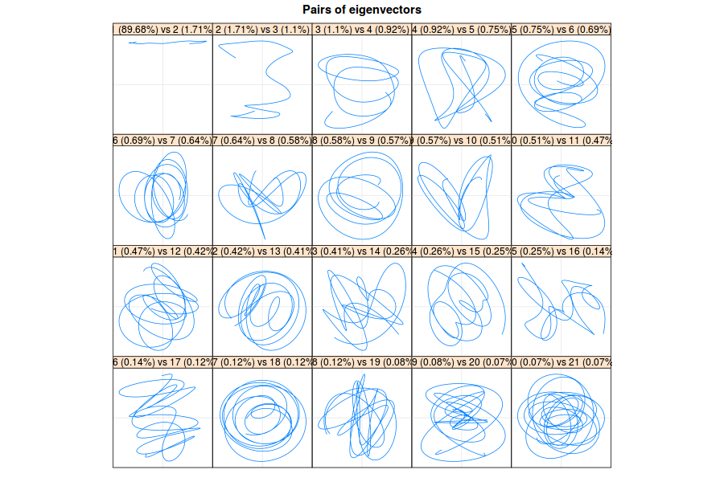

```r
plot(wcor(dec), idx = 1:100)
```

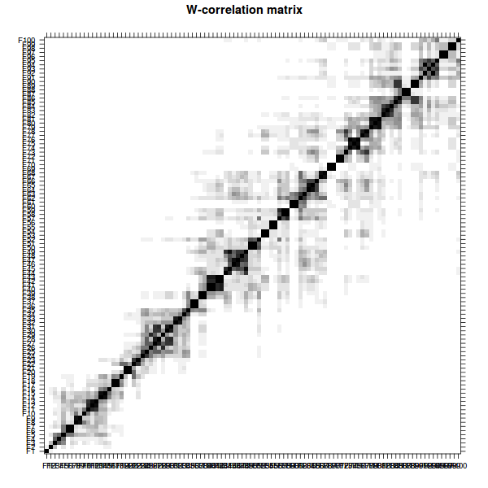

Three different options `– 1`, `1:23`, and `1:35` are tested because groups `1`, `2:23`, and `24:35` are separated from other Eigenvectors, as judged from the `w`-correlation matrix.

The `rforecast()` function builds the forecast:

```r
rforecast(x = dec, groups = 1:35, len = 21 * 24, base = "original")
```

Using `vforecast()` and `bforecast()` with different parameters to test the forecast, `rforecast()` proves to be the best option in this case.

Graph of the original series and three resulting forecasts:

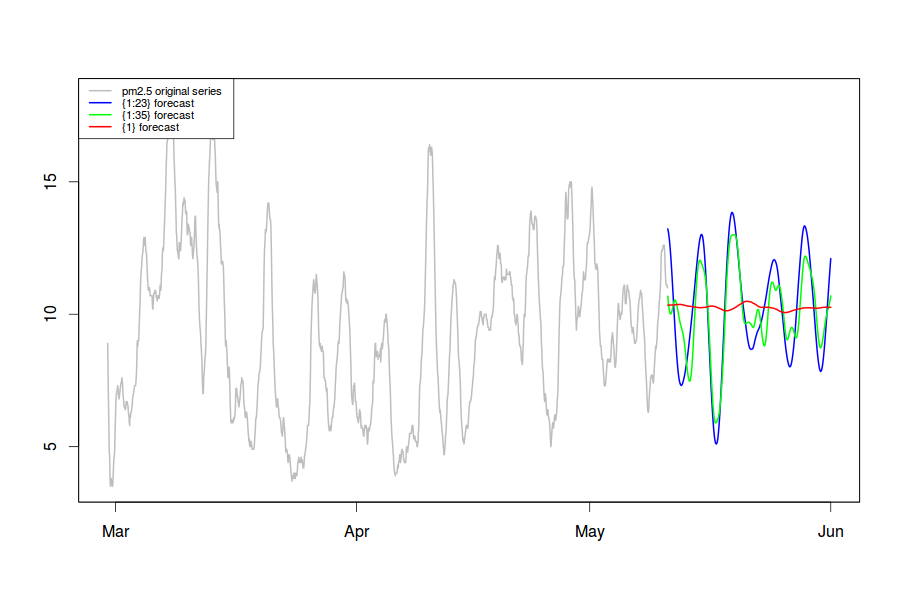

The forecast with Eigen triples `1:35` is the most accurate and inserted into ATSD.

## Generating Forecasts in ATSD

The next step is to create a competing forecast in ATSD using the built-in forecasting features. A majority of the settings are left in automatic mode, the system itself determines the best parameters when generating the forecast.

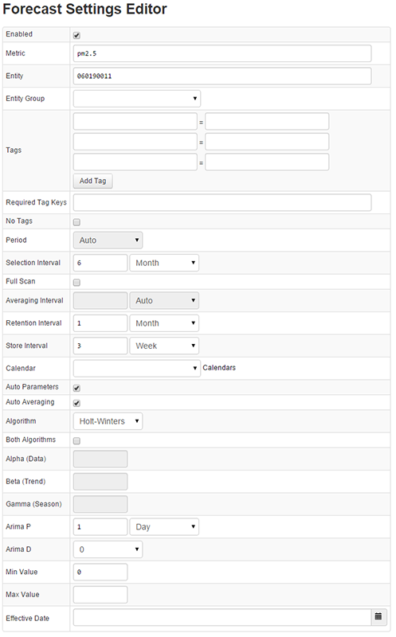

### Visualizing the Results

To visualize the data and forecasts, a portal is created using the [visualization](https://axibase.com/products/axibase-time-series-database/visualization/) features of ATSD.

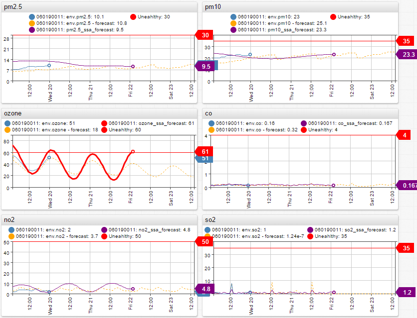

Thresholds are set for each metric to alert when either the forecast or the actual data reaches unhealthy levels of air pollution.

When comparing the R-generated and ATSD forecasts to actual data, the ATSD forecast turns out to be significantly more accurate in most cases, learning and recognizing patterns and trends with more certainty. As of today, as the actual data is coming in, it is following the ATSD forecast very closely. Any deviations are minimal and fall within the confidence interval.

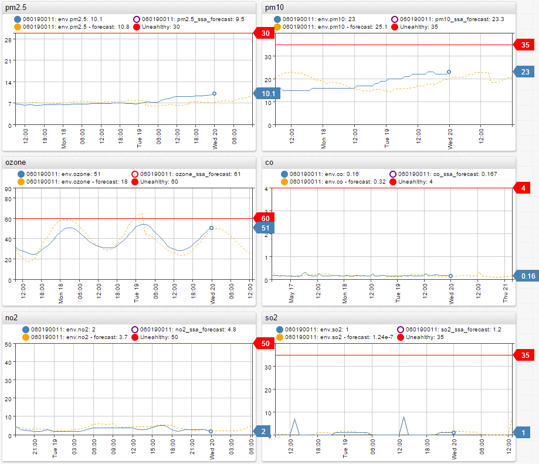

ATSD built-in forecasting produces more accurate results than one of the most advanced R-language forecasting algorithms. It is definitely possible to rely on ATSD to forecast air pollution for a few days and weeks into the future.

Keep track of how these forecasts perform in comparison to the actual data in Axibase [ChartLab](../shared/chartlab.md).

[](https://apps.axibase.com/chartlab/d06179aa)

### Alerts and Notifications

A smart alert notification set up in the [Rule Engine](https://axibase.com/docs/atsd/rule-engine/) notifies by email if the pollution levels breach the set threshold or deviate from the ATSD forecast by a significant margin.

Analytical rules set in Rule Engine for metric `PM2.5`, alert raised if streaming data satisfies one of the below rules:

Rule | Description
--|--
`value > 30` | Raise an alert if last metric value exceeds threshold.
`forecast_deviation(avg()) > 2` | Raise an alert if the actual value exceeds the forecast by more than two [standard deviations](https://en.wikipedia.org/wiki/Normal_distribution). Smart rules capture extreme spikes in air pollution.

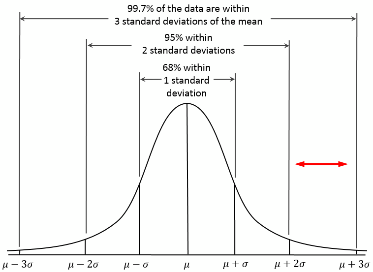

At this point the use case is fully implemented and functions autonomously. ATSD automatically streams sensor data, generates a new forecast every 24 hours for three weeks into the future, and raises alerts if the pollution levels rise above the threshold or if a negative trend is discovered.

## Results and Conclusions

The results of this case can be [useful for travelers](https://www.telegraph.co.uk/travel/travelnews/10239362/Air-pollution-blamed-as-China-loses-tourists.html) who need to have an [accurate forecast of environmental and pollution related issues](resources/content_19087645.htm target=) that they are exposed to during the trip. This information can also be helpful to expats moving to a new city or country. [Studies have proven](http://www.euro.who.int/__data/assets/pdf_file/0006/189051/Health-effects-of-particulate-matter-final-Eng.pdf) that long-term exposure to high levels of `PM2.5` can lead to serious health issues.

This research and environmental forecasting is especially valuable in regions like [China](https://aqicn.org/map/china/), where air pollution seriously affects the local population and visitors. In cities like [Shanghai](http://www.stateair.net/web/post/1/4.html), [Beijing](http://www.stateair.net/web/post/1/1.html), and [Guangzhou](http://www.stateair.net/web/post/1/3.html), `PM2.5` levels are constantly fluctuating from unhealthy to critical levels, yet accurate forecasting is limited. `PM2.5` forecasting is essential for travelers and tourists who need to plan trips during periods of lower pollution levels due to potential health risks of pollution exposure.

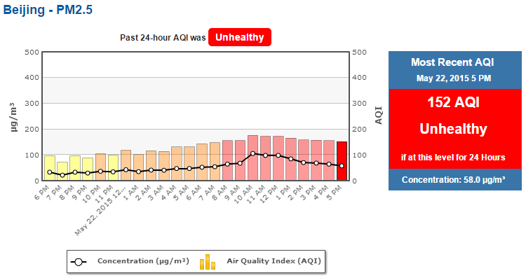

Government agencies can also take advantage of pollution monitoring to plan and issue early warnings. This way, precautions can be taken to prevent exposure to unhealthy levels of `PM2.5` pollution. Detecting a trend and raising an alert before `PM2.5` levels breach the unhealthy threshold is critical for public safety and health. Reliable air quality data and data analytics allow people to adapt and make informed decisions.

In conclusion, Big Data Analytics is an empowering tool that can put valuable information in the hands of corporations, governments, and individuals. That knowledge can motivate people to effect change. Air pollution is currently affecting the lives of over a billion people across the globe and with the current trends, the situation is only going to get worse.

Often the exact source of air pollution, the way the pollutants interact in the air, and the dispersion of pollution cannot be determined. The lack of such information makes air pollution a difficult problem to tackle. However, the advances in modern technologies and the arrival of new Big Data solutions enable ATSD users to combine sensor data with meteorological satellite data to perform extensive analytics and forecasting. Big Data analytics makes it possible to pinpoint the pollution source and dispersion trends in advance.

Axibase sincerely believes that Big Data has a large role to play in tackling air pollution. The company predicts that in the coming years advanced data analytics can become a key factor influencing the decisions of government and possible changes in pollution regulations.