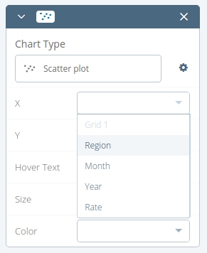
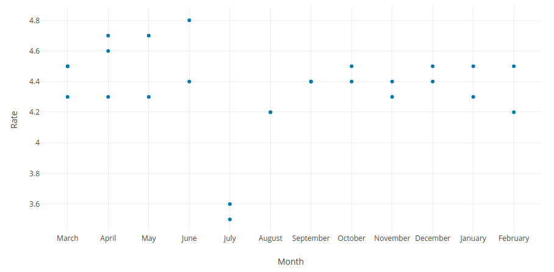
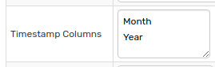
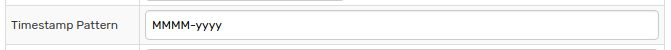
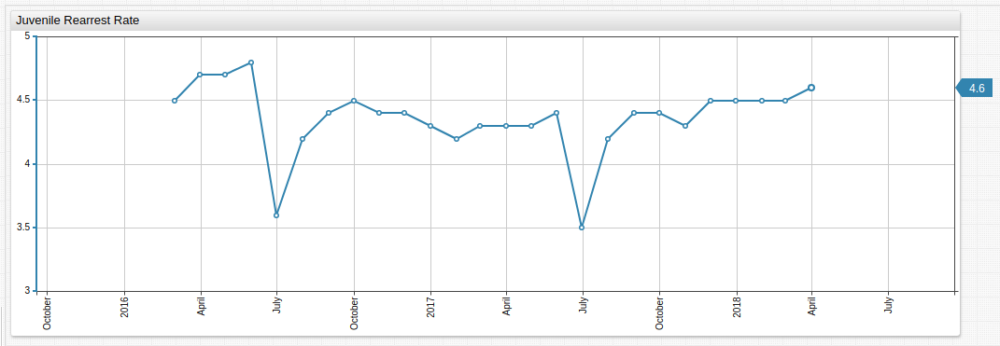

# Parsing Irregular Timestamps

## Introduction

While most time series data is stored with regular timestamps in one column, this is not always the case. When your data storage or visualization tool does not have flexible settings to handle irregular data schema, the information cannot be read and understood correctly thus destroying its value.

This tutorial explains how to use [CSV parsing](https://axibase.com/docs/atsd/parsers/csv/) features in ATSD to correctly interpret irregularly stored timestamp data.

## Dataset

The dataset parsed in this tutorial is stored in the [Axibase Dataset Catalog](https://axibase.com/datasets/). The data tracks City of New York Department of Probation [Youth Rearrest Rates](https://catalog.data.gov/dataset/juvenile-rearrest-rate-monthly-average). Data samples from the downloadable table are shown below:

Region | Month | Year | Rate
--|--|--|--
Citywide | March | 2016 | 4.5
Citywide | April | 2016 | 4.7
Citywide | May | 2016| 4.7
Citywide | June | 2016 | 4.8

Because the timestamp is split across two columns, working with the data from within the `data.gov` portal is impossible because defining either part of the timpstamp as the `x` axis erroneously groups the data, considering either only the month or year of the data sample.



Access the [plotly](https://plot.ly/external/?url=https://data.cityofnewyork.us/api/views/c87b-2j3i/rows.csv?accessType=DOWNLOAD) portal. Selecting either column creates an invalid visualization. The visualization sorted by `Month` is shown here:



The dataset tracks data from March 2016 to April 2018, thus most months contain two datapoints, April contains three, and August and September contain one.

## CSV Parser

Download the dataset in CSV format.

```csv
Region,Month,Year,Rate
Citywide,March,2016,4.5
Citywide,April,2016,4.7
Citywide,May,2016,4.7
Citywide,June,2016,4.8
...
```

Using Excel, Numbers, or LibreOffice to concatenate the `Month` and `Year` columns is one solution, but adds an unneeded step when using ATSD.

Open the **Data > CSV Parsers** page and create a new parser for this file. Alternatively, download the [parser configuration](./resources/irregular-timestamp-parser.xml) and follow the [upload instructions](../shared/import-csv-parser.md) to import the configuration into ATSD.

If you manually create the parser, complete the **Timestamp Columns** field to define both columns which contain a piece of the fragmented timestamp separated by semi-colon, comma, or line break.



Define the **Timestamp Type** as **Pattern** and specify the pattern in the **Timestamp Pattern** field.



> See [Oracle Documentation](https://docs.oracle.com/javase/tutorial/i18n/format/simpleDateFormat.html) for more information about `SimpleDateFormat` timestamp patterns.

During import, ATSD concatenates the specified columns to create the **Timestamp Pattern**. Each component of the timestamp may be defined by its own column and still be read by the database during import using the appropriate configuration.

Using [**ChartLab**](../shared/chartlab.md), the DOP dataset is parsed to create a visualization that shows the time series data as it is meant to be portrayed.



[](https://apps.axibase.com/chartlab/b560456e)

The declarative [Charts Syntax](https://axibase.com/products/axibase-time-series-database/visualization/widgets/time-chart/) defines the `entity` and `metric` created by the parser upon import:

```css
[series]
  entity = data.cityofnewyork.us
  metric = juvenile_rearrest_rate
```