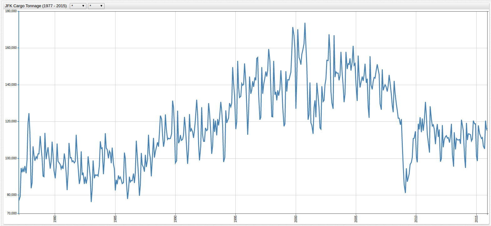
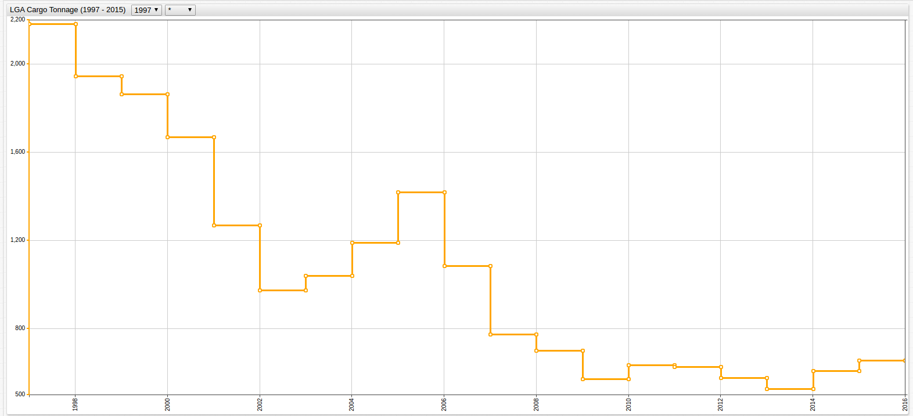
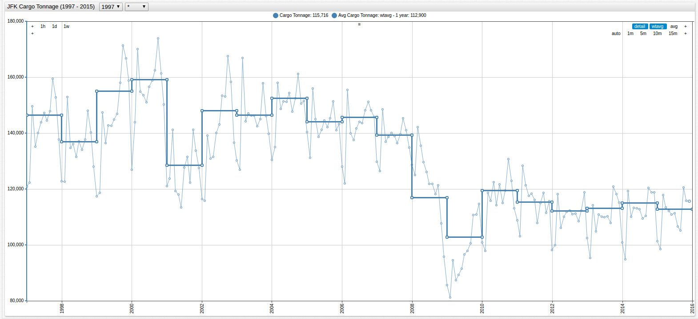
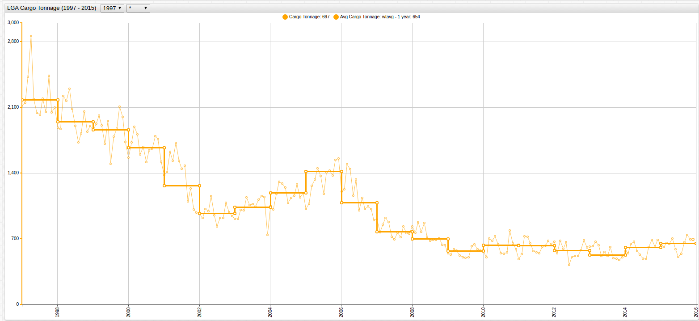

# Curve Smoothing Using Moving Averages

## Problem Overview

An operations analyst has with two possibly related datasets, [cargo tonnage data](https://axibase.com/datasets/socrata/nthh-fhwt.html) from the two largest airports in the New York City Metropolitan Area and [passenger enplanement data](https://axibase.com/datasets/socrata/vpv5-zd4k.html)
from the same airports both available in [Axibase Dataset Catalog](https://axibase.com/datasets/). The analyst must create a relational model between the two datasets for a major airline looking to expand their presence
at either LaGuardia or John F. Kennedy Airport to facilitate the maximum number of passengers and cargo.

The first dataset, collected by the [Port Authority of New York and New Jersey](https://www.panynj.gov/) is aggregated monthly while the second dataset from
the [New York Department of Transportation](https://www.dot.ny.gov/index) is aggregated annually.

* Annually aggregating the Port Authority Cargo data would destroy the granularization that created by monthly collection over the observation period.
* Using an average baseline calculated over the entire observation period would return results that neglected current trends because four decades worth of data would be regarded equally.

With ATSD and the [Moving Average](https://axibase.com/products/axibase-time-series-database/visualization/widgets/configuring-the-widgets/aggregators/)
setting, data with differing granularization is easily comparable.

## Data

The tonnage dataset is visualized below. Because of the differences in the ranges of the data, there are two charts to show the high variance for each of the metrics:

**Figure 1.1**: JFK Cargo Tonnage (1977-2015)



[](https://apps.axibase.com/chartlab/479e4525/#fullscreen)

**Figure 1.2**: LGA Cargo Tonnage (1977-2015)


[](https://apps.axibase.com/chartlab/f36262ee/#fullscreen)

The passenger enplanement data, aggregated annually is shown below:

**Figure 1.3**: LGA and JFK Passenger Enplanement Data (1997-2015)


[](https://apps.axibase.com/chartlab/00cf9be3/#fullscreen)

The granularization is mismatched and the observed periods differ by twenty years. The latter problem has a simple solution, modify the observation period using the drop-down lists in **ChartLab** or hardcode the desired timespan in the editor
window with the `starttime` setting, but the former does not offer such an obvious solution.

The syntax required to modify the dataset to reflect the moving average is two parts and shown below. It can be placed under
the `[widget]` field to modify all available series, or placed under an individual `[series]` field to modify only one desired
series.

```sql
statistic = wtavg
period = 1 year
```

The `period` is set by the user and able to be as low as millisecond granularity and as high as any
number of years. This two line syntax calculates the average of each annual input and aggregates the value to return one value
per selected period. Additionally, this type of ad hoc modification does nothing to the underlying data.

Read detailed documentation about the `wtavg` setting and other supported [aggregation functions](https://axibase.com/products/axibase-time-series-database/visualization/widgets/configuring-the-widgets/aggregators/).

## Implementation

Applying the moving, or weighted, average to **Figures 1.1** and **1.2** is shown below:

**Figure 2.1** Annual Average of JFK Cargo Tonnage (1997-2015)


[](https://apps.axibase.com/chartlab/b03d8e2c/#fullscreen)

**Figure 2.2** Annual Average of LGA Cargo Tonnage (1997-2015)



[](https://apps.axibase.com/chartlab/b456f1b5/#fullscreen)

> Open the ChartLab visualizations above to inspect the newly-inserted syntax on lines 17 and 18

The analyst is now able to more accurately judge the relationship between the two datasets because of the equal rate of
granularization. Combining the JFK and LGA elements from each of the two datasets, and using the `mode = column` setting,
produces the following visualizations:

**Figure 2.3**: JFK Cargo Tonnage vs. Passenger Enplanement (1997-2015)


[](https://apps.axibase.com/chartlab/897c0429/#fullscreen)

Scale Modification:

```javascript
enplanements = value/100
```

**Figure 2.4**: LGA Cargo Tonnage vs. Passenger Enplanement (1997-2015)


[](https://apps.axibase.com/chartlab/0de58b58/#fullscreen)

Scale Modification:

```javascript
enplanements = value/10000
```

Once the comparison is complete, remove the `statistic` setting from the **Editor** window to return the data to the original
state.

Alternatively, it may be helpful to compare the modified chart with the original to calculate concrete monthly baselines. Airport traffic and use is seasonal, as such comparing values month to month may be misleading.

With the moving average calculation included year-on-year monthly data is calculated.



[](https://apps.axibase.com/chartlab/6b3e4ed6/#fullscreen)



[](https://apps.axibase.com/chartlab/a4d77c47/#fullscreen)

For more information, see the [ATSD Documentation](https://axibase.com/docs/atsd/).