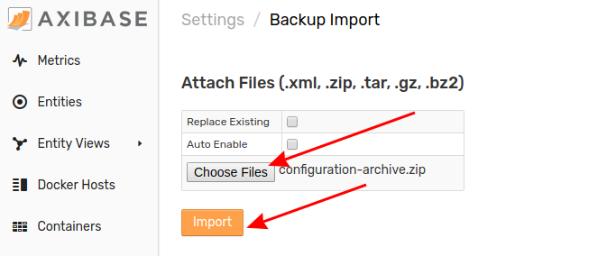

# Importing Scheduled SQL Queries

A Scheduled SQL Query is executed by the database on a schedule. Before the query is executed,configure it to generate files on the local file system, send a report via email, or produce calculated metrics and store the results in the database.

Follow this process to add a new Scheduled SQL Query to your local ATSD instance.

1. Expand the **SQL** menu and select **Scheduled Queries**.

    

2. From the **Scheduled Queries** page, expand the split button at the bottom of the page and click **Import**.

    

3. Select the appropriate XML file from your local machine and click **Import**.

    

Return to the **Scheduled Queries** page, to view the newly-configured Scheduled SQL Query.

## Uploading Multiple Configuration Files

Note that multiple files may be uploaded together or as an archive by opening the **Settings** menu, expanding the **Diagnostics** section, selecting the **Backup Import** page, and completing the form.

