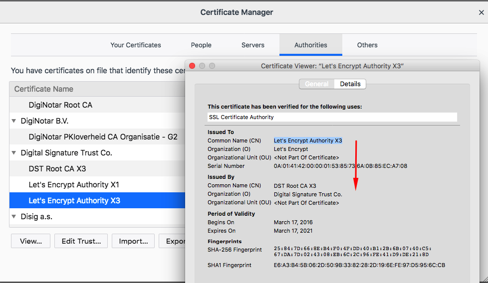
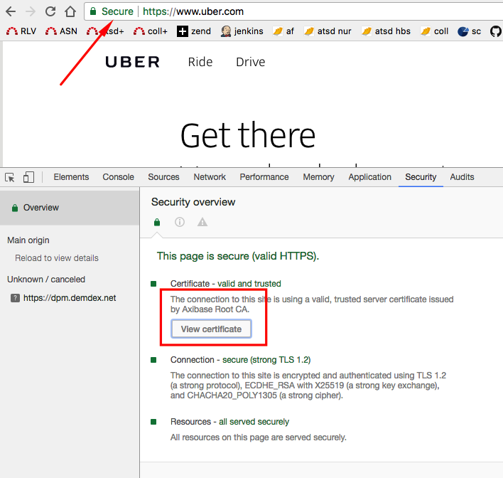
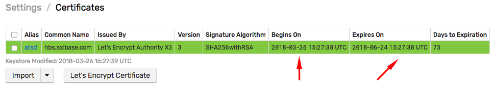
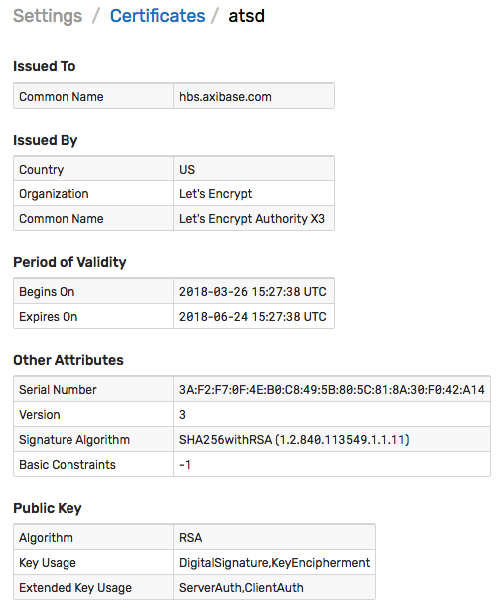
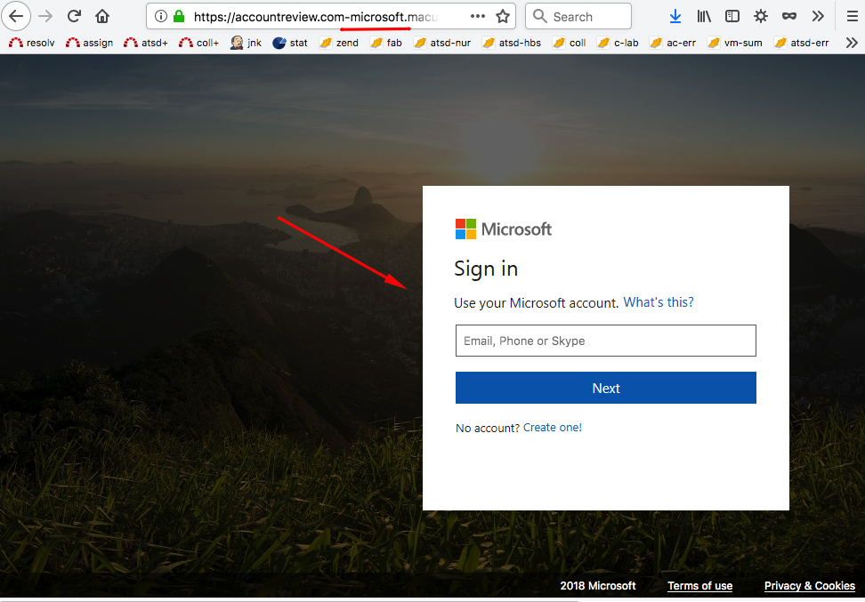
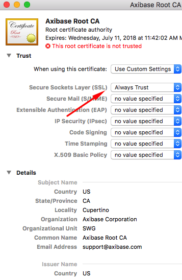
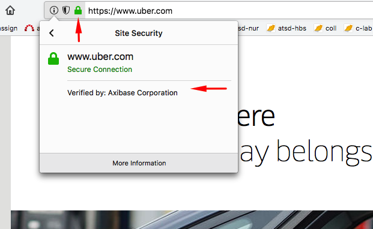

# Let's Encrypt SSL Certificates for Java Developers

## Table of Contents

* [Overview](#overview)
* [What is Certificate Authority](#what-is-certificate-authority)
* [Trust Store](#trust-store)
  * [Operating System](#operating-system-trust-store)
  * [Browsers](#browser-trust-store)
  * [Applications](#application-trust-store)
* [Trust Inheritance](#trust-inheritance)
* [Certificate Issuance](#certificate-issuance)
  * [Self-Signed](#self-signed-certificate)
  * [CA-Signed](#ca-signed-certificate)
  * [Custom CA-Signed](#custom-ca-signed-certificate)
* [Automated Certificate Issuance](#automated-certificate-issuance)
  * [ACME Protocol](#acme-protocol)
  * [Let's Encrypt Process](#lets-encrypt-process)
    * [Automation with certbot](#automation-with-certbot)
    * [nginx Mode](#nginx-mode)
    * [Standalone Mode](#standalone-mode)
    * [Renewal](#renewal)
* [ATSD Integration](#atsd-integration)
  * [Certificate Upload Endpoint](#certificate-upload-endpoint)
  * [Upload Permissions](#upload-permissions)
  * [Renewal Trigger](#renewal-trigger)
* [Public Certificate Logging](#public-certificate-logging)
  * [Certificate Transparency Logs](#certificate-transparency-logs)
  * [CRT Database Access](#crt-database-access)
  * [Certificate Issuance Monitoring](#certificate-issuance-monitoring)
* [Custom CA](#custom-ca)
  * [Generate Custom CA Certificate](#generate-custom-ca-certificate)
  * [Install Custom CA Certificate](#install-custom-ca-certificate)
* [Custom CA Examples](#custom-ca-examples)
  * [ATSD Validated by Custom CA](#atsd-validated-by-custom-ca)
  * [Any Site Validated by Custom CA](#any-site-validated-by-custom-ca)
* [Miscellaneous](#miscellaneous)
  * [`openssl s_connect` Utility](#openssl-s_client-utility)
  * [Java Client Debugging](#java-client-debugging)

## Overview

[Let's Encrypt](https://letsencrypt.org/certificates/) is a non-profit **certificate authority** established in 2016. It allows web administrators to easily obtain and renew **free** SSL certificates based on domain validation.

The certificate signing and issuance process is automated based on ACME protocol using Linux packages and plugins for popular web servers.

## What is Certificate Authority

CA is a trusted organization authorized to issue public key certificates to end entities (organization, person, **domain**, program).

Trust is established when the person installs software (OS, browser, Java Runtime/Development Environment, python) containing a list of trusted CAs.

CAs issue certificates which is a file, typically in [X509](https://tools.ietf.org/html/rfc5280) format, containing information about the issuer (CA), the subject or end entity, the certificate validity dates, issuer signature, and the public key of the subject.

In cases of HTTPS connection, the certificate is presented by the web server (nginx, apache, tomcat, jetty) to the client (browser, `curl`, apache http client, java url connection) as part of an SSL handshake.

`*.axibase.com` old wildcard certificate:

```txt
Certificate:
    Data:
        Version: 3 (0x2)
        Serial Number:
            13:81:71:6d:80:d8:c8:f1:d4:5f:66:4f:6f:21:6f:6d
    Signature Algorithm: sha256WithRSAEncryption
        Issuer: (CA ID: 1455)
            commonName                = COMODO RSA Domain Validation Secure Server CA
            organizationName          = COMODO CA Limited
            localityName              = Salford
            stateOrProvinceName       = Greater Manchester
            countryName               = GB
        Validity
            Not Before: Mar 17 00:00:00 2015 GMT
            Not After : Mar 16 23:59:59 2018 GMT
        Subject:
            commonName                = *.axibase.com
            organizationalUnitName    = PositiveSSL Wildcard
            organizationalUnitName    = Domain Control Validated
        Subject Public Key Info:
            Public Key Algorithm: rsaEncryption
                Public-Key: (2048 bit)
                Modulus:
                    00:cc:e9:99:88:9f:92:25:f5:9e:35:b1:d3:07:43:
                    ....
                    2a:91
                Exponent: 65537 (0x10001)
        X509v3 extensions:
            X509v3 Authority Key Identifier:
                keyid:90:AF:6A:3A:94:5A:0B:D8:90:EA:12:56:73:DF:43:B4:3A:28:DA:E7

            X509v3 Subject Key Identifier:
                85:F2:49:06:2C:14:61:A0:C6:67:8E:75:00:4B:07:30:10:6D:59:11
            X509v3 Key Usage: critical
                Digital Signature, Key Encipherment
            X509v3 Basic Constraints: critical
                CA:FALSE
            X509v3 Extended Key Usage:
                TLS Web Server Authentication, TLS Web Client Authentication
            X509v3 Certificate Policies:
                Policy: 1.3.6.1.4.1.6449.1.2.2.7
                  CPS: https://secure.comodo.com/CPS
                Policy: 2.23.140.1.2.1

            X509v3 CRL Distribution Points:

                Full Name:
                  URI:http://crl.comodoca.com/COMODORSADomainValidationSecureServerCA.crl

            Authority Information Access:
                CA Issuers - URI:http://crt.comodoca.com/COMODORSADomainValidationSecureServerCA.crt
                OCSP - URI:http://ocsp.comodoca.com

            X509v3 Subject Alternative Name:
                DNS:*.axibase.com
                DNS:axibase.com
    Signature Algorithm: sha256WithRSAEncryption
         8a:d9:06:0e:42:68:48:e7:ab:ec:8f:d9:be:ff:c5:9f:5a:86:
         ...
```

The certificate is presented to the client as part of the secure connection negotiations process.

`curl` SSL handshake:

```txt
  0     0    0     0    0     0      0      0 --:--:-- --:--:-- --:--:--     0* Connected to axibase.com (.....) port 443 (#0)
* Cipher selection: ALL:!EXPORT:!EXPORT40:!EXPORT56:!aNULL:!LOW:!RC4:@STRENGTH
* successfully set certificate verify locations:
*   CAfile: /etc/ssl/certs/ca-certificates.crt
  CApath: none
* TLSv1.2 (OUT), TLS handshake, Client hello (1):
} [290 bytes data]
* TLSv1.2 (IN), TLS handshake, Server hello (2):
{ [85 bytes data]
* TLSv1.2 (IN), TLS handshake, Certificate (11):
{ [2472 bytes data]
* TLSv1.2 (IN), TLS handshake, Server key exchange (12):
{ [413 bytes data]
* TLSv1.2 (IN), TLS handshake, Server finished (14):
{ [4 bytes data]
* TLSv1.2 (OUT), TLS handshake, Client key exchange (16):
} [150 bytes data]
* TLSv1.2 (OUT), TLS change cipher, Client hello (1):
} [1 bytes data]
* TLSv1.2 (OUT), TLS handshake, Finished (20):
} [16 bytes data]
* TLSv1.2 (IN), TLS change cipher, Client hello (1):
{ [1 bytes data]
* TLSv1.2 (IN), TLS handshake, Finished (20):
{ [16 bytes data]
* SSL connection using TLSv1.2 / ECDHE-RSA-AES128-SHA256
* Server certificate:
*  subject: CN=*.axibase.com
*  start date: Mar 17 00:00:00 2015 GMT
*  expire date: Mar 16 23:59:59 2018 GMT
*  issuer: C=US; O=Let's Encrypt; CN=Let's Encrypt Authority X3
*  SSL certificate verify ok.
```

The client uses its private trust store (`CAfile: /etc/ssl/certs/ca-certificates.crt` above) containing the list of trusted CA certificates. These trusted CA certificates are often called **Root** certificates.

The CA can delegate certificate issuance to other intermediate CAs.

Both the Root CA and any of its intermediate CAs can issue a certificate to **any** subject.

Trust is established when the issuer of the certificate is present in the client trust store. Trust is also established when the issuer is an intermediate CA whose authority can be verified with a chain of certificates leading to a trusted CA certificate present in the client trust store.

The certificates for intermediate CAs are bundled by web server into an ordered chain which is presented to the client during SSL handshake for verification.

In case of the old `*.axibase.com` wildcard certificate, the chain is established as follows:

```txt
*.axibase.com
  issued by COMODO RSA Domain Validation Secure Server CA
    issued by COMODO RSA Certification Authority
      issued by  AddTrust External CA Root [ROOT]
```

### Let's Encrypt CA Certificates

The Let's Encrypt root CA, **ISRG Root X1**, is not _yet_ present in trust stores.

Let's Encrypt has [four](https://letsencrypt.org/certificates/) intermediate CAs, two of which are signed by other more established CAs who are present in trust stores.

Currently active intermediate CAs:

* Let's Encrypt Authority X3
* Let's Encrypt Authority X4

The root CA for X3 and X4 is **DST Root CA X3** by **Digital Signature Trust Co.**. These intermediate certificates expire in less than 3 years.

Sample certificate chain for Let's Encrypt Authority X3-signed certificate:

```txt
=== BEGIN chain ===
  Subject = CN=nur.axibase.com
   Issuer = CN=Let's Encrypt Authority X3, O=Let's Encrypt, C=US
    Valid = 2018-03-17 - 2018-06-15
  :::
  Subject = CN=Let's Encrypt Authority X3, O=Let's Encrypt, C=US
   Issuer = CN=DST Root CA X3, O=Digital Signature Trust Co.
    Valid = 2016-03-17 - 2021-03-17
=== END   chain ===
```

## Trust Store

Trust store is where a client maintains a list of trusted CAs.

Trust store typically uses `JKS` (Java specific) or `PKCS12` format.

### Operating System Trust Store

#### List of Root CAs in MacOS

The [list](https://support.apple.com/en-us/HT208127) is managed by Apple (company) and is updated with OS patches.

Open **Utilities > KeyChain**.


#### List of Root CAs in Ubuntu

The root CA certificates are stored in the `/etc/ssl/certs/ca-certificates.crt` directory.

```sh
awk -v cmd='openssl x509 -noout -subject' '
    /BEGIN/{close(cmd)};{print | cmd}' < /etc/ssl/certs/ca-certificates.crt
```

The list has 148 entries including the 'DST Root CA X3' certificate.

```txt
...
subject= /C=US/O=Digital Signature Trust/OU=DST ACES/CN=DST ACES CA X6
subject= /O=Digital Signature Trust Co./CN=DST Root CA X3
```

```sh
ls /usr/share/ca-certificates/mozilla/
```

<details><summary><b>View Ubuntu 14.04 CAs</b></summary>

```css
ACCVRAIZ1.crt                                                       Global_Chambersign_Root_-_2008.crt
ACEDICOM_Root.crt                                                   GlobalSign_ECC_Root_CA_-_R4.crt
AC_RAIZ_FNMT-RCM.crt                                                GlobalSign_ECC_Root_CA_-_R5.crt
Actalis_Authentication_Root_CA.crt                                  GlobalSign_Root_CA.crt
AddTrust_External_Root.crt                                          GlobalSign_Root_CA_-_R2.crt
AddTrust_Low-Value_Services_Root.crt                                GlobalSign_Root_CA_-_R3.crt
AddTrust_Public_Services_Root.crt                                   Go_Daddy_Class_2_CA.crt
AddTrust_Qualified_Certificates_Root.crt                            Go_Daddy_Root_Certificate_Authority_-_G2.crt
AffirmTrust_Commercial.crt                                          Hellenic_Academic_and_Research_Institutions_ECC_RootCA_2015.crt
AffirmTrust_Networking.crt                                          Hellenic_Academic_and_Research_Institutions_RootCA_2011.crt
AffirmTrust_Premium.crt                                             Hellenic_Academic_and_Research_Institutions_RootCA_2015.crt
AffirmTrust_Premium_ECC.crt                                         Hongkong_Post_Root_CA_1.crt
Amazon_Root_CA_1.crt                                                IdenTrust_Commercial_Root_CA_1.crt
Amazon_Root_CA_2.crt                                                IdenTrust_Public_Sector_Root_CA_1.crt
Amazon_Root_CA_3.crt                                                ISRG_Root_X1.crt
Amazon_Root_CA_4.crt                                                Izenpe.com.crt
Atos_TrustedRoot_2011.crt                                           LuxTrust_Global_Root_2.crt
Autoridad_de_Certificacion_Firmaprofesional_CIF_A62634068.crt       Microsec_e-Szigno_Root_CA_2009.crt
Baltimore_CyberTrust_Root.crt                                       NetLock_Arany_=Class_Gold=_Főtanúsítvány.crt
Buypass_Class_2_Root_CA.crt                                         Network_Solutions_Certificate_Authority.crt
Buypass_Class_3_Root_CA.crt                                         OISTE_WISeKey_Global_Root_GA_CA.crt
CA_Disig_Root_R1.crt                                                OISTE_WISeKey_Global_Root_GB_CA.crt
CA_Disig_Root_R2.crt                                                OpenTrust_Root_CA_G1.crt
Camerfirma_Chambers_of_Commerce_Root.crt                            OpenTrust_Root_CA_G2.crt
Camerfirma_Global_Chambersign_Root.crt                              OpenTrust_Root_CA_G3.crt
Certigna.crt                                                        PSCProcert.crt
Certinomis_-_Autorité_Racine.crt                                    QuoVadis_Root_CA_1_G3.crt
Certinomis_-_Root_CA.crt                                            QuoVadis_Root_CA_2.crt
Certplus_Class_2_Primary_CA.crt                                     QuoVadis_Root_CA_2_G3.crt
Certplus_Root_CA_G1.crt                                             QuoVadis_Root_CA_3.crt
Certplus_Root_CA_G2.crt                                             QuoVadis_Root_CA_3_G3.crt
certSIGN_ROOT_CA.crt                                                QuoVadis_Root_CA.crt
Certum_Root_CA.crt                                                  Secure_Global_CA.crt
Certum_Trusted_Network_CA_2.crt                                     SecureSign_RootCA11.crt
Certum_Trusted_Network_CA.crt                                       SecureTrust_CA.crt
CFCA_EV_ROOT.crt                                                    Security_Communication_EV_RootCA1.crt
Chambers_of_Commerce_Root_-_2008.crt                                Security_Communication_RootCA2.crt
China_Internet_Network_Information_Center_EV_Certificates_Root.crt  Security_Communication_Root_CA.crt
CNNIC_ROOT.crt                                                      Sonera_Class_2_Root_CA.crt
Comodo_AAA_Services_root.crt                                        Staat_der_Nederlanden_EV_Root_CA.crt
COMODO_Certification_Authority.crt                                  Staat_der_Nederlanden_Root_CA_-_G2.crt
COMODO_ECC_Certification_Authority.crt                              Staat_der_Nederlanden_Root_CA_-_G3.crt
COMODO_RSA_Certification_Authority.crt                              Starfield_Class_2_CA.crt
Comodo_Secure_Services_root.crt                                     Starfield_Root_Certificate_Authority_-_G2.crt
Comodo_Trusted_Services_root.crt                                    Starfield_Services_Root_Certificate_Authority_-_G2.crt
Cybertrust_Global_Root.crt                                          Swisscom_Root_CA_1.crt
Deutsche_Telekom_Root_CA_2.crt                                      Swisscom_Root_CA_2.crt
DigiCert_Assured_ID_Root_CA.crt                                     Swisscom_Root_EV_CA_2.crt
DigiCert_Assured_ID_Root_G2.crt                                     SwissSign_Gold_CA_-_G2.crt
DigiCert_Assured_ID_Root_G3.crt                                     SwissSign_Silver_CA_-_G2.crt
DigiCert_Global_Root_CA.crt                                         SZAFIR_ROOT_CA2.crt
DigiCert_Global_Root_G2.crt                                         Taiwan_GRCA.crt
DigiCert_Global_Root_G3.crt                                         TeliaSonera_Root_CA_v1.crt
DigiCert_High_Assurance_EV_Root_CA.crt                              thawte_Primary_Root_CA.crt
DigiCert_Trusted_Root_G4.crt                                        thawte_Primary_Root_CA_-_G2.crt
DST_ACES_CA_X6.crt                                                  thawte_Primary_Root_CA_-_G3.crt
DST_Root_CA_X3.crt                                                  Trustis_FPS_Root_CA.crt
D-TRUST_Root_Class_3_CA_2_2009.crt                                  T-TeleSec_GlobalRoot_Class_2.crt
D-TRUST_Root_Class_3_CA_2_EV_2009.crt                               T-TeleSec_GlobalRoot_Class_3.crt
EC-ACC.crt                                                          TUBITAK_Kamu_SM_SSL_Kok_Sertifikasi_-_Surum_1.crt
EE_Certification_Centre_Root_CA.crt                                 TÜBİTAK_UEKAE_Kök_Sertifika_Hizmet_Sağlayıcısı_-_Sürüm_3.crt
Entrust.net_Premium_2048_Secure_Server_CA.crt                       TURKTRUST_Certificate_Services_Provider_Root_2007.crt
Entrust_Root_Certification_Authority.crt                            TÜRKTRUST_Elektronik_Sertifika_Hizmet_Sağlayıcısı_H5.crt
Entrust_Root_Certification_Authority_-_EC1.crt                      TWCA_Global_Root_CA.crt
Entrust_Root_Certification_Authority_-_G2.crt                       TWCA_Root_Certification_Authority.crt
ePKI_Root_Certification_Authority.crt                               USERTrust_ECC_Certification_Authority.crt
E-Tugra_Certification_Authority.crt                                 USERTrust_RSA_Certification_Authority.crt
GeoTrust_Global_CA_2.crt                                            UTN_USERFirst_Hardware_Root_CA.crt
GeoTrust_Global_CA.crt                                              Verisign_Class_3_Public_Primary_Certification_Authority_-_G3.crt
GeoTrust_Primary_Certification_Authority.crt                        VeriSign_Class_3_Public_Primary_Certification_Authority_-_G4.crt
GeoTrust_Primary_Certification_Authority_-_G2.crt                   VeriSign_Class_3_Public_Primary_Certification_Authority_-_G5.crt
GeoTrust_Primary_Certification_Authority_-_G3.crt                   VeriSign_Universal_Root_Certification_Authority.crt
GeoTrust_Universal_CA_2.crt                                         Visa_eCommerce_Root.crt
GeoTrust_Universal_CA.crt                                           XRamp_Global_CA_Root.crt
```

</details>

The list of root CAs is updated through the `ca-certificates` package.

Search apt package manager history to view when the `ca-certificates` package is last updated.

```sh
zgrep ca-certificates /var/log/apt/history*
```

```txt
-rw-r--r--  1 root root    3300 Oct 30 09:55 history.log.6.gz
```

```txt
ca-certificates:amd64 (20160104ubuntu0.14.04.1, 20170717~14.04.1)
ca-certificates-java:amd64 (20130815ubuntu1)
```

The list of changes performed on a specific version of the `ca-certificates` package is summarized in the package [change log](https://launchpad.net/ubuntu/+source/ca-certificates/+changelog):

```txt
ca-certificates (20170717) unstable; urgency=medium
  * mozilla/{certdata.txt,nssckbi.h}:

The following certificate authorities were added (+):
    + "AC RAIZ FNMT-RCM"
    + "Amazon Root CA 1"
    + "Amazon Root CA 2"
    + "Amazon Root CA 3"
    + "Amazon Root CA 4"
    + "D-TRUST Root CA 3 2013"
    + "LuxTrust Global Root 2"
    + "TUBITAK Kamu SM SSL Kok Sertifikasi - Surum 1"

The following certificate authorities were removed (-):
    - "AC Raiz Certicamara S.A."
    - "ApplicationCA - Japanese Government"
    - "Buypass Class 2 CA 1"
    - "ComSign CA"
    - "EBG Elektronik Sertifika Hizmet Saglayicisi"
    - "Equifax Secure CA"
    - "Equifax Secure eBusiness CA 1"
    - "Equifax Secure Global eBusiness CA"
    - "IGC/A"
    - "Juur-SK"
    - "Microsec e-Szigno Root CA"
    - "Root CA Generalitat Valenciana"
    - "RSA Security 2048 v3"
    - "S-TRUST Authentication and Encryption Root CA 2005 PN"
    - "S-TRUST Universal Root CA"
    - "SwissSign Platinum CA - G2"
    - "TC TrustCenter Class 3 CA II"
    - "TÜRKTRUST Elektronik Sertifika Hizmet Sağlayıcısı H6"
    - "UTN USERFirst Email Root CA"
    - "Verisign Class 1 Public Primary Certification Authority"
    - "Verisign Class 1 Public Primary Certification Authority - G3"
    - "Verisign Class 2 Public Primary Certification Authority - G2"
    - "Verisign Class 2 Public Primary Certification Authority - G3"
    - "Verisign Class 3 Public Primary Certification Authority"
    - "WellsSecure Public Root Certificate Authority"
```

### Browser Trust Store

* Chrome defers to the list of Root CAs maintained by the operating system.
* Mozilla Firefox maintains its own list of Root CAs.

The changes are subject to [review](https://ccadb-public.secure.force.com/mozilla/PendingCACertificateReport). It takes 2 years to become a Mozilla root CA.

The updated list is propagated to users via browser patches.




### Application Trust Store

Applications can elect to utilize their own, built-in, trust store or utilize the trust store of the underlying operating system.

* Python

The `Requests` module uses certificates from the [`certifi`](https://pypi.python.org/pypi/certifi) package.

> [Certifi](https://pypi.python.org/pypi/certifi) is a carefully curated collection of Root Certificates for validating the trustworthiness of SSL certificates while verifying the identity of TLS hosts. It has been extracted from the Requests project. Certifi updates its list based on Mozilla [certdata.txt](https://hg.mozilla.org/mozilla-central/raw-file/tip/security/nss/lib/ckfw/builtins/certdata.txt).

* Java

```java
import java.io.*;
import java.util.*;
import java.util.stream.*;

import java.security.KeyStore;
import java.security.cert.X509Certificate;
import javax.naming.ldap.LdapName;

public class CertListCA {

    public static void main(String[] args) throws Exception {

        String trustPath = System.getProperties().get("java.home") + "/lib/security/cacerts";
        System.out.println("   trust.path= " + trustPath);

        KeyStore trustStore = KeyStore.getInstance("JKS");
        trustStore.load(new FileInputStream(trustPath), "changeit".toCharArray());

        Collections.list(trustStore.aliases()).stream().sorted(String.CASE_INSENSITIVE_ORDER).forEach(
                rootAlias -> {
                try {
                    X509Certificate caCert = (X509Certificate)trustStore.getCertificate(rootAlias);
                    LdapName issuerName = new LdapName(caCert.getIssuerDN().getName());
                    String issuerCN = issuerName.getRdns().stream().filter(rdn -> rdn.getType().equalsIgnoreCase("cn")).map(rdn -> rdn.getValue().toString()).collect(Collectors.joining( "," ));
                    if (issuerCN.isEmpty()) {
                        System.out.println("  no CN = " + caCert.getIssuerDN().getName());
                    } else {
                        System.out.println("     CN = " + issuerCN);
                    }
                } catch (Exception ke) {
                    ke.printStackTrace();
                }
        });

    }

}
```

---

<details><summary><b>View OpenJDK 1.8.0_162 CAs</b></summary>

```ls
     trust.path= /usr/lib/jvm/java-8-openjdk-amd64/jre/lib/security/cacerts

     CN = AC Raíz Certicámara S.A.
     CN = ACCVRAIZ1
     CN = ACEDICOM Root
     CN = Actalis Authentication Root CA
     CN = AddTrust External CA Root
     CN = AddTrust Class 1 CA Root
     CN = AddTrust Public CA Root
     CN = AddTrust Qualified CA Root
     CN = AffirmTrust Commercial
     CN = AffirmTrust Networking
     CN = AffirmTrust Premium
     CN = AffirmTrust Premium ECC
  no CN = OU=ApplicationCA, O=Japanese Government, C=JP
     CN = Atos TrustedRoot 2011
     CN = Autoridad de Certificacion Firmaprofesional CIF A62634068
     CN = Baltimore CyberTrust Root
     CN = Buypass Class 2 CA 1
     CN = Buypass Class 2 Root CA
     CN = Buypass Class 3 Root CA
     CN = CA Disig Root R1
     CN = CA Disig Root R2
     CN = Chambers of Commerce Root
     CN = Global Chambersign Root
     CN = Certigna
     CN = Certinomis - Autorité Racine
     CN = Certinomis - Root CA
     CN = Class 2 Primary CA
     CN = Certplus Root CA G1
     CN = Certplus Root CA G2
  no CN = OU=certSIGN ROOT CA, O=certSIGN, C=RO
     CN = Certum CA
     CN = Certum Trusted Network CA
     CN = Certum Trusted Network CA 2
     CN = CFCA EV ROOT
     CN = Chambers of Commerce Root - 2008
     CN = China Internet Network Information Center EV Certificates Root
     CN = CNNIC ROOT
     CN = AAA Certificate Services
     CN = COMODO Certification Authority
     CN = COMODO ECC Certification Authority
     CN = COMODO RSA Certification Authority
     CN = Secure Certificate Services
     CN = Trusted Certificate Services
     CN = ComSign CA
     CN = Cybertrust Global Root
     CN = D-TRUST Root Class 3 CA 2 2009
     CN = D-TRUST Root Class 3 CA 2 EV 2009
     CN = Deutsche Telekom Root CA 2
     CN = DigiCert Assured ID Root CA
     CN = DigiCert Assured ID Root G2
     CN = DigiCert Assured ID Root G3
     CN = DigiCert Global Root CA
     CN = DigiCert Global Root G2
     CN = DigiCert Global Root G3
     CN = DigiCert High Assurance EV Root CA
     CN = DigiCert Trusted Root G4
     CN = DST ACES CA X6
     CN = DST Root CA X3
     CN = E-Tugra Certification Authority
     CN = EBG Elektronik Sertifika Hizmet Sağlayıcısı
     CN = EC-ACC
     CN = EE Certification Centre Root CA
     CN = Entrust.net Certification Authority (2048)
     CN = Entrust Root Certification Authority
     CN = Entrust Root Certification Authority - EC1
     CN = Entrust Root Certification Authority - G2
  no CN = OU=ePKI Root Certification Authority, O="Chunghwa Telecom Co., Ltd.", C=TW
  no CN = OU=Equifax Secure Certificate Authority, O=Equifax, C=US
     CN = Equifax Secure eBusiness CA-1
     CN = Equifax Secure Global eBusiness CA-1
     CN = GeoTrust Global CA
     CN = GeoTrust Global CA 2
     CN = GeoTrust Primary Certification Authority
     CN = GeoTrust Primary Certification Authority - G2
     CN = GeoTrust Primary Certification Authority - G3
     CN = GeoTrust Universal CA
     CN = GeoTrust Universal CA 2
     CN = Global Chambersign Root - 2008
     CN = GlobalSign
     CN = GlobalSign
     CN = GlobalSign Root CA
     CN = GlobalSign
     CN = GlobalSign
  no CN = OU=Go Daddy Class 2 Certification Authority, O="The Go Daddy Group, Inc.", C=US
     CN = Go Daddy Root Certificate Authority - G2
     CN = Hellenic Academic and Research Institutions ECC RootCA 2015
     CN = Hellenic Academic and Research Institutions RootCA 2011
     CN = Hellenic Academic and Research Institutions RootCA 2015
     CN = Hongkong Post Root CA 1
     CN = IdenTrust Commercial Root CA 1
     CN = IdenTrust Public Sector Root CA 1
     CN = IGC/A
     CN = ISRG Root X1
     CN = Izenpe.com
     CN = Juur-SK
     CN = Microsec e-Szigno Root CA
     CN = Microsec e-Szigno Root CA 2009
     CN = NetLock Arany (Class Gold) Főtanúsítvány
     CN = Network Solutions Certificate Authority
     CN = OISTE WISeKey Global Root GA CA
     CN = OISTE WISeKey Global Root GB CA
     CN = OpenTrust Root CA G1
     CN = OpenTrust Root CA G2
     CN = OpenTrust Root CA G3
     CN = Autoridad de Certificacion Raiz del Estado Venezolano
     CN = QuoVadis Root Certification Authority
     CN = QuoVadis Root CA 1 G3
     CN = QuoVadis Root CA 2
     CN = QuoVadis Root CA 2 G3
     CN = QuoVadis Root CA 3
     CN = QuoVadis Root CA 3 G3
     CN = Root CA Generalitat Valenciana
  no CN = OU=RSA Security 2048 V3, O=RSA Security Inc
     CN = S-TRUST Authentication and Encryption Root CA 2005:PN
     CN = S-TRUST Universal Root CA
     CN = Secure Global CA
     CN = SecureSign RootCA11
     CN = SecureTrust CA
  no CN = OU=Security Communication EV RootCA1, O="SECOM Trust Systems CO.,LTD.", C=JP
  no CN = OU=Security Communication RootCA1, O=SECOM Trust.net, C=JP
  no CN = OU=Security Communication RootCA2, O="SECOM Trust Systems CO.,LTD.", C=JP
     CN = Sonera Class2 CA
     CN = Staat der Nederlanden EV Root CA
     CN = Staat der Nederlanden Root CA - G2
     CN = Staat der Nederlanden Root CA - G3
  no CN = OU=Starfield Class 2 Certification Authority, O="Starfield Technologies, Inc.", C=US
     CN = Starfield Root Certificate Authority - G2
     CN = Starfield Services Root Certificate Authority - G2
     CN = Swisscom Root CA 1
     CN = Swisscom Root CA 2
     CN = Swisscom Root EV CA 2
     CN = SwissSign Gold CA - G2
     CN = SwissSign Platinum CA - G2
     CN = SwissSign Silver CA - G2
     CN = SZAFIR ROOT CA2
     CN = T-TeleSec GlobalRoot Class 2
     CN = T-TeleSec GlobalRoot Class 3
  no CN = O=Government Root Certification Authority, C=TW
     CN = TC TrustCenter Class 3 CA II
     CN = TeliaSonera Root CA v1
     CN = thawte Primary Root CA
     CN = thawte Primary Root CA - G2
     CN = thawte Primary Root CA - G3
  no CN = OU=Trustis FPS Root CA, O=Trustis Limited, C=GB
     CN = TÜRKTRUST Elektronik Sertifika Hizmet Sağlayıcısı
     CN = TWCA Global Root CA
     CN = TWCA Root Certification Authority
     CN = TÜBİTAK UEKAE Kök Sertifika Hizmet Sağlayıcısı - Sürüm 3
     CN = TÜRKTRUST Elektronik Sertifika Hizmet Sağlayıcısı H5
     CN = TÜRKTRUST Elektronik Sertifika Hizmet Sağlayıcısı H6
     CN = USERTrust ECC Certification Authority
     CN = USERTrust RSA Certification Authority
     CN = UTN-USERFirst-Client Authentication and Email
     CN = UTN-USERFirst-Hardware
  no CN = OU=Class 1 Public Primary Certification Authority, O="VeriSign, Inc.", C=US
     CN = VeriSign Class 1 Public Primary Certification Authority - G3
  no CN = OU=VeriSign Trust Network, OU="(c) 1998 VeriSign, Inc. - For authorized use only", OU=Class 2 Public Primary Certification Authority - G2, O="VeriSign, Inc.", C=US
     CN = VeriSign Class 2 Public Primary Certification Authority - G3
  no CN = OU=Class 3 Public Primary Certification Authority, O="VeriSign, Inc.", C=US
     CN = VeriSign Class 3 Public Primary Certification Authority - G3
     CN = VeriSign Class 3 Public Primary Certification Authority - G4
     CN = VeriSign Class 3 Public Primary Certification Authority - G5
     CN = VeriSign Universal Root Certification Authority
     CN = Visa eCommerce Root
     CN = WellsSecure Public Root Certificate Authority
     CN = XRamp Global Certification Authority
```

</details>

---

OpenJDK 9

Until fix [JEP 319](http://openjdk.java.net/jeps/319), the [OpenJDK 9](https://www.oracle.com/technetwork/java/javase/9all-relnotes-3704433.html#JDK-8189131) binary for Linux x64 contains an **empty** `cacerts` keystore.

<details><summary><b>View OpenJDK 9 CAs</b></summary>

```ls
     trust.path= /usr/lib/jvm/java-9-openjdk-amd64/lib/security/cacerts

  no CN = OU=AC RAIZ FNMT-RCM, O=FNMT-RCM, C=ES
     CN = ACCVRAIZ1
     CN = ACEDICOM Root
     CN = Actalis Authentication Root CA
     CN = AddTrust External CA Root
     CN = AddTrust Class 1 CA Root
     CN = AddTrust Public CA Root
     CN = AddTrust Qualified CA Root
     CN = AffirmTrust Commercial
     CN = AffirmTrust Networking
     CN = AffirmTrust Premium
     CN = AffirmTrust Premium ECC
     CN = Amazon Root CA 1
     CN = Amazon Root CA 2
     CN = Amazon Root CA 3
     CN = Amazon Root CA 4
     CN = Atos TrustedRoot 2011
     CN = Autoridad de Certificacion Firmaprofesional CIF A62634068
     CN = Baltimore CyberTrust Root
     CN = Buypass Class 2 Root CA
     CN = Buypass Class 3 Root CA
     CN = CA Disig Root R1
     CN = CA Disig Root R2
     CN = Chambers of Commerce Root
     CN = Global Chambersign Root
     CN = Certigna
     CN = Certinomis - Autorité Racine
     CN = Certinomis - Root CA
     CN = Class 2 Primary CA
     CN = Certplus Root CA G1
     CN = Certplus Root CA G2
  no CN = OU=certSIGN ROOT CA, O=certSIGN, C=RO
     CN = Certum CA
     CN = Certum Trusted Network CA
     CN = Certum Trusted Network CA 2
     CN = CFCA EV ROOT
     CN = Chambers of Commerce Root - 2008
     CN = China Internet Network Information Center EV Certificates Root
     CN = CNNIC ROOT
     CN = AAA Certificate Services
     CN = COMODO Certification Authority
     CN = COMODO ECC Certification Authority
     CN = COMODO RSA Certification Authority
     CN = Secure Certificate Services
     CN = Trusted Certificate Services
     CN = Cybertrust Global Root
     CN = D-TRUST Root Class 3 CA 2 2009
     CN = D-TRUST Root Class 3 CA 2 EV 2009
     CN = Deutsche Telekom Root CA 2
     CN = DigiCert Assured ID Root CA
     CN = DigiCert Assured ID Root G2
     CN = DigiCert Assured ID Root G3
     CN = DigiCert Global Root CA
     CN = DigiCert Global Root G2
     CN = DigiCert Global Root G3
     CN = DigiCert High Assurance EV Root CA
     CN = DigiCert Trusted Root G4
     CN = DST ACES CA X6
     CN = DST Root CA X3
     CN = E-Tugra Certification Authority
     CN = EC-ACC
     CN = EE Certification Centre Root CA
     CN = Entrust.net Certification Authority (2048)
     CN = Entrust Root Certification Authority
     CN = Entrust Root Certification Authority - EC1
     CN = Entrust Root Certification Authority - G2
  no CN = OU=ePKI Root Certification Authority, O="Chunghwa Telecom Co., Ltd.", C=TW
     CN = GeoTrust Global CA
     CN = GeoTrust Global CA 2
     CN = GeoTrust Primary Certification Authority
     CN = GeoTrust Primary Certification Authority - G2
     CN = GeoTrust Primary Certification Authority - G3
     CN = GeoTrust Universal CA
     CN = GeoTrust Universal CA 2
     CN = Global Chambersign Root - 2008
     CN = GlobalSign
     CN = GlobalSign
     CN = GlobalSign Root CA
     CN = GlobalSign
     CN = GlobalSign
  no CN = OU=Go Daddy Class 2 Certification Authority, O="The Go Daddy Group, Inc.", C=US
     CN = Go Daddy Root Certificate Authority - G2
     CN = Hellenic Academic and Research Institutions ECC RootCA 2015
     CN = Hellenic Academic and Research Institutions RootCA 2011
     CN = Hellenic Academic and Research Institutions RootCA 2015
     CN = Hongkong Post Root CA 1
     CN = IdenTrust Commercial Root CA 1
     CN = IdenTrust Public Sector Root CA 1
     CN = ISRG Root X1
     CN = Izenpe.com
     CN = LuxTrust Global Root 2
     CN = Microsec e-Szigno Root CA 2009
     CN = NetLock Arany (Class Gold) Főtanúsítvány
     CN = Network Solutions Certificate Authority
     CN = OISTE WISeKey Global Root GA CA
     CN = OISTE WISeKey Global Root GB CA
     CN = OpenTrust Root CA G1
     CN = OpenTrust Root CA G2
     CN = OpenTrust Root CA G3
     CN = Autoridad de Certificacion Raiz del Estado Venezolano
     CN = QuoVadis Root Certification Authority
     CN = QuoVadis Root CA 1 G3
     CN = QuoVadis Root CA 2
     CN = QuoVadis Root CA 2 G3
     CN = QuoVadis Root CA 3
     CN = QuoVadis Root CA 3 G3
     CN = Secure Global CA
     CN = SecureSign RootCA11
     CN = SecureTrust CA
  no CN = OU=Security Communication EV RootCA1, O="SECOM Trust Systems CO.,LTD.", C=JP
  no CN = OU=Security Communication RootCA1, O=SECOM Trust.net, C=JP
  no CN = OU=Security Communication RootCA2, O="SECOM Trust Systems CO.,LTD.", C=JP
     CN = Sonera Class2 CA
     CN = Staat der Nederlanden EV Root CA
     CN = Staat der Nederlanden Root CA - G2
     CN = Staat der Nederlanden Root CA - G3
  no CN = OU=Starfield Class 2 Certification Authority, O="Starfield Technologies, Inc.", C=US
     CN = Starfield Root Certificate Authority - G2
     CN = Starfield Services Root Certificate Authority - G2
     CN = Swisscom Root CA 1
     CN = Swisscom Root CA 2
     CN = Swisscom Root EV CA 2
     CN = SwissSign Gold CA - G2
     CN = SwissSign Silver CA - G2
     CN = SZAFIR ROOT CA2
     CN = T-TeleSec GlobalRoot Class 2
     CN = T-TeleSec GlobalRoot Class 3
  no CN = O=Government Root Certification Authority, C=TW
     CN = TeliaSonera Root CA v1
     CN = thawte Primary Root CA
     CN = thawte Primary Root CA - G2
     CN = thawte Primary Root CA - G3
  no CN = OU=Trustis FPS Root CA, O=Trustis Limited, C=GB
     CN = TUBITAK Kamu SM SSL Kok Sertifikasi - Surum 1
     CN = TÜRKTRUST Elektronik Sertifika Hizmet Sağlayıcısı
     CN = TWCA Global Root CA
     CN = TWCA Root Certification Authority
     CN = TÜBİTAK UEKAE Kök Sertifika Hizmet Sağlayıcısı - Sürüm 3
     CN = TÜRKTRUST Elektronik Sertifika Hizmet Sağlayıcısı H5
     CN = USERTrust ECC Certification Authority
     CN = USERTrust RSA Certification Authority
     CN = UTN-USERFirst-Hardware
     CN = VeriSign Class 3 Public Primary Certification Authority - G3
     CN = VeriSign Class 3 Public Primary Certification Authority - G4
     CN = VeriSign Class 3 Public Primary Certification Authority - G5
     CN = VeriSign Universal Root Certification Authority
     CN = Visa eCommerce Root
     CN = XRamp Global Certification Authority
```

</details>

---

```sh
diff --unchanged-line-format="" --old-line-format="" --new-line-format="%L" java8_ca.txt java9_ca.txt
```

New CAs in OpenJDK 8 -> 9:

```txt
  no CN = OU=AC RAIZ FNMT-RCM, O=FNMT-RCM, C=ES
     CN = Amazon Root CA 1
     CN = Amazon Root CA 2
     CN = Amazon Root CA 3
     CN = Amazon Root CA 4
     CN = LuxTrust Global Root 2
     CN = TUBITAK Kamu SM SSL Kok Sertifikasi - Surum 1
```

Removed CAs in OpenJDK 8 -> 9:

```txt
     CN = AC Raíz Certicámara S.A.
  no CN = OU=ApplicationCA, O=Japanese Government, C=JP
     CN = Buypass Class 2 CA 1
     CN = ComSign CA
     CN = EBG Elektronik Sertifika Hizmet Sağlayıcısı
  no CN = OU=Equifax Secure Certificate Authority, O=Equifax, C=US
     CN = Equifax Secure eBusiness CA-1
     CN = Equifax Secure Global eBusiness CA-1
     CN = IGC/A
     CN = Juur-SK
     CN = Microsec e-Szigno Root CA
     CN = Root CA Generalitat Valenciana
  no CN = OU=RSA Security 2048 V3, O=RSA Security Inc
     CN = S-TRUST Authentication and Encryption Root CA 2005:PN
     CN = S-TRUST Universal Root CA
     CN = SwissSign Platinum CA - G2
     CN = TC TrustCenter Class 3 CA II
     CN = TÜRKTRUST Elektronik Sertifika Hizmet Sağlayıcısı H6
     CN = UTN-USERFirst-Client Authentication and Email
  no CN = OU=Class 1 Public Primary Certification Authority, O="VeriSign, Inc.", C=US
     CN = VeriSign Class 1 Public Primary Certification Authority - G3
  no CN = OU=VeriSign Trust Network, OU="(c) 1998 VeriSign, Inc. - For authorized use only", OU=Class 2 Public Primary Certification Authority - G2, O="VeriSign, Inc.", C=US
     CN = VeriSign Class 2 Public Primary Certification Authority - G3
  no CN = OU=Class 3 Public Primary Certification Authority, O="VeriSign, Inc.", C=US
     CN = WellsSecure Public Root Certificate Authority
```

---

<details><summary><b>View Oracle OpenJDK 1.8.0_131 CAs</b></summary>

```txt
     trust.path= /Library/Java/JavaVirtualMachines/jdk1.8.0_131.jdk/Contents/Home/jre/lib/security/cacerts

     CN = Actalis Authentication Root CA
     CN = AddTrust Class 1 CA Root
     CN = AddTrust External CA Root
     CN = AddTrust Qualified CA Root
     CN = AffirmTrust Commercial
     CN = AffirmTrust Networking
     CN = AffirmTrust Premium
     CN = AffirmTrust Premium ECC
     CN = America Online Root Certification Authority 1
     CN = America Online Root Certification Authority 2
     CN = Baltimore CyberTrust Code Signing Root
     CN = Baltimore CyberTrust Root
     CN = Buypass Class 2 Root CA
     CN = Buypass Class 3 Root CA
     CN = Chambers of Commerce Root - 2008
     CN = Chambers of Commerce Root
     CN = Global Chambersign Root - 2008
     CN = Class 2 Primary CA
     CN = Class 3P Primary CA
     CN = Certum CA
     CN = Certum Trusted Network CA
  no CN = OU=ePKI Root Certification Authority, O="Chunghwa Telecom Co., Ltd.", C=TW
     CN = AAA Certificate Services
     CN = COMODO ECC Certification Authority
     CN = COMODO RSA Certification Authority
     CN = Deutsche Telekom Root CA 2
     CN = DigiCert Assured ID Root G2
     CN = DigiCert Assured ID Root G3
     CN = DigiCert Assured ID Root CA
     CN = DigiCert Global Root CA
     CN = DigiCert Global Root G2
     CN = DigiCert Global Root G3
     CN = DigiCert High Assurance EV Root CA
     CN = DigiCert Trusted Root G4
     CN = D-TRUST Root Class 3 CA 2 2009
     CN = D-TRUST Root Class 3 CA 2 EV 2009
     CN = Entrust.net Certification Authority (2048)
     CN = Entrust Root Certification Authority
     CN = Entrust Root Certification Authority - EC1
     CN = Entrust Root Certification Authority - G2
  no CN = OU=Equifax Secure Certificate Authority, O=Equifax, C=US
     CN = Equifax Secure eBusiness CA-1
     CN = Equifax Secure Global eBusiness CA-1
     CN = GeoTrust Global CA
     CN = GeoTrust Primary Certification Authority
     CN = GeoTrust Primary Certification Authority - G2
     CN = GeoTrust Primary Certification Authority - G3
     CN = GeoTrust Universal CA
     CN = GlobalSign Root CA
     CN = GlobalSign
     CN = GlobalSign
     CN = GlobalSign
     CN = GlobalSign
  no CN = OU=Go Daddy Class 2 Certification Authority, O="The Go Daddy Group, Inc.", C=US
     CN = Go Daddy Root Certificate Authority - G2
     CN = GTE CyberTrust Global Root
     CN = IdenTrust Commercial Root CA 1
     CN = DST Root CA X3
     CN = IdenTrust Public Sector Root CA 1
     CN = KEYNECTIS ROOT CA
     CN = LuxTrust Global Root
     CN = QuoVadis Root Certification Authority
     CN = QuoVadis Root CA 1 G3
     CN = QuoVadis Root CA 2
     CN = QuoVadis Root CA 2 G3
     CN = QuoVadis Root CA 3
     CN = QuoVadis Root CA 3 G3
  no CN = OU=Security Communication EV RootCA1, O="SECOM Trust Systems CO.,LTD.", C=JP
  no CN = OU=Security Communication RootCA1, O=SECOM Trust.net, C=JP
  no CN = OU=Security Communication RootCA2, O="SECOM Trust Systems CO.,LTD.", C=JP
     CN = SecureTrust CA
     CN = Sonera Class2 CA
  no CN = OU=Starfield Class 2 Certification Authority, O="Starfield Technologies, Inc.", C=US
     CN = Starfield Root Certificate Authority - G2
     CN = Starfield Services Root Certificate Authority - G2
     CN = Swisscom Root CA 2
     CN = Swisscom Root EV CA 2
     CN = SwissSign Gold CA - G2
     CN = SwissSign Platinum CA - G2
     CN = SwissSign Silver CA - G2
     CN = Thawte Premium Server CA
     CN = thawte Primary Root CA
     CN = thawte Primary Root CA - G2
     CN = thawte Primary Root CA - G3
     CN = T-TeleSec GlobalRoot Class 2
     CN = T-TeleSec GlobalRoot Class 3
     CN = USERTrust ECC Certification Authority
     CN = USERTrust RSA Certification Authority
     CN = UTN-USERFirst-Client Authentication and Email
     CN = UTN-USERFirst-Hardware
     CN = UTN-USERFirst-Object
  no CN = OU=Class 1 Public Primary Certification Authority, O="VeriSign, Inc.", C=US
  no CN = OU=VeriSign Trust Network, OU="(c) 1998 VeriSign, Inc. - For authorized use only", OU=Class 1 Public Primary Certification Authority - G2, O="VeriSign, Inc.", C=US
     CN = VeriSign Class 1 Public Primary Certification Authority - G3
  no CN = OU=VeriSign Trust Network, OU="(c) 1998 VeriSign, Inc. - For authorized use only", OU=Class 2 Public Primary Certification Authority - G2, O="VeriSign, Inc.", C=US
     CN = VeriSign Class 2 Public Primary Certification Authority - G3
  no CN = OU=Class 3 Public Primary Certification Authority, O="VeriSign, Inc.", C=US
  no CN = OU=VeriSign Trust Network, OU="(c) 1998 VeriSign, Inc. - For authorized use only", OU=Class 3 Public Primary Certification Authority - G2, O="VeriSign, Inc.", C=US
     CN = VeriSign Class 3 Public Primary Certification Authority - G3
     CN = VeriSign Class 3 Public Primary Certification Authority - G4
     CN = VeriSign Class 3 Public Primary Certification Authority - G5
     CN = Thawte Timestamping CA
     CN = VeriSign Universal Root Certification Authority
     CN = XRamp Global Certification Authority
```

</details>

## Trust Inheritance

When establishing a secure connection based on X509 certificates, the client is presented not only with the domain certificate of the server, but also with a list of intermediate certificates leading to the root CA in the client trust store.

The list of hierarchically validated certificates is called a **certificate chain**.

```txt
Domain Certificate (1)
  Intermediate Certificate (2)
    Intermediate Certificate (3)
       Root Certificate (4)
```

The chain of client trust is `(4) -> (3) -> (2) -> (1)`.

* The client trusts Root Certificate (4) because it is in the clients trust store
* The client trusts Intermediate Certificate (3) because it is signed by Root Certificate (4).
* The client trusts Intermediate Certificate (2), because it is signed by Intermediate Certificate (3).
* The client trusts Domain Certificate (1), because it is signed by Intermediate Certificate (2).

The client traverses the chain up until it finds a root CA in its trust store and verifies the validity of the chain using public keys and signatures embedded in each certificate.

### Viewing Certificate Chain in Java

```java
import java.io.*;
import java.security.*;
import java.security.cert.*;
import java.time.ZoneId;
import java.time.format.DateTimeFormatter;
import java.util.*;

public class CertListChain {

    public static final DateTimeFormatter DF = DateTimeFormatter.ISO_LOCAL_DATE.withZone( ZoneId.of("UTC") );

    public static void main(String[] args) throws Exception {

        String path = args[0];
        String password = args[1];
        String alias = args[2];

        KeyStore keyStore = KeyStore.getInstance("JKS");
        // Load certificates from a password-protected file in JKS format
        keyStore.load(new FileInputStream(new File(path)), password.toCharArray());

        // Retrieve certificates from the keystore for the given alias
        Certificate[] certificateChain = keyStore.getCertificateChain(alias);

        // Cast certificates to X509Certificate
        X509Certificate[] chain = Arrays.stream(certificateChain).toArray(X509Certificate[]::new);

        // Print the X509 chain
        for (X509Certificate c : chain) {
            System.out.println("  Subject = " + c.getSubjectDN().getName());
            System.out.println("   Issuer = " + c.getIssuerDN().getName());
            System.out.println("    Valid = " + DF.format(c.getNotBefore().toInstant()) + " - " + DF.format(c.getNotAfter().toInstant()));
        }
    }
}
```

#### Self-Signed Certificate Chain

[Self-Signed](https://axibase.com/docs/atsd/administration/ssl-self-signed.html) certificates have no chain.

The subject is the same as the issuer.

```txt
  Subject = CN=atsd, OU=Software Group, O=Axibase Corporation, L=Cupertino, ST=CA, C=US
   Issuer = CN=atsd, OU=Software Group, O=Axibase Corporation, L=Cupertino, ST=CA, C=US
    Valid = 2017-01-18 - 2017-04-18
```

#### CA-Signed Certificate Chain

[CA-Signed](https://axibase.com/docs/atsd/administration/ssl-ca-signed.html) Certificate.

```txt
  Subject = CN=*.axibase.com, OU=PositiveSSL Wildcard, OU=Domain Control Validated
   Issuer = CN=COMODO RSA Domain Validation Secure Server CA, O=COMODO CA Limited, L=Salford, ST=Greater Manchester, C=GB
    Valid = 2015-03-17 - 2018-03-16
:::
  Subject = CN=COMODO RSA Domain Validation Secure Server CA, O=COMODO CA Limited, L=Salford, ST=Greater Manchester, C=GB
   Issuer = CN=COMODO RSA Certification Authority, O=COMODO CA Limited, L=Salford, ST=Greater Manchester, C=GB
    Valid = 2014-02-12 - 2029-02-11
:::
  Subject = CN=COMODO RSA Certification Authority, O=COMODO CA Limited, L=Salford, ST=Greater Manchester, C=GB
   Issuer = CN=AddTrust External CA Root, OU=AddTrust External TTP Network, O=AddTrust AB, C=SE
    Valid = 2000-05-30 - 2020-05-30
:::
  Subject = CN=AddTrust External CA Root, OU=AddTrust External TTP Network, O=AddTrust AB, C=SE
   Issuer = CN=AddTrust External CA Root, OU=AddTrust External TTP Network, O=AddTrust AB, C=SE
    Valid = 2000-05-30 - 2020-05-30
```

### Trust Manager in Java

#### Finding Root CA in Java Trust Store

The client can traverse the chain up until it finds a root CA in its trust store.

```java
        Enumeration<String> trustStoreAliases = trustStore.aliases();
        while (trustStoreAliases.hasMoreElements()) {
            String tAlias = trustStoreAliases.nextElement();
            X509Certificate rc = (X509Certificate)keyStore.getCertificate(tAlias);
            if (rc.getIssuerX500Principal().equals(searchCert.getIssuerX500Principal())) {
                System.err.println("Root CA found by name: " + rc.getIssuerDN());
                printCert(rootCert);
                // Proceed to validate the certificate chain using public keys and signatures
            }
        }
```

#### Validating Certificate Chain using TrustManager

Java provides `java.security.X509TrustManager` that implements the required functionality.

The following example overrides the default `X509TrustManager` with a `LoggingX509TrustManager`.

```java
    trustManager.checkServerTrusted(chain, "ECDHE_RSA");
```

```java
import java.io.*;
import java.security.*;
import java.security.cert.*;
import java.security.cert.Certificate;
import java.time.ZoneId;
import java.time.format.DateTimeFormatter;
import java.util.*;

import javax.net.ssl.*;

public class CertTrust {

    public static final DateTimeFormatter DF = DateTimeFormatter.ISO_LOCAL_DATE.withZone( ZoneId.of("UTC") );

    public static void main(String[] args) throws Exception {

        String path = args[0];
        String password = args[1];
        String alias = args[2];
        String trustPath = System.getProperties().get("java.home") + "/lib/security/cacerts";

        KeyStore keyStore = KeyStore.getInstance("JKS");
        keyStore.load(new FileInputStream(new File(path)), password.toCharArray());

        Certificate[] certificateChain = keyStore.getCertificateChain(alias);
        X509Certificate[] chain = Arrays.stream(certificateChain).toArray(X509Certificate[]::new);

        KeyStore trustStore = KeyStore.getInstance("JKS");
        trustStore.load(new FileInputStream(trustPath), "changeit".toCharArray());

        TrustManagerFactory factory = TrustManagerFactory.getInstance(TrustManagerFactory.getDefaultAlgorithm());
        factory.init(trustStore);
        X509TrustManager defaultTrustManager = (X509TrustManager)factory.getTrustManagers()[0];

        LoggingX509TrustManager loggingTrustManager = new LoggingX509TrustManager(defaultTrustManager, trustStore);
        loggingTrustManager.checkServerTrusted(chain, "ECDHE_RSA");
    }

    public static class LoggingX509TrustManager implements X509TrustManager {

        private X509TrustManager defaultTrustManager;
        private KeyStore trustStore;

        public LoggingX509TrustManager(X509TrustManager defaultTrustManager, KeyStore trustStore) throws NoSuchAlgorithmException, KeyStoreException {
            this.defaultTrustManager = defaultTrustManager;
            this.trustStore = trustStore;
        }

        @Override
        public void checkClientTrusted(X509Certificate[] chain, String authType) throws CertificateException {
            throw new CertificateException("not implemented");
        }

        @Override
        public void checkServerTrusted(X509Certificate[] chain, String authType) throws CertificateException {

            try {

                CertPathValidator validator = CertPathValidator.getInstance("PKIX");
                CertificateFactory factory = CertificateFactory.getInstance("X509");
                CertPath certPath = factory.generateCertPath(Arrays.asList(chain));
                PKIXParameters params = new PKIXParameters(trustStore);
                params.setRevocationEnabled(false);
                validator.validate(certPath, params);
                System.out.println("Certificate chain validated OK");

            } catch (NoSuchAlgorithmException | InvalidAlgorithmParameterException | KeyStoreException | CertPathValidatorException e) {
                System.err.println("Certificate chain validation failed: " + e + " : " + e.getCause());
            }

            try {
                //check with default trust manager
                defaultTrustManager.checkServerTrusted(chain, authType);
                System.out.println("Default trust manager: certificate chain validated OK");
            } catch (CertificateException ce){
                System.err.println("Default trust manager: certificate chain validation failed: " + ce + " : " + ce.getCause());
            }

        }

        @Override
        public X509Certificate[] getAcceptedIssuers() {
            return defaultTrustManager.getAcceptedIssuers();
        }
    }

}

```

Validation results for Expired Certificate:

```css
Certificate chain validation failed: java.security.cert.CertPathValidatorException: timestamp check failed :
  java.security.cert.CertificateExpiredException: NotAfter: Sat Mar 17 02:59:59 MSK 2018
Default trust manager: certificate chain validation failed:
  sun.security.validator.ValidatorException: PKIX path validation failed:
  java.security.cert.CertPathValidatorException: timestamp check failed :
  java.security.cert.CertPathValidatorException: timestamp check failed
```

Validation Results for Self-Signed Certificate:

```css
Certificate chain validation failed: java.security.cert.CertPathValidatorException: Path does not chain with any of the trust anchors : null

Default trust manager: certificate chain validation failed: sun.security.validator.ValidatorException: PKIX path building failed:
  sun.security.provider.certpath.SunCertPathBuilderException: unable to find valid certification path to requested target

No TRUSTED root certificate found for CN=atsd.axibase.com, OU=Unknown, O=Unknown, L=Unknown, ST=Unknown, C=Unknown
```

## Certificate Issuance

### Self-Signed Certificate

Use [keytool](https://axibase.com/docs/atsd/administration/ssl-self-signed.html#generate-certificate) to generate and install a self-signed certificate.

The default certificate in ATSD is issued for 'atsd' CN and 'atsd' alias.

Example generating a self-signed certificate:

```sh
keytool -genkeypair -keystore /opt/atsd/atsd/conf/server.keystore -alias atsd -keyalg RSA -keysize 2048 -validity 365000
```

```txt
Enter keystore password:
Re-enter new password:
What is your first and last name?
  [Unknown]:  atsd.axibase.com
What is the name of your organizational unit?
  [Unknown]:
  ...
Is CN=atsd.axibase.com, OU=Unknown, O=Unknown, L=Unknown, ST=Unknown, C=Unknown correct?
  [no]:  yes

Enter key password for <atsd>
  (RETURN if same as keystore password):
```

```txt
=== BEGIN chain ===
  Subject = CN=atsd.axibase.com, OU=Unknown, O=Unknown, L=Unknown, ST=Unknown, C=Unknown
   Issuer = CN=atsd.axibase.com, OU=Unknown, O=Unknown, L=Unknown, ST=Unknown, C=Unknown
    Valid = 2018-04-12 - 3018-04-12
=== END   chain ===
```

### CA-Signed Certificate

Certificate authorities can perform various validation checks, from simple domain validation to extended legal and physical validation.

**Domain validation** is the easiest method to obtain an SSL certificate. It involves checks by the CA to prove that the requester has **full** control of a specific domain (range of domains in case of wildcard certificates).

```txt
    Issuer: (CA ID: 1455)
        commonName                = COMODO RSA Domain Validation Secure Server CA
        ...
    Subject:
        commonName                = *.axibase.com
        organizationalUnitName    = PositiveSSL Wildcard
        organizationalUnitName    = Domain Control Validated
```

Before Let's Encrypt, this was accomplished by replying to a verification email sent to an inbox address recorded with the domain registrar (or from a shortlist).

This is the process to obtain certificates in 2015.

> It is time consuming.


### Custom CA-Signed Certificate

Creating a custom CA and signing 'end entity' certificates is possible but is of limited practical value given that such custom CA certificate is not present in the client trust stores.

Because any CA can sign **any** certificate it exposes clients to security risks (man-in-the-middle attack).



See [Appendix](#custom-ca) on how to create a custom CA and sign any certificate.

## Automated Certificate Issuance

### ACME Protocol

The ACME (v1, v2) protocol used by Let's Encrypt supports the following challenge types for domain validation:

* `HOST-01`. Certificate requester must respond to HTTP request on the requested domain to port 80.
* `TLS-SNI-01`. Certificate requester must respond to HTTPS request on the requested domain to port 443.
* `DNS-01`. Certificate requester must add an expiring TXT record to its DNS records on a nameserver.

The request must pass the challenge to receive the certificate.

The `TLS-SNI-01` challenge on port 443 is no longer supported by Let's Encrypt.

### Let's Encrypt Process

#### Automation with certbot

The process of obtaining certificates in 2018 using Let's Encrypt plugins and `HOST-01` challenge.

```sh
sudo apt install software-properties-common
```

```sh
sudo add-apt-repository ppa:certbot/certbot
```

```sh
sudo apt update
```

```sh
sudo apt install certbot
```

#### nginx Mode

```sh
sudo apt install python-certbot-nginx
```

```sh
sudo certbot --nginx -d trends.axibase.com
```

* The certificate is only issued for 90 days.
* Port 80 must remain open for host challenge to succeed.
* Fix to port `80` exposure is to configure nginx to redirect from `80` to `443` using `301` status.
* Port `80` exposure increases the risk of insecure cookie highjacking, for example in Redmine.
* DNS validation is **NOT** possible for Axibase since the hosting provider Hostway does not provide an API for managing DNS.

#### Standalone Mode

```sh
sudo mkdir -p /var/www/certbot
```

```sh
sudo certbot certonly --standalone --agree-tos --no-eff-email --email support@axibase.com -w /var/www/certbot -d atsd.axibase.com
```

```txt
- Congratulations! Your certificate and chain have been saved at:
   /etc/letsencrypt/live/atsd.axibase.com/fullchain.pem
   Your key file has been saved at:
   /etc/letsencrypt/live/atsd.axibase.com/privkey.pem
   Your cert will expire on 2018-04-24. To obtain a new or tweaked
   version of this certificate in the future, simply run certbot
   again. To non-interactively renew *all* of your certificates, run
   "certbot renew"
 - If you like Certbot, please consider supporting our work by:

   Donating to ISRG / Let's Encrypt:   https://letsencrypt.org/donate
   Donating to EFF:                    https://eff.org/donate-le
```

The certificate files (including the chained certificates) and the private key are stored in the `/etc/letsencrypt/live` directory, each domain in its own sub-directory.

```sh
cd /etc/letsencrypt/live/atsd.axibase.com
```

#### Renewal

* The certificate is issued only for 90 days.
* Port `80` must remain open, or already be open using pre-hook, for renewals to work.
* The certbot adds a `cron`task to renew the certificate automatically.
* Auto-renewal is triggered by `cron` every 12 hours with some jitter.

View certbot renewal command

```sh
cat /etc/cron.d/certbot
```

```txt
# /etc/cron.d/certbot: crontab entries for the certbot package
#
# Upstream recommends attempting renewal twice a day
#
# Eventually, this will be an opportunity to validate certificates
# haven't been revoked, etc.  Renewal will only occur if expiration
# is within 30 days.
SHELL=/bin/sh
PATH=/usr/local/sbin:/usr/local/bin:/sbin:/bin:/usr/sbin:/usr/bin

0 */12 * * * root test -x /usr/bin/certbot -a \! -d /run/systemd/system && perl -e 'sleep int(rand(3600))' && certbot -q renew
```

## ATSD Integration

### Initial Implementation

The initial integration of the ACME protocol in ATSD contained essentially the same functionality as certbot using [acme4j](https://github.com/shred/acme4j) client.


Implement HTTP and TLS challenges. The TLS challenge was then discontinued.

Estimate that most Axibase enterprise customers do not plan to adopt a centralized approach to automated certificate issuance using DNS challenge. The deployment of certbot on end nodes (hosts) is not necessary.


The certbot workflow in a centralized environment:

* (1) certbot initiates a new certificate challenge for `atsd` subdomain with Let's Encrypt servers
* (2) Let's Encrypt server responds with a prepared DNS challenge
* (3) certbot invokes DNS provider API to add a temporary `TXT` record
* (4) Let's Encrypt servers validate the presence of `TXT` record within a timeout
* (5) certbot requests the new certificate from Let's Encrypt servers
* (6) Let's Encrypt servers reply with new certificates based on completed DNS challenge
* (7) certbot invokes deploy-hook to upload new certificates into ATSD

### Certificate Upload Endpoint

To install new certificates into ATSD at runtime, upload the chained certificate and the private key into `/admin/certificates/import/atsd` endpoint in ATSD using `curl`.

```sh
cd /etc/letsencrypt/live/atsd.axibase.com
```

```sh
sudo curl -k -u cert-renew:********** -X POST https://locahost:8443/admin/certificates/import/atsd \
   -F "privkey=@privkey.pem" -F "fullchain=@fullchain.pem" -w "\n%{http_code}\n"
```

ATSD validates the certificate and install it without restarting the server.

Axibase upgraded Jetty to version `9.4` to support SSLContent reloading without reboot.

### Upload Permissions

The `/admin/certificates/import/atsd` endpoint can be used by a user account with limited permissions:

* Role `USER`.
* No group membership.
* Allow access only from `127.0.0.1` address.

Administrative permissions are not necessary.

### Upload Restrictions

A non-trusted certificate **can not** replace the currently installed trusted certificate.

For instance, a self-signed certificate cannot be uploaded via the endpoint if the currently installed certificate is trusted by the default trust manager. Such a replacement must be performed manually and requires access to the local file system.

A new trusted certificate can replace the currently installed trusted certificate even if it involves a change in the common name.

### Renewal Trigger

To automate the certificate upload after certbot renewal, create `deploy.sh` script.

> The certbot can be installed on the same machine as ATSD or on a remote machine in which case its IP address must be included in the ['Allow Access'](#upload-permissions) list.

```sh
#!/bin/bash

axiuser=cert-renew
axipass=**********
atsd_host=localhost
atsd_port=8443

cd /etc/letsencrypt/live/atsd.axibase.com/

curl -k -u $axiuser:$axipass https://localhost:8443/admin/certificates/import/atsd -F "privkey=@privkey.pem" -F "fullchain=@fullchain.pem" -w "\n%{http_code}\n"
```

Add post-renewal trigger to the renewal command.

```txt
crontab -e
0 */12 * * * certbot -q renew --deploy-hook "/path/to/deploy.sh"
```

#### Renewal Demo

Certificates are displayed on **Settings > Certificates** page.





```sh
sudo certbot renew
```

```txt
Saving debug log to /var/log/letsencrypt/letsencrypt.log
-------------------------------------------------------------------------------
Processing /etc/letsencrypt/renewal/hbs.axibase.com.conf
-------------------------------------------------------------------------------
Cert not yet due for renewal
-------------------------------------------------------------------------------
The following certs are not due for renewal yet:
  /etc/letsencrypt/live/hbs.axibase.com/fullchain.pem expires on 2018-06-24 (skipped)
No renewals were attempted.
-------------------------------------------------------------------------------
```

Review renewal logs if necessary.

```sh
sudo cat /var/log/letsencrypt/letsencrypt.log
```

```sh
sudo certbot renew --dry-run
```

```txt
Saving debug log to /var/log/letsencrypt/letsencrypt.log
-------------------------------------------------------------------------------
Processing /etc/letsencrypt/renewal/hbs.axibase.com.conf
-------------------------------------------------------------------------------
Cert not due for renewal, but simulating renewal for dry run
Plugins selected: Authenticator standalone, Installer None
Renewing an existing certificate
Performing the following challenges:
http-01 challenge for hbs.axibase.com
Waiting for verification...
Cleaning up challenges
Dry run: skipping deploy hook command: /home/axibase/certbot-hook/deploy.sh
-------------------------------------------------------------------------------
new certificate deployed without reload, fullchain is
/etc/letsencrypt/live/hbs.axibase.com/fullchain.pem
-------------------------------------------------------------------------------
-------------------------------------------------------------------------------
** DRY RUN: simulating 'certbot renew' close to cert expiry
**          (The test certificates below have not been saved.)

Congratulations, all renewals succeeded. The following certs have been renewed:
  /etc/letsencrypt/live/hbs.axibase.com/fullchain.pem (success)
** DRY RUN: simulating 'certbot renew' close to cert expiry
**          (The test certificates above have not been saved.)
-------------------------------------------------------------------------------
```

To check that `deploy-hook` is configured, search for it in the `/etc/letsencrypt` directory.

```sh
sudo grep -nr /etc/letsencrypt -e "deploy.sh"
```

```txt
/etc/letsencrypt/renewal/hbs.axibase.com.conf:14:renew_hook = /home/axibase/certbot-hook/deploy.sh
```

#### Force Renewal

Renewals are subject to **weekly** limits, per subdomain and per domain.

```sh
sudo certbot renew --force-renewal
```

```txt
Saving debug log to /var/log/letsencrypt/letsencrypt.log
-------------------------------------------------------------------------------
Processing /etc/letsencrypt/renewal/hbs.axibase.com.conf
-------------------------------------------------------------------------------
Plugins selected: Authenticator standalone, Installer None
Renewing an existing certificate
Performing the following challenges:
http-01 challenge for hbs.axibase.com
Waiting for verification...
Cleaning up challenges
Running deploy-hook command: /home/axibase/certbot-hook/deploy.sh
Output from deploy.sh:
Upload private key and certificate
```

The script reports an error because the `curl` connection is **closed** when the SSL context is restarted. While all current SSL connections are closed, ATSD server itself is not restarted during this process.

```txt
Error output from deploy.sh:
*   Trying 127.0.0.1...
* TCP_NODELAY set
  % Total    % Received % Xferd  Average Speed   Time    Time     Time  Current
                                 Dload  Upload   Total   Spent    Left  Speed

  0     0    0     0    0     0      0      0 --:--:-- --:--:-- --:--:--     0* Connected to localhost (127.0.0.1) port 8443 (#0)
* Cipher selection: ALL:!EXPORT:!EXPORT40:!EXPORT56:!aNULL:!LOW:!RC4:@STRENGTH
* successfully set certificate verify locations:
*   CAfile: /etc/ssl/certs/ca-certificates.crt
  CApath: none
* TLSv1.2 (OUT), TLS handshake, Client hello (1):
} [290 bytes data]
* TLSv1.2 (IN), TLS handshake, Server hello (2):
{ [85 bytes data]
* TLSv1.2 (IN), TLS handshake, Certificate (11):
{ [2472 bytes data]
* TLSv1.2 (IN), TLS handshake, Server key exchange (12):
{ [413 bytes data]
* TLSv1.2 (IN), TLS handshake, Server finished (14):
{ [4 bytes data]
* TLSv1.2 (OUT), TLS handshake, Client key exchange (16):
} [150 bytes data]
* TLSv1.2 (OUT), TLS change cipher, Client hello (1):
} [1 bytes data]
* TLSv1.2 (OUT), TLS handshake, Finished (20):
} [16 bytes data]
* TLSv1.2 (IN), TLS change cipher, Client hello (1):
{ [1 bytes data]
* TLSv1.2 (IN), TLS handshake, Finished (20):
{ [16 bytes data]
* SSL connection using TLSv1.2 / ECDHE-RSA-AES128-SHA256
* Server certificate:
*  subject: CN=hbs.axibase.com
*  start date: Mar 26 15:27:38 2018 GMT
*  expire date: Jun 24 15:27:38 2018 GMT
*  issuer: C=US; O=Let's Encrypt; CN=Let's Encrypt Authority X3
*  SSL certificate verify ok.
* Server auth using Basic with user 'cert-renew'
> POST /admin/certificates/import/atsd HTTP/1.1
> Host: localhost:8443
> Authorization: Basic *************************
> User-Agent: curl/7.50.2
> Accept: */*
> Content-Length: 5876
> Expect: 100-continue
> Content-Type: multipart/form-data; boundary=------------------------d379b7cc72088a1e
>
< HTTP/1.1 100 Continue
} [158 bytes data]
< HTTP/1.1 200 OK
< Date: Thu, 12 Apr 2018 13:54:29 GMT
< Expires: Thu, 01 Jan 1970 00:00:00 GMT
< Vary: Accept-Encoding, User-Agent
< Content-Length: 0
< Server: Jetty(9.4.z-SNAPSHOT)
<
* Curl_http_done: called premature == 0

100  5876    0     0  100  5876      0  19870 --:--:-- --:--:-- --:--:-- 19986
* Connection #0 to host localhost left intact

-------------------------------------------------------------------------------
new certificate deployed without reload, fullchain is
/etc/letsencrypt/live/hbs.axibase.com/fullchain.pem
-------------------------------------------------------------------------------
Congratulations, all renewals succeeded. The following certs have been renewed:
  /etc/letsencrypt/live/hbs.axibase.com/fullchain.pem (success)
-------------------------------------------------------------------------------
```

New certificate is now installed. No ATSD restart performed.


## Public Certificate Logging

### Certificate Transparency Logs

Some CAs, including Lets Encrypt, voluntarily disclose all issued certificates to one or multiple 'Certificate Transparency' servers.

CT servers store immutable logs of certificate issuance events which contain the subject CN (common name) and certificate details.

The CT servers also accept events from crawlers when they identify a new certificate.

crt.sh (`https://crt.sh`) is a front-end to a database of issued certificates, maintained by COMODO CA.

Certificate chain for the old wildcard certificate:

```txt
*.axibase.com
  issued by COMODO RSA Domain Validation Secure Server CA
    issued by COMODO RSA Certification Authority
      issued by  AddTrust External CA Root [ROOT]
```

* 6871548 (`https://crt.sh/?id=6871548`)
* `--` 1455 (`https://crt.sh/?caid=1455`)
* `----` 3509153 (`https://crt.sh/?id=3509153`)
* `------`  1044348 (`https://crt.sh/?id=1044348`)

Certificate details including DNS names are now publicly available even if the certificate is issued for an internal server:

* [trends.axibase.com](https://ct.googleapis.com/logs/argon2018/ct/v1/get-entries?start=115175247&end=115175247) CT log

crt.sh (`https://crt.sh`) maintained by one of the CAs, COMODO, allows searching a consolidated log from multiple CT servers for certificates using wildcards.

* axibase.com certificates (`https://crt.sh/?Identity=%.axibase.com`)


### CRT Database Access

Publicly-accessible certificate database.

Table schema is available on [GitHub](https://github.com/crtsh/certwatch_db/blob/master/create_schema.sql).

```ls
Database.URL = jdbc:postgresql://crt.sh:5432/certwatch
Username = guest
Password = (none)
```

```sql
SELECT ci.ISSUER_CA_ID,
        ca.NAME ISSUER_NAME,
        ci.NAME_VALUE NAME_VALUE,
        min(c.ID) MIN_CERT_ID,
        min(ctle.ENTRY_TIMESTAMP) MIN_ENTRY_TIMESTAMP,
        x509_notBefore(c.CERTIFICATE) NOT_BEFORE,
        x509_notAfter(c.CERTIFICATE) NOT_AFTER
    FROM ca,
        ct_log_entry ctle,
        certificate_identity ci,
        certificate c
    WHERE ci.ISSUER_CA_ID = ca.ID
        AND c.ID = ctle.CERTIFICATE_ID
        AND (reverse(lower(ci.NAME_VALUE)) LIKE reverse(lower('%.axibase.com')) OR reverse(lower(ci.NAME_VALUE)) = reverse(lower('axibase.com')))
        AND ci.NAME_TYPE = 'commonName'
        AND ci.CERTIFICATE_ID = c.ID
        AND CAST(x509_notBefore(c.CERTIFICATE) AS Date) >= '2018-04-01'
    GROUP BY c.ID, ci.ISSUER_CA_ID, ISSUER_NAME, NAME_VALUE
    ORDER BY MIN_ENTRY_TIMESTAMP DESC, NAME_VALUE, ISSUER_NAME;
```

```ls
| issuer_ca_id | issuer_name                                           | name_value          | min_cert_id | min_entry_timestamp       | not_before                | not_after                |
|--------------|-------------------------------------------------------|---------------------|-------------|---------------------------|---------------------------|--------------------------|
| 16418        | C=US, O=Let's Encrypt, CN=Let's Encrypt Authority X3  | trends.axibase.com  | 382036307   | 2018-04-06T21:26:08.180Z  | 2018-04-03T10:55:24.000Z  | 2018-07-02T10:55:24.000Z |
| 16418        | C=US, O=Let's Encrypt, CN=Let's Encrypt Authority X3  | trends.axibase.com  | 375329448   | 2018-04-03T11:55:24.257Z  | 2018-04-03T10:55:24.000Z  | 2018-07-02T10:55:24.000Z |
```

* Query Performance

The database is **slow** for analytical queries (`GROUP BY`). Analytical queries do not complete.


ChartLab [crt.sh](https://apps.axibase.com/chartlab/0ffbd30b/6#fullscreen) Portal.


## Certificate Issuance Monitoring

* Bank of america phishing sites: `https://crt.sh/?q=bankofamerica%25`

* Sample phishing domains:

  * `accountreview.com-microsoft.macultiple .ga`
  * `lichnyj-kabinet-sberbank .ru`



## Custom CA

### Generate Custom CA Certificate

Generate private key file for the new custom CA which is manually added to the trust stores. This key needs to guarded as **top secret**.

```sh
openssl genrsa -des3 -out axibase_root_ca.key 2048
```

Generate root CA certificate. This certificate is used to sign (validate) end entity certificates.

```sh
openssl req -x509 -new -nodes -key axibase_root_ca.key -sha256 -days 90 -out axibase_root_ca.pem
```

```txt
  Country Name (2 letter code) [AU]:US
  State or Province Name (full name) [Some-State]:CA
  Locality Name (eg, city) []:Cupertino
  Organization Name (eg, company) [Internet Widgits Pty Ltd]:Axibase Corporation
  Organizational Unit Name (eg, section) []:SWG
  Common Name (e.g. server FQDN or YOUR name) []:Axibase Root CA
  Email Address []:
```

Convert PEM file to CRT file.

```sh
openssl x509 -outform der -in axibase_root_ca.pem -out axibase_root_ca.crt
```

### Install Custom CA Certificate

#### Operating System





#### Browser

* Chrome and Safari

These browsers inherit root CAs from the operating system trust store.

* Firefox Browser

Firefox displays an **Unknown Identity** error.

Import **Axibase Root CA** via **Settings > Security and Privacy**.

#### Java

Root CAs are stored in `/jre/lib/security/cacerts`.

List current root CA in JRE:

```sh
keytool -list -keystore /Library/Java/JavaVirtualMachines/jdk1.8.0_131.jdk/Contents/Home/jre/lib/security/cacerts
```

Add 'Axibase Root CA' to root CAs (need root privilege).

```sh
sudo keytool -keystore /Library/Java/JavaVirtualMachines/jdk1.8.0_131.jdk/Contents/Home/jre/lib/security/cacerts \
  -importcert -alias axibaserootca -file axibase_root_ca.crt
```

Notice the `CA:true` flag.

```txt
Enter keystore password:
Owner: CN=Axibase Root CA, OU=SWG, O=Axibase Corporation, L=Cupertino, ST=CA, C=US
Issuer: CN=Axibase Root CA, OU=SWG, O=Axibase Corporation, L=Cupertino, ST=CA, C=US
Serial number: db9a0b3b2639f4f9
Valid from: Thu Apr 12 11:42:02 MSK 2018 until: Wed Jul 11 11:42:02 MSK 2018
...
Extensions:

#2: ObjectId: 2.5.29 Criticality=false
BasicConstraints:[
  CA:true
  PathLen:2147483647
]
```

```txt
Trust this certificate? [no]: yes
Certificate was added to keystore
```

Verify that 'Axibase Root CA' is present in the root CA list.

```sh
keytool -list -keystore /Library/Java/JavaVirtualMachines/jdk1.8.0_131.jdk/Contents/Home/jre/lib/security/cacerts | grep axibase
```

```txt
axibaserootca, Apr 12, 2018, trustedCertEntry,
```

## Custom CA Examples

### ATSD Validated by Custom CA

#### Generate Certificate Signing Request for Domain

Generate private key file.

```sh
openssl genrsa -out atsd_axibase_com.key 2048
```

Generate CSR (Certificate Signing Request) file, to be submitted to the CA.

```sh
openssl req -new -key atsd_axibase_com.key -out atsd_axibase_com.csr
```

```txt
Country Name (2 letter code) [AU]:US
State or Province Name (full name) [Some-State]:CA
Locality Name (eg, city) []:Cupertino
Organization Name (eg, company) [Internet Widgits Pty Ltd]:Axibase Corporation
Organizational Unit Name (eg, section) []:SWG
Common Name (e.g. server FQDN or YOUR name) []:atsd.axibase.com
```

Submit the CSR file `atsd_axibase_com.csr` to the CA.

#### CA signs CSR for the domain

```sh
openssl x509 -req -in atsd_axibase_com.csr -CAcreateserial \
  -CA axibase_root_ca.pem -CAkey axibase_root_ca.key \
  -out atsd_axibase_com.crt -days 90 -sha256 -extfile atsd_axibase_com.conf
```

Extended settings (`CA:FALSE`).

```sh
cat atsd_axibase_com.conf
```

```txt
authorityKeyIdentifier=keyid,issuer
basicConstraints=CA:FALSE
keyUsage = digitalSignature, nonRepudiation, keyEncipherment, dataEncipherment
extendedKeyUsage=serverAuth
subjectAltName = @alt_names

[alt_names]
DNS.1 = atsd.axibase.com
```

#### Create `atsd` KeyStore

Create trust store file in `PKCS12` format containing the atsd_axibase_com private key and the signed certificate, stored under `1` (default) alias.

```sh
openssl pkcs12 -export -inkey atsd_axibase_com.key -in atsd_axibase_com.crt -out atsd_axibase_com.pkcs12
```

Convert the `PKCS12` keystore into `JKS` keystore, change alias from `1` to `atsd`.

```sh
keytool -importkeystore -srckeystore atsd_axibase_com.pkcs12 -srcstoretype PKCS12 -alias 1 -destkeystore atsd_axibase_com.keystore -destalias atsd
```

Check `atsd_axibase_com.keystore`: chain and trust.

```txt
        alias= atsd
   trust.path= /Library/Java/JavaVirtualMachines/jdk1.8.0_131.jdk/Contents/Home/jre//lib/security/cacerts
keystore aliases= [atsd]

=== BEGIN chain ===
  Subject = CN=atsd.axibase.com, OU=SWG, O=Axibase Corporation, L=Cupertino, ST=CA, C=US
   Issuer = CN=Axibase Root CA, OU=SWG, O=Axibase Corporation, L=Cupertino, ST=CA, C=US
    Valid = 2018-04-12 - 2018-07-11
  :::
=== END   chain ===

Certificate chain validated OK
Default trust manager: certificate chain validated OK
```

The `atsd_axibase_com` certificate, signed with 'Axibase Root CA' is now valid.

If `Axibase Root CA` is not present in the trust store, an exception is raised:

```txt
Certificate chain validatation failed: java.security.cert.CertPathValidatorException: Path does not chain with any of the trust anchors : null

  Default trust manager: certificate chain validatation failed: sun.security.validator.ValidatorException: PKIX path building failed:
    sun.security.provider.certpath.SunCertPathBuilderException: unable to find valid certification path to requested target : sun.security.provider.certpath.SunCertPathBuilderException: unable to find valid certification path to requested target
No TRUSTED root certificate found for CN=Axibase Root CA, OU=SWG, O=Axibase Corporation, L=Cupertino, ST=CA, C=US
```

#### Deploy `atsd` KeyStore into ATSD

Start ATSD container.

```sh
docker run -d --name=atsd -p 8443:8443 axibase/atsd:latest
```

```sh
docker exec -it atsd bash
```

Copy `atsd_axibase_com.keystore` as `/opt/atsd/atsd/conf/server.keystore` and set correct file permissions.

```sh
docker cp atsd_axibase_com.keystore atsd:/opt/atsd/atsd/conf/server.keystore
```

```sh
docker exec -u root atsd chown axibase:axibase /opt/atsd/atsd/conf/server.keystore
```

Restart ATSD

```sh
docker exec /opt/atsd/bin/atsd-tsd.sh stop
```

```sh
docker exec /opt/atsd/bin/atsd-tsd.sh start
```

#### Change DNS for `atsd.axibase.com`

Modify `/etc/hosts` File to Route `atsd.axibase.com` to localhost

```sh
sudo nano /etc/hosts
```

```txt
127.0.0.1 localhost, atsd.axibase.com
255.255.255.255 broadcasthost
::1             localhost
fe80::1%lo0 localhost
```

#### Access ATSD on a trusted certificate

The `atsd.axibase.com` domain is trusted because its certificate is signed by 'Axibase Root CA' which is present in MacOS System Root list.


Firefox displays an 'Unknown Identity' error.


Import 'Axibase Root CA' via Settings > Security and Privacy.


The certificate is now validated.


### Any Site Validated by Custom CA

Example: `https://www.uber.com`

#### Change DNS

Modify `/etc/hosts` File to route `www.uber.com` to localhost

```sh
sudo nano /etc/hosts
```

```txt
127.0.0.1 localhost, www.uber.com
255.255.255.255 broadcasthost
::1             localhost
fe80::1%lo0 localhost
```

#### Generate SSL Certificate Request

Generate private key file

```sh
openssl genrsa -out www.uber.com.key 2048
```

Generate CSR

```sh
openssl req -new -key www.uber.com.key -out www.uber.com.csr
```

```txt
...
Country Name (2 letter code) [AU]:US
...
Common Name (e.g. server FQDN or YOUR name) []:www.uber.com
```

#### Sign CSR

```sh
openssl x509 -req -in www.uber.com.csr -CAcreateserial \
  -CA axibase_root_ca.pem -CAkey axibase_root_ca.key \
  -out www.uber.com.crt -days 90 -sha256 -extfile www.uber.com.conf
```

#### Launch nginx Proxy Container

```sh
docker run --name uber -d -p 443:443 -e VIRTUAL_HOST=www.uber.com -v /Users/sergei/Desktop/cert:/etc/nginx/certs -v /var/run/docker.sock:/tmp/docker.sock:ro jwilder/nginx-proxy
```

```sh
docker exec -it uber bash
```

```sh
apt update && apt install nano
```

Modify nginx server configuration to fetch (proxy) content from `https://uber.com` for all requests.

```sh
nano /etc/nginx/conf.d/default.conf
```

```txt
server {
  ...
  location / {
    proxy_pass https://uber.com;
  }
}
```

Apply new nginx configuration without restarting.

```sh
service nginx reload
```

Access `https://www.uber.com` in the browser as usual.




The requests are now logged in nginx. Content is proxied from `https://uber.com`.

```txt
nginx.1    | www.uber.com 172.17.0.1 - - [12/Apr/2018:10:55:27 +0000] "GET / HTTP/2.0" 200 162485 "-" "Mozilla/5.0 (Macintosh; Intel Mac OS X 10_12_6) AppleWebKit/537.36 (KHTML, like Gecko) Chrome/65.0.3325.181 Safari/537.36"
nginx.1    | www.uber.com 172.17.0.1 - - [12/Apr/2018:10:55:30 +0000] "GET /api/current-city HTTP/2.0" 200 174 "https://www.uber.com/" "Mozilla/5.0 (Macintosh; Intel Mac OS X 10_12_6) AppleWebKit/537.36 (KHTML, like Gecko) Chrome/65.0.3325.181 Safari/537.36"
```

Since custom CA is in the Java trust store, URL connections complete without errors as well.

```java
  URL url = new URL("https://www.uber.com:443/");
  HttpURLConnection conn = (HttpURLConnection) url.openConnection();
  conn.connect();
  System.out.println("Connection OK");
```

```txt
  Connection OK
```

If the certificate is untrusted, you see this error:

```txt
Exception in thread "main" javax.net.ssl.SSLHandshakeException: java.security.cert.CertificateException: No name matching www.uber.com found
  at sun.security.ssl.Alerts.getSSLException(Alerts.java:192)
```

## Miscellaneous

### `openssl s_client` Utility

```sh
openssl s_client -showcerts -connect axibase.com:443
```

```txt
CONNECTED(00000003)
depth=2 O = Digital Signature Trust Co., CN = DST Root CA X3
verify return:1
depth=1 C = US, O = Let's Encrypt, CN = Let's Encrypt Authority X3
verify return:1
depth=0 CN = axibase.com
verify return:1
---
Certificate chain
 0 s:/CN=axibase.com
   i:/C=US/O=Let's Encrypt/CN=Let's Encrypt Authority X3
-----BEGIN CERTIFICATE-----
MIIFCjCCA/KgAwIBAgISA5CuzM7UVH6hkig+pFXVBagZMA0GCSqGSIb3DQEBCwUA
...
-----END CERTIFICATE-----
 1 s:/C=US/O=Let's Encrypt/CN=Let's Encrypt Authority X3
   i:/O=Digital Signature Trust Co./CN=DST Root CA X3
-----BEGIN CERTIFICATE-----
MIIEkjCCA3qgAwIBAgIQCgFBQgAAAVOFc2oLheynCDANBgkqhkiG9w0BAQsFADA/
...
KOqkqm57TH2H3eDJAkSnh6/DNFu0Qg==
-----END CERTIFICATE-----
---
Server certificate
subject=/CN=axibase.com
issuer=/C=US/O=Let's Encrypt/CN=Let's Encrypt Authority X3
---
No client certificate CA names sent
Peer signing digest: SHA512
Server Temp Key: ECDH, P-256, 256 bits
---
SSL handshake has read 3146 bytes and written 431 bytes
---
New, TLSv1/SSLv3, Cipher is ECDHE-RSA-AES256-GCM-SHA384
Server public key is 2048 bit
Secure Renegotiation IS supported
Compression: NONE
Expansion: NONE
No ALPN negotiated
SSL-Session:
    Protocol  : TLSv1.2
    Cipher    : ECDHE-RSA-AES256-GCM-SHA384
    Session-ID: D63A3B9080395F810EAFECB6E979E4398471DDE539373573282C9425957C537D
    Session-ID-ctx:
    Master-Key: 523E253B06B67151C8BD2887F6BA344FA5E8E7921B0429BCB7A4B5151D2AB8430FD7C1B46CCEDB1AD6451944F110EBB6
    Key-Arg   : None
    PSK identity: None
    PSK identity hint: None
    SRP username: None
    TLS session ticket lifetime hint: 300 (seconds)
    TLS session ticket:
    0000 - a9 1c 11 e0 57 95 47 33-8f 0b ff ed 7e ff 60 ad   ....W.G3....~.`.
    ...
    Start Time: 1523343252
    Timeout   : 300 (sec)
    Verify return code: 0 (ok)
---
```

### Java Client Debugging

The Java clients use a variety of methods to establish SSL connections and execute requests over the https protocol.

To debug SSL connectivity issues such as SSL handshake failures, enable the `javax.net.debug` parameter.

```sh
java -Djavax.net.debug=ssl
```

The `ssl` output can be further detailed by appending one of the following options, for example `javax.net.debug=ssl:trustmanager`:

* `record`
* `handshake`
* `keygen`
* `session`
* `defaultctx`
* `sslctx`
* `sessioncache`
* `keymanager`
* `trustmanager`

Refer to [IBMJSSE2 tracing note](https://www.ibm.com/support/knowledgecenter/en/SSYKE2_6.0.0/com.ibm.java.security.component.60.doc/security-component/jsse2Docs/debug.html) for additional details.

```txt
Ignoring unavailable cipher suite: TLS_DHE_DSS_WITH_AES_256_GCM_SHA384
Ignoring unavailable cipher suite: TLS_DH_anon_WITH_AES_256_CBC_SHA
Ignoring unavailable cipher suite: TLS_DH_anon_WITH_AES_256_CBC_SHA256
Ignoring unavailable cipher suite: TLS_RSA_WITH_AES_256_CBC_SHA
Ignoring unavailable cipher suite: TLS_DHE_RSA_WITH_AES_256_GCM_SHA384
Ignoring unavailable cipher suite: TLS_ECDH_ECDSA_WITH_AES_256_CBC_SHA
Ignoring unavailable cipher suite: TLS_ECDHE_ECDSA_WITH_AES_256_GCM_SHA384
Ignoring unavailable cipher suite: TLS_RSA_WITH_AES_256_CBC_SHA256
Ignoring unavailable cipher suite: TLS_DHE_DSS_WITH_AES_256_CBC_SHA
Ignoring unavailable cipher suite: TLS_ECDH_ECDSA_WITH_AES_256_GCM_SHA384
Ignoring unavailable cipher suite: TLS_ECDH_RSA_WITH_AES_256_CBC_SHA384
Ignoring unavailable cipher suite: TLS_RSA_WITH_AES_256_GCM_SHA384
Ignoring unavailable cipher suite: TLS_ECDH_ECDSA_WITH_AES_256_CBC_SHA384
Ignoring unavailable cipher suite: TLS_ECDH_anon_WITH_AES_256_CBC_SHA
Ignoring unavailable cipher suite: TLS_ECDHE_RSA_WITH_AES_256_CBC_SHA384
Ignoring unavailable cipher suite: TLS_ECDH_RSA_WITH_AES_256_CBC_SHA
Ignoring unavailable cipher suite: TLS_ECDH_RSA_WITH_AES_256_GCM_SHA384
Ignoring unavailable cipher suite: TLS_ECDHE_ECDSA_WITH_AES_256_CBC_SHA384
Ignoring unavailable cipher suite: TLS_DHE_RSA_WITH_AES_256_CBC_SHA256
Ignoring unavailable cipher suite: TLS_ECDHE_ECDSA_WITH_AES_256_CBC_SHA
Ignoring unavailable cipher suite: TLS_DHE_DSS_WITH_AES_256_CBC_SHA256
Ignoring unavailable cipher suite: TLS_DHE_RSA_WITH_AES_256_CBC_SHA
Ignoring unavailable cipher suite: TLS_ECDHE_RSA_WITH_AES_256_CBC_SHA
Ignoring unavailable cipher suite: TLS_ECDHE_RSA_WITH_AES_256_GCM_SHA384
Ignoring unavailable cipher suite: TLS_DH_anon_WITH_AES_256_GCM_SHA384
Ignoring unavailable cipher suite: TLS_DHE_DSS_WITH_AES_256_GCM_SHA384
Ignoring unavailable cipher suite: TLS_RSA_WITH_AES_256_CBC_SHA
Ignoring unavailable cipher suite: TLS_DHE_RSA_WITH_AES_256_GCM_SHA384
Ignoring unavailable cipher suite: TLS_ECDH_ECDSA_WITH_AES_256_CBC_SHA
Ignoring unavailable cipher suite: TLS_ECDHE_ECDSA_WITH_AES_256_GCM_SHA384
Ignoring unavailable cipher suite: TLS_RSA_WITH_AES_256_CBC_SHA256
Ignoring unavailable cipher suite: TLS_DHE_DSS_WITH_AES_256_CBC_SHA
Ignoring unavailable cipher suite: TLS_ECDH_ECDSA_WITH_AES_256_GCM_SHA384
Ignoring unavailable cipher suite: TLS_ECDH_RSA_WITH_AES_256_CBC_SHA384
Ignoring unavailable cipher suite: TLS_RSA_WITH_AES_256_GCM_SHA384
Ignoring unavailable cipher suite: TLS_ECDH_ECDSA_WITH_AES_256_CBC_SHA384
Ignoring unavailable cipher suite: TLS_ECDHE_RSA_WITH_AES_256_CBC_SHA384
Ignoring unavailable cipher suite: TLS_ECDH_RSA_WITH_AES_256_CBC_SHA
Ignoring unavailable cipher suite: TLS_ECDH_RSA_WITH_AES_256_GCM_SHA384
Ignoring unavailable cipher suite: TLS_ECDHE_ECDSA_WITH_AES_256_CBC_SHA384
Ignoring unavailable cipher suite: TLS_DHE_RSA_WITH_AES_256_CBC_SHA256
Ignoring unavailable cipher suite: TLS_ECDHE_ECDSA_WITH_AES_256_CBC_SHA
Ignoring unavailable cipher suite: TLS_DHE_DSS_WITH_AES_256_CBC_SHA256
Ignoring unavailable cipher suite: TLS_DHE_RSA_WITH_AES_256_CBC_SHA
Ignoring unavailable cipher suite: TLS_ECDHE_RSA_WITH_AES_256_CBC_SHA
Ignoring unavailable cipher suite: TLS_ECDHE_RSA_WITH_AES_256_GCM_SHA384
Ignoring unavailable cipher suite: TLS_DHE_DSS_WITH_AES_256_GCM_SHA384
Ignoring unavailable cipher suite: TLS_RSA_WITH_AES_256_CBC_SHA
Ignoring unavailable cipher suite: TLS_DHE_RSA_WITH_AES_256_GCM_SHA384
Ignoring unavailable cipher suite: TLS_ECDH_ECDSA_WITH_AES_256_CBC_SHA
Ignoring unavailable cipher suite: TLS_ECDHE_ECDSA_WITH_AES_256_GCM_SHA384
Ignoring unavailable cipher suite: TLS_RSA_WITH_AES_256_CBC_SHA256
Ignoring unavailable cipher suite: TLS_DHE_DSS_WITH_AES_256_CBC_SHA
Ignoring unavailable cipher suite: TLS_ECDH_ECDSA_WITH_AES_256_GCM_SHA384
Ignoring unavailable cipher suite: TLS_ECDH_RSA_WITH_AES_256_CBC_SHA384
Ignoring unavailable cipher suite: TLS_RSA_WITH_AES_256_GCM_SHA384
Ignoring unavailable cipher suite: TLS_ECDH_ECDSA_WITH_AES_256_CBC_SHA384
Ignoring unavailable cipher suite: TLS_ECDHE_RSA_WITH_AES_256_CBC_SHA384
Ignoring unavailable cipher suite: TLS_ECDH_RSA_WITH_AES_256_CBC_SHA
Ignoring unavailable cipher suite: TLS_ECDH_RSA_WITH_AES_256_GCM_SHA384
Ignoring unavailable cipher suite: TLS_ECDHE_ECDSA_WITH_AES_256_CBC_SHA384
Ignoring unavailable cipher suite: TLS_DHE_RSA_WITH_AES_256_CBC_SHA256
Ignoring unavailable cipher suite: TLS_ECDHE_ECDSA_WITH_AES_256_CBC_SHA
Ignoring unavailable cipher suite: TLS_DHE_DSS_WITH_AES_256_CBC_SHA256
Ignoring unavailable cipher suite: TLS_DHE_RSA_WITH_AES_256_CBC_SHA
Ignoring unavailable cipher suite: TLS_ECDHE_RSA_WITH_AES_256_CBC_SHA
Ignoring unavailable cipher suite: TLS_ECDHE_RSA_WITH_AES_256_GCM_SHA384
trustStore is: /Library/Java/JavaVirtualMachines/jdk1.8.0_131.jdk/Contents/Home/jre/lib/security/cacerts
trustStore type is : jks
trustStore provider is :
init truststore
adding as trusted cert:
  Subject: CN=Equifax Secure Global eBusiness CA-1, O=Equifax Secure Inc., C=US
  Issuer:  CN=Equifax Secure Global eBusiness CA-1, O=Equifax Secure Inc., C=US
  Algorithm: RSA; Serial number: 0xc3517
  Valid from Mon Jun 21 08:00:00 MSD 1999 until Mon Jun 22 07:00:00 MSK 2020
...

trigger seeding of SecureRandom
done seeding SecureRandom
Allow unsafe renegotiation: false
Allow legacy hello messages: true
Is initial handshake: true
Is secure renegotiation: false
main, setSoTimeout(30000) called
main, setSoTimeout(30000) called
Ignoring disabled protocol: SSLv3
Ignoring unsupported cipher suite: TLS_ECDHE_ECDSA_WITH_AES_128_CBC_SHA256 for TLSv1
Ignoring unsupported cipher suite: TLS_ECDHE_RSA_WITH_AES_128_CBC_SHA256 for TLSv1
Ignoring unsupported cipher suite: TLS_RSA_WITH_AES_128_CBC_SHA256 for TLSv1
Ignoring unsupported cipher suite: TLS_ECDH_ECDSA_WITH_AES_128_CBC_SHA256 for TLSv1
Ignoring unsupported cipher suite: TLS_ECDH_RSA_WITH_AES_128_CBC_SHA256 for TLSv1
Ignoring unsupported cipher suite: TLS_DHE_RSA_WITH_AES_128_CBC_SHA256 for TLSv1
Ignoring unsupported cipher suite: TLS_DHE_DSS_WITH_AES_128_CBC_SHA256 for TLSv1
Ignoring unsupported cipher suite: TLS_ECDHE_ECDSA_WITH_AES_128_CBC_SHA256
Ignoring unsupported cipher suite: TLS_ECDHE_RSA_WITH_AES_128_CBC_SHA256
Ignoring unsupported cipher suite: TLS_RSA_WITH_AES_128_CBC_SHA256
Ignoring unsupported cipher suite: TLS_ECDH_ECDSA_WITH_AES_128_CBC_SHA256
Ignoring unsupported cipher suite: TLS_ECDH_RSA_WITH_AES_128_CBC_SHA256
Ignoring unsupported cipher suite: TLS_DHE_RSA_WITH_AES_128_CBC_SHA256
Ignoring unsupported cipher suite: TLS_DHE_DSS_WITH_AES_128_CBC_SHA256
Ignoring unsupported cipher suite: TLS_ECDHE_ECDSA_WITH_AES_128_GCM_SHA256
Ignoring unsupported cipher suite: TLS_ECDHE_RSA_WITH_AES_128_GCM_SHA256
Ignoring unsupported cipher suite: TLS_RSA_WITH_AES_128_GCM_SHA256
Ignoring unsupported cipher suite: TLS_ECDH_ECDSA_WITH_AES_128_GCM_SHA256
Ignoring unsupported cipher suite: TLS_ECDH_RSA_WITH_AES_128_GCM_SHA256
Ignoring unsupported cipher suite: TLS_DHE_RSA_WITH_AES_128_GCM_SHA256
Ignoring unsupported cipher suite: TLS_DHE_DSS_WITH_AES_128_GCM_SHA256
%% No cached client session
*** ClientHello, TLSv1
RandomCookie:  GMT: 1507311304 bytes = { 166, 106, 123, 5, 109, 113, 69, 36, 17, 27, 114, 137, 94, 204, 178, 231, 12, 131, 55, 208, 175, 127, 222, 187, 100, 208, 141, 168 }
Session ID:  {}
Cipher Suites: [TLS_ECDHE_ECDSA_WITH_AES_128_CBC_SHA, TLS_ECDHE_RSA_WITH_AES_128_CBC_SHA, TLS_RSA_WITH_AES_128_CBC_SHA, TLS_ECDH_ECDSA_WITH_AES_128_CBC_SHA, TLS_ECDH_RSA_WITH_AES_128_CBC_SHA, TLS_DHE_RSA_WITH_AES_128_CBC_SHA, TLS_DHE_DSS_WITH_AES_128_CBC_SHA, TLS_ECDHE_ECDSA_WITH_3DES_EDE_CBC_SHA, TLS_ECDHE_RSA_WITH_3DES_EDE_CBC_SHA, SSL_RSA_WITH_3DES_EDE_CBC_SHA, TLS_ECDH_ECDSA_WITH_3DES_EDE_CBC_SHA, TLS_ECDH_RSA_WITH_3DES_EDE_CBC_SHA, SSL_DHE_RSA_WITH_3DES_EDE_CBC_SHA, SSL_DHE_DSS_WITH_3DES_EDE_CBC_SHA, TLS_EMPTY_RENEGOTIATION_INFO_SCSV]
Compression Methods:  { 0 }
Extension elliptic_curves, curve names: {secp256r1, secp384r1, secp521r1, sect283k1, sect283r1, sect409k1, sect409r1, sect571k1, sect571r1, secp256k1}
Extension ec_point_formats, formats: [uncompressed]
Extension server_name, server_name: [type=host_name (0), value=nur.axibase.com]
***
main, WRITE: TLSv1 Handshake, length = 131
main, READ: TLSv1.2 Alert, length = 2
main, RECV TLSv1.2 ALERT:  fatal, handshake_failure
main, called closeSocket()
main, handling exception: javax.net.ssl.SSLHandshakeException: Received fatal alert: handshake_failure
main, called close()
main, called closeInternal(true)
main, called close()
main, called closeInternal(true)
main, called close()
main, called closeInternal(true)
Exception in thread "main" javax.net.ssl.SSLHandshakeException: Received fatal alert: handshake_failure
```
