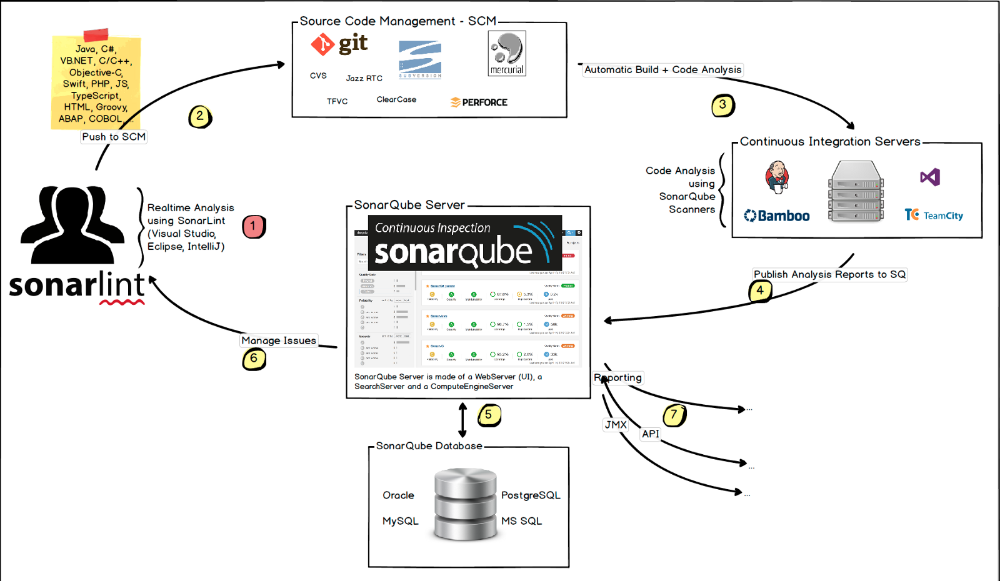
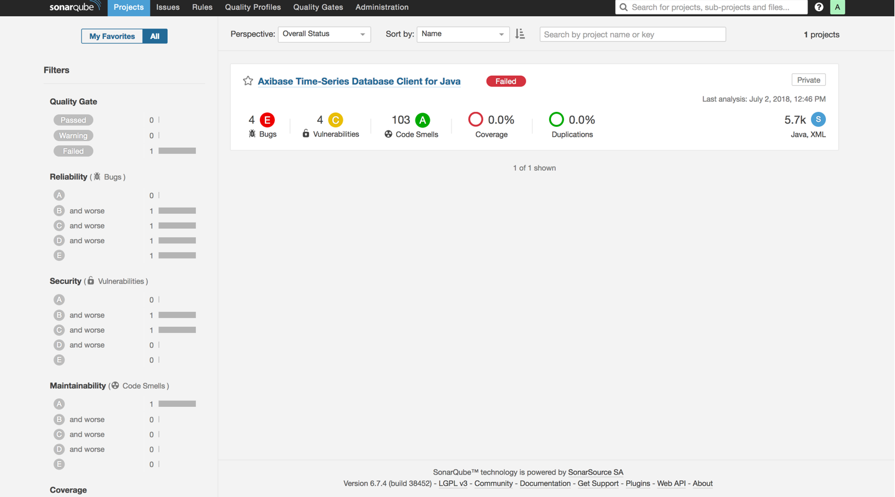
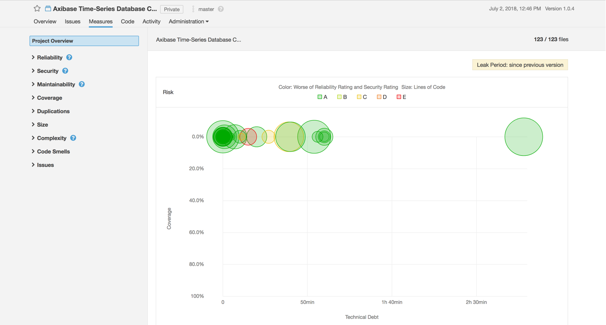
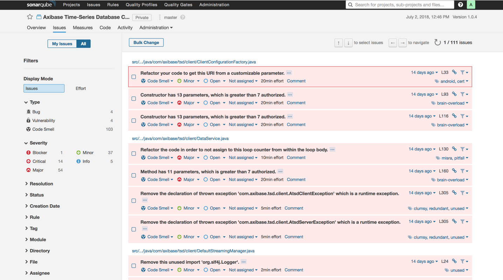
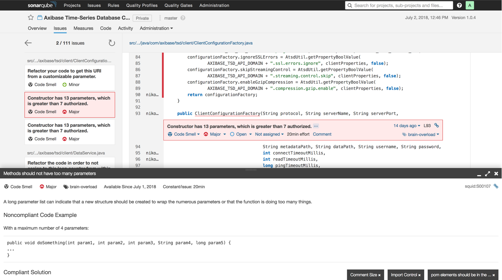
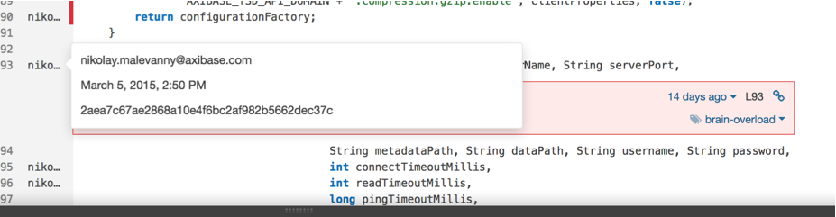
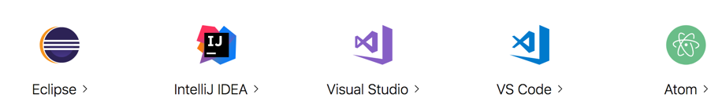
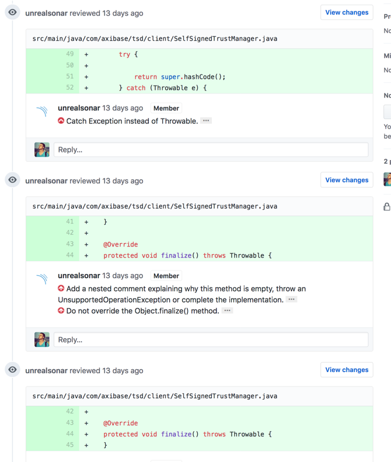
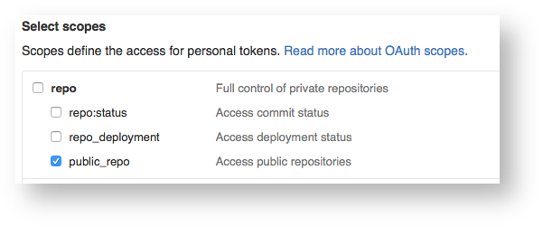

# Static code analysis with SonarQube


<!-- TOC -->

- [Static code analysis with SonarQube](#static-code-analysis-with-sonarqube)
  - [Overview](#overview)
  - [What is a static analysis of a code](#what-is-a-static-analysis-of-a-code)
    - [Benefits](#benefits)
    - [Solutions](#solutions)
  - [Continious Code Inspection](#continious-code-inspection)
  - [Sonarqube](#sonarqube)
    - [Capabilites](#capabilites)
      - [Advantages](#advantages)
      - [Disadvantages](#disadvantages)
    - [How SonarQube helps to assess the quality of the code](#how-sonarqube-helps-to-assess-the-quality-of-the-code)
    - [Installation](#installation)
      - [General scheme of installation](#general-scheme-of-installation)
      - [Simplified installation](#simplified-installation)
  - [Compose file](#compose-file)
    - [UI Review](#ui-review)
      - [Home page](#home-page)
      - [Project metrics](#project-metrics)
      - [Navigating the code and the bugs](#navigating-the-code-and-the-bugs)
      - [Rules, Quality Profiles and Quality Gates](#rules-quality-profiles-and-quality-gates)
    - [IDE Integration](#ide-integration)
      - [Supported IDEs](#supported-ides)
    - [Github Integration](#github-integration)
      - [Requirements](#requirements)
      - [Running Sonar analysis in CI](#running-sonar-analysis-in-ci)

<!-- /TOC -->

## Overview

[SonarQube](https://www.sonarsource.com/products/sonarqube/) (formerly Sonar) is an open source platform developed by [SonarSource](https://www.sonarsource.com/) for continuous inspection of code quality to perform automatic reviews with `static analysis` of code to detect bugs, code smells, and security vulnerabilities on 20+ programming languages.

## What is a static analysis of a code

`Static program analysis` is the analysis of computer software that is performed without actually executing programs, in contrast with dynamic analysis, which is analysis performed on programs while they are executing.

There are two main ways to analyze the code without execution:

- Analysis of `source code`

- Analysis of `object code`

### Benefits

- Static Analysis Tools are generally used by developers as part of the development and component testing process

- Static Code Analysis helps identify potential software quality issues during the development phase before the software goes into production.

- It detects areas in the code that needs refactoring/simplification

- The analysis detects programming errors or flaws and shows them to you

- Static Code Analysis improves communication in the development team and helps training developers to produce high-quality code

### Solutions

- [Checkstyle](http://checkstyle.sourceforge.net/) is a tool for checking Java source code for adherence to a Code Standard or set of validation rules (best practices).

- [SpotBugs](https://spotbugs.github.io/) is a program which uses static analysis to look for bugs in `Java` code. SpotBugs is the spiritual successor of [FindBugs](http://findbugs.sourceforge.net/), carrying on from the point where it left off with the support of its community.

- [ESLint](https://eslint.org/) is a tool for identifying and reporting on patterns found in ECMAScript/JavaScript code.

## Continious Code Inspection

The major benefit of static code analysis is they can find the bug early in the development cycle, which means less cost to fix them.
All these advantages of static code analyzer can be best utilized only if they are part of the build process.

The integration code analysis into your CI process calls
`continuous code inspection`.

## Sonarqube

SonarQube is an open source platform, designed for continuous analysis and measurement of code quality.

The main difference between SonarQube and the other tools is that the code analysis **runs externally** in your CI server and the result is sent to SonarQube. Then, this analysis is processed by SonarQube and stored in a database in order to be served. That means an extra effort in configuring your CI server.



### Capabilites

- The support of many languages:
  - `Java`
  - `C`
  - `C++`
  - `C#`
  - `Objective-C`
  - `Swift`
  - `PHP`
  - `JavaScript`
  - `Python`
  - and other languages.

- It provides reports of:
  - code duplication
  - compliance with the coding standards
  - unit tests coverage
  - possible errors in the code
  - density of comments in the code
  - technical debt and much more.

- It saves the history of metrics and builds charts of the changes in the metrics over the time.

- It provides a fully automated analysis: integrates with:
  - `Maven`
  - `Ant`
  - `Gradle`

  and common continuous integration systems such as `Jenkins`.

- Allows integration with such IDEs:
  - `IntelliJ IDEA`
  - `Visual Studio`
  - `Eclipse`
  - `VSCode`
  
  using the `SonarLint` plugin.

- It provides integration with external tool:
  - `JIRA`
  - `Mantis`
  - `LDAP`
  - `Fortify`
  and so on.

- You can extend the existing functionality using third-party plugins. For example, add integration with Github for automatic code review of Pull Requests.

- It implements the `SQALE` methodology to evaluate the technical debt.

#### Advantages

- Fully-configured own server

- Storing history of changes in a preferable Database  

- Personal quality profiles for each project

- Support of integration custom static analysis programs such as (`FindBugs`, `Checkstyle`, `PMD`)

#### Disadvantages

- Plugins for some languages available only in commercial versions of the platform.

- Additional time for configuration and resources for administration of SonarQube.

### How SonarQube helps to assess the quality of the code

A SonarQube quality model implements the `SQALE` methodology (Software Quality Assessment based on Lifecycle Expectations) with certain improvements.
As it is well known, the SQALE methodology focuses mainly on the complexity of the code maintainability and does not take the project risks into account.

SonarQube developers have modified the quality model, based on SQALE to focus on the following important points:

- The quality model should be as simple as possible

- Bugs and vulnerabilities should not get lost among the maintainability issues

- Serious bugs and security vulnerabilities in the project should lead to the fact that the Quality Gate requirements aren’t met

- Maintainability issues of the code are important too and cannot be ignored

- The estimation of the remediation cost (using the SQALE analysis model) is important and should be carried out

The standard SonarQube Quality Gate uses the following metric values to assess if the code has passed the checks successfully:

- `0` new bugs

- `0` new vulnerabilities

- technical debt ratio on the new code <= `5%`

- the new code coverage is not less than `80%`

Sonar team has defined `7` deadly sins of developers that increase the technical debt:

- Bugs and potential bugs

- Violation of coding standards

- Code duplication

- Insufficient unit tests coverage

- Poor distribution of complexity

- Spaghetti design

- Too few or too many comments

The SonarQube platform is designed to help fight these sins.

### Installation

The Sonarqube Platform is Java Web Server that uses a database to store history, settings etc. Several database engines are supported.

#### General scheme of installation

- Install preferred database.
- Create an empty schema and a `sonarqube` user
- Grant this  `sonarqube` user permissions to create, update and delete objects for this schema.
- Copy web app files.
- Run the platform using the provided script.

Visit SonarQube [documentation](https://docs.sonarqube.org/display/SONAR/Installing+the+Server#InstallingtheServer-installingDatabaseInstallingtheDatabase) site for details.

#### Simplified installation

The foll## Requirements

- Docker Engine 1.9

- Docker Compose 1.6

## Compose file

The docker-compose file allows running SonarQube with a PostgreSQL database.

Create this `docker-compose.yml` file:

```yaml
version: "2"

services:
  sonarqube:
    image: sonarqube
    ports:
      - "9000:9000"
    networks:
      - sonarnet
    environment:
      - SONARQUBE_JDBC_URL=jdbc:postgresql://db:5432/sonar
    volumes:
      - sonarqube_conf:/opt/sonarqube/conf
      - sonarqube_data:/opt/sonarqube/data
      - sonarqube_extensions:/opt/sonarqube/extensions
      - sonarqube_bundled-plugins:/opt/sonarqube/lib/bundled-plugins

  db:
    image: postgres
    networks:
      - sonarnet
    environment:
      - POSTGRES_USER=sonar
      - POSTGRES_PASSWORD=sonar
    volumes:
      - postgresql:/var/lib/postgresql
      - postgresql_data:/var/lib/postgresql/data

networks:
  sonarnet:
    driver: bridge

volumes:
  sonarqube_conf:
  sonarqube_data:
  sonarqube_extensions:
  sonarqube_bundled-plugins:
  postgresql:
  postgresql_data:
```

Use [docker-compose](https://github.com/docker/compose) to start the containers.

```bash
docker-compose up
```

Restart the containers (after plugin upgrade or install for example).

```bash
docker-compose restart sonarqube
```

Analyse a project using `Maven`:

```bash
mvn sonar:sonar \
  -Dsonar.host.url=http://$(boot2docker ip):9000 \
  -Dsonar.jdbc.url=jdbc:postgresql://$(boot2docker ip)/sonar
```

### UI Review

Let’s have a look at the main features of SonarQube in more detail.

#### Home page

On the home page of SonarQube, you can see a list of projects added to the system with brief statistics for each project: the version of the build, number of lines in the code, number of bugs, vulnerabilities, and code smells, date of the last analysis:



The content of the home page can be customized for your goals by using a large number of built-in widgets that allow you to visualize the status of the code in SonarQube projects.

#### Project metrics

To get more detail information about project status goes to **Project > Measures**.



Here you can find information about the following code metrics:

- Reliability

- Security

- Maintainability

- Coverage

- Duplications

- Codebase size

- Cyclomatic and cognitive complexity

- Documentation and Issues

#### Navigating the code and the bugs

To see how SonarQube allows working with problems found in the code navigate to **Issues** section.



Here we see all the problems found in the code with vast filtering options, which allows focusing on the most important issues. It should be noted that SonarQube allows you to save filter settings to use them later again.

By double-clicking on the error message, you can go to the code, in which the problem was found. Besides that you can find a detailed description of an error and recommendations of how it can be fixed:



Also note that, thanks to the integration with version control systems, you can see, when and who made changes to the code that caused the analyzer warning to appear:



#### Rules, Quality Profiles and Quality Gates

`Rules`, `Quality Profiles` and `Quality Gates` — key notions of SonarQube platform.

Each plugin for SonarQube that performs static code analysis, contains a repository with the description of diagnostic `rules` that this plugin performs.

Violations of these rules are used to determine the technical debt in your code and evaluate the time to fix these issues. For ease-of-use, the rules are grouped as Quality Profiles. By default, SonarQube creates a default `quality profile` for each supported language, but you can create your own quality profiles containing those diagnostic rules, that would be useful for you.

For example, for the analysis of critically important projects, which have the highest quality requirements, you can define a quality profile that will contain all the available diagnostics; for less critical projects you can define a less critical quality profile, that will contain only serious bugs, so that you don’t get distracted by minor code smells.

`Quality Gate` — is an indicator of compliance (or inconsistency) of the project to the specified threshold code metrics. By default, all projects added to SonarQube, use a standard quality gate, with the following metrics and their threshold values:

```txt
New bugs = 0
New vulnerabilities = 0
Technical debt ratio on new code <= 5%
Coverage of new code >= 80%
```

Based on your own requirements for the quality of the source code, you can change the default quality gate or create a new one by adding or removing those metrics and their threshold values that are of interest to you.

### IDE Integration

[SonarLint](https://www.sonarlint.org/) is an IDE extension that helps you detect and fix quality issues as you write code.
Like a spell checker, SonarLint squiggles flaws so that they can be fixed before committing code.

It easily connects to your SonarQube platform and provides real-time analysis of the code.

#### Supported IDEs



### Github Integration

The [GitHub Plugin](https://docs.sonarqube.org/display/PLUG/GitHub+Plugin) serves only one purpose: analyze GitHub pull requests without pushing results to SonarQube. Any issues that are found are published as comments on the pull request.

The plugin performs the following operations:

- Add an inline comment for each issue
- Add a global comment that gives a summary of the analysis



#### Requirements

- SonarQube

  - SonarQube Server must be up and running. If that's not the case, see Setup and Upgrade.

  - The SonarQube GitHub plugin is installed on SonarQube Server.

- GitHub

  - You have a dedicated technical GitHub user which will be used to insert comments when there are issues and update the status of the pull request.
  
  - To insert comments, you just need to generate a token (for that user) that has only the "public_repo" scope (or "repo" for private repositories)
  

#### Running Sonar analysis in CI

```bash
function sonar_analysis {
    if [[ -n ${PULL_REQUEST} ]]; then
        mvn  sonar:sonar \
            -DskipTests=true \
            -Dsonar.host.url=${SONAR_HOST} \
            -Dsonar.login=${SONAR_TOKEN} \
            -Dsonar.github.pullRequest=${PULL_REQUEST} \
            -Dsonar.github.repository=unrealworkteam/atsd-api-java \
            -Dsonar.github.oauth=${GITHUB_ACCESS_TOKEN}

    else
       mvn  sonar:sonar \
            -DskipTests=true \
            -Dsonar.host.url=${SONAR_HOST} \
            -Dsonar.login=${SONAR_TOKEN}
    fi
}
```
